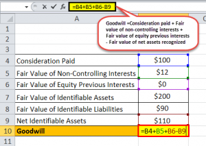

In today's dynamic financial environment, understanding the valuation of intangible assets like goodwill is crucial for businesses and investors alike. Goodwill represents the premium aspect in acquisitions, embodying elements such as brand reputation, customer loyalty, and intellectual property that do not appear on a company's balance sheet. Unlike tangible assets, goodwill is not a physical entity but a representation of the value added to a company due to its exceptional standing or presence in its industry. This intangible asset becomes particularly significant during mergers and acquisitions, often determining the final transaction price above the book value of the firm's known assets. 

Alongside these traditional concepts, algorithmic trading is reshaping financial markets by leveraging cutting-edge technology to optimize trading strategies. This method uses complex algorithms to perform trades at speeds and volumes impossible for human traders, analyzing vast datasets to make predictions and execute trades in real-time. The application of algorithmic trading extends beyond mere trade execution, having the potential to influence broader market trends and sentiment analysis, thus offering new perspectives on the valuation model of intangible assets like goodwill.



This article explores strategies for assessing goodwill and calculating it accurately. By integrating algorithmic trading into the valuation process, the approach attempts to bridge the gap between traditional valuation methods and technological advancements. This synthesis will provide both businesses and investors with a comprehensive understanding of how to manage intangible asset valuation and enhance investment strategies, optimizing decision-making processes in the continuously evolving landscape of financial markets.

## Table of Contents

## Understanding Financial Assessment of Goodwill

Goodwill is an intangible asset recognized in financial statements following an acquisition, embodying elements that are not physical in nature, such as brand reputation, customer relationships, and employee expertise. It emerges when a company is purchased for more than the fair market value of its net identifiable assets. This difference in value acknowledges the premium paid for these non-physical attributes, reflecting their perceived benefit to the acquiring company.

The financial assessment of goodwill is critical for both regulatory compliance and internal strategic decisions. Two major frameworks guide this valuation process: the International Financial Reporting Standards (IFRS) and Generally Accepted Accounting Principles (GAAP). Under IFRS, particularly IFRS 3 - Business Combinations, goodwill is not subject to amortization but must be tested for impairment annually or more frequently if circumstances indicate potential impairment. This contrasts with GAAP, which also requires annual impairment testing but has nuances in methodology, notably through the impairment test outlined in ASC 350, Intangibles - Goodwill and Other.

Accurately assessing goodwill is crucial in mergers and acquisitions (M&A) because it significantly affects the financial statements of the acquiring company. An overvaluation can lead to inflated asset values and understatement of subsequent impairment losses, while an undervaluation may result in underreported assets, impacting financial ratios crucial for decision-making. For example, Return on Assets (ROA) could be skewed, affecting investment and financial strategies.

Transparent financial reporting, facilitated by a precise valuation of goodwill, builds investor and stakeholder trust, enhancing market confidence in the company’s financial health. Companies employ various valuation methods, including the purchase price allocation (PPA) process, where goodwill is calculated as the excess of purchase consideration transferred over the net recognized amount of the identifiable assets acquired, and liabilities assumed.

The importance of goodwill assessment also extends to its impact on financial ratios and metrics used by investors and analysts to evaluate company performance. Insightful evaluation and reporting of goodwill ensure alignment with both short-term financial targets and long-term strategic goals.

## Goodwill Valuation Techniques

Goodwill valuation is a critical aspect of financial analysis, particularly in mergers and acquisitions, as it reflects the premium paid over the fair value of the identifiable net assets of a company. The primary method involves calculating the purchase price and subtracting the fair market value of the acquired company's tangible and identifiable intangible assets. This residual figure represents the goodwill.

Several additional methodologies exist to assess goodwill's value, with the Income Approach and Market Approach being widely recognized.

1. **Income Approach**: This method evaluates goodwill by predicting future economic benefits derived from the intangible asset. It involves discounting anticipated future cash flows to their present value, utilizing a discount rate that considers risk factors associated with the investment. The formula can be represented as:
$$
   \text{Goodwill Value} = \sum \frac{\text{Expected Future Cash Flows}_t}{(1 + r)^t}

$$

   where $t$ is the time period and $r$ is the discount rate. This approach emphasizes the prospective revenue streams attributable to goodwill, such as increased brand recognition or customer loyalty.

2. **Market Approach**: This method determines goodwill by comparing the subject company with similar businesses in the industry, using metrics such as revenue multiples or EBITDA multiples. The calculation aligns with market data to infer the value of intangible assets. The Market Approach can be particularly challenging due to the need for comparable market data, which is not always available or directly applicable.

Valuation of goodwill presents inherent challenges, primarily due to the subjective nature of intangible benefits and the difficulty of quantifying factors like brand reputation, customer loyalty, or intellectual property. These elements do not possess a direct market value, which necessitates careful consideration and robust financial modeling techniques.

Overall, rigorous methodologies and a deep understanding of market conditions are essential for accurately valuing goodwill, ensuring an objective assessment that supports sound financial decision-making.

## Goodwill Calculation: Methods and Considerations

According to IFRS 3 (International Financial Reporting Standard 3), goodwill is calculated using the formula: 

$$
\text{Goodwill} = C + \text{NCI} + \text{FV} - \text{NA}
$$

where:
- $C$ is the consideration transferred by the acquirer.
- $\text{NCI}$ represents non-controlling interests in the acquiree.
- $\text{FV}$ is the fair value of any previous equity interest in the acquiree.
- $\text{NA}$ is the net identifiable assets acquired.

In calculating goodwill, businesses need to consider two primary methods: the full goodwill method and the proportionate share method. 

1. **Full Goodwill Method**: This approach involves recognizing the entire goodwill attributable to both the parent and the non-controlling interests. Here, the non-controlling interest is measured at its fair value. This method yields a comprehensive view of goodwill, enhancing comparability across financial statements.

2. **Proportionate Share Method**: Under this method, the non-controlling interest is valued at its proportionate share of the acquiree's identifiable net assets. Consequently, goodwill is recognized only for the parent company's share. Though this method may reduce perceived goodwill on the balance sheet, it aligns more closely with the parent company's percentage of ownership.

Understanding the nuances of non-controlling interests (NCI) is critical. Non-controlling interests represent the equity in a subsidiary not attributable, directly or indirectly, to the parent company. Under IFRS 3, NCI can be measured either at fair value or at the NCI’s proportionate share of the subsidiary’s identifiable net assets. The choice between these measurement methods influences the amount of goodwill recognized and impacts financial statement presentations. 

Accurate calculation of goodwill is essential for providing transparent and fair reporting. It affects balance sheets and financial analysis, playing a crucial role during mergers and acquisitions. As such, a clear grasp of how non-controlling interests influence goodwill calculations is crucial for precise financial reporting and compliance with relevant accounting standards.

## The Role of Algo Trading in Goodwill Valuation

Algorithmic trading employs sophisticated algorithms to scrutinize vast datasets, providing profound insights into the evaluation of intangible assets such as goodwill. By integrating data from diverse sources, including market sentiment analyses and financial reports, trading algorithms have the potential to refine the assessment of goodwill. This integration is vital as it shifts the perception of goodwill from a subjective understanding to an objective and quantifiable evaluation.

The use of [algorithmic trading](/wiki/algorithmic-trading) in goodwill valuation allows for the continuous monitoring of market trends and consumer sentiments, which are crucial in understanding brand perception and customer loyalty—key components of goodwill. Algorithms can process large volumes of real-time data, thereby detecting patterns and anomalies that traditional analysis might overlook. For example, sentiment analysis can be linked with the valuation of assets by tracking public opinion through news outlets and social media platforms. This linkage can be achieved through natural language processing (NLP) techniques. A basic implementation might involve:

```python
from textblob import TextBlob
import requests

# Example function to calculate sentiment score from tweets or news headlines
def sentiment_analysis(content):
    sentiment_score = TextBlob(content).sentiment.polarity
    return sentiment_score

# Fetching market sentiment data (hypothetical API or web data)
def fetch_data(url):
    response = requests.get(url)
    data = response.text  # Placeholder for actual data extraction logic
    return data

# Analyzing goodwill-related sentiment
market_data = fetch_data('https://api.marketanalysis.com/goodwill')
sentiment_score = sentiment_analysis(market_data)
print("Market Sentiment Score:", sentiment_score)
```

This data-driven approach allows companies to assign more precise valuations to goodwill by correlating market perceptions with potential future earnings, improving the reliability of financial analyses.

Furthermore, the advanced analysis provided by algorithms can isolate specific factors influencing intangible assets, enhancing the valuation's precision. Factors such as customer satisfaction indices or shifts in consumer preferences become accessible through these analytically powered models.

Thus, the integration of these technological tools is transformative. By reconciling market perception with the reality reflected in financial reports, algorithmic trading systems can achieve more robust goodwill valuations. This type of assessment supports better-informed investment decisions and strategic planning, providing a competitive edge in financial markets where nuances of intangible assets are often crucial to success. 

By leveraging technology in this manner, businesses can convert the abstract qualities of goodwill into a tangible and measurable asset, thus bringing clarity and objectivity to an inherently subjective financial element.

## Strategic Implications of Integrating Goodwill Valuation and Algo Trading

Integrating goodwill valuation with algorithmic trading provides distinct strategic implications, enhancing the capacity to make informed decisions and gain market advantages. This integration allows businesses to harness the power of technology to transform traditional methods of assessing goodwill into a robust, data-driven process.

One technique to incorporate goodwill assessments into algorithmic trading is the utilization of predictive analytics. By analyzing historical data, algorithms can identify patterns and trends that indicate the potential future performance of a company's goodwill. For example, [machine learning](/wiki/machine-learning) models can be trained to assess the impact of intangible assets such as brand reputation or customer loyalty on a company's overall market value, thus providing a quantifiable assessment of goodwill. These models rely on variables such as historical financial performance, market trends, and macroeconomic indicators to predict future changes in goodwill valuation.

Moreover, real-time data processing is another critical aspect of this integration. By continuously analyzing data from financial reports, market sentiment, and other relevant sources, algorithmic trading systems can provide up-to-the-minute insights into the market perception of a company's goodwill. This level of granularity allows for more dynamic trading strategies, enabling traders to react swiftly to changes in valuation and market conditions.

The synergy between goodwill valuation and algorithmic trading is further enhanced by advancements in fintech. Modern fintech tools offer the ability to process vast amounts of data quickly and accurately, thus reducing the subjectivity traditionally associated with goodwill valuation. This evolution in technology enables the transformation of qualitative assessments into statistically significant insights, providing a more objective basis for trading decisions.

For example, Python-based libraries such as NumPy and Pandas can be used to perform advanced data analysis and visualization tasks. These libraries enable financial analysts to implement statistical models that forecast changes in goodwill valuation based on a multitude of factors, from customer satisfaction indices to changes in competitive positioning.

```python
import pandas as pd
import numpy as np

# Sample code to calculate changes in goodwill valuation
data = pd.read_csv('financial_data.csv')

# Assuming 'customer_loyalty_index' and 'brand_value_index' are columns in the dataset
data['change_in_goodwill'] = np.log(data['customer_loyalty_index'] + 1) * data['brand_value_index']

# Display the first few rows of the updated dataset
print(data.head())
```

The convergence of goodwill valuation and algorithmic trading signifies a transformative shift in financial decision-making processes. By leveraging advanced algorithms, businesses can not only assess goodwill with greater accuracy but also optimize trading strategies to reflect the intrinsic value derived from intangible assets. As fintech continues to evolve, the integration of these two elements is poised to offer deeper, data-driven insights that promise to reshape the financial landscape.

## Conclusion

The valuation of goodwill and the integration of algorithmic trading are increasingly integral to modern financial management. Goodwill, representing intangible assets like brand reputation and customer loyalty, plays a significant role in mergers and acquisitions. Accurately valuing these assets ensures transparent and informed decision-making, essential for maintaining investor confidence and supporting sound corporate strategies. As businesses recognize the necessity of these valuations, mastering the intricacies of goodwill assessment becomes paramount.

On the other hand, advancements in algorithmic trading have brought a technological revolution to financial markets. These advanced algorithms enable traders and analysts to process vast amounts of data and extract insightful patterns, fostering more accurate and timely decisions. The combination of machine learning, [artificial intelligence](/wiki/ai-artificial-intelligence), and big data analytics enhances the precision of intangible asset valuation, transforming goodwill from a static, uncertain estimate into a dynamic, objective measurement.

The strategic integration of these elements—goodwill valuation and algorithmic trading—affords businesses considerable competitive advantages. Accurate valuation aids strategic acquisitions and alliances, while cutting-edge trading algorithms provide immediate, data-driven insights. Consequently, this synergy not only optimizes financial transactions but also elevates market transparency and operational efficiency.

Future advancements in these domains hold promise for further refinements. As technology continues to evolve, the integration of real-time data analytics with goodwill valuation and trading strategies is expected to become more sophisticated. These innovations will undoubtedly shape the future of financial markets, ensuring greater precision, reducing risk exposures, and bolstering market efficiency. Therefore, stakeholders and decision-makers must remain vigilant and adaptable to these ongoing developments to leverage the full potential of modern financial management tools.

## References & Further Reading

[1]: ["IFRS 3 - Business Combinations"](https://www.ifrs.org/content/dam/ifrs/publications/pdf-standards/english/2022/issued/part-a/ifrs-3-business-combinations.pdf?bypass=on) by International Financial Reporting Standards (IFRS)

[2]: "ASC 350, Intangibles - Goodwill and Other." Financial Accounting Standards Board (FASB).

[3]: ["Valuing Intangible Assets"](https://accountinginsights.org/valuing-intangible-assets-methods-challenges-and-impact/) by Jeffrey Cohen

[4]: ["Algorithmic Trading: Winning Strategies and Their Rationale"](https://www.wiley.com/en-us/Algorithmic+Trading%3A+Winning+Strategies+and+Their+Rationale-p-9781118746912) by Ernie Chan

[5]: ["The Basics of Mergers and Acquisitions"](https://www.mikevestil.com/entrepreneurship/business-planning/business-model/the-abcs-of-mergers-and-acquisitions-a-beginners-guide/) by Andrew Sherman

[6]: López de Prado, M. (2018). ["Advances in Financial Machine Learning."](https://www.amazon.com/Advances-Financial-Machine-Learning-Marcos/dp/1119482089) Wiley.

[7]: ["Financial Analysis and Modeling Using Excel and VBA"](https://www.amazon.com/Financial-Analysis-Modeling-Using-Excel/dp/047027560X) by Chandan Sengupta