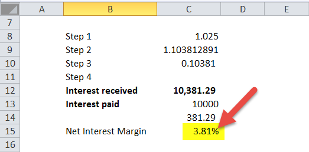

Margin accounts play a crucial role in the financial trading landscape, offering traders the opportunity to magnify their buying power through borrowed funds. These accounts allow investors to purchase securities using a combination of their own capital and funds borrowed from their broker. By leveraging borrowed money, traders can increase their investment capacity beyond what their capital alone could support. However, this benefit comes with the responsibility of managing interest charges and potential risks, which can significantly affect the profitability of trades.

Interest charges associated with margin accounts are a critical consideration for traders. When borrowing funds to trade on margin, investors are required to pay interest on the borrowed amount, which can accumulate over time. The interest rate applied to margin loans typically varies based on factors such as prevailing market rates, the brokerage's policies, and the trader's account balance. Understanding how these charges are calculated—often expressed on a monthly or annualized basis—is essential for traders to maintain a profitable margin trading strategy and prevent substantial costs from eroding their gains.



Parallel to the evolution of margin trading, algorithmic trading has become an increasingly pivotal component of the financial markets. Algorithmic trading involves the use of computer programs to execute trades at speeds and frequencies that are impossible for human traders. The growing importance of algorithmic trading is underscored by its ability to process vast amounts of data quickly, enhancing the decision-making process and executing trades with precision. Its adoption has transformed the financial markets, leading to highly automated trading environments where algorithms not only aid in executing trades efficiently but also assist in managing complex financial calculations, such as those involving interest on margin accounts. 

This article examines the intersection of interest charges, margin accounts, and algorithmic trading, providing insights and strategies to navigate these interconnected elements. For traders and financial enthusiasts, understanding this convergence offers a competitive edge in optimizing trading strategies and maximizing returns in today's challenging market conditions. This exploration addresses a critical need for greater awareness and sophistication in managing the nuanced financial mechanisms that significantly impact trading performance.

## Table of Contents

## Understanding Margin Accounts

A margin account is a type of brokerage account in which the broker lends the investor funds to purchase securities. This enables investors to buy more securities than they could with their available capital alone, thus amplifying potential gains. However, using a margin account also increases the risk, as losses are also magnified.

One of the key features of a margin account is the leverage it provides. When an investor buys securities on margin, they are required to deposit a certain percentage of the total purchase price, known as the "initial margin requirement". The rest is financed by the broker. For instance, if the initial margin requirement is 50%, an investor wanting to buy $10,000 worth of securities only needs to initially invest $5,000, borrowing the remaining $5,000 from the broker.

However, margin trading comes with its risks. The use of leverage can lead to significant losses, especially in volatile markets. If the value of the securities purchased on margin falls, the investor might be subject to a "margin call", wherein the broker demands additional funds to maintain the minimum margin requirement. Failure to meet a margin call can result in the broker selling the investor's securities to cover the loan, potentially at a substantial loss.

Margin accounts also facilitate greater buying power by allowing investors to leverage their positions. This means that investors can execute larger trades than their cash balances would typically permit, potentially leading to higher returns on investment. The effective buying power is directly proportional to the initial investment and the leverage ratio determined by the margin requirement.

For example, consider an investor with $5,000 in cash wanting to buy securities with a 50% margin requirement. The maximum effective buying power can be calculated as follows:

$$
\text{Buying Power} = \frac{\text{Cash Available}}{\text{Margin Requirement}} = \frac{5,000}{0.50} = 10,000
$$

Thus, the investor can purchase up to $10,000 worth of securities, doubling the potential gain or loss compared to a cash-only purchase.

Managing margin accounts effectively is crucial to mitigate the associated risks. This involves not just responding to margin calls but also maintaining a keen awareness of market conditions and price movements to avoid forced liquidation of positions. Investors should regularly review their portfolio's leverage ratios, rebalance as necessary, and only use margin for investments that align with their risk tolerance and investment strategy.

In summary, while margin accounts provide increased financial leverage and greater buying power, they also entail higher risk. Prudent management and understanding of the dynamics involved are essential to harnessing the benefits while mitigating potential downsides.

## Interest Charges in Margin Accounts

Margin accounts are integral to providing traders with enhanced purchasing power, but they come with the caveat of interest charges. Understanding how these charges are calculated is crucial for traders to manage costs effectively.

Interest on margin accounts is typically charged on borrowed funds, calculated daily based on the amount of margin used, and then compounded over time. This daily interest is generally expressed as an annual percentage rate (APR). To calculate the interest cost for a day, the daily [interest rate](/wiki/interest-rate-trading-strategies)—determined by dividing the APR by 360 or 365, depending on the brokerage—is multiplied by the amount of the margin balance.

**Factors Influencing Interest Rates on Margin Borrowing**

Several factors influence the interest rates applicable to margin accounts:

1. **Brokerage Policies**: Different brokerages offer varying interest rates based on their policies and competitive positioning.
2. **Loan Amounts**: Larger loans often attract lower interest rates due to tiered pricing structures.
3. **Account-Level Tiers**: Preferred clients or those with higher account balances may benefit from lower rates.
4. **Prevailing Market Interest Rates**: Rates may fluctuate based on changes in the broader financial environment, such as central bank interest rate shifts.

**Monthly vs. Annualized Interest Rates: What Traders Need to Know**

Interest rates on margin borrowing can be quoted as both monthly and annualized figures. While APR provides a yearly perspective, understanding the monthly impact is essential for tracking and managing shorter-term borrowing costs. The effective annual rate (EAR) could be higher than the nominal APR due to the effect of compounding, particularly when the interest compounds monthly or daily.

**Example Calculation**

Consider a trader with a margin balance of $10,000 at an APR of 8%. If the brokerage uses a 360-day year for daily calculations, the daily interest rate would be:

$$
\text{Daily interest rate} = \frac{8\%}{360} = 0.0222\%
$$

The daily interest cost would then be:

$$
\text{Daily interest cost} = 10,000 \times 0.000222 = 2.22
$$

Over a month (assuming 30 days), this would accrue to:

$$
\text{Monthly interest} = 2.22 \times 30 = 66.60
$$

**Strategies to Minimize Interest Charges**

Traders can employ several strategies to reduce the cost of borrowing on margin:

- **Utilizing Interest-Free Strategies**: Short-term trades that can be cleared before interest applies, typically within a day.
- **Reducing Balance Amounts**: Limiting the amount borrowed or repaying margin balances quickly.
- **Taking Advantage of Tiered Rates**: Leveraging account balances to qualify for lower interest tiers.
- **Regular Monitoring and Adjustments**: Continuously assessing balance requirements and interest rates can help in choosing the optimal amount and timing for borrowing.

Understanding these dynamics allows traders to make informed decisions about margin borrowing, potentially enhancing their trading performance while minimizing unnecessary costs.

## Algorithmic Trading: An Overview

Algorithmic trading, also known as algo trading, refers to the use of computer algorithms to automate trading decisions and execute orders in financial markets. These algorithms follow a defined set of rules based on price, timing, [volume](/wiki/volume-trading-strategy), or other mathematical models, allowing traders to execute trades with unprecedented speed and efficiency. The history of [algorithmic trading](/wiki/algorithmic-trading) can be traced back to the 1970s when the New York Stock Exchange (NYSE) introduced designated order turnaround (DOT) systems to route orders electronically. The practice gained [momentum](/wiki/momentum) in the 1980s and 1990s with the advent of electronic communications networks (ECNs) and the increasing computational capabilities of computers.

One of the primary benefits of using algorithms in trading is the speed at which they can process information and perform trades. With advances in technology, algorithms can now analyze vast amounts of data in real-time, enabling traders to capitalize on opportunities within milliseconds. This speed is coupled with enhanced efficiency, as algorithms can execute trades at optimal prices, reducing transaction costs and minimizing the impact on the market. Additionally, algorithmic trading allows for sophisticated data processing, drawing insights from complex historical and real-time datasets to inform trading strategies.

Several common types of algorithms are employed in trading, each serving specific purposes. These include trend-following algorithms, which capitalize on market movements in specific directions; market-making algorithms, which provide [liquidity](/wiki/liquidity-risk-premium) by continuously buying and selling; and statistical [arbitrage](/wiki/arbitrage) algorithms, which exploit price discrepancies between correlated assets. High-frequency trading ([HFT](/wiki/high-frequency-trading-strategies)) represents a subset where trading systems execute thousands of orders within seconds based on rapid market fluctuations.

Algorithmic trading has dramatically shifted the financial markets by increasing market liquidity and reducing bid-ask spreads. It has also introduced greater transparency, as trades executed via algorithms are subject to regulatory oversight. However, algorithmic trading presents several challenges and drawbacks. One major concern is the potential for systemic risk; algorithms can exacerbate market [volatility](/wiki/volatility-trading-strategies), as evidenced by events like the 2010 Flash Crash, where the Dow Jones Industrial Average plummeted nearly 1,000 points within minutes. Furthermore, the complexity of these systems can lead to unintended trading behaviors or errors, which may result in significant financial losses.

In conclusion, while algorithmic trading offers substantial advantages, including speed and efficiency, it also requires careful oversight and risk management to mitigate potential negative impacts on the financial markets.

## Financial Calculations in Algorithmic Trading

In algorithmic trading, the accuracy of financial calculations is crucial to the development of effective trading strategies. Precise calculations enable traders to make informed and timely decisions by employing complex algorithms that process large volumes of data swiftly and efficiently.

### Key Metrics and Calculations

Algorithms rely on several key metrics and calculations to facilitate successful trading. These include:

1. **Moving Averages**: Traders often use moving averages to smooth price data and identify trends. A simple moving average (SMA) is calculated by taking the arithmetic mean of a given set of prices over a specific period. The formula for an $n$-day SMA is:
$$
   \text{SMA} = \frac{P_1 + P_2 + \ldots + P_n}{n}

$$
   Where $P_i$ represents the price at day $i$.

2. **Exponential Moving Average (EMA)**: Unlike SMA, EMA gives more weight to recent prices, making it more responsive to new information. The EMA for a given day is computed as:
$$
   \text{EMA}_{\text{today}} = \left( \frac{2}{n+1} \right) \times (\text{Price}_{\text{today}} - \text{EMA}_{\text{yesterday}}) + \text{EMA}_{\text{yesterday}}

$$

3. **Relative Strength Index (RSI)**: RSI is a momentum indicator used to measure the speed and change of price movements. It is calculated using the formula:
$$
   \text{RSI} = 100 - \left( \frac{100}{1 + \text{RS}} \right)

$$
   Where RS is the average of $n$ days' up closes divided by the average of $n$ days' down closes.

4. **Standard Deviation and Variance**: Used to measure market volatility, these metrics help in assessing the risk involved with certain trades.

### Role of Historical Data and Real-time Analysis

Historical data provides the foundation for [backtesting](/wiki/backtesting) trading strategies, allowing traders to evaluate the potential success of their algorithms using past market conditions. This helps refine strategies by understanding how they would have performed in different scenarios. Real-time analysis, on the other hand, ensures that the algorithms can adapt to current market conditions by continuously ingesting and processing live data streams.

### Examples of Financial Models and Calculation Methods

1. **Mean Reversion Models**: These models assume that the price of an asset will revert to its historical mean. Algorithms based on mean reversion monitor price movements to capitalize on this behavior.

2. **Arbitrage Models**: Algorithms can execute trades simultaneously in different markets to exploit price discrepancies, maintaining precise calculations to ensure profitability.

3. **Machine Learning Models**: Advanced algorithms now incorporate machine learning techniques to predict market movements by identifying patterns in historical and real-time data.

### Impact on Trading Outcomes and Profitability

Accurate financial calculations directly influence trading outcomes by allowing algorithms to execute trades at optimal prices and timing. This precision enhances profitability by minimizing losses and capitalizing on favorable market movements. Moreover, effectively calibrated algorithms can adapt to changing market conditions, thereby reducing the risk and increasing the resiliency of trading strategies over time.

In sum, financial calculations form the bedrock of algorithmic trading, determining the success of trading strategies through precise metric computations, the strategic application of historical data, and the integration of real-time analysis in decision-making.

## Managing Interest Charges in Algorithmic Trading

Algorithmic trading has revolutionized financial markets by enabling the automation of trading strategies, characterized by speed, efficiency, and precision. However, managing interest charges within this context poses unique challenges. As traders leverage margin accounts to increase their buying power, the cost associated with borrowed funds becomes a critical [factor](/wiki/factor-investing) in determining the profitability of these automated strategies.

### Building Algorithms to Account for Interest Charges

Incorporating interest charges into algorithmic trading strategies necessitates a robust framework where algorithms can dynamically calculate and anticipate these costs. Developing algorithms that effectively account for interest involves scripting comprehensive financial models that include both static and dynamic interest rate inputs. For instance, an algorithm could be structured to account for fluctuating interest rates by integrating functions that capture real-time market data on borrowing costs.

```python
def calculate_interest(balance, annual_rate, days):
    # Simple interest calculation for borrowed funds
    daily_rate = annual_rate / 365
    interest = balance * daily_rate * days
    return interest
```

This Python function can be part of a larger algorithmic system, allowing the model to adapt interest calculations based on fluctuating balances and interest rates, thus enhancing financial accuracy.

### Automation of Interest Calculations

Automation is at the core of algorithmic trading, where interest calculations can be seamlessly integrated into trading algorithms. Automated systems update interest rate information continuously, ensuring the strategies adapt to current financial environments. This does not only involve calculating accrued interest but also includes mitigation strategies, where algorithms might strategically adjust positions to offset potential interest costs.

### Case Studies: Successful Strategies

Some trading platforms have witnessed success by designing algorithms with built-in sensitivity to borrowing costs. For instance, high-frequency trading (HFT) firms have developed strategies that minimize holding periods, thereby reducing the accumulation of interest charges. Moreover, quant trading strategies have been refined to prioritize trades that optimize the return on capital relative to the cost of borrowing, minimizing the impact of interest charges on the overall trading strategy.

### Boosting Returns with Effective Interest Management

Effective management of interest charges can significantly enhance the profitability of algorithmic trading portfolios. By optimizing the balance between asset returns and interest costs, traders can ensure that their strategies yield higher net gains. Sophisticated algorithms execute trades that not only aim for the highest gross returns but also consider the net return after deducting interest expenses. This hyper-focus on net profitability encourages the development of more efficient algorithms that strategically manage both assets and liabilities.

In conclusion, integrating interest charge management into algorithmic trading platforms is crucial for maximizing financial performance. As trading algorithms evolve, their capability to dynamically adjust for interest costs will increasingly determine their competitive advantage. By marrying advanced computational techniques with strategic financial planning, traders can extract maximum value from algorithmic trading while effectively managing the expenses associated with margin borrowing.

## Conclusion

The proliferation of margin accounts has been a pivotal development in financial trading, enabling traders to leverage their positions beyond personal capital. This growth brings with it the critical consideration of interest charges—the cost of borrowing funds from brokers. As these charges accumulate, they can significantly impact trading profitability, emphasizing the need for effective management strategies.

Algorithmic trading has revolutionized the trading landscape by employing sophisticated mathematical models and high-speed computing. These algorithms incorporate financial calculations to optimize trades and adjust strategies in real-time. Consequently, the intersection of financial calculations with algorithmic trading is vital, as precise computations of variables like entry and [exit](/wiki/exit-strategy) points, position sizing, and interest charges can influence trading outcomes.

Looking ahead, future trends in algorithmic trading are likely to focus on advanced margin account management. Innovations may include superior algorithms that autonomously factor in interest rate fluctuations, optimize borrowing costs, and enhance predictive modeling with [machine learning](/wiki/machine-learning) techniques. These advancements promise to refine trading efficiencies and returns, further leveraging the capabilities of margin accounts.

For traders seeking to optimize strategies, understanding and managing the implications of interest in margin trading is essential. Embracing algorithmic techniques that integrate these factors can provide a competitive edge. Techniques such as backtesting algorithms with historical interest data, using real-time monitoring systems, and adjusting trading strategies to mitigate interest costs can be invaluable.

In conclusion, mastering the balance between effective margin account use and algorithmic trading strategies is key to thriving in today’s fast-paced financial markets. As technology and trading volumes grow, adapting to these changes will be critical for success. Traders who leverage sophisticated algorithms for meticulous interest management stand to gain competitive advantages in this evolving landscape.

## References & Further Reading

[1]: Hull, J. C. (2018). ["Options, Futures, and Other Derivatives"](https://www.semanticscholar.org/paper/Options%2C-Futures%2C-and-Other-Derivatives-Hull/89bdee500c8623864fc9eb7a471546aa713acc44) by John C. Hull, 10th Edition. This book provides comprehensive coverage of derivatives, including options and futures, and their role in trading strategies.

[2]: Lopez de Prado, M. (2018). ["Advances in Financial Machine Learning"](https://www.amazon.com/Advances-Financial-Machine-Learning-Marcos/dp/1119482089). Wiley. This text explores the application of machine learning techniques to financial strategies and risk management.

[3]: Chan, E. P. (2009). ["Quantitative Trading: How to Build Your Own Algorithmic Trading Business"](https://github.com/ftvision/quant_trading_echan_book). Wiley. This guide investigates into the principles of developing algorithmic trading systems, including backtesting and risk management.

[4]: Aronson, D. R. (2007). ["Evidence-Based Technical Analysis: Applying the Scientific Method and Statistical Inference to Trading Signals"](https://onlinelibrary.wiley.com/doi/book/10.1002/9781118268315). Wiley. This book examines the scientific approach to technical analysis in trading.

[5]: Malkiel, B. G. (2015). ["A Random Walk Down Wall Street: The Time-Tested Strategy for Successful Investing"](https://www.tandfonline.com/doi/full/10.1080/14697688.2016.1256598). W. W. Norton & Company. A classic book on investment strategies and the efficiency of markets.