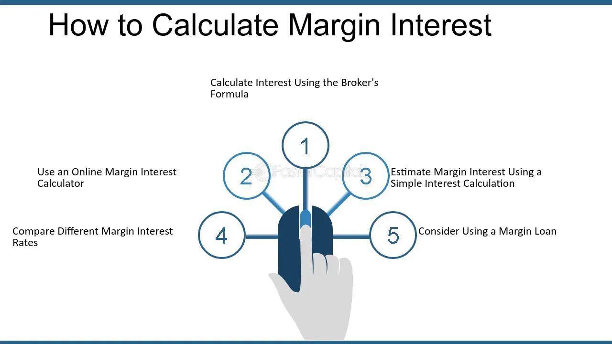

## Table of Contents

## What is a margin account and how does it work?

A margin account is a type of brokerage account that lets you borrow money from your broker to buy investments like stocks or bonds. When you use a margin account, you're not just using your own money; you're also using money that you've borrowed from the broker. This borrowed money is called a "margin loan." The amount you can borrow depends on the value of the investments in your account and the rules set by the broker and the government.

When you buy investments using a margin loan, you need to put up some of your own money as well. This is called the "initial margin," and it's usually a percentage of the total cost of the investment. For example, if you want to buy $10,000 worth of stock and the initial margin requirement is 50%, you would need to put up $5,000 of your own money and borrow the other $5,000. As the value of your investments goes up or down, you might need to add more money to your account to keep the loan covered. This is called a "margin call." If you don't meet a margin call, the broker can sell your investments to pay back the loan.

## How is interest calculated on a margin account?

Interest on a margin account is calculated based on the amount of money you borrow from your broker. The interest rate is set by the broker and can change over time. The interest is usually charged daily and added to your account at the end of the month. The amount of interest you pay depends on how much you borrow and for how long you keep the borrowed money.

For example, if you borrow $5,000 and the annual interest rate is 8%, you would owe about $33 in interest for that month ($5,000 x 0.08 / 12). The interest is added to your loan balance, so you'll pay interest on the new, higher balance the next month. This means the longer you keep the borrowed money, the more interest you'll have to pay.

## What is the difference between debit and credit interest in margin accounts?

In a margin account, debit interest is the interest you pay on the money you borrow from your broker. When you use a margin loan to buy investments, you have to pay interest on the amount you borrowed. This interest is called debit interest because it's a cost to you, like a debit from your account. The interest rate is set by your broker and can change over time. You usually pay this interest monthly, and it's added to your loan balance, so you end up paying interest on a growing amount.

Credit interest, on the other hand, is the interest you earn on the cash balance in your margin account. If you have extra cash in your account that you're not using to buy investments, your broker might pay you interest on that cash. This interest is called credit interest because it's money credited to your account. The rate for credit interest is usually lower than the rate for debit interest, and it's also set by your broker. So, while you're paying debit interest on your borrowed money, you might also be [earning](/wiki/earning-announcement) a small amount of credit interest on any unused cash in your account.

## What are the typical interest rates for margin accounts?

Interest rates for margin accounts can change a lot depending on the broker and the market. On average, you might see rates between 5% and 10% per year for debit interest, which is what you pay when you borrow money from your broker. Some brokers might offer lower rates if you have a lot of money in your account or if you trade a lot. But remember, these rates can go up or down, so it's a good idea to check with your broker to know the exact rate you'll be paying.

For credit interest, which is what you earn on the cash you keep in your account, the rates are usually much lower. You might see rates around 0.01% to 0.5% per year. This means you won't earn much from the cash sitting in your account, but it's still better than nothing. Just like with debit interest, the credit interest rate can vary based on your broker and how much money you have in your account.

## How can the interest rate on a margin account affect my investment returns?

The interest rate on a margin account can really change how much money you make or lose from your investments. When you borrow money to buy stocks or other investments, you have to pay interest on that loan. If the interest rate is high, it means you're paying more money to use the borrowed funds. This can eat into your profits if your investments don't grow enough to cover the cost of the interest. For example, if you make a 6% return on your investment but you're paying 8% interest on your margin loan, you're actually losing money overall.

On the other hand, if the interest rate is low, it can help you make more money. With a lower interest rate, you're not paying as much to borrow, so it's easier for your investments to grow faster than the cost of the loan. This can boost your returns. But remember, using a margin account always comes with risks. If your investments go down in value, you still have to pay back the loan with interest, which could mean you end up losing more money than you started with.

## What are margin calls and how do they relate to interest on margin accounts?

A margin call happens when the value of your investments in a margin account goes down a lot. When you use a margin account, you borrow money from your broker to buy stocks or other investments. If the value of those investments drops, your broker might ask you to add more money to your account to cover the loan. This is called a margin call. You need to put more money in or sell some of your investments to meet the margin call. If you don't do this, the broker can sell your investments to pay back the loan, which could mean you lose money.

Margin calls are related to interest because the money you borrow to buy investments comes with an interest cost. The interest you pay is based on how much you borrow and how long you keep the loan. If the value of your investments goes down and you get a margin call, you might have to use more of your own money to keep the account in good standing. This means you're not just paying interest on the original loan but also on any extra money you borrow to meet the margin call. So, the interest can add up quickly, making it even more important to keep an eye on your investments and be ready to act if you get a margin call.

## Can you explain the concept of compounding interest in the context of margin accounts?

Compounding interest in margin accounts means that the interest you pay on your loan gets added to the amount you owe. So, every month, you're not just paying interest on the money you borrowed at first, but also on the interest that's been added to your loan. This can make the total amount you owe grow faster over time. For example, if you borrow $5,000 at an 8% annual interest rate, you'll owe about $33 in interest the first month. The next month, you'll pay interest on $5,033 instead of $5,000, so the interest will be a bit more.

This compounding effect can really add up if you keep the loan for a long time. It's important to remember that while your investments might grow, the interest on your margin loan is also growing. If your investments don't do well, you could end up owing more in interest than you make from your investments. So, it's a good idea to keep an eye on your account and think about how long you want to keep the borrowed money, because the longer it is, the more interest you'll have to pay because of compounding.

## How do different brokers calculate interest on margin accounts differently?

Different brokers might have different ways of figuring out the interest you pay on a margin account. Some brokers might charge you interest every day and add it to your account at the end of the month. Others might use a different way, like charging interest only on the part of the loan you're using, not the whole amount you're allowed to borrow. The interest rate can also be different from one broker to another. Some might give you a lower rate if you have a lot of money in your account or if you trade a lot, while others might have the same rate for everyone.

Brokers can also change their interest rates over time. This means the rate you start with might go up or down later on. It's a good idea to check with your broker to know exactly how they calculate interest and what the current rate is. That way, you can plan better and know how much you'll have to pay.

## What strategies can be used to minimize interest costs on margin accounts?

One way to keep the interest costs low on a margin account is to pay back the loan as fast as you can. When you borrow money from your broker, you have to pay interest on it. The longer you keep the borrowed money, the more interest you'll have to pay. So, if you can sell some of your investments and use the money to pay back the loan, you'll save on interest. Another way is to only borrow what you really need. If you can buy your investments with less borrowed money, you'll pay less interest.

Another strategy is to keep an eye on the interest rates your broker charges. Sometimes, brokers offer lower rates if you have a lot of money in your account or if you trade a lot. If you can, try to meet these conditions to get a better rate. Also, it's a good idea to compare different brokers because their rates can be different. If you find a broker with a lower rate, switching to them could save you money on interest.

## How does the Federal Reserve's interest rate policy impact margin account interest?

The Federal Reserve's interest rate policy can change the interest rates that brokers charge on margin accounts. When the Federal Reserve raises its interest rates, it usually means that borrowing money becomes more expensive. This can make the interest rates on margin accounts go up too. Brokers often set their rates based on what the Federal Reserve does, so if the Fed's rates go up, the cost of borrowing money from your broker might go up as well.

On the other hand, when the Federal Reserve lowers its interest rates, borrowing money can become cheaper. This can lead to lower interest rates on margin accounts. If the Fed's rates go down, brokers might lower their rates too, which means you'll pay less interest on the money you borrow to buy investments. Keeping an eye on what the Federal Reserve is doing can help you understand how much you might have to pay in interest on your margin account.

## What are the tax implications of interest earned or paid on margin accounts?

When you pay interest on a margin account, you might be able to take it off your taxes. The interest you pay to borrow money from your broker can be a tax deduction if you use the borrowed money to buy investments that make money, like stocks or bonds. This means you can lower the amount of money you have to pay in taxes. But, you have to keep good records and follow the rules set by the tax office to make sure you can take this deduction.

On the other hand, if you earn interest on the cash you keep in your margin account, you have to pay taxes on that money. The interest you earn is seen as income, so you'll have to report it on your tax return and pay taxes on it. The tax rate you pay on this interest depends on how much money you make overall. It's a good idea to talk to a tax expert to make sure you're doing everything right and taking advantage of any deductions you can.

## How can advanced investors use leverage and margin interest to optimize their portfolios?

Advanced investors can use leverage in their margin accounts to try to make more money from their investments. Leverage means borrowing money to buy more investments than you could with just your own cash. If the investments go up in value, you can make a bigger profit because you used borrowed money to buy more. But, it's a risky move. If the investments go down, you could lose more money than you started with because you still have to pay back the loan with interest. So, smart investors watch their investments closely and have a plan for when things don't go as expected.

To optimize their portfolios, advanced investors also think about the interest they have to pay on the borrowed money. They might try to pay back the loan quickly to keep the interest costs low. Or, they might look for brokers that offer lower interest rates. Some investors might even use the money they earn from their investments to pay the interest, hoping that their investments will grow enough to cover the cost. It's all about balancing the potential for bigger profits with the risk of higher losses and interest costs.

## What is Understanding Margin Accounts?

A margin account is a type of brokerage account in which the broker lends the investor funds to purchase securities. This enables investors to buy more securities than they could with their available capital alone, thus amplifying potential gains. However, using a margin account also increases the risk, as losses are also magnified.

One of the key features of a margin account is the leverage it provides. When an investor buys securities on margin, they are required to deposit a certain percentage of the total purchase price, known as the "initial margin requirement". The rest is financed by the broker. For instance, if the initial margin requirement is 50%, an investor wanting to buy $10,000 worth of securities only needs to initially invest $5,000, borrowing the remaining $5,000 from the broker.

However, margin trading comes with its risks. The use of leverage can lead to significant losses, especially in volatile markets. If the value of the securities purchased on margin falls, the investor might be subject to a "margin call", wherein the broker demands additional funds to maintain the minimum margin requirement. Failure to meet a margin call can result in the broker selling the investor's securities to cover the loan, potentially at a substantial loss.

Margin accounts also facilitate greater buying power by allowing investors to leverage their positions. This means that investors can execute larger trades than their cash balances would typically permit, potentially leading to higher returns on investment. The effective buying power is directly proportional to the initial investment and the leverage ratio determined by the margin requirement.

For example, consider an investor with $5,000 in cash wanting to buy securities with a 50% margin requirement. The maximum effective buying power can be calculated as follows:

$$
\text{Buying Power} = \frac{\text{Cash Available}}{\text{Margin Requirement}} = \frac{5,000}{0.50} = 10,000
$$

Thus, the investor can purchase up to $10,000 worth of securities, doubling the potential gain or loss compared to a cash-only purchase.

Managing margin accounts effectively is crucial to mitigate the associated risks. This involves not just responding to margin calls but also maintaining a keen awareness of market conditions and price movements to avoid forced liquidation of positions. Investors should regularly review their portfolio's leverage ratios, rebalance as necessary, and only use margin for investments that align with their risk tolerance and investment strategy.

In summary, while margin accounts provide increased financial leverage and greater buying power, they also entail higher risk. Prudent management and understanding of the dynamics involved are essential to harnessing the benefits while mitigating potential downsides.

## What are Interest Charges in Margin Accounts?

Margin accounts are integral to providing traders with enhanced purchasing power, but they come with the caveat of interest charges. Understanding how these charges are calculated is crucial for traders to manage costs effectively.

Interest on margin accounts is typically charged on borrowed funds, calculated daily based on the amount of margin used, and then compounded over time. This daily interest is generally expressed as an annual percentage rate (APR). To calculate the interest cost for a day, the daily [interest rate](/wiki/interest-rate-trading-strategies)—determined by dividing the APR by 360 or 365, depending on the brokerage—is multiplied by the amount of the margin balance.

**Factors Influencing Interest Rates on Margin Borrowing**

Several factors influence the interest rates applicable to margin accounts:

1. **Brokerage Policies**: Different brokerages offer varying interest rates based on their policies and competitive positioning.
2. **Loan Amounts**: Larger loans often attract lower interest rates due to tiered pricing structures.
3. **Account-Level Tiers**: Preferred clients or those with higher account balances may benefit from lower rates.
4. **Prevailing Market Interest Rates**: Rates may fluctuate based on changes in the broader financial environment, such as central bank interest rate shifts.

**Monthly vs. Annualized Interest Rates: What Traders Need to Know**

Interest rates on margin borrowing can be quoted as both monthly and annualized figures. While APR provides a yearly perspective, understanding the monthly impact is essential for tracking and managing shorter-term borrowing costs. The effective annual rate (EAR) could be higher than the nominal APR due to the effect of compounding, particularly when the interest compounds monthly or daily.

**Example Calculation**

Consider a trader with a margin balance of $10,000 at an APR of 8%. If the brokerage uses a 360-day year for daily calculations, the daily interest rate would be:

$$
\text{Daily interest rate} = \frac{8\%}{360} = 0.0222\%
$$

The daily interest cost would then be:

$$
\text{Daily interest cost} = 10,000 \times 0.000222 = 2.22
$$

Over a month (assuming 30 days), this would accrue to:

$$
\text{Monthly interest} = 2.22 \times 30 = 66.60
$$

**Strategies to Minimize Interest Charges**

Traders can employ several strategies to reduce the cost of borrowing on margin:

- **Utilizing Interest-Free Strategies**: Short-term trades that can be cleared before interest applies, typically within a day.
- **Reducing Balance Amounts**: Limiting the amount borrowed or repaying margin balances quickly.
- **Taking Advantage of Tiered Rates**: Leveraging account balances to qualify for lower interest tiers.
- **Regular Monitoring and Adjustments**: Continuously assessing balance requirements and interest rates can help in choosing the optimal amount and timing for borrowing.

Understanding these dynamics allows traders to make informed decisions about margin borrowing, potentially enhancing their trading performance while minimizing unnecessary costs.

## What are Financial Calculations in Algorithmic Trading?

In [algorithmic trading](/wiki/algorithmic-trading), the accuracy of financial calculations is crucial to the development of effective trading strategies. Precise calculations enable traders to make informed and timely decisions by employing complex algorithms that process large volumes of data swiftly and efficiently.

### Key Metrics and Calculations

Algorithms rely on several key metrics and calculations to facilitate successful trading. These include:

1. **Moving Averages**: Traders often use moving averages to smooth price data and identify trends. A simple moving average (SMA) is calculated by taking the arithmetic mean of a given set of prices over a specific period. The formula for an $n$-day SMA is:
$$
   \text{SMA} = \frac{P_1 + P_2 + \ldots + P_n}{n}

$$
   Where $P_i$ represents the price at day $i$.

2. **Exponential Moving Average (EMA)**: Unlike SMA, EMA gives more weight to recent prices, making it more responsive to new information. The EMA for a given day is computed as:
$$
   \text{EMA}_{\text{today}} = \left( \frac{2}{n+1} \right) \times (\text{Price}_{\text{today}} - \text{EMA}_{\text{yesterday}}) + \text{EMA}_{\text{yesterday}}

$$

3. **Relative Strength Index (RSI)**: RSI is a momentum indicator used to measure the speed and change of price movements. It is calculated using the formula:
$$
   \text{RSI} = 100 - \left( \frac{100}{1 + \text{RS}} \right)

$$
   Where RS is the average of $n$ days' up closes divided by the average of $n$ days' down closes.

4. **Standard Deviation and Variance**: Used to measure market volatility, these metrics help in assessing the risk involved with certain trades.

### Role of Historical Data and Real-time Analysis

Historical data provides the foundation for [backtesting](/wiki/backtesting) trading strategies, allowing traders to evaluate the potential success of their algorithms using past market conditions. This helps refine strategies by understanding how they would have performed in different scenarios. Real-time analysis, on the other hand, ensures that the algorithms can adapt to current market conditions by continuously ingesting and processing live data streams.

### Examples of Financial Models and Calculation Methods

1. **Mean Reversion Models**: These models assume that the price of an asset will revert to its historical mean. Algorithms based on mean reversion monitor price movements to capitalize on this behavior.

2. **Arbitrage Models**: Algorithms can execute trades simultaneously in different markets to exploit price discrepancies, maintaining precise calculations to ensure profitability.

3. **Machine Learning Models**: Advanced algorithms now incorporate machine learning techniques to predict market movements by identifying patterns in historical and real-time data.

### Impact on Trading Outcomes and Profitability

Accurate financial calculations directly influence trading outcomes by allowing algorithms to execute trades at optimal prices and timing. This precision enhances profitability by minimizing losses and capitalizing on favorable market movements. Moreover, effectively calibrated algorithms can adapt to changing market conditions, thereby reducing the risk and increasing the resiliency of trading strategies over time.

In sum, financial calculations form the bedrock of algorithmic trading, determining the success of trading strategies through precise metric computations, the strategic application of historical data, and the integration of real-time analysis in decision-making.

## References & Further Reading

[1]: Hull, J. C. (2018). ["Options, Futures, and Other Derivatives"](https://www.semanticscholar.org/paper/Options%2C-Futures%2C-and-Other-Derivatives-Hull/89bdee500c8623864fc9eb7a471546aa713acc44) by John C. Hull, 10th Edition. This book provides comprehensive coverage of derivatives, including options and futures, and their role in trading strategies.

[2]: Lopez de Prado, M. (2018). ["Advances in Financial Machine Learning"](https://www.amazon.com/Advances-Financial-Machine-Learning-Marcos/dp/1119482089). Wiley. This text explores the application of machine learning techniques to financial strategies and risk management.

[3]: Chan, E. P. (2009). ["Quantitative Trading: How to Build Your Own Algorithmic Trading Business"](https://github.com/ftvision/quant_trading_echan_book). Wiley. This guide investigates into the principles of developing algorithmic trading systems, including backtesting and risk management.

[4]: Aronson, D. R. (2007). ["Evidence-Based Technical Analysis: Applying the Scientific Method and Statistical Inference to Trading Signals"](https://onlinelibrary.wiley.com/doi/book/10.1002/9781118268315). Wiley. This book examines the scientific approach to technical analysis in trading.

[5]: Malkiel, B. G. (2015). ["A Random Walk Down Wall Street: The Time-Tested Strategy for Successful Investing"](https://www.tandfonline.com/doi/full/10.1080/14697688.2016.1256598). W. W. Norton & Company. A classic book on investment strategies and the efficiency of markets.