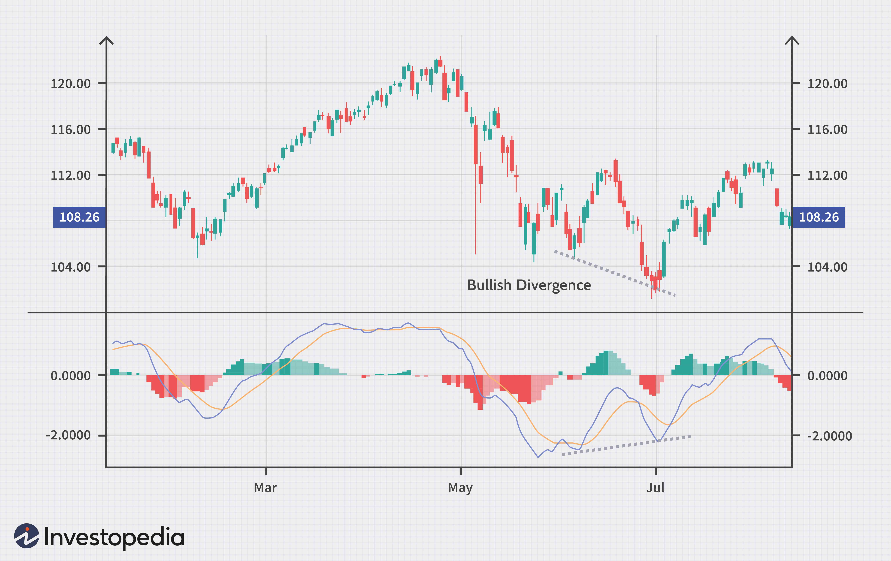

The Moving Average Convergence Divergence (MACD) is a widely recognized technical analysis tool employed by traders and investors across financial markets. Its primary function is to assist in identifying potential buy and sell signals, which are pivotal for making informed investment decisions based on asset price momentum and trends. This technical indicator is celebrated for its effectiveness in spotlighting shifts in market conditions, thereby offering a reliable foundation for strategic trading actions.

This article will examine the importance of MACD specifically within the context of algorithmic trading. Algorithmic trading, which utilizes automated, rule-based systems to execute trades, can leverage the MACD's capabilities to optimize decision-making processes. By integrating MACD, these systems can achieve enhanced precision and speed, reducing the likelihood of emotional bias influencing trades. 



Key components of MACD, including its computation methodologies, will be discussed. The MACD is primarily derived from the difference between a 12-period and a 26-period exponential moving average (EMA), forming what is known as the MACD line. Additionally, a 9-day EMA of the MACD line functions as a Signal line, providing actionable insights when crossovers occur. These elements are visually represented through the MACD line, Signal line, and histogram, which together offer a comprehensive picture of trends and momentum in a given market.

In subsequent sections, we will explore how these components are effectively applied in various trading scenarios. Furthermore, we will explore the ways automated trading systems utilize MACD signals to execute trades with superior accuracy, as well as discuss the broader implications of using MACD as part of a diverse trading strategy that involves various indicators and robust risk management practices.

## Table of Contents

## Understanding Moving Average Convergence Divergence (MACD)

The Moving Average Convergence Divergence (MACD) is a widely recognized technical analysis indicator employed to identify trend changes and potential momentum in financial markets. This tool primarily utilizes the relationship between two exponential moving averages (EMAs) of a security's price, serving as a reliable gauge for traders aiming to discern market dynamics.

The computation of MACD involves the subtraction of the 26-period EMA from the 12-period EMA. This difference forms the MACD line, which is central to the indicator's function:

$$
\text{MACD Line} = \text{EMA}_{12} - \text{EMA}_{26}
$$

In addition to the MACD line, a further component known as the Signal Line is used to trigger buy and sell decisions. The Signal Line is typically a 9-day EMA of the MACD line itself, facilitating the identification of MACD line crossovers that may indicate buy or sell opportunities. 

The MACD setup generally consists of three components: the MACD line, the Signal line, and a histogram. The histogram serves a crucial role by visually representing the divergence or convergence between the MACD line and the Signal line. It provides insights into the strength and direction of [momentum](/wiki/momentum):

- A positive and increasing histogram suggests rising bullish momentum.
- A negative and decreasing histogram indicates strengthening bearish momentum.

This combination allows traders to visualize the correlation between moving average trends and potential shifts in market direction.

In practical terms, the MACD helps traders by providing a clear visual representation of price changes over time, offering signals through crossovers and divergences that may not be immediately obvious through price charts alone. By analyzing the interactions between the MACD line and the Signal line, as well as the histogram's form, traders can infer whether the market is experiencing bullish or bearish phases, which significantly informs trading decisions.  

Utilizing the MACD indicator requires careful attention to its parameters and the selected time frames, as these influence its sensitivity to price fluctuations. As with any technical tool, it is advisable to use MACD alongside other indicators to bolster the accuracy of trading insights.

## Calculating MACD

The Moving Average Convergence Divergence (MACD) is calculated through a series of steps that harness exponential moving averages (EMAs) to generate actionable trading signals. At the core, the MACD line is derived by subtracting the 26-period EMA from the 12-period EMA. This serves as the foundation for the indicator, offering insights into the changing momentum and trend directions of asset prices.

The Signal line, which plays a crucial role in validating these trends, is calculated as a 9-period EMA of the MACD line itself. By smoothing the MACD line over nine periods, the Signal line helps in mitigating the noise inherent in short-term price fluctuations, thereby providing clearer signals for potential trade entries and exits.

The third component, the MACD Histogram, visually represents the difference between the MACD line and the Signal line. It is a powerful tool that depicts the convergence or divergence between these two lines, indicating the strength of market momentum. The height and direction of the histogram bars can reveal changes in momentum, aiding traders in detecting possible shifts in trends.

For practitioners interested in implementing these calculations programmatically, the following Python code snippet showcases how to compute MACD, Signal line, and Histogram using the popular pandas library:

```python
import pandas as pd

def calculate_ema(prices, period):
    return prices.ewm(span=period, adjust=False).mean()

def calculate_macd(price_data):
    ema_12 = calculate_ema(price_data, 12)
    ema_26 = calculate_ema(price_data, 26)
    macd_line = ema_12 - ema_26
    signal_line = macd_line.ewm(span=9, adjust=False).mean()
    histogram = macd_line - signal_line
    return macd_line, signal_line, histogram

# Example usage with pandas DataFrame
# 'data' should be a DataFrame with a column 'Close' containing closing prices.
# data = pd.read_csv('your_price_data.csv')
# macd_line, signal_line, histogram = calculate_macd(data['Close'])
```

Understanding how to compute MACD components is essential for both manual and algorithmic traders. This knowledge allows traders to incorporate MACD into their strategies effectively, improving the interpretation of market conditions and enhancing decision-making processes.

## Applying MACD in Technical Analysis

The Moving Average Convergence Divergence (MACD) is a crucial tool in technical analysis, primarily utilized to pinpoint price trends and potential market shifts. It provides visual cues of imminent bullish or bearish movements, making it essential for traders seeking to capitalize on market dynamics.

One of the fundamental elements of MACD analysis is the observation of crossovers between the MACD line and the Signal line. A bullish crossover occurs when the MACD line crosses above the Signal line, signaling a potential upward momentum. Conversely, a bearish crossover, where the MACD line falls below the Signal line, suggests possible downward momentum. These crossovers serve as primary indicators for executing buy or sell trades.

Divergences between MACD and price action further enrich trading signals. Bullish divergence arises when prices are declining while the MACD line is ascending, indicating a possible reversal to an upward trend. On the other hand, a bearish divergence occurs when the prices are rising and the MACD line is falling, hinting at a potential decline. Recognizing these divergences is critical for preemptive trading decisions.

The MACD histogram plays a significant role by illustrating the difference between the MACD line and the Signal line. Expansion or contraction of the histogram indicates momentum strength and trend direction. A growing histogram suggests strengthening momentum, while a shrinking one indicates weakening momentum, aiding traders in gauging market sentiment.

To bolster the reliability of MACD signals, it is beneficial to use it alongside other technical indicators. The Relative Strength Index (RSI) can be employed to confirm overbought or oversold conditions, adding an additional layer to the MACD analysis. Volume indicators provide insights into the [liquidity](/wiki/liquidity-risk-premium) and strength of price movements. Bollinger Bands, with their [volatility](/wiki/volatility-trading-strategies) bands, further complement MACD by highlighting potential trend reversals and confirming [breakout](/wiki/breakout-trading) signals.

Incorporating these indicators with MACD enhances the precision of trading signals, enabling more informed decision-making and improving the odds of successful trades. By combining these tools, traders can achieve a more comprehensive view of the market landscape, helping to mitigate risks associated with false signals and market noise.

## Integrating MACD with Algorithmic Trading

Algorithmic trading has transformed the landscape of financial markets by employing automated systems for executing trades. The Moving Average Convergence Divergence (MACD) is a favored indicator within these systems for its ability to capture momentum and trends effectively. MACD's dynamic nature makes it a valuable tool for identifying potential buy and sell points, enhancing the efficiency of [algorithmic trading](/wiki/algorithmic-trading) strategies.

Automated trading systems utilize MACD to continuously monitor market conditions and execute trades based on pre-defined criteria. This automation improves the speed and accuracy of trade execution, minimizing the challenges of manual trading, such as emotional bias or delayed reaction times. A Python example to implement a basic MACD crossover strategy in an algorithmic trading system can be demonstrated using the Pandas and TA-Lib libraries:

```python
import pandas as pd
import talib

# Sample data loading (your_dataframe should already contain 'Close' prices)
close_prices = your_dataframe['Close']

# Calculate MACD
macd, signal, hist = talib.MACD(close_prices, fastperiod=12, slowperiod=26, signalperiod=9)

# Generate trading signals
your_dataframe['Signal'] = 0
your_dataframe.loc[macd > signal, 'Signal'] = 1  # Buy signal
your_dataframe.loc[macd < signal, 'Signal'] = -1  # Sell signal
```

Backtesting these strategies is crucial for validating their viability across different market environments. By analyzing historical data with MACD strategies, traders can refine algorithmic models, ensuring the algorithms are robust and adaptable to varying conditions. This process entails assessing performance metrics and making iterative improvements to optimize trade outcomes.

Risk management is an essential component of any trading strategy, and integrating MACD into algorithmic setups allows for the establishment of clear parameters, such as stop-loss and take-profit levels. Traders can define these levels using MACD signals to manage potential downside effectively while maximizing upside opportunities.

In summary, integrating MACD into algorithmic trading harnesses its trend-detection capabilities, providing traders with systematic approaches that enhance decision-making processes. As technology in trading evolves, the adaptability and utility of MACD are expected to yield increasingly sophisticated algorithmic solutions.

## Challenges and Limitations of MACD in Algo Trading

The Moving Average Convergence Divergence (MACD) indicator, while widely used in algorithmic trading, presents several challenges and limitations that traders must consider for effective strategy implementation. One significant issue is the potential for false signals, especially in sideways or range-bound markets. In such scenarios, the MACD may indicate bullish or bearish movements that do not materialize, potentially leading to unprofitable trades. This occurs because the MACD is designed as a trend-following indicator and performs best in trending markets.

Another important limitation is its nature as a lagging indicator, which relies on historical price data. This lag can lead to delayed signals, causing traders to miss the timely execution of trades in rapidly changing market conditions. The underlying calculation of the MACD line involves exponential moving averages (EMAs), specifically a 12-period and a 26-period EMA, creating an intrinsic delay. The resulting MACD line is given by:

$$
\text{MACD Line} = \text{EMA}_{12} - \text{EMA}_{26}
$$

In algorithmic trading, this lag can be detrimental as algorithms strive for efficient and immediate trade execution.

Additionally, traders must exercise proper diversification and risk management when designing MACD-driven algorithms. Overreliance on MACD signals without adequate checks can amplify losses in volatile or range-bound markets. Employing stop-loss and take-profit levels, as well as diversifying across different assets and timeframes, can help mitigate risks.

To enhance decision-making accuracy and limit the drawbacks of the MACD, it is often combined with other leading indicators. For instance, the Relative Strength Index (RSI) or Bollinger Bands can provide additional confirmation of trading signals, reducing the likelihood of false trades. By integrating these indicators into the algorithmic framework, traders can achieve a more robust and reliable trading strategy. Here is a simple example of how such integration might occur in Python:

```python
import pandas as pd
import talib

# Sample OHLC data
data = pd.DataFrame({ 
    'close': [100, 102, 105, 107, 108, 109, 112, 114, 113, 115]
})

# Calculate MACD
macd, signal, hist = talib.MACD(data['close'], fastperiod=12, slowperiod=26, signalperiod=9)

# Calculate RSI
rsi = talib.RSI(data['close'], timeperiod=14)

# Combine indicators for a basic strategy
buy_signals = (macd > signal) & (rsi < 30)
sell_signals = (macd < signal) & (rsi > 70)

print("Buy Signals:", buy_signals)
print("Sell Signals:", sell_signals)
```

In conclusion, while the MACD is a powerful tool in algorithmic trading, awareness of its limitations is crucial. By supplementing it with additional indicators and solid risk management practices, traders can leverage its strengths while minimizing potential pitfalls.

## Conclusion

The Moving Average Convergence Divergence (MACD) remains a pivotal tool in both manual and automated trading due to its capacity to accurately highlight market momentum and trends. By calculating the difference between two exponential moving averages (EMAs), MACD provides traders with clear indications of potential bullish or bearish market movements. In algorithmic trading setups, the integration of MACD allows for systematic and objective trade execution. Automated systems equipped with MACD can effectively minimize emotional biases that may influence manual trading decisions, enhancing the precision of trade execution.

To achieve the best outcomes, traders and investors should use MACD within a broader strategy that incorporates multiple indicators and sound risk management practices. By doing so, they can enhance the reliability of their trading decisions and mitigate potential losses from false signals, particularly in markets with high volatility or unpredictable behavior. Indicators like the Relative Strength Index (RSI), [volume](/wiki/volume-trading-strategy) indicators, and Bollinger Bands can complement MACD analyses, offering a more comprehensive trading framework.

The continuous advancement in algorithmic trading technology suggests that the use of MACD is poised to evolve further. With improved [backtesting](/wiki/backtesting) methods and [machine learning](/wiki/machine-learning) capabilities, the application of MACD in trading is expected to offer more robust trading solutions. These advancements could lead to more adaptive algorithms that better respond to market dynamics, ultimately aiding traders and investors in navigating complex financial environments with greater accuracy and efficiency.

## References & Further Reading

[1]: ["Technical Analysis of the Financial Markets: A Comprehensive Guide to Trading Methods and Applications"](https://www.amazon.com/Technical-Analysis-Financial-Markets-Comprehensive/dp/0735200661) by John J. Murphy

[2]: Appel, G. (2005). "Technical Analysis: Power Tools for Active Investors." Financial Times Prentice Hall.

[3]: ["Algorithmic Trading: Winning Strategies and Their Rationale"](https://www.wiley.com/en-us/Algorithmic+Trading%3A+Winning+Strategies+and+Their+Rationale-p-9781118460146) by Ernest P. Chan

[4]: Pring, M. J. (1991). ["Technical Analysis Explained: The Successful Investor's Guide to Spotting Investment Trends and Turning Points."](https://www.amazon.com/Technical-Analysis-Explained-Fifth-Successful/dp/0071825177) McGraw-Hill.

[5]: Achelis, S. B. (2001). ["Technical Analysis from A to Z."](https://archive.org/details/technicalanalysi00ache) McGraw-Hill.

[6]: Elder, A. (2008). ["Trading for a Living: Psychology, Trading Tactics, Money Management."](https://www.amazon.com/Trading-Living-Psychology-Tactics-Management/dp/0471592242) Wiley.