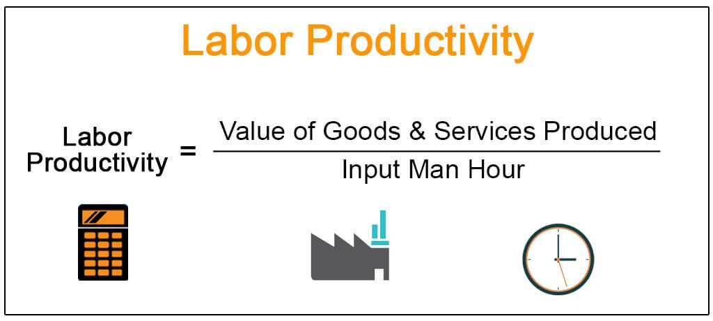

## Table of Contents

## What is productivity and why is it important to measure?

Productivity is how well someone or a group uses their time and resources to get things done. It's about doing more work in less time, or using fewer resources to achieve the same result. For example, if a worker can make 10 items in an hour instead of 5, their productivity has gone up.

Measuring productivity is important because it helps us see how efficient we are. When we know our productivity, we can find ways to improve it. This can lead to better performance at work, higher profits for businesses, and more time for personal activities. By tracking productivity, we can also set goals and see if we are meeting them, which helps us grow and succeed.

## How do you define productivity in different industries?

In manufacturing, productivity is about how many products workers can make in a certain amount of time. If a factory can make more cars or toys in an hour than before, its productivity has increased. This industry often uses machines and technology to help workers do more work faster. By measuring productivity, factory managers can see if new machines or methods are helping or if they need to make changes.

In the service industry, like restaurants or hotels, productivity is about how well workers serve customers. It's not just about speed, but also about the quality of service. For example, a restaurant might measure productivity by how many customers they serve in an evening, but also by how happy those customers are with their meals and the service they received. Good productivity in this industry means happy customers and more business.

In the tech industry, productivity can be about how quickly a team can develop and release new software or features. It's also about how well the software works and how it helps users. Tech companies often use tools to track how much code their developers write and how fast they fix problems. High productivity in tech means getting new, useful products to market quickly and keeping them running smoothly.

## What are the basic formulas used to calculate productivity?

To calculate productivity, you can use a simple formula: Productivity = Output / Input. Here, "Output" is what you get from your work, like the number of products made or services provided. "Input" is what you use to get that output, such as the time spent working or the materials used. For example, if a worker makes 20 widgets in 4 hours, the productivity would be 20 widgets / 4 hours = 5 widgets per hour.

In some cases, you might want to measure productivity in terms of money. You can do this by using the formula: Productivity = Revenue / Cost. "Revenue" is the money you earn from your work, and "Cost" is the money you spend to do that work. For instance, if a business earns $10,000 from selling products and spent $5,000 to make them, the productivity would be $10,000 / $5,000 = 2. This means for every dollar spent, the business made two dollars.

## Can you explain the difference between labor productivity and total factor productivity?

Labor productivity is about how much work a worker can do in a certain amount of time. It's calculated by dividing the total output by the total hours worked. For example, if a worker makes 100 items in a day, their labor productivity is 100 items per day. This measure helps businesses see how efficient their workers are and find ways to help them work better. It's useful for understanding how changes like training or new tools affect the amount of work done.

Total [factor](/wiki/factor-investing) productivity, on the other hand, looks at how well all the resources a business uses are working together. It's not just about the workers, but also about the machines, materials, and technology used in the process. Total factor productivity is harder to calculate because it involves many different inputs, but it gives a broader view of how efficient the whole business is. It helps businesses see if they are using all their resources in the best way possible, not just focusing on labor.

## How do you collect data needed for productivity calculations?

To collect data for productivity calculations, you start by keeping track of what your workers do and what resources they use. For example, in a factory, you might count how many items each worker makes every day. You can use a simple logbook or a computer system to write down this information. It's important to be accurate and consistent so you can trust the data later. You also need to record the time spent working, like the number of hours each worker is on the job. This helps you figure out how much work is done per hour.

Besides tracking output and time, you might need to gather data on other resources used, like materials or energy. For instance, in a restaurant, you would note how much food is used to make meals and how much electricity is used to cook. This data can be collected by looking at receipts, bills, or using special meters. Once you have all this information, you can use it to calculate productivity by dividing the output by the input. Keeping good records and updating them regularly makes sure your productivity calculations are reliable and useful for making decisions.

## What are common metrics used to assess productivity in a business setting?

In a business setting, one common metric used to assess productivity is the output per hour worked. This means counting how many items or services a worker can produce in an hour. For example, in a factory, you might measure how many cars are made per hour. In an office, it could be how many reports an employee completes in a day. This metric helps businesses see how fast their workers are and if they need to find ways to speed up the work.

Another important metric is revenue per employee. This is about how much money the business earns for each worker it has. If a company makes $1 million and has 10 workers, the revenue per employee would be $100,000. This helps business owners see if their workers are helping the company make money or if they need to change how they work. It's a good way to check if the business is using its workers well.

Sometimes, businesses also look at the quality of work done, not just the quantity. They might measure the error rate, which is how often mistakes happen. For example, in a call center, they might count how many calls have problems that need fixing. A low error rate means workers are doing good work, which is another way to measure productivity. This helps businesses keep their customers happy and their work high quality.

## How can technology be used to enhance productivity measurement?

Technology can make it easier to measure productivity by using special tools and software. These tools can keep track of how much work is done and how long it takes. For example, in a factory, machines can count how many items are made each hour and send that information to a computer. In an office, software can track how many reports an employee finishes in a day. This makes it easy to see productivity numbers without having to write everything down by hand. It also helps businesses see patterns and find ways to work better.

Using technology also helps businesses get more detailed information about productivity. They can use special programs to see how different parts of the business are doing, like how well a team is working together or if a new way of doing things is helping. This detailed data can show where improvements are needed and where things are going well. By using technology, businesses can make smarter decisions about how to help their workers be more productive and keep track of their progress over time.

## What are the challenges in accurately measuring productivity?

Measuring productivity accurately can be hard because there are many things that can affect it. For example, the quality of work is important, but it's not always easy to measure. If someone works fast but makes a lot of mistakes, their productivity might look good on paper, but it's not really high because they have to fix those mistakes. Also, different jobs have different ways of measuring productivity. A factory worker's productivity might be easy to count by the number of items they make, but for a teacher or a nurse, it's harder to see how much they get done in a day.

Another challenge is that people can change how they work when they know they are being watched. If workers know their productivity is being measured, they might try to work faster just for that time, but then go back to their normal pace later. This makes the numbers less accurate. Also, some things that help productivity, like good teamwork or a happy work environment, are hard to measure with numbers. So, businesses have to be careful and use different ways to check productivity to get a true picture of how well they are doing.

## How do you compare productivity across different countries or regions?

Comparing productivity across different countries or regions can be tricky because each place has its own way of doing things. One common way to do this is by looking at the Gross Domestic Product (GDP) per hour worked. This tells us how much money a country makes for each hour people work. For example, if Country A has a higher GDP per hour than Country B, it means workers in Country A are more productive on average. But, this method doesn't tell the whole story because it doesn't consider things like the cost of living or how good the education system is in each country.

Another way to compare productivity is by looking at how much stuff or services workers make or provide in a certain time. This can be measured by the number of cars made in a factory or the number of customers served in a store. But, even this can be hard because different countries might make different things or have different ways of working. For example, a country with a lot of farms might be very good at growing food, but not as good at making computers. So, when comparing productivity, it's important to look at many different things and not just one number.

## What advanced statistical methods can be applied to productivity analysis?

One advanced statistical method that can be used for productivity analysis is regression analysis. This method helps us see how different things, like the number of workers or the amount of money spent on machines, affect productivity. By using regression analysis, we can figure out which factors are most important for making productivity go up or down. For example, if we see that spending more money on training leads to higher productivity, we might decide to invest more in training our workers. This helps businesses make smart decisions about where to put their time and money to get the best results.

Another useful method is time series analysis. This method looks at how productivity changes over time, like from one month to the next or one year to the next. It can help us see if there are patterns or cycles in productivity, like if it goes up during certain times of the year. By understanding these patterns, businesses can plan better and make sure they have enough workers or resources at the right times. Time series analysis can also help predict future productivity, which is useful for setting goals and planning for growth.

## How does productivity measurement influence organizational strategy and decision-making?

Productivity measurement helps businesses make smart choices about how to run their company. When a business knows how productive its workers are, it can see where it needs to make changes. For example, if productivity is low, the business might decide to train its workers better or buy new machines to help them work faster. By looking at productivity numbers, business leaders can figure out which parts of the company are doing well and which parts need help. This helps them decide where to spend money and time to make the whole business more successful.

Understanding productivity also helps businesses plan for the future. If a company sees that its productivity is going up, it might decide to grow by hiring more workers or opening new locations. On the other hand, if productivity is going down, the business might need to find new ways to work or even cut back on some things. By keeping an eye on productivity, business leaders can set goals and make plans to reach them. This makes sure the company keeps moving forward and stays competitive in its industry.

## What are future trends in productivity calculation and measurement?

In the future, technology will play a bigger role in how we measure productivity. More businesses will use special software and tools that can track work in real-time. These tools will not just count how many things workers make, but also look at how well they work together and how happy they are. This means businesses will get a fuller picture of productivity, not just numbers. For example, AI and [machine learning](/wiki/machine-learning) might help by finding patterns in how workers do their jobs, which can lead to better ways of working.

Another trend will be using data from many different places to measure productivity. Businesses will look at information from their computers, phones, and even from the internet to see how well they are doing. This will help them understand how different parts of the world or different industries are affecting their productivity. By using all this data, businesses can make smarter decisions about how to improve and grow. This way of measuring productivity will be more complete and will help businesses stay ahead in a fast-changing world.

## What is the understanding of productivity and efficiency in trading?

Productivity in algorithmic trading is analogous to the operational efficiency observed in manufacturing processes. In trading, productivity can be quantified by examining the ratio of successful trades to the resources employed, which include capital, time, and computational power. This concept mirrors the efficiency in manufacturing, where the focus is on maximizing output while consuming minimal input. Similarly, in trading, the goal is to enhance transaction success rates with optimized use of available resources.

Efficiency in trading is characterized by the ability to maximize outputs, such as profit and successful trade execution, while minimizing inputs like time and capital. This involves careful management of transaction costs, swift market execution, and precise algorithm tuning, ensuring that each executed trade contributes positively to the overall profitability of the trading strategy.

Drawing parallels from industries such as manufacturing, where Lean and Six Sigma methodologies are applied to minimize waste and improve processes, [algorithmic trading](/wiki/algorithmic-trading) also employs strategies to refine trading operations. For instance, trade execution algorithms are often optimized using [backtesting](/wiki/backtesting) and simulation techniques to ensure they perform efficiently in live market conditions.

In terms of quantifiable measures, trading efficiency can be expressed using metrics such as the success rate of trades, cost efficiency ratio, and average return per transaction. For example, if we define:

- $S$ as the number of successful trades,
- $C$ as the capital employed,
- $T$ as the trading time,
- and $R_c$ as computational resources,

the productivity $P$ can be represented as:

$$
P = \frac{S}{C + T + R_c}
$$

This formula provides a framework to assess the productivity by balancing successful outcomes over resource expenditure. By optimizing each component, traders aim to achieve a higher productivity score, indicating a more refined and successful trading strategy.

Through these methodologies, algorithmic trading systems strive to foster increased efficiency and productivity, similar to industrial optimization processes, thereby contributing to more robust financial performance.

## How can we measure efficiency in algorithmic trading?

In algorithmic trading, measuring efficiency is critical for optimizing trading strategies and achieving sustainable profits. Traders rely on a range of key performance indicators (KPIs) to evaluate the efficacy of their algorithms. Among these, the Sharpe Ratio is a widely used metric. It measures the risk-adjusted return of an investment portfolio. Mathematically, it is expressed as:

$$
\text{Sharpe Ratio} = \frac{E[R_p] - R_f}{\sigma_p}
$$

where $E[R_p]$ is the expected return of the portfolio, $R_f$ is the risk-free rate, and $\sigma_p$ represents the standard deviation of the portfolio's excess return. A higher Sharpe Ratio indicates a more favorable risk-return profile.

Total return is another critical KPI, representing the overall gain or loss of an investment relative to its initial cost. This metric provides insight into an algorithm's profitability over a specific period without accounting for risk. Conversely, risk-adjusted returns, which modify the total return by factoring in the variability of returns, offer a more nuanced view by highlighting how much risk is undertaken to achieve these returns.

The importance of accurate data and real-time analytics in assessing these KPIs cannot be overstated. High-frequency data and sophisticated analytical tools are necessary to monitor and evaluate algorithmic performance continually. Without precise data, the interpretation of KPIs like the Sharpe Ratio or total return may be skewed, leading to misguided decisions.

Quantitative analysis is fundamental in measuring trading efficiency. This approach involves statistical methods to assess trading algorithms, often using historical data to identify patterns and predict future performance. Algorithmic performance tracking further enhances this analysis by monitoring the real-time execution of trades, allowing traders to adjust strategies dynamically based on market conditions.

Python, a popular language for algorithmic trading, provides robust libraries such as Pandas and NumPy for data manipulation and quantitative analysis. These tools can be used to calculate KPIs and visualize trading performance. Below is a simple Python snippet that calculates the Sharpe Ratio for a given set of returns:

```python
import numpy as np

def sharpe_ratio(returns, risk_free_rate=0.01):
    excess_returns = returns - risk_free_rate
    return np.mean(excess_returns) / np.std(excess_returns)

# Example usage
daily_returns = np.array([0.01, 0.02, 0.015, -0.005, 0.01])
print("Sharpe Ratio:", sharpe_ratio(daily_returns))
```

Overall, measuring efficiency in algorithmic trading involves a comprehensive analysis of performance metrics, supported by accurate data and real-time analytics. By leveraging these tools and methods, traders can refine strategies and improve their trading outcomes.

## References & Further Reading

- **Academic Papers and Articles:**

1. **Cartea, Álvaro, et al. (2015). "Algorithmic and High-Frequency Trading". Cambridge University Press.**  
   This book provides a comprehensive overview of the tools and techniques used in algorithmic and high-frequency trading ([HFT](/wiki/high-frequency-trading-strategies)), offering insights into optimization and efficiency.

2. **Hendershott, Terrence, et al. (2011). "Does Algorithmic Trading Improve Liquidity?". The Journal of Finance, 66(1), 1-33.**  
   This paper explores the role of algorithmic trading in enhancing market [liquidity](/wiki/liquidity-risk-premium) and efficiency, providing empirical evidence and analysis.

3. **Cheng, Jie. (2018). "Measuring the Efficiency of Trading Strategies: From Sharpe Ratio to Machine Learning". Journal of Financial Data Science, 1(1), 1-9.**  
   This article examines various metrics, including the Sharpe Ratio, for assessing the efficiency of trading strategies and introduces machine learning applications in this domain.

4. **Kearns, Michael, et al. (2014). "Machine Learning for Market Microstructure and High Frequency Trading". In Bouchaud, Jean-Philippe, et al. (Eds.), Handbook of Systemic Risk.**  
   The paper discusses the application of machine learning to market microstructure, which is integral to developing efficient algorithmic trading strategies.

- **Books and Resources:**

5. **Chan, Ernest. (2013). "Algorithmic Trading: Winning Strategies and Their Rationale". Wiley.**  
   This book investigates into practical algorithmic trading strategies, discussing efficiency and productivity improvement through quantitative approaches.

6. **Narang, Rishi K. (2009). "Inside the Black Box: The Simple Truth About Quantitative Trading". Wiley.**  
   Narang's book offers a detailed description of [quantitative trading](/wiki/quantitative-trading) techniques, valuable for understanding algorithmic trading's productivity aspects.

7. **Hasbrouck, Joel. (2007). "Empirical Market Microstructure: The Institutions, Economics, and Econometrics of Securities Trading". Oxford University Press.**  
   This book outlines the empirical foundations of market microstructure, essential for comprehending algorithmic trading's role in market efficiency.

- **Online Articles and Journals:**

8. **"The Role of Artificial Intelligence in Algorithmic Trading", Investopedia.**  
   An article that surveys how AI is transforming algorithmic trading by improving accuracy, efficiency, and decision-making processes.

9. **QuantStart. (n.d.). "Algorithmic Trading & Quantitative Investment Strategies".**  
   This online resource provides tutorials and articles on algorithmic trading, focusing on efficiency optimization and strategy development.

10. **"Enhancing Trading Efficiency through Real-Time Data Analysis", Journal of Trading, 2020.**  
    An article analyzing the impact of real-time data analytics in boosting trading efficiency and informing strategic decisions.

These resources collectively offer a deep dive into the efficiency calculations and productivity strategies pivotal in algorithmic trading. They provide a foundation for further study and exploration into the subject, facilitating a comprehensive understanding of this sophisticated field.

