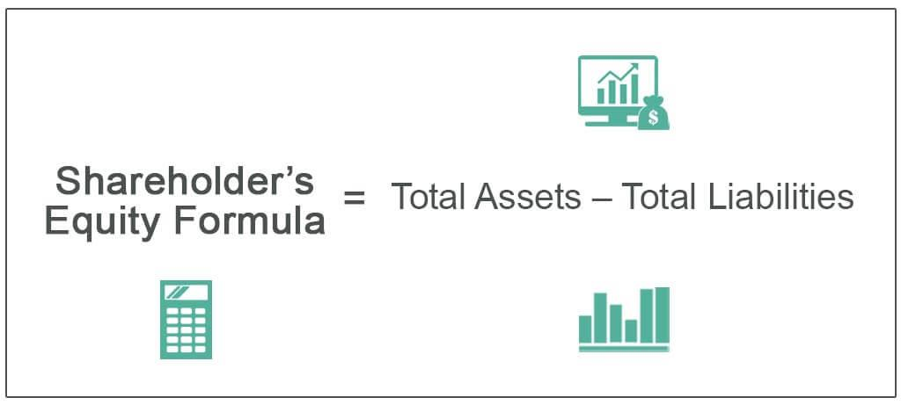

In the complex world of finance, understanding various financial metrics is crucial for investors and analysts. This article examines the intricate details of equity calculation, financial metrics, shareholders' equity, and their interplay with algorithmic trading.

Shareholders' equity, often referred to as the net worth of a company, is a vital indicator of a company’s financial health. It is calculated by subtracting total liabilities from total assets. A positive shareholders' equity indicates that a company's assets exceed its liabilities, which is often a sign of financial strength. Conversely, negative equity can serve as a warning signal about potential financial trouble. In algorithmic trading, sophisticated mathematical models utilize financial metrics like shareholders' equity to make data-driven trading decisions. By integrating these metrics, algorithms can optimize trade execution, assess market conditions, and manage risk more effectively.



The aim of this article is to bridge the gap between traditional financial analysis and modern trading techniques by exploring how equity calculations and financial metrics can enhance algorithmic trading strategies. Key formulas and examples will be discussed to illustrate their application in the trading ecosystem. Whether you are an investor, a trader, or a finance enthusiast, understanding these elements will empower you with enhanced decision-making tools, enabling you to navigate financial markets with greater confidence and precision.

## Table of Contents

## Understanding Shareholders' Equity

Shareholders' equity, prominently featured on a company's balance sheet, is central to discerning the net worth of a business entity. The calculation is straightforward: 

$$
\text{Shareholders' Equity} = \text{Total Assets} - \text{Total Liabilities}
$$

This metric serves as a robust indicator of financial health, highlighting whether a company has sufficient assets to offset its liabilities. A positive shareholders' equity signifies that the company's assets surpass its liabilities, indicating a fundamentally sound financial position. Conversely, negative equity should raise concerns, often signaling potential financial distress or underlying issues that necessitate further investigation.

Furthermore, shareholders' equity is instrumental in computing pivotal financial ratios, notably the Debt-to-Equity Ratio (D/E) and Return on Equity (ROE). These ratios are indispensable tools for investors seeking to evaluate a company's financial stability and profitability. 

- The Debt-to-Equity Ratio, calculated by dividing a company's total liabilities by its shareholders' equity, provides insight into the financial leverage and risk profile. A high D/E ratio may suggest over-reliance on borrowed capital, whereas a lower ratio may indicate prudent financial management.

- Return on Equity measures a company's ability to generate profits from shareholders' investments, calculated as:

$$
\text{ROE} = \frac{\text{Net Income}}{\text{Shareholders' Equity}}
$$

A higher ROE indicates efficient management and potentially higher returns for investors.

In-depth understanding of the components of shareholders' equity is crucial for comprehensive financial analysis. These components include:

1. **Share Capital:** The funds raised by issuing shares in exchange for cash or other considerations.
2. **Retained Earnings:** The cumulative amount of net income retained by a company rather than distributed as dividends. This element reflects a company's capacity to reinvest in its growth.
3. **Treasury Stock:** Represents shares that a company has repurchased from investors, which are held in the company's treasury and can be reissued or retired.

Interpreting these components provides nuanced insights into the company's financial strategies and operational choices, equipping analysts and investors with the necessary data to make informed decisions. Understanding shareholders' equity and its implications allows stakeholders to assess growth potential, risk, and overall financial soundness accurately.

## Equity Calculation Techniques

Calculating shareholders' equity is an essential task in financial analysis, which requires the efficient organization and interpretation of a company's financial statements. The fundamental formula used to determine shareholders' equity is:

$$
\text{Shareholders' Equity} = \text{Total Assets} - \text{Total Liabilities}
$$

This formula extracts the company's net worth by calculating the remaining assets after deducting liabilities. Understanding and categorizing assets and liabilities are crucial in this process. 

**Asset and Liability Categorization:**

Assets and liabilities are classified as either current or non-current:
- **Current Assets** are expected to be converted into cash or consumed within a year, including cash equivalents, marketable securities, and inventory.
- **Non-current Assets** are long-term resources, such as property, plant, and equipment (PPE), intangible assets, and long-term investments.
- **Current Liabilities** are obligations due within the upcoming year, like accounts payable and short-term debt.
- **Non-current Liabilities** consist of long-term debts, lease obligations, and other non-current financial commitments.

The correct classification is crucial since current assets and liabilities impact a company's [liquidity](/wiki/liquidity-risk-premium), while non-current items affect long-term financial stability.

**Advanced Equity Calculation Techniques:**

Besides the basic calculation, various models exist to provide a more nuanced evaluation of shareholders' equity. These techniques involve adjustments for factors such as intangible assets, contingent liabilities, and off-balance-sheet items:
- **Intangible Assets:** Elements like patents and trademarks should be assessed for their true value. Unlike physical assets, their valuation is more complex and might require adjustments, especially if they have significant market value but are listed at a lower cost on the balance sheet.
- **Contingent Liabilities:** These potential liabilities should be evaluated under various scenarios since they can impact the company's financial state. They include pending lawsuits or tax disputes, which might not be reflected in the balance sheet under standard accounting rules.

**Implications of Comprehensive Equity Calculation:**

A thorough equity calculation is indispensable for analyzing a company's operational efficiency and potential for investment. It provides insight into:
- **Operational Efficiency:** By evaluating how well a company utilizes its assets to generate profits without succumbing to excessive debt or contingent liabilities.
- **Investment Potential:** By scrutinizing the value of intangible assets or adjusting for any off-balance-sheet obligations, investors can make better risk assessments and inform their decisions.

Understanding these nuances ensures that equity figures are interpreted correctly, thereby offering a more accurate picture of a company's financial health and potential for growth.

## The Role of Financial Metrics in Algorithmic Trading

Algorithmic trading employs pre-determined rules and complex algorithms to automate the trading process. At its core, this method relies heavily on financial metrics such as equity ratios to design frameworks for entering and exiting trades. These metrics play a pivotal role in evaluating a company's financial health and potential, thus influencing trading strategies.

Return on Equity (ROE) and Debt-to-Equity Ratio (D/E) are two fundamental metrics utilized in [algorithmic trading](/wiki/algorithmic-trading). ROE measures a company’s profitability in relation to shareholders' equity, calculated as:

$$
\text{ROE} = \frac{\text{Net Income}}{\text{Shareholders' Equity}}
$$

This metric provides insight into how effectively a company is generating profits from its equity base, thereby serving as a benchmark for investment performance. A higher ROE indicates efficient use of equity to generate earnings, making it a crucial input for algorithmic systems aimed at capitalizing on profitable trading opportunities.

The D/E ratio, on the other hand, gauges financial leverage by comparing a company's total liabilities to its shareholders' equity:

$$
\text{D/E Ratio} = \frac{\text{Total Liabilities}}{\text{Shareholders' Equity}}
$$

This ratio helps assess risk by indicating the proportion of company financing that comes from debt versus equity. In algorithmic trading, understanding a company's leverage enables systems to forecast potential risks and returns associated with investments in that company.

Algorithmic trading systems utilize these financial metrics to discern patterns and predictive insights about market movements. By analyzing data trends, these systems can execute trades at optimal speeds, minimizing latency and enhancing the potential for investment returns. The computational efficiency of algorithmic platforms is often augmented by employing robust financial data, enabling faster response times to market signals and conditions.

The integration of comprehensive financial metrics in trading algorithms provides traders a competitive advantage by enabling them to make more informed and data-driven decisions. This approach fosters an environment where trading strategies can be refined continuously based on shifting financial metrics and market dynamics, leading to improved trading outcomes and strategic foresight. 

By leveraging quantitative analyses rooted in these financial metrics, algorithmic trading not only enhances predictive capabilities but also streamlines operational efficiency, allowing for better management of trading portfolios and risk. This symbiotic relationship between traditional financial analysis and modern trading technology underscores the evolving landscape of trading strategies in the financial markets.

## Practical Examples

To illustrate the application of these concepts, consider a hypothetical company with total assets of $100 million and total liabilities of $60 million, resulting in shareholders’ equity of $40 million. This crucial financial metric plays a significant role for algorithmic trading systems, which leverage such figures to determine optimal trading positions. By analyzing equity alongside other metrics like Return on Equity (ROE) and Debt-to-Equity Ratio (D/E), these systems can manage risks more effectively.

Algorithmic trading often involves [backtesting](/wiki/backtesting) strategies using historical data, allowing traders to refine their approaches based on calculated financial metrics. For instance, a Python-based backtesting framework could be employed to simulate a trading strategy, using the following simple code snippet:

```python
import pandas as pd

def backtest_strategy(data, equity_threshold):
    # Simulate buying when equity is above the threshold
    buy_signals = data[data['Shareholder_Equity'] > equity_threshold]
    sell_signals = data[data['Shareholder_Equity'] <= equity_threshold]

    # Here, more sophisticated logic can be added for strategy development
    profit = (sell_signals['Price'].sum() - buy_signals['Price'].sum())
    return profit

# Sample data
data = pd.DataFrame({
    'Date': pd.date_range(start='1/1/2020', periods=5),
    'Shareholder_Equity': [35, 45, 40, 50, 55],
    'Price': [10, 12, 13, 14, 15]
})

equity_threshold = 40
profit = backtest_strategy(data, equity_threshold)
print(f"Profit from strategy: ${profit}")
```

This basic example demonstrates how simple threshold-based strategies can be tested. Traders can extend such frameworks by incorporating more advanced financial metrics and predictive analytics to optimize performance.

Real-world case studies further highlight the success of firms utilizing these metrics. For example, high-frequency trading firms often incorporate financial metrics into their algorithms, which could lead to improved forecasting accuracy and strategic adaptability. Studies have shown that integrating financial health indicators into trading models can significantly enhance predictive capabilities, ultimately driving more precise and stable trading outcomes. Such applications underscore the value of combining traditional financial metrics with advanced algorithmic approaches to optimize trading strategies and enhance investment performance.

## Conclusion

Equity calculation and financial metrics are essential tools in the complex world of finance and trading. They offer crucial insights into a company's financial health, aiding investors and analysts in making informed investment decisions. As the landscape of algorithmic trading continues to advance, incorporating these financial metrics into trading algorithms can significantly enhance predictive accuracy and operational efficiency. 

Understanding and accurately applying concepts such as Return on Equity (ROE) and Debt-to-Equity Ratio (D/E) empower investors, analysts, and traders. This knowledge equips them with the confidence and precision required to navigate financial markets effectively. By integrating both traditional financial analysis methods and cutting-edge algorithmic strategies, a more comprehensive and insightful analysis is achievable. This amalgamation ultimately leads to better financial outcomes, highlighting the importance of these metrics in modern financial practice.

## References

1. **Investopedia. How Do You Calculate Shareholders' Equity?** This article from Investopedia provides a comprehensive guide on calculating shareholders' equity, outlining the formula where shareholders' equity equals total assets minus total liabilities. It discusses the significance of this calculation in evaluating a company's financial stability and investment potential (Source: [Investopedia](https://www.investopedia.com)).

2. **Wall Street Prep. Shareholders Equity on Balance Sheet.** The resource from Wall Street Prep elaborates on the components of shareholders' equity as presented on a balance sheet, including share capital, retained earnings, and treasury stock. This guide is useful for financial statement analysis and understanding the elements contributing to a business’s net worth (Source: [Wall Street Prep](https://www.wallstreetprep.com)).

3. **Algorithmic Trading Library. Importance of Equity in Algorithmic Trading.** This resource emphasizes the role of equity metrics in algorithmic trading strategies, detailing how ratios like the Return on Equity (ROE) and Debt-to-Equity Ratio (D/E) inform trading algorithms for improved decision-making and efficiency (Source: [Algorithmic Trading Library](https://www.algorithmictradinglibrary.com)).

4. **Calculator.dev. Equity Ratio Calculator.** This tool on Calculator.dev allows users to compute the equity ratio, a financial metric that assesses a company's capital structure by illustrating the proportion of assets financed by shareholder equity in relation to total assets. This calculation aids investors in assessing financial risk and investment quality (Source: [Calculator.dev](https://www.calculator.dev)).

## References & Further Reading

[1]: ["How Do You Calculate Shareholders' Equity?"](https://www.investopedia.com/ask/answers/070615/how-do-you-calculate-shareholder-equity.asp) - Investopedia provides a detailed guide on calculating shareholders' equity and its importance in financial stability.

[2]: ["Shareholders Equity on Balance Sheet"](https://www.investopedia.com/terms/s/shareholdersequity.asp) - Wall Street Prep explains the components of shareholders' equity and its significance in financial statements.

[3]: Lopez de Prado, M. (2018). ["Advances in Financial Machine Learning"](https://books.google.com/books/about/Advances_in_Financial_Machine_Learning.html?id=oU9KDwAAQBAJ) - Discusses machine learning techniques used in financial markets and their applications in trading.

[4]: Jansen, S. (2020). ["Machine Learning for Algorithmic Trading: Predictive Models to Extract Signals from Market and Alternative Data for Systematic Trading Strategies"](https://www.amazon.com/Machine-Learning-Algorithmic-Trading-alternative/dp/1839217715) - Covers the application of machine learning in developing algorithmic trading strategies.

[5]: Chan, E. P. (2008). ["Quantitative Trading: How to Build Your Own Algorithmic Trading Business"](https://github.com/ftvision/quant_trading_echan_book) - Offers insights on building algorithmic trading strategies and understanding quantitative analysis.