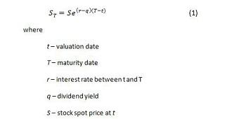

The stock futures market plays a pivotal role in global finance by providing a mechanism for managing risk and facilitating speculation. Futures contracts are standardized agreements to buy or sell an asset at a predetermined price at a future date. They cater to a wide range of underlying assets, including stocks, commodities, indices, and currencies. The futures market offers liquidity, price discovery, and risk management tools essential for the stability and efficiency of financial markets worldwide.

Futures price calculation is a fundamental aspect of futures trading and is crucial for developing effective trading strategies. The price of a futures contract is influenced by several factors, including the spot price of the underlying asset, interest rates, and, in the case of dividend-yielding assets, expected dividends. The cost-of-carry model is commonly used to determine the futures price, defined by the equation:

$$
F = S \times e^{(r - q) \times T}
$$

where $F$ is the futures price, $S$ is the spot price, $r$ is the risk-free interest rate, $q$ is the dividend yield, and $T$ is the time to maturity. Understanding these elements is critical for traders and investors as they form the basis for identifying opportunities and managing risks in the futures market.

Algorithmic trading has become an integral component of futures trading, offering numerous advantages such as speed, precision, and the ability to process large datasets. Essentially, algorithmic trading involves the use of computer algorithms to automatically execute trades based on pre-defined criteria. It is particularly well-suited to the futures market due to its standardized and liquid nature. 

The convergence of algorithmic trading and futures pricing forms the core of this discourse, highlighting how precise futures price calculations can enhance algorithmic trading strategies. By examining the interplay between these two areas, this article aims to provide insights into developing more robust and profitable trading strategies. Additionally, it explores the role of advanced technologies like artificial intelligence in shaping the future of futures trading and algorithmic solutions.

## Table of Contents

## Understanding Futures Contracts

Futures contracts are standardized financial agreements obligating the buyer to purchase, or the seller to sell, an asset at a predetermined future date and price. These contracts play a crucial role in financial markets by allowing participants to hedge against price [volatility](/wiki/volatility-trading-strategies) or speculate on price movements. 

**Types of Assets and Commodities:** Futures contracts cover a wide range of assets, including commodities like oil, gold, and wheat, as well as financial instruments such as stock indices, interest rates, and foreign currencies. Commodity futures are typically used by producers and consumers seeking to stabilize production costs and revenues, while financial futures serve investors and institutions aiming to manage portfolio risks or gain speculative exposure.

**Structure and Trading of Futures Contracts:** Futures contracts are traded on organized exchanges, such as the Chicago Mercantile Exchange (CME) or the Intercontinental Exchange (ICE), which facilitate liquidity and transparency. Key contract specifications include the contract size, delivery month, and tick size, which define the minimum price movement. Trading occurs using a standardized process where participants either buy (go long) or sell (go short) contracts, usually with the help of brokers and margin accounts, which require only a fraction of the contract's total value to be deposited as collateral.

**Transferring Risk Through Futures Contracts:** One of futures contracts' primary functions is the transfer of risk, enabling market participants to lock in prices and stabilize financial planning. For instance, a farmer unsure of future crop prices can sell futures contracts to secure a price level, thus mitigating the risk of price reductions at harvest time. Conversely, a processor might buy futures to ensure future commodity costs remain predictable. This aspect of futures contracts underscores their utility in risk management strategies, as they fundamentally shift price risk from one party to another, thus fostering stability and predictability in financial operations.

## Futures Price Calculation

Futures price calculation is a fundamental aspect of futures trading, providing traders and investors with insights into potential market movements and aiding in the formulation of trading strategies. Several key components influence the pricing of futures contracts, including the spot price, interest rates, dividends, and time to maturity.

The spot price refers to the current market price of the underlying asset. It serves as the baseline from which futures prices are derived. The relationship between the spot price and futures price is foundational, as futures prices generally converge to the spot price as the contract nears its expiration.

Interest rates play a significant role in futures pricing, particularly for financial futures. This is because holding a futures contract often requires capital, which can accrue interest over time. The difference in interest rates between borrowing and lending can affect the cost of carrying a position in futures.

Including dividends is essential when the underlying asset is an equity that pays dividends. Future dividends are income that investors forego when holding futures rather than the underlying asset, thus influencing the cost of [carry](/wiki/carry-trading) and, consequently, futures prices.

Time to maturity is another crucial [factor](/wiki/factor-investing). The longer a futures contract has until expiration, the more influenced it may be by carrying costs and market expectations. The time value further affects how the current economic and market sentiment might adjust expectations about future prices.

The cost-of-carry model is a primary method for determining futures prices, defined by the equation:

$$
F = S \times e^{(r - d) \times T}
$$

Where:
- $F$ is the futures price,
- $S$ is the spot price,
- $e$ is the base of the natural logarithm,
- $r$ is the risk-free interest rate,
- $d$ is the dividend yield,
- $T$ is the time to maturity expressed in years.

Under this model, the futures price equates to the spot price compounded by the cost of carrying the investment until the contract's expiration. This formula effectively outlines how interest rates, dividends, and time until expiration influence pricing.

For example, consider a futures contract for a stock with a spot price of $100, an annual risk-free rate of 5%, a dividend yield of 2%, and a maturity of one year. Using the cost-of-carry model:

$$
F = 100 \times e^{(0.05 - 0.02)\times 1} = 100 \times e^{0.03} \approx 103.05
$$

This calculation suggests the futures price would be approximately $103.05 under these conditions.

Market sentiment significantly impacts futures pricing through expectations of the future state of the economy. High volatility, changing interest rates, or geopolitical events can lead to rapid adjustments in prices as market participants reassess risk and the likely future spot price. Economic indicators, such as unemployment rates, inflation data, and GDP growth, further influence trader expectations and the pricing of futures contracts.

Understanding the dynamics of futures pricing requires constant attention to these components, highlighting the need for comprehensive strategies in trading and investment decisions.

## Algorithmic Trading in Futures Markets

Algorithmic trading refers to the use of computer programs to automate trading strategies, enabling rapid execution and analysis of market data. In the futures market, [algorithmic trading](/wiki/algorithmic-trading) offers several advantages, including increased speed and efficiency in executing trades, reduced emotional bias, and the ability to process and react to vast quantities of market information. By employing algorithms, traders can capitalize on opportunities presented by price fluctuations in futures markets and maintain positions that align with desired risk preferences.

There are several types of algorithms commonly used for trading futures. Trend following algorithms are designed to identify and capitalize on market trends, either upward or downward. These algorithms often employ moving averages and [breakout](/wiki/breakout-trading) strategies to determine optimal entry and [exit](/wiki/exit-strategy) points. A typical moving average calculation could be represented as:

$$
\text{SMA}(n) = \frac{1}{n} \sum_{i=0}^{n-1} \text{Price}_i
$$

where $\text{Price}_i$ is the asset price at time $i$, and $n$ is the number of periods.

Mean reversion algorithms, on the other hand, are based on the premise that asset prices tend to revert to their historical mean over time. These strategies identify potential entry points when prices deviate significantly from their mean, expecting an eventual price correction. An example involves Bollinger Bands, which use standard deviations to define overbought or oversold conditions.

Arbitrage algorithms exploit price discrepancies between related markets or assets. For instance, discrepancies between the spot price and the futures price might indicate an opportunity if the cost-of-carry and other factors suggest prolonged imbalance. Arbitrage strategies typically demand [high frequency](/wiki/high-frequency-trading) trading ([HFT](/wiki/high-frequency-trading-strategies)) to capitalize on the fleeting nature of these opportunities.

Artificial intelligence (AI) and [machine learning](/wiki/machine-learning) (ML) have further enhanced the development of sophisticated trading algorithms. These technologies allow for the creation of adaptive models that continuously learn and refine trading strategies based on historical and real-time data. Techniques such as neural networks and [reinforcement learning](/wiki/reinforcement-learning) enable algorithms to detect complex patterns and predict future market movements autonomously, leading to potential improvements in returns.

However, implementing algorithmic trading strategies presents several challenges and considerations. The accuracy and reliability of data are paramount, as poor data quality can lead to erroneous signals and significant losses. Additionally, there is a need to manage execution risk, such as slippage, which occurs when prices change between the issuance of a trade order and its execution. Furthermore, the prevalence of algorithmic trading has increased market competition, requiring continual innovation to maintain an edge.

Regulatory constraints and ethical considerations also play a critical role. Traders must ensure that their algorithms comply with financial regulations and do not contribute to market manipulation or unfair practices. Due diligence in monitoring and reviewing algorithm performance is essential to mitigate the risk of unintended market impacts.

In summary, while algorithmic trading offers significant advantages in the futures markets, traders must carefully consider the types of algorithms employed, the role of AI and ML in strategy development, and the operational and ethical challenges associated with their implementation.

## Integrating Futures Pricing with Algorithmic Trading

Accurate futures price calculation is fundamental in the development of profitable algorithmic trading strategies. By precisely understanding the underlying factors that determine futures pricing, traders can construct algorithms that not only optimize trade execution but also manage risk more effectively. Precise calculation helps in forecasting future price movements, which is crucial for the timing and direction of trades, setting stop-loss orders, and adjusting leverage.

### Case Studies of Successful Algorithmic Trading

Numerous case studies highlight the effectiveness of integrating futures pricing with algorithmic trading. For instance, high-frequency trading firms often employ advanced algorithms that depend on precise pricing models to initiate trades at lightning speeds, capitalizing on minute price discrepancies. In one example, an algorithm designed for [arbitrage](/wiki/arbitrage) in commodity futures identified inconsistencies between spot and futures prices, executing trades that resulted in significant profits over a short period. These strategies depend on real-time data and precise pricing models to identify and exploit temporary market inefficiencies.

### Role of Automation in Enhancing Trading Efficiency and Risk Management

Automation plays a crucial role in improving trading efficiency and managing risks associated with futures trading. Automated systems are capable of executing trades without the need for human intervention, which not only reduces transaction times but also minimizes the risk of human error. Furthermore, these systems can be programmed to monitor markets continuously and to execute complex strategies that involve numerous variables and conditions. For example, an automated trading strategy might utilize predictive models to adjust positions dynamically based on anticipated market movements, thereby optimizing potential returns while mitigating risks.

### Impact of Real-Time Data Analysis and Predictive Modeling

Real-time data analysis, coupled with predictive modeling, significantly influences the outcomes of algorithmic trading strategies in futures markets. By leveraging machine learning and [artificial intelligence](/wiki/ai-artificial-intelligence), traders can analyze vast amounts of data rapidly, uncovering patterns that might be imperceptible to the human eye. For instance, predictive algorithms can process current and historical market data to forecast future price trends, allowing traders to proactively adjust their strategies. The integration of real-time analytics ensures that algorithms can adapt swiftly to fluctuating market conditions, thereby enhancing their ability to capitalize on emerging opportunities.

In summary, the synergy between futures pricing and algorithmic trading hinges on accurate pricing models, automation, and cutting-edge data analytics. As technology continues to evolve, the integration of these components promises to further refine trading strategies, drive efficiencies, and optimize returns in the futures market.

## Future Trends in Stock Futures and Algo Trading

Quantum computing is poised to revolutionize the field of stock futures trading by dramatically increasing computational speed and efficiency. Unlike classical computers, which process information in bits, quantum computers use quantum bits or qubits. This allows them to handle complex calculations significantly faster, potentially enabling traders to process vast datasets and execute trades in ways previously unimaginable. For instance, quantum computing power can enhance the development of optimization algorithms, which are crucial for identifying profitable trading opportunities and minimizing risk. Research into quantum algorithms, such as quantum annealing and Grover's algorithm, shows promise in streamlining tasks like portfolio optimization and risk assessment in futures trading.

The integration of artificial intelligence (AI) and machine learning in trading setup has brought ethical and regulatory challenges to the forefront. As algorithmic trading becomes more prevalent, concerns over market fairness and manipulation have emerged. Regulatory bodies face challenges in monitoring and controlling AI-driven trades to prevent disruptive practices, such as flash crashes. Ethical considerations also arise regarding the unintended consequences of autonomous trading systems, including job displacement in trading sectors and biases encoded in algorithmic models. Addressing these challenges requires balanced regulatory frameworks that safeguard market integrity while encouraging innovation.

Algorithmic trading is expected to become increasingly sophisticated as financial markets and technologies evolve. The use of big data analytics, machine learning, and real-time data processing will continue to enhance the precision and effectiveness of trading strategies. Traders will have access to real-time market sentiment analysis, allowing for adaptive strategies based on current economic and geopolitical developments. Additionally, the development of blockchain technology is likely to influence futures trading by providing secure, transparent, and efficient transaction processes.

The evolution of futures pricing models will likely see the integration of advanced AI technologies, improving their accuracy and adaptability. Traditional models, such as the cost-of-carry model, may be augmented with machine learning techniques that consider a wider array of market variables and historical data. Predictive modeling based on AI can offer more nuanced market forecasts, thus aiding traders in making informed decisions. Enhancements in neural networks and natural language processing can further refine predictive analytics, providing insights into market volatility and pricing dynamics.

In conclusion, the future of stock futures trading lies in embracing cutting-edge technologies such as quantum computing and AI, which hold the potential to transform trading strategies and market operations. As these technologies advance, they will reshape the landscape of futures trading, necessitating thoughtful consideration of ethical and regulatory impacts to ensure a fair and resilient market.

## Conclusion

Understanding futures price calculation is crucial for participants in the financial markets. This understanding helps traders and investors make informed decisions, mitigate risks, and strategically allocate resources. Futures prices are influenced by several factors, including the spot price, interest rates, dividends, and time to maturity. Accurate calculation of these prices allows for the anticipation of market movements and the creation of effective trading strategies.

Algorithmic trading, which relies heavily on mathematical models and computational power, leverages insights from the futures market to enhance performance. By utilizing algorithms, traders can process vast amounts of data, identify patterns, and execute trades with precision and speed that are unachievable through traditional methods. This technological advantage allows for the exploitation of arbitrage opportunities, following market trends, and implementing mean reversion strategies with efficiency. The integration of AI and machine learning further refines these processes, improving the ability to predict market behavior and adapt strategies accordingly.

As futures trading and technology continue to evolve, they are likely to become more intertwined. The incorporation of advanced technologies such as quantum computing might provide even greater computational capabilities, fundamentally transforming how futures pricing models are developed and employed. Alongside these advancements, ethical considerations and regulatory challenges will likely shape the future landscape of algorithmic trading. The continuous integration of cutting-edge technology with financial markets suggests a dynamic future where traders and investors must stay informed and adaptable to maintain a competitive edge.

## References & Further Reading

[1]: Hull, J. C. (2018). ["Options, Futures, and Other Derivatives."](https://www.semanticscholar.org/paper/Options%2C-Futures%2C-and-Other-Derivatives-Hull/89bdee500c8623864fc9eb7a471546aa713acc44) Pearson Education.

[2]: Black, F., & Scholes, M. (1973). ["The Pricing of Options and Corporate Liabilities."](https://www.cs.princeton.edu/courses/archive/fall09/cos323/papers/black_scholes73.pdf) The Journal of Political Economy.

[3]: Hull, J. C. (2017). ["Risk Management and Financial Institutions."](https://www.amazon.com/Management-Financial-Institutions-Wiley-Finance/dp/1119932483) Wiley.

[4]: Lo, A. W. (2017). ["Adaptive Markets: Financial Evolution at the Speed of Thought."](https://www.amazon.com/Adaptive-Markets-Financial-Evolution-Thought/dp/0691135142) Princeton University Press.

[5]: Cartea, Á., Jaimungal, S., & Penalva, J. (2015). ["Algorithmic and High-Frequency Trading."](https://assets.cambridge.org/97811070/91146/frontmatter/9781107091146_frontmatter.pdf) Cambridge University Press.