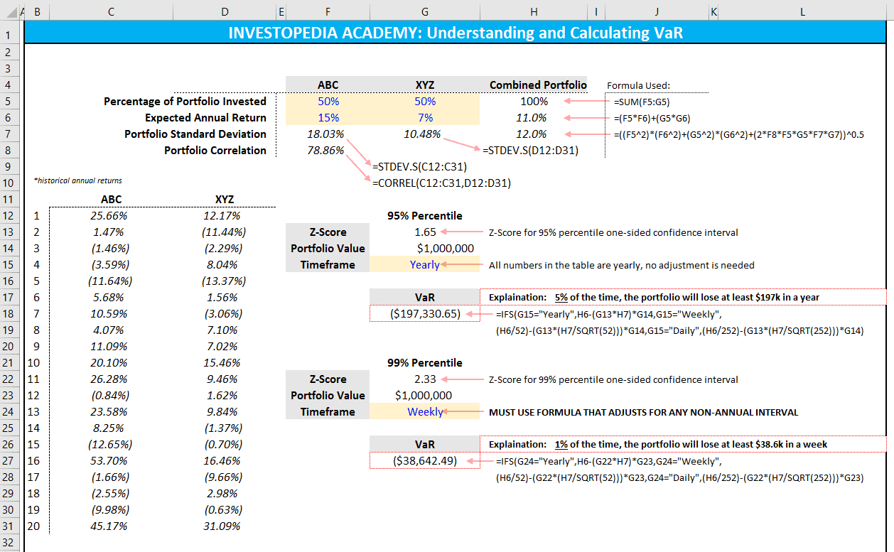

Value at Risk (VaR) is a vital metric in financial risk management, widely employed to quantify the potential losses within a trading portfolio over a specified timeframe. This metric is integral for risk assessment as it allows investors and financial institutions to understand the risk of loss inherent in their portfolios and make informed decisions regarding their investments.

VaR quantifies risk by providing a probabilistic estimate of the maximum expected loss for a given confidence interval. For example, a one-day VaR of $1 million at a 95% confidence level implies that there is a 5% probability that the portfolio will lose more than $1 million on any given day. Such insights are crucial for developing strategies to mitigate financial risk and ensure that potential losses do not exceed a company's risk appetite.



Excel facilitates VaR calculations and plays a significant role in algorithmic trading by offering a straightforward platform for financial analysts and traders to perform these computations. Using Excel's built-in functions like AVERAGE, STDEV, and NORM.INV, users can efficiently calculate VaR without the need for sophisticated software or programming skills. This accessibility is particularly beneficial for smaller trading operations or individual traders who may not have access to advanced computational resources.

In the context of algorithmic trading, VaR is indispensable for managing risk efficiently. Algorithmic traders rely on automated systems that utilize quantitative data analysis to execute trades at optimal conditions, often in milliseconds. Incorporating VaR into these systems ensures that trading strategies remain within predefined risk parameters, protecting investments from unexpected market fluctuations.

Overall, Value at Risk serves as an essential component of financial risk management, offering a standardized means of assessing and communicating risk levels across diverse trading environments. Its integration into platforms like Excel further enhances its applicability, providing users with a practical tool for effective risk management in trading portfolios.

## Table of Contents

## Understanding Value at Risk (VaR)

Value at Risk (VaR) is a statistical technique commonly used in the financial industry to quantify the potential risk of loss in value of a financial asset or portfolio over a defined period for a given confidence interval. Essentially, VaR answers the question: "What is my worst-case scenario loss over a specified holding period, with a certain level of confidence?"

Mathematically, if a portfolio’s return is normally distributed, the VaR can be calculated using the formula:

$$
\text{VaR} = \mu + Z \times \sigma
$$

where $\mu$ is the expected return, $\sigma$ is the standard deviation of returns, and $Z$ is the Z-score corresponding to the desired confidence level (e.g., 1.65 for 95%).

VaR is pivotal in the financial industry for assessing potential risks related to investments. By quantifying the minimum potential loss within a certain confidence interval, it allows fund managers and financial analysts to understand the risk posture of their portfolios. This is crucial for making informed decisions, such as portfolio adjustments, hedging strategies, or diversifying assets to mitigate risk.

Moreover, VaR serves as a standardized measure for communicating risk levels. By providing a clear, numerical risk indication, different stakeholders—including executives, regulators, and investors—can uniformly interpret the inherent risks, which aids in regulatory compliance and performance benchmarking. Hence, VaR is not only a risk management tool but also a communication bridge in the financial ecosystem.

## Methods of VaR Calculation

Value at Risk (VaR) is a statistical technique utilized to measure the risk of loss on a specific portfolio of financial assets. Calculating VaR involves estimating the potential loss in value of an asset portfolio with a given confidence level and over a specific time period. There are three primary methods for calculating VaR, each with its own set of assumptions, advantages, and limitations: Variance-Covariance, Historical Simulation, and Monte Carlo Simulation.

**Variance-Covariance Method**

The Variance-Covariance method, also known as the parametric method, assumes that returns on a portfolio are normally distributed. This approach calculates VaR based on the mean and standard deviation ([volatility](/wiki/volatility-trading-strategies)) of the returns. The formula for the VaR of a portfolio using this method is:

$$
\text{VaR}_{\alpha} = Z_{\alpha} \times \sigma_P \times \sqrt{T}
$$

where $Z_{\alpha}$ is the z-score corresponding to the confidence level $\alpha$, $\sigma_P$ is the portfolio's standard deviation, and $T$ is the time horizon.

*Assumptions*: 
- Asset returns are normally distributed.
- Historical volatility is a predictor of future risk.

*Advantages*: 
- Computationally simple and fast.
- Easy to understand and communicate.

*Limitations*: 
- Fails to accurately capture the risk of non-linear portfolios (e.g., those with options).
- Assumes normal distribution, which may not reflect the true distribution of returns, especially in turbulent markets.

**Historical Simulation Method**

The Historical Simulation method involves revaluing a portfolio at the end of a historical period, using the actual historical returns data to simulate changes in portfolio value. This method does not assume a normal distribution of returns, making it versatile for different types of portfolios.

*Assumptions*: 
- Historical returns reflect future risks.
- No specific distribution of returns is assumed.

*Advantages*: 
- Does not rely on parameter estimation.
- Can be easily applied to portfolios with derivatives or non-linear instruments.

*Limitations*: 
- Assumes that historical patterns will repeat, which may not always be true.
- Computationally intensive for large datasets.

**Monte Carlo Simulation Method**

The Monte Carlo Simulation method involves generating a large number of random price paths for the assets in the portfolio based on their statistical properties. This method is highly flexible and can accommodate various types of distributions and asset correlations.

*Assumptions*: 
- Underlying asset price processes are stochastic.
- Simulations can reflect complex market dynamics.

*Advantages*: 
- Can model complex instruments with embedded options.
- Does not assume normal distribution and can model various shapes of distribution.

*Limitations*: 
- Computationally expensive and requires significant processing time.
- Sensitive to input parameters: small errors in assumptions can lead to large errors in VaR.

Each method provides a different perspective on risk and may be more or less appropriate depending on the portfolio's characteristics, the data available, and the computational resources at hand. By understanding and leveraging these techniques, financial professionals can gain insights into potential market risks and improve decision-making in risk management.

## Calculating VaR in Excel

Value at Risk (VaR) can be effectively calculated using Excel, leveraging the software's accessibility and flexibility for financial calculations. A step-by-step approach to computing VaR in Excel involves several key functions to manage and analyze the data effectively. Here, we’ll detail the process using Excel functions, helping users understand the simplicity and effectiveness of this method.

### Step-by-step Guide to Calculating VaR in Excel

#### 1. Data Preparation

Begin by gathering historical price data of the asset or portfolio you are analyzing. This data is crucial as it forms the basis for calculating historical returns, which are essential for computing VaR.

#### 2. Calculating Returns

In Excel, calculate the returns based on the historical price data. Assuming the prices are listed in column B starting from cell B2, use the following formula in cell C3 to compute the return for each period:

- Formula: `=(B3/B2)-1`

Drag this formula down the column to calculate returns for all periods.

#### 3. Calculating the Average and Standard Deviation

To find the average of these returns, use Excel’s AVERAGE function. For example, if your returns are in cells C3 to C102, use:

- Formula for Average: `=AVERAGE(C3:C102)`

Similarly, calculate the standard deviation of these returns using the STDEV function:

- Formula for Standard Deviation: `=STDEV.S(C3:C102)`

These [statistics](/wiki/bayesian-statistics) are vital for understanding the normal distribution of portfolio returns, which is foundational for the Variance-Covariance method.

#### 4. Calculate VaR

To calculate VaR, you typically need to decide on a confidence level, common ones being 95% or 99%. Assuming a 95% confidence level, the NORM.INV function helps in determining the Z-score, which is a critical input for the normal distribution-based VaR calculation.

- Formula for Z-score at 95% confidence level: `=NORM.INV(0.05, 0, 1)`

Now, use the calculated Z-score to compute VaR at the chosen confidence level. The formula for VaR (for 95% confidence) is:

- VaR Formula: `=AVERAGE(C3:C102) + Z-score * STDEV.S(C3:C102)`

This formula gives the VaR as a negative number, which indicates the potential loss.

### Benefits of Using Excel for VaR

1. **Simplicity**: Excel provides familiar and straightforward tools that can help users with little programming background calculate VaR efficiently.

2. **Accessibility**: Excel is widely available, easy to learn, and offers flexibility. Users can customize VaR calculations to fit specific needs without requiring advanced software.

3. **Real-time Analysis**: With Excel, financial analysts can update their models easily, reflecting the most recent data and thus providing up-to-date risk assessments.

4. **Visualization**: Excel’s charting capabilities allow users to visualize the distribution of returns and highlight potential risks effectively.

By following these steps, users can utilize Excel's capabilities to compute Value at Risk, enhancing their risk assessment processes with simple yet powerful tools.

## Implementing VaR in Algorithmic Trading

Value at Risk (VaR) is a pivotal metric in [algorithmic trading](/wiki/algorithmic-trading) for quantifying and managing potential losses in trading portfolios. By providing a probabilistic estimate of the maximum loss expected over a specified time period at a given confidence level, VaR assists traders and risk managers in understanding and controlling the risks inherent in their trading strategies.

One primary use of VaR in algorithmic trading is in risk management. Algorithmic trading strategies often involve automated buying and selling of financial instruments, meaning they can execute trades at a rapid pace. Incorporating VaR allows traders to set risk thresholds and automatically adjust their positions once potential losses approach these thresholds. This proactive approach aids in mitigating severe losses and maintaining portfolio health.

For example, consider a trading strategy that utilizes a 1% VaR for a $1 million portfolio. If the daily VaR is $10,000, there is a 1% chance that the portfolio will lose more than $10,000 in a single day. A trading algorithm can be programmed to reduce exposure once the portfolio nears this loss level, ensuring risk containment.

Integrating VaR into decision-making processes involves utilizing it as a benchmark for evaluating different strategies. By comparing the VaR across different strategies, traders can choose options that align with their risk appetite. Furthermore, VaR aids in stress testing trading strategies by allowing traders to evaluate the potential impact of extreme market movements.

The calculation and utilization of VaR in algorithmic trading can be enhanced by employing advanced tools such as Python alongside Excel. Excel is often used for its simplicity and accessibility, capable of executing basic VaR calculations using functions like AVERAGE, STDEV, and NORM.INV. However, Python provides additional capabilities, enabling more complex calculations and large-scale data processing through libraries such as NumPy, pandas, and SciPy.

A simple example of computing VaR using Python involves the following code snippet, which calculates the daily VaR for a portfolio using historical returns:

```python
import numpy as np

# Simulate daily returns
portfolio_returns = np.random.normal(0.001, 0.02, 1000)

# Specify the confidence level
confidence_level = 0.99

# Calculate the VaR at the specified confidence level
var = -np.percentile(portfolio_returns, 100 * (1 - confidence_level))

print(f"The daily Value at Risk at {confidence_level*100}% confidence level is {var:.2f}")
```

This script generates simulated daily returns of a portfolio, specifies a confidence level, and then computes the VaR using the historical simulation method.

Python's advanced statistical and [machine learning](/wiki/machine-learning) libraries allow for more sophisticated analyses and the implementation of custom VaR methodologies, such as Monte Carlo simulations or the incorporation of machine learning models to estimate potential future asset distributions. These capabilities make Python a powerful tool for risk assessment and strategy optimization within algorithmic trading frameworks, complementing the more straightforward functionalities provided by Excel.

## Advanced Techniques and Considerations

Advanced Value at Risk (VaR) techniques, such as Parametric and Semi-Parametric VaR, are pivotal in refining risk assessment models. Parametric VaR, also known as Variance-Covariance VaR, operates under the assumption that returns follow a normal distribution. This method simplifies computation but may lack accuracy if the return distribution deviates significantly from normality. The formula typically used is:

$$
\text{VaR} = \mu + z \times \sigma
$$

where $\mu$ is the mean of the asset returns, $\sigma$ is the standard deviation, and $z$ is the z-score corresponding to the desired confidence level.

Semi-Parametric VaR attempts to overcome the restrictions of Parametric VaR by incorporating non-normal return distributions, using techniques like the Cornish-Fisher expansion, which adjusts skewness and kurtosis. This approach provides a more flexible risk estimation suitable for portfolios exhibiting non-normal behaviors.

In multi-asset portfolios, asset correlation is a critical [factor](/wiki/factor-investing) affecting VaR calculations. Accurate estimation of correlation coefficients is essential to properly assess the portfolio's diversified risk. Ignoring asset correlation might lead to an overestimation or underestimation of risk, potentially resulting in inefficient capital allocation.

Backtesting VaR models is fundamental to verify their predictive accuracy and reliability. This involves comparing predicted risk measures with actual outcomes over a historical period to validate the effectiveness of the VaR model. A common approach to [backtesting](/wiki/backtesting) is the use of the Kupiec Test, which assesses the frequency of VaR breaches. Python libraries like 'pandas', 'numpy', and 'scipy' facilitate the backtesting process with their extensive statistical functionalities.

To demonstrate a simple backtesting in Python:

```python
import numpy as np
import scipy.stats as stats

# Simulating portfolio returns
np.random.seed(0)
returns = np.random.normal(0, 0.01, 1000)

# Setting VaR level and calculating breaches
var_level = 0.05
var_value = np.percentile(returns, 100 * var_level)
breaches = returns < -var_value

# Kupiec Proportion of Failures (POF) Test
n_breaches = np.sum(breaches)
n = len(returns)
pof_test_stat = -2.0 * (n * np.log(1 - var_level) + n_breaches * np.log(var_level / n_breaches))

# Assessing test statistic against chi-squared distribution
p_value = 1 - stats.chi2.cdf(pof_test_stat, 1)
result = "Reject" if p_value < 0.05 else "Do not reject"

print(f"POF Test Statistic: {pof_test_stat:.2f}, P-value: {p_value:.2f}, Result: {result} null hypothesis that model is correct")
```

These advanced techniques and considerations underscore the importance of refining VaR methodologies for better risk management, ensuring they align with the evolving market dynamics and assets' behavior.

## Conclusion and Future Trends

Value at Risk (VaR) remains a pivotal tool in financial risk management, providing a standardized measure for quantifying potential losses within a portfolio over a specified time horizon and confidence level. This measure is crucial for both institutional and individual investors, offering insights into potential exposure and aiding in informed decision-making processes. VaR's utility extends across various financial practices, from asset allocation to regulatory compliance, underscoring its importance in the financial sector.

In algorithmic trading, VaR is instrumental in shaping risk management protocols. By quantifying the maximum expected loss, traders can devise strategies that align with their risk tolerance and capital allocation plans. This integration of VaR in trading strategies not only enhances risk assessment but also optimizes portfolio performance by ensuring that exposure remains within acceptable thresholds. As algorithmic trading continues to evolve, the significance of robust risk management metrics like VaR becomes increasingly evident.

Looking forward, the landscape of VaR calculations is set to transform with the advancement of machine learning and advanced analytics. These technologies promise to refine risk assessment models, potentially enhancing the accuracy and reliability of VaR estimates. Machine learning algorithms, capable of processing vast data sets and identifying complex patterns, offer unprecedented opportunities for optimizing VaR calculations. Future developments may witness the integration of real-time data analytics, allowing for dynamic VaR assessments that adjust to market conditions instantaneously.

Further exploration of VaR models is encouraged, particularly in the context of emerging technologies. Financial professionals and researchers are tasked with the challenge of adapting traditional risk metrics to new paradigms of data science and computational finance. The confluence of quantitative finance and advanced computational techniques holds the potential to revolutionize risk management practices, delivering insights that are both nuanced and precise.

In summary, VaR continues to be a cornerstone in financial risk management and algorithmic trading. As the financial industry embraces technological advancements, the evolution of VaR methodologies will likely align with the broader trend towards greater precision, agility, and data-driven decision-making. The future of VaR, shaped by innovative analytics and computing capabilities, promises to enhance both the strategic and operational aspects of financial risk management.

## References & Further Reading

1. Jorion, Philippe. *Value at Risk: The New Benchmark for Managing Financial Risk*. McGraw-Hill, 2007. This book is a comprehensive guide to understanding and implementing Value at Risk in financial risk management, discussing its uses, calculation methods, and limitations.

2. Crouhy, Michel, Dan Galai, and Robert Mark. *Risk Management*. McGraw-Hill, 2001. This text provides in-depth coverage of various risk management techniques, including VaR, with practical applications and examples.

3. Hull, John C. *Options, Futures, and Other Derivatives*. Pearson, 2018. An authoritative source on derivatives, this book includes sections on risk management techniques such as VaR, with theoretical underpinnings and real-world applications.

4. Alexander, Carol. *Market Risk Analysis Volume IV: Value at Risk Models*. Wiley, 2008. Focusing specifically on VaR models, this book provides detailed methodologies and case studies to help professionals estimate market risk effectively.

5. Pritsker, Matthew. *The Hidden Dangers of Historical Simulation*. Finance and Economics Discussion Series 2006-37. Board of Governors of the Federal Reserve System, 2006. A critical examination of the historical simulation approach to VaR, assessing potential pitfalls and recommending best practices.

6. Linsmeier, Thomas J., and Neil D. Pearson. "Risk Measurement: An Introduction to Value at Risk." *University of Illinois at Urbana-Champaign*. Provides a thorough introduction to VaR, suitable for those new to the concept or looking for a refresher.

7. Python Risk Analytics Libraries: Explore open-source libraries such as PyVaR, QuantLib, and RiskMetrics to practice implementing VaR models. These libraries offer various tools and functions to perform complex calculations and simulations efficiently.

8. Academic Journal Articles: Numerous articles available through journals like the *Journal of Risk* and *Journal of Banking & Finance* provide insights into recent developments and research in VaR methodologies and applications.

9. Online Courses and Lectures: Platforms like Coursera, edX, and Khan Academy offer courses on financial risk management and quantitative finance, including modules on VaR to build foundational knowledge or expand expertise.

These resources will provide a well-rounded understanding of Value at Risk and its application in financial risk management and algorithmic trading.