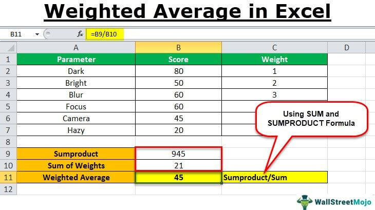

Welcome to the comprehensive guide on using Excel for weighted average calculations, particularly in the context of algorithmic trading. In the fast-evolving world of trading, where precision and efficiency are paramount, mastering the tools that aid in decision-making is essential. This article seeks to provide traders and investors with the knowledge to harness Excel's robust functionalities for calculating weighted averages and developing algorithmic trading strategies.

A weighted average is an essential calculation in trading, allowing for a more accurate reflection of value by assigning different weights to various data points. This metric is particularly useful for financial evaluations, such as performance analysis and execution efficiency. Understanding how to calculate a weighted average can significantly enhance the assessment of trading activities, providing insights that are not apparent when using simple averages.



Excel stands out as a versatile tool that facilitates the computation of weighted averages efficiently. With its array of functions and formulas, Excel enables traders to process large datasets swiftly, making it an invaluable resource for analyzing market data. Excel's capability to handle complex calculations aids traders in applying theories to practice, such as through strategies like the Volume Weighted Average Price (VWAP) and the Time Weighted Average Price (TWAP), both crucial for evaluating trade performance and market trends.

Throughout this guide, we will explore the fundamental aspects of weighted averages, demonstrate how to calculate them using Excel, and discuss their practical applications in algorithmic trading. By the end, you should have a solid understanding of how to leverage Excel to optimize trade execution strategies effectively.

## Table of Contents

## Understanding Weighted Average and Its Importance

A weighted average is a method for calculating the average of a set of values, where each value can contribute differently based on an assigned weight. This technique gives higher significance to more influential values, providing a nuanced and accurate representation of data. Unlike a simple average, where each value is considered equally, a weighted average accounts for the varying importance of different values. The formula for calculating a weighted average is:

$$
\text{Weighted Average} = \frac{\sum (x_i \times w_i)}{\sum w_i}
$$

where $x_i$ represents each data point and $w_i$ is its corresponding weight.

Weighted averages are extensively used in financial contexts. A prominent example is the calculation of Earnings Per Share (EPS), which evaluates a company's profitability. By applying weights to the number of shares outstanding during different periods, EPS can reflect more accurately in financial reporting.

In trading, weighted averages play a crucial role in obtaining realistic price metrics by considering both prices and traded volumes. This approach is essential, particularly when assessing securities across fluctuating market conditions. For instance, when tracking stock prices, incorporating [volume](/wiki/volume-trading-strategy) data allows traders to recognize patterns that would otherwise be hidden under a simple average.

In [algorithmic trading](/wiki/algorithmic-trading), the benefit of weighted averages extends further into accurately reflecting market performance. Algorithms often require a dynamic and responsive metric that aligns with real-time market activity. By embedding volume information in calculations, weighted averages provide a precise view of market trends, enhancing decision-making capabilities in trading strategies.

Overall, the ability to incorporate and prioritize specific data points makes weighted averages indispensable for traders and investors alike, supporting more informed and strategic financial decisions.

## Calculating Weighted Average in Excel

Excel provides an efficient framework for calculating weighted averages, a function particularly beneficial for traders and analysts handling large datasets. To execute this computation effectively, one must first organize the data — for example, arranging numerical values such as prices or returns alongside their corresponding weights, which could be volumes or proportions in a portfolio.

The core of computing a weighted average in Excel lies in using formulas that simplify the process. The formula for a weighted average is expressed as:

$$
\text{Weighted Average} = \frac{\sum (x_i \times w_i)}{\sum w_i}
$$

where $x_i$ is each individual value and $w_i$ is the corresponding weight.

In Excel, the SUMPRODUCT function is a powerful tool that can compute the weighted sum of a series of data directly. Here is a step-by-step process to calculate a weighted average using Excel:

1. **Input Data**: Enter your set of values in one column (e.g., column A) and their corresponding weights in an adjacent column (e.g., column B).

2. **Utilize Excel SUMPRODUCT Function**: 
   - Click on the cell where you want the weighted average result to appear.
   - Enter the formula: `=SUMPRODUCT(A2:A10, B2:B10)/SUM(B2:B10)`, assuming your data spans from A2 to A10 and B2 to B10.

This formula works by first multiplying each value in column A by its corresponding weight in column B, summing these results to get the total weighted sum, and then dividing by the sum of the weights.

To illustrate, consider calculating the Earnings Per Share (EPS) as part of a financial analysis. If each share’s earnings over several periods are listed in column A and their respective weights (e.g., the number of shares during each period) in column B, applying the SUMPRODUCT formula provides an accurate EPS reflecting varying conditions in share numbers.

Additionally, Excel's capability to incorporate custom formulas further enhances the flexibility and precision of weighted average calculations. By embedding these calculations directly into trading models or financial analysis sheets, users can generate insights that are both timely and precise. This integration is particularly beneficial in algorithmic trading setups where rapid recalculations aligned with real-time data are crucial.

## Excel and Algorithmic Trading: An Overview

Excel serves as a powerful platform for algorithmic trading, offering a range of functionalities that cater to both novice and advanced traders. Its versatility stems from its ability to handle extensive data analysis and facilitate the development and [backtesting](/wiki/backtesting) of trading strategies.

One of Excel's primary advantages is its accessibility. Traders can easily input historical market data and perform backtesting of trading strategies without the need for sophisticated software environments. Excel's robust data manipulation capabilities let users create detailed simulations to assess the performance of trading strategies over historical data. Backtesting is crucial, as it provides insights into how a trading strategy would perform in various market conditions based on past data.

In addition, Excel can be connected to live data feeds, enabling traders to generate real-time trading signals. This integration is facilitated through the use of APIs and add-ons, such as Microsoft Excel's Real-Time Data (RTD) function or third-party data providers. By maintaining a live connection, traders can automate the updating of data points, such as asset prices and volumes, allowing for the real-time execution of trading strategies.

Furthermore, Excel’s built-in functions offer the ability to code and execute basic trading strategies with precision. Logical functions like IF, AND, and OR can be combined with mathematical operations to create complex conditions that trigger trading actions. For example, a trader might use these functions to set up conditional statements that execute a buy order when certain market conditions are met:

```python
=IF(AND(CurrentPrice < MovingAverage, Volume > Threshold), "Buy", "Hold")
```

This formula demonstrates how Excel can execute decisions based on real-time data inputs, making it possible to automate parts of the trading process.

Additionally, user-defined functions and advanced Excel features like VBA (Visual Basic for Applications) extend the customization and sophistication of trading strategies. VBA scripts can handle more complex tasks such as iterative processes and integrating with external trading systems, enabling the development of more refined trading algorithms.

Overall, Excel’s ability to blend live data integration, backtesting, and execution of trading logic demonstrates its value as a tool for developing algorithmic trading strategies. Its combination of accessibility, flexibility, and computational power makes it an essential component for traders aiming to enhance their market analysis and trading efficiency.

## Implementation of VWAP in Excel

Volume Weighted Average Price (VWAP) is widely used in trading to assess trade execution quality and market trends. It represents the average trading price of a security, weighted by volume, over a specific time period. Implementing VWAP in Excel involves setting up a spreadsheet that organizes the necessary data and calculations in a structured manner. Here's a step-by-step approach:

1. **Data Preparation**: Begin by collecting data such as the date, transaction price, and volume traded. This data forms the foundation for VWAP calculation.

2. **Spreadsheet Setup**:
   - **Columns**: Create columns for Date, Price, Volume, and for intermediate calculations that will lead to the VWAP result.
   - **Intermediate Calculations**: Add columns for Total Price Volume (Price × Volume) and Cumulative Volume. The Total Price Volume represents the weighted price for each trade entry, and Cumulative Volume aggregates the traded volume over time.

3. **VWAP Calculation**:
   - Use the formula: 
$$
     \text{VWAP} = \frac{\sum (\text{Price}_i \times \text{Volume}_i)}{\sum \text{Volume}_i}

$$
   - In Excel, calculate the sum of the Price Volume and Cumulative Volume columns:
     - Use `=SUMPRODUCT(Price_Range, Volume_Range)` to compute the total dollar traded.
     - Use `=SUM(Volume_Range)` for the total volume traded.
   - Create an additional column to store the VWAP value by dividing the cumulative total price volume by the cumulative volume for each data point.

4. **Building the VWAP Calculation in Excel**:
   - Let's assume columns are labeled as follows: A (Date), B (Price), C (Volume), D (Price × Volume), E (Cumulative Volume), F (VWAP).
   - In cell D2, input the formula `=B2*C2` to calculate the Price Volume.
   - In cell E2, input `=SUM($C$2:C2)` to compute the Cumulative Volume, dragging the formula down to cover all rows.
   - In cell F2, input `=SUM($D$2:D2)/E2` to determine the VWAP value, and extend this formula down the column.

5. **Use in Trading**:
   - With VWAP calculated, traders can compare the VWAP with actual trade prices to evaluate execution efficiency.
   - Trading strategies can be refined using VWAP as an indicator of average entry or exit points, helping traders aim for better execution compared to the market average.

Implementing VWAP in Excel not only enhances trade performance analysis but also aids in adjusting strategies based on accurate, volume-adjusted pricing metrics. By mastering VWAP calculations within Excel, traders are better equipped to leverage data-driven insights, ensuring alignment with market benchmarks and optimizing trading positions.

## Advanced Excel Functions for Trading

Excel's robust suite of logical and mathematical functions is indispensable for traders seeking to develop and refine trading strategies. Logical functions such as IF, AND, and OR serve as the foundation for creating dynamic models capable of adjusting strategies in real-time. These functions allow traders to implement conditional statements that respond to specific market conditions, facilitating automated decision-making processes.

For instance, the IF function can execute different actions based on whether a condition is met. In a trading context, this could mean setting a buy order if the price exceeds a certain threshold. The AND and OR functions extend these capabilities, enabling complex condition testing. For example, a trader might use a combined IF(AND(...)) statement to execute an order only when multiple conditions, such as price and volume thresholds, are simultaneously met.

Mathematical functions like SUM, AVERAGE, and MAX are equally crucial in trading analysis. SUM is frequently used to aggregate data, such as calculating the total traded volume over a period. AVERAGE aids in determining moving averages, a common tool for analyzing price trends. The MAX function can identify price highs within a dataset, which is essential for setting stop-loss and take-profit levels.

Excel's data handling prowess becomes particularly evident in backtesting scenarios. Traders can simulate a variety of market conditions using historical data to validate and enhance their trading algorithms. By employing sophisticated Excel models, traders can assess how their strategies would have performed under past conditions, thereby refining them for future applications.

Moreover, Excel's proficiency in managing large datasets is vital for evaluating different trading scenarios, a necessity in [quantitative trading](/wiki/quantitative-trading). The ability to process and analyze vast amounts of data efficiently allows traders to explore a multitude of potential strategies and optimize based on empirical evidence. 

Incorporating advanced Excel functions into trading activities not only streamlines the analytical process but also enhances the trader's ability to react promptly and effectively to market changes, ultimately contributing to more informed and successful trading decisions.

## Conclusion

Excel remains an adaptable tool for calculating weighted averages and deploying intricate trading strategies in algorithmic trading. By mastering Excel's myriad functions and formulas, traders can significantly enhance their ability to analyze and interpret market data, leading to more effective trade execution. Excel's structured environment allows for precise calculations, such as using the SUMPRODUCT function to quickly derive weighted averages, which are critical in evaluating trading performance.

Moreover, integrating advanced tools like the Volume Weighted Average Price (VWAP) in Excel allows traders to gain deeper insights into market trends and dynamics. VWAP serves as a vital metric for comparing trade prices to market performance, helping traders optimize their strategies and achieve better execution than standard market benchmarks.

Harnessing Excel’s capabilities effectively can lead to the development of robust trading strategies and foster consistent performance in the financial markets. Excel's adaptability in handling various data formats and connecting to live market feeds provides traders with the flexibility needed for real-time analysis and decision-making. As traders become more proficient in Excel, they can better tailor their strategies to market conditions, ultimately leading to enhanced profitability and sustained success in trading activities.

## References & Further Reading

[1]: Bergstra, J., Bardenet, R., Bengio, Y., & Kégl, B. (2011). ["Algorithms for Hyper-Parameter Optimization."](https://dl.acm.org/doi/10.5555/2986459.2986743) Advances in Neural Information Processing Systems 24.

[2]: ["Advances in Financial Machine Learning"](https://www.amazon.com/Advances-Financial-Machine-Learning-Marcos/dp/1119482089) by Marcos Lopez de Prado

[3]: ["Evidence-Based Technical Analysis: Applying the Scientific Method and Statistical Inference to Trading Signals"](https://www.amazon.com/Evidence-Based-Technical-Analysis-Scientific-Statistical/dp/0470008741) by David Aronson

[4]: ["Machine Learning for Algorithmic Trading"](https://github.com/stefan-jansen/machine-learning-for-trading) by Stefan Jansen

[5]: ["Quantitative Trading: How to Build Your Own Algorithmic Trading Business"](https://www.amazon.com/Quantitative-Trading-Build-Algorithmic-Business/dp/1119800064) by Ernest P. Chan