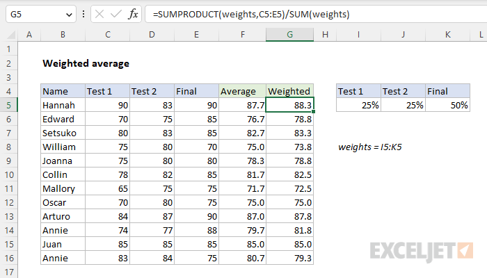

## Table of Contents

## What is a weighted average and why is it used?

A weighted average is a type of average where some numbers are more important than others. Instead of just adding up all the numbers and dividing by how many there are, you multiply each number by a weight, which shows how important it is. Then, you add up these results and divide by the total of the weights. This way, the numbers with bigger weights have a bigger effect on the final average.

Weighted averages are used when some data points are more important than others. For example, in school, if a final exam is worth more than a quiz, you would use a weighted average to calculate your grade. This makes sure that the more important things, like the final exam, have a bigger impact on the overall average. This method helps to give a more accurate picture of the overall situation by considering the importance of each piece of data.

## How do you set up your data in Excel for calculating a weighted average?

To set up your data in Excel for calculating a weighted average, you need two columns. In the first column, list all the numbers you want to average. In the second column, list the weights that show how important each number is. For example, if you are calculating your grade, the first column could have your scores for tests, quizzes, and homework. The second column would have the weights for each, like 50% for the final exam, 20% for a midterm, and 10% for each quiz.

Once you have your numbers and weights in the columns, you can use a formula to find the weighted average. In an empty cell, you can type a formula like this: `=SUMPRODUCT(A2:A10, B2:B10) / SUM(B2:B10)`. Here, A2:A10 are the cells with your numbers, and B2:B10 are the cells with your weights. The `SUMPRODUCT` function multiplies each number by its weight and adds them up. Then, you divide by the sum of the weights to get the weighted average. This way, Excel does the math for you and gives you the correct weighted average.

## What are the basic steps to calculate a weighted average in Excel?

To calculate a weighted average in Excel, first, you need to set up your data in two columns. In one column, list all the numbers you want to average. For example, these could be your scores for tests, quizzes, or any other values you need to average. In the second column, list the weights that show how important each number is. If you're calculating a grade, the weights could be percentages like 50% for a final exam, 20% for a midterm, and 10% for each quiz.

Once your data is set up, you can use a formula to find the weighted average. In an empty cell, type the formula `=SUMPRODUCT(A2:A10, B2:B10) / SUM(B2:B10)`. In this formula, A2:A10 are the cells with your numbers, and B2:B10 are the cells with your weights. The `SUMPRODUCT` function will multiply each number by its weight and add them all up. Then, you divide by the total of the weights to get the weighted average. This way, Excel does the math for you and gives you the correct weighted average based on the importance of each number.

## Can you explain the formula used for weighted average in Excel?

The formula used for calculating a weighted average in Excel is `=SUMPRODUCT(A2:A10, B2:B10) / SUM(B2:B10)`. In this formula, A2:A10 represents the cells that contain the numbers you want to average, and B2:B10 represents the cells that contain the weights. The `SUMPRODUCT` function does two things: it multiplies each number by its weight, and then it adds up all these products. After that, you divide this total by the sum of all the weights, which you get using the `SUM` function.

This formula makes sure that each number has an impact on the final average that matches its importance. For example, if you're calculating your grade, a final exam that's worth 50% will have a bigger effect on your average than a quiz that's worth 10%. By using the `SUMPRODUCT` function to multiply and add, and then dividing by the total weights, Excel gives you a weighted average that accurately reflects the importance of each piece of data.

## How do you use the SUMPRODUCT and SUM functions to calculate weighted average?

To calculate a weighted average using Excel, you use the `SUMPRODUCT` and `SUM` functions together. The `SUMPRODUCT` function is used to multiply each number by its weight and then add up all these products. For example, if you have numbers in cells A2 through A10 and their weights in cells B2 through B10, the `SUMPRODUCT(A2:A10, B2:B10)` part of the formula will multiply each number by its weight and then add all these results together.

After multiplying and adding with `SUMPRODUCT`, you need to divide by the total of the weights to get the weighted average. This is where the `SUM` function comes in. You use `SUM(B2:B10)` to add up all the weights. So, the full formula in Excel is `=SUMPRODUCT(A2:A10, B2:B10) / SUM(B2:B10)`. This way, each number's impact on the final average is based on its weight, making the average more accurate.

## What are common mistakes to avoid when calculating weighted averages in Excel?

One common mistake when calculating weighted averages in Excel is mixing up the order of the columns. You need to make sure that the numbers you want to average are in one column, and their weights are in another. If you mix them up, the formula won't work right. For example, if your numbers are in column A and weights in column B, you should use `=SUMPRODUCT(A2:A10, B2:B10) / SUM(B2:B10)`. If you switch the columns by accident, your weighted average will be wrong.

Another mistake is not checking that the weights add up to 100% or 1, depending on how you set them up. If your weights are percentages, they should total 100%. If they're decimals, they should total 1. If they don't, your weighted average won't be accurate. You can use the `SUM` function to check this, like `=SUM(B2:B10)`. If the total isn't right, you need to adjust your weights before calculating the weighted average.

Lastly, some people forget to use the `SUM` function in the denominator of the formula. If you only use `SUMPRODUCT(A2:A10, B2:B10)` without dividing by `SUM(B2:B10)`, you'll get a different number that isn't a weighted average. Always remember to divide by the total of the weights to make sure your calculation is correct.

## How can you automate the calculation of weighted averages using Excel formulas?

To automate the calculation of weighted averages in Excel, you need to set up your numbers and weights in two separate columns. For example, put your numbers in column A and your weights in column B. Once you have these columns ready, you can use a special formula in Excel to do the math for you. The formula is `=SUMPRODUCT(A2:A10, B2:B10) / SUM(B2:B10)`. This formula will automatically multiply each number by its weight, add up all these results, and then divide by the total of the weights to give you the weighted average.

By using this formula, you don't have to do the math yourself every time you need a weighted average. If you change any of the numbers or weights in your columns, the formula will automatically update the weighted average for you. This makes it easy to keep your calculations up to date without having to redo everything each time. Just make sure your weights add up to 100% or 1, depending on if you're using percentages or decimals, and your formula will work perfectly.

## How do you handle missing or erroneous data when calculating weighted averages?

When you're calculating weighted averages and you find missing or wrong data, you need to be careful. If a number or its weight is missing, you can't just ignore it and keep going. You need to decide what to do. One way is to leave out that piece of data completely. This means you won't use it in your calculation, and you'll need to adjust the weights of the other numbers so they still add up to 100% or 1. Another way is to guess or estimate the missing number or weight, but be careful because this can make your average less accurate.

If you find wrong data, you need to fix it before you can use it. Look at the numbers and weights carefully to see if there are any mistakes. If you find a wrong number, change it to the right one. If a weight is wrong, fix it too. After you've fixed everything, make sure the weights still add up to the right total. Only then should you use the formula `=SUMPRODUCT(A2:A10, B2:B10) / SUM(B2:B10)` in Excel to calculate your weighted average. This way, you'll get the most accurate result possible.

## What advanced techniques can be used to calculate weighted averages across multiple sheets?

To calculate weighted averages across multiple sheets in Excel, you can use a combination of cell references and functions. First, you need to set up your numbers and weights on each sheet in the same way, with numbers in one column and weights in another. Then, you can use the `SUMPRODUCT` function along with `SUM` to calculate the weighted average for each sheet separately. To reference data from different sheets, you use the sheet name followed by an exclamation mark and the cell range, like `Sheet1!A2:A10` for numbers and `Sheet1!B2:B10` for weights. You can do this for each sheet, creating a formula like `=SUMPRODUCT(Sheet1!A2:A10, Sheet1!B2:B10) / SUM(Sheet1!B2:B10)` for the first sheet, and so on.

Once you have the weighted average for each sheet, you can combine them into one final weighted average. To do this, you'll need a master sheet where you list the weighted averages from each sheet in one column and their respective weights in another column. Then, you apply the same `SUMPRODUCT` and `SUM` formula to these values to get the overall weighted average across all sheets. For example, if the weighted averages are in cells A2:A5 of your master sheet and their weights are in B2:B5, you would use the formula `=SUMPRODUCT(A2:A5, B2:B5) / SUM(B2:B5)` to calculate the final weighted average. This method lets you handle complex data spread across multiple sheets easily and accurately.

## How can you use conditional formatting to highlight results based on weighted averages?

To use conditional formatting to highlight results based on weighted averages in Excel, you first need to calculate your weighted averages. Once you have your weighted averages in a column, you can use conditional formatting to make certain cells stand out. For example, if you want to highlight cells where the weighted average is above a certain number, you can select the cells with the weighted averages, go to the "Home" tab, and click on "Conditional Formatting." Then, choose "Highlight Cells Rules" and select "Greater Than." Enter the number you want to use as the threshold, and pick a color to highlight those cells. This way, you can easily see which weighted averages meet your criteria.

You can also use conditional formatting to show different levels of weighted averages with different colors. After selecting the cells with the weighted averages, go to "Conditional Formatting" again, but this time choose "Color Scales." You can pick a color scale that changes from one color to another as the weighted average increases or decreases. This helps you see at a glance which weighted averages are high, medium, or low. By using conditional formatting, you can quickly identify important trends or outliers in your data without having to look at each number individually.

## How do you validate the accuracy of your weighted average calculations in Excel?

To make sure your weighted average calculations in Excel are correct, you can check them in a few ways. First, you can do the math by hand or use a calculator to see if you get the same result as Excel. If you have a small set of numbers, this is easy to do. Just multiply each number by its weight, add up all those products, and then divide by the total of the weights. If your hand calculation matches what Excel shows, then your formula is probably right.

Another way to check is to use Excel's built-in tools. You can use the "Evaluate Formula" feature to see how Excel is calculating the weighted average step by step. To do this, go to the "Formulas" tab, click on "Evaluate Formula," and then click "Evaluate" to watch Excel break down the calculation. This can help you spot any mistakes in how the formula is set up. Also, make sure your weights add up to 100% or 1, depending on whether you're using percentages or decimals. If they don't, your weighted average won't be accurate. By checking these things, you can be more confident that your weighted average calculations are correct.

## What are some real-world applications of weighted averages in Excel, and how can they be implemented?

Weighted averages are used in many real-world situations, like figuring out grades in school or calculating investment returns. In school, if a final exam is worth more than a quiz, you can use Excel to find your overall grade. You would list your scores in one column and the weights (like 50% for the final exam, 20% for a midterm, and 10% for each quiz) in another column. Then, you use the formula `=SUMPRODUCT(A2:A10, B2:B10) / SUM(B2:B10)` to get your weighted average grade. This way, the more important tests have a bigger impact on your final grade.

In finance, weighted averages help calculate the return on a portfolio of investments. If you have different stocks or bonds with different values and returns, you can use Excel to find the overall return. You list the value of each investment in one column and its return in another. Then, you use the same formula to find the weighted average return. This gives you a better idea of how well your whole portfolio is doing, because it takes into account how much money you have in each investment. By using Excel, you can easily update your calculations if the values or returns change.

## What is the importance of understanding weighted average?

A weighted average is a method for calculating the average of a set of values, where each value can contribute differently based on an assigned weight. This technique gives higher significance to more influential values, providing a nuanced and accurate representation of data. Unlike a simple average, where each value is considered equally, a weighted average accounts for the varying importance of different values. The formula for calculating a weighted average is:

$$
\text{Weighted Average} = \frac{\sum (x_i \times w_i)}{\sum w_i}
$$

where $x_i$ represents each data point and $w_i$ is its corresponding weight.

Weighted averages are extensively used in financial contexts. A prominent example is the calculation of Earnings Per Share (EPS), which evaluates a company's profitability. By applying weights to the number of shares outstanding during different periods, EPS can reflect more accurately in financial reporting.

In trading, weighted averages play a crucial role in obtaining realistic price metrics by considering both prices and traded volumes. This approach is essential, particularly when assessing securities across fluctuating market conditions. For instance, when tracking stock prices, incorporating [volume](/wiki/volume-trading-strategy) data allows traders to recognize patterns that would otherwise be hidden under a simple average.

In [algorithmic trading](/wiki/algorithmic-trading), the benefit of weighted averages extends further into accurately reflecting market performance. Algorithms often require a dynamic and responsive metric that aligns with real-time market activity. By embedding volume information in calculations, weighted averages provide a precise view of market trends, enhancing decision-making capabilities in trading strategies.

Overall, the ability to incorporate and prioritize specific data points makes weighted averages indispensable for traders and investors alike, supporting more informed and strategic financial decisions.

## How do you calculate a weighted average in Excel?

Excel provides an efficient framework for calculating weighted averages, a function particularly beneficial for traders and analysts handling large datasets. To execute this computation effectively, one must first organize the data — for example, arranging numerical values such as prices or returns alongside their corresponding weights, which could be volumes or proportions in a portfolio.

The core of computing a weighted average in Excel lies in using formulas that simplify the process. The formula for a weighted average is expressed as:

$$
\text{Weighted Average} = \frac{\sum (x_i \times w_i)}{\sum w_i}
$$

where $x_i$ is each individual value and $w_i$ is the corresponding weight.

In Excel, the SUMPRODUCT function is a powerful tool that can compute the weighted sum of a series of data directly. Here is a step-by-step process to calculate a weighted average using Excel:

1. **Input Data**: Enter your set of values in one column (e.g., column A) and their corresponding weights in an adjacent column (e.g., column B).

2. **Utilize Excel SUMPRODUCT Function**: 
   - Click on the cell where you want the weighted average result to appear.
   - Enter the formula: `=SUMPRODUCT(A2:A10, B2:B10)/SUM(B2:B10)`, assuming your data spans from A2 to A10 and B2 to B10.

This formula works by first multiplying each value in column A by its corresponding weight in column B, summing these results to get the total weighted sum, and then dividing by the sum of the weights.

To illustrate, consider calculating the Earnings Per Share (EPS) as part of a financial analysis. If each share’s earnings over several periods are listed in column A and their respective weights (e.g., the number of shares during each period) in column B, applying the SUMPRODUCT formula provides an accurate EPS reflecting varying conditions in share numbers.

Additionally, Excel's capability to incorporate custom formulas further enhances the flexibility and precision of weighted average calculations. By embedding these calculations directly into trading models or financial analysis sheets, users can generate insights that are both timely and precise. This integration is particularly beneficial in algorithmic trading setups where rapid recalculations aligned with real-time data are crucial.

## How can VWAP be implemented in Excel?

Volume Weighted Average Price (VWAP) is widely used in trading to assess trade execution quality and market trends. It represents the average trading price of a security, weighted by volume, over a specific time period. Implementing VWAP in Excel involves setting up a spreadsheet that organizes the necessary data and calculations in a structured manner. Here's a step-by-step approach:

1. **Data Preparation**: Begin by collecting data such as the date, transaction price, and volume traded. This data forms the foundation for VWAP calculation.

2. **Spreadsheet Setup**:
   - **Columns**: Create columns for Date, Price, Volume, and for intermediate calculations that will lead to the VWAP result.
   - **Intermediate Calculations**: Add columns for Total Price Volume (Price × Volume) and Cumulative Volume. The Total Price Volume represents the weighted price for each trade entry, and Cumulative Volume aggregates the traded volume over time.

3. **VWAP Calculation**:
   - Use the formula: 
$$
     \text{VWAP} = \frac{\sum (\text{Price}_i \times \text{Volume}_i)}{\sum \text{Volume}_i}

$$
   - In Excel, calculate the sum of the Price Volume and Cumulative Volume columns:
     - Use `=SUMPRODUCT(Price_Range, Volume_Range)` to compute the total dollar traded.
     - Use `=SUM(Volume_Range)` for the total volume traded.
   - Create an additional column to store the VWAP value by dividing the cumulative total price volume by the cumulative volume for each data point.

4. **Building the VWAP Calculation in Excel**:
   - Let's assume columns are labeled as follows: A (Date), B (Price), C (Volume), D (Price × Volume), E (Cumulative Volume), F (VWAP).
   - In cell D2, input the formula `=B2*C2` to calculate the Price Volume.
   - In cell E2, input `=SUM($C$2:C2)` to compute the Cumulative Volume, dragging the formula down to cover all rows.
   - In cell F2, input `=SUM($D$2:D2)/E2` to determine the VWAP value, and extend this formula down the column.

5. **Use in Trading**:
   - With VWAP calculated, traders can compare the VWAP with actual trade prices to evaluate execution efficiency.
   - Trading strategies can be refined using VWAP as an indicator of average entry or exit points, helping traders aim for better execution compared to the market average.

Implementing VWAP in Excel not only enhances trade performance analysis but also aids in adjusting strategies based on accurate, volume-adjusted pricing metrics. By mastering VWAP calculations within Excel, traders are better equipped to leverage data-driven insights, ensuring alignment with market benchmarks and optimizing trading positions.

## References & Further Reading

[1]: Bergstra, J., Bardenet, R., Bengio, Y., & Kégl, B. (2011). ["Algorithms for Hyper-Parameter Optimization."](https://dl.acm.org/doi/10.5555/2986459.2986743) Advances in Neural Information Processing Systems 24.

[2]: ["Advances in Financial Machine Learning"](https://www.amazon.com/Advances-Financial-Machine-Learning-Marcos/dp/1119482089) by Marcos Lopez de Prado

[3]: ["Evidence-Based Technical Analysis: Applying the Scientific Method and Statistical Inference to Trading Signals"](https://www.amazon.com/Evidence-Based-Technical-Analysis-Scientific-Statistical/dp/0470008741) by David Aronson

[4]: ["Machine Learning for Algorithmic Trading"](https://github.com/stefan-jansen/machine-learning-for-trading) by Stefan Jansen

[5]: ["Quantitative Trading: How to Build Your Own Algorithmic Trading Business"](https://www.amazon.com/Quantitative-Trading-Build-Algorithmic-Business/dp/1119800064) by Ernest P. Chan