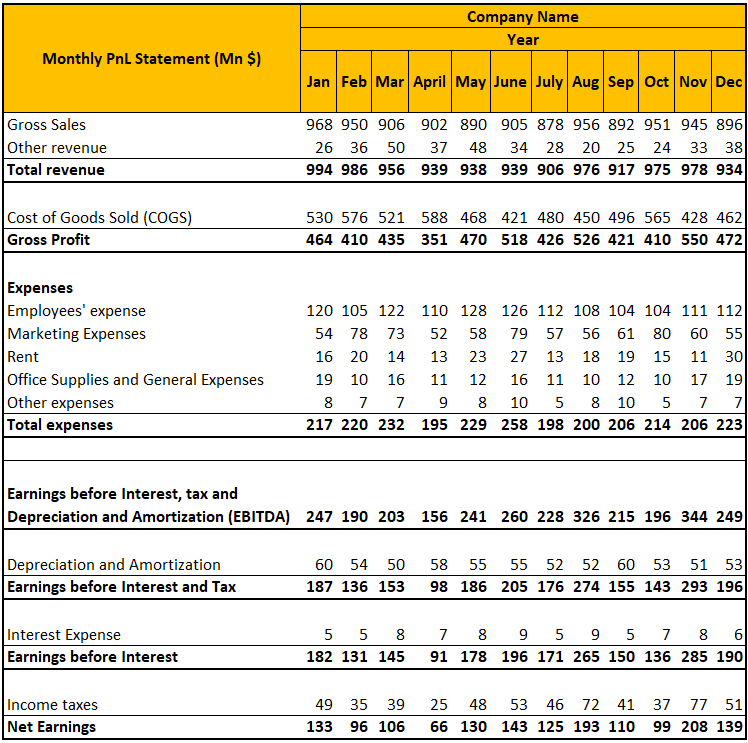

Understanding the fundamental concepts of profit and loss is essential in portfolio management and investment strategies. The ability to accurately assess and forecast financial outcomes forms the bedrock of effective decision-making for investors. Profit and loss analysis not only helps in evaluating past performance but also enables investors to anticipate future trends, thereby facilitating informed portfolio adjustments.

In today's fast-paced financial markets, algorithmic trading plays a pivotal role in optimizing these strategies. By leveraging algorithms, investors can execute high-frequency trades with precision and speed, reducing human errors and improving market efficiency. This technological advancement allows for real-time market analysis and data-driven decision-making, contributing to a more dynamic investment environment.



This article explores key aspects of profit and loss in the context of portfolio management, investment calculation, and how algorithmic trading integrates into these processes. We delve into methods for balancing risk and reward, critical for sustaining investment growth. Furthermore, we examine the metrics and tools essential for evaluating portfolio success, emphasizing the importance of diversification in mitigating potential losses.

We aim to provide readers with actionable insights related to managing investment risks and maximizing returns. Whether you are refining existing strategies or crafting new ones, understanding these principles can significantly enhance your financial acumen. This comprehensive guide is tailored for both novice and experienced investors seeking to navigate the complex landscape of modern portfolio management. By incorporating both foundational knowledge and advanced algorithmic techniques, we offer a resource that equips investors to respond adeptly to the evolving demands of the financial world.

## Table of Contents

## Understanding Profit and Loss in Portfolio Management

Profit and loss analysis serves as a foundational element of effective portfolio management. It provides investors with a framework to evaluate portfolio performance and make informed decisions to enhance returns while minimizing risks. Understanding the influences on profit and loss helps investors identify opportunities and threats within their portfolios, facilitating strategic adjustments.

A vital aspect of assessing portfolio performance is tracking individual asset contributions to the portfolio's overall profit and loss. This analysis helps determine the extent to which different securities contribute to returns or incur losses. Factors such as market volatility, economic conditions, and company-specific news can significantly impact asset performance.

Balancing risk and reward is crucial for sustainable investment growth. Implementing risk management strategies can help mitigate potential losses while pursuing higher returns. This balance often involves a trade-off, as higher returns are typically associated with greater risk. Calculating the risk-adjusted return of a portfolio, using metrics like the Sharpe Ratio or Sortino Ratio, allows investors to evaluate performance relative to the risk undertaken. The Sharpe Ratio, for instance, is calculated as:

$$
\text{Sharpe Ratio} = \frac{R_p - R_f}{\sigma_p}
$$

where $R_p$ represents the portfolio return, $R_f$ is the risk-free rate, and $\sigma_p$ is the standard deviation of the portfolio's excess return.

Several tools and metrics assist in evaluating portfolio success. Benchmarking against market indices or peer groups provides valuable insights into relative performance, highlighting areas for potential improvement. Metrics such as alpha and beta offer further granularity, measuring a portfolio's excess return over a benchmark and its sensitivity to market movements, respectively.

Diversification stands out as a critical strategy in managing portfolio risk. By investing across various asset classes, sectors, or geographies, investors can reduce the impact of any single asset's poor performance. This non-correlation among assets helps stabilize overall portfolio returns. The concept of diversification can be mathematically expressed through the reduction in portfolio variance:

$$
\sigma_p = \sqrt{\sum_{i=1}^n \sum_{j=1}^n w_i w_j \sigma_i \sigma_j \rho_{ij}}
$$

where $w_i$ and $w_j$ are the asset weights, $\sigma_i$ and $\sigma_j$ their respective standard deviations, and $\rho_{ij}$ the correlation between asset $i$ and asset $j$.

In summary, understanding profit and loss in portfolio management involves a comprehensive evaluation of performance using a combination of asset analysis, risk-reward balancing, and strategic diversification. These approaches equip investors to navigate the complexities of financial markets successfully, aiming for optimal growth and risk control in their investment portfolios.

## Investment Calculation Techniques

Investment calculation is a cornerstone of effective portfolio management, enabling investors to evaluate potential returns and assess the inherent risks of their decisions. A comprehensive understanding of key investment calculation strategies empowers investors to make informed decisions, optimize their portfolios, and achieve their financial objectives.

**Net Present Value (NPV) and Internal Rate of Return (IRR)**

Net Present Value (NPV) and Internal Rate of Return (IRR) are widely used metrics in investment calculation, both serving as critical tools for decision-making. NPV is calculated by discounting the expected cash flows of an investment to their present value, then subtracting the initial investment cost. Mathematically, NPV can be expressed as:

$$

NPV = \sum_{t=1}^{n} \frac{C_t}{(1 + r)^t} - C_0 
$$

where $C_t$ is the cash inflow at time $t$, $r$ is the discount rate, and $C_0$ is the initial investment. A positive NPV indicates that the projected earnings exceed the anticipated costs, making the investment potentially profitable.

IRR is the discount rate that makes the NPV of an investment zero, representing the expected annualized rate of return. It is particularly useful when comparing multiple investment opportunities. To find the IRR, one would solve the following equation for $r$:

$$

0 = \sum_{t=1}^{n} \frac{C_t}{(1 + r)^t} - C_0 
$$

Both NPV and IRR require accurate cash flow forecasting, highlighting the importance of precise financial modeling to predict investment outcomes effectively.

**Importance of Accurate Financial Modeling**

Accurate financial modeling is essential in investment analysis as it provides a structured approach to estimate future performance. Models incorporate various assumptions about market conditions, interest rates, and company growth, allowing investors to simulate potential scenarios and evaluate their impact on investment returns. The reliability of decisions hinges on the quality of these models, necessitating continuous learning and adaptation to improve forecasting techniques.

**Integrating Calculations into Daily Practices**

Investors can integrate these calculation techniques into their daily practices to enhance decision-making processes. By applying NPV and IRR systematically during portfolio evaluations, investors can prioritize projects and allocate resources efficiently. These tools also help assess the viability of new investments, enabling swift adjustments to portfolio strategies based on quantitative insights.

**Role of Technology and Software Tools**

Advancements in technology and software have greatly facilitated precise investment calculations, making complex analysis more accessible and manageable. Tools such as Python and financial modeling software like Excel or specialized platforms (e.g., Bloomberg Terminal, FactSet) enable investors to automate these calculations, ensuring accuracy and saving time. Python, for instance, offers libraries such as NumPy and Pandas for handling numerical data and performing quantitative analysis. A simple implementation to calculate NPV in Python might look like this:

```python
import numpy as np

def calculate_npv(cash_flows, discount_rate):
    npv = np.sum([cf / (1 + discount_rate)**t for t, cf in enumerate(cash_flows)])
    return npv

cash_flows = [-1000, 200, 300, 400, 500]
discount_rate = 0.1

npv = calculate_npv(cash_flows, discount_rate)
print(f"NPV: {npv}")
```
In this example, `calculate_npv` computes the NPV of a series of cash flows given a discount rate, illustrating the seamless integration of computation techniques into investment decision frameworks.

The use of these tools in investment calculation not only enhances accuracy but also provides the flexibility to analyze various investment scenarios rapidly. Leveraging cutting-edge technology, investors can stay ahead in a dynamic financial environment, making data-informed decisions that support sustained portfolio growth.

## Role of Algorithmic Trading in Portfolio Management

Algorithmic trading has revolutionized the landscape of portfolio management by introducing mechanisms that improve both the speed and efficiency of trading activities. This technologically advanced method uses pre-defined algorithms to execute trades based on a set of criteria, such as price levels, technical indicators, or market conditions.

### Types of Algorithms Used in Trading

There are several types of algorithms employed in trading:

1. **Trend Following Algorithms**: These algorithms are designed to identify and follow market trends based on moving averages or other trend indicators. They help investors capitalize on market momentum.

2. **Arbitrage Algorithms**: These algorithms exploit price discrepancies between markets or instruments, allowing traders to execute simultaneous buy and sell orders to capture risk-free profit.

3. **Mean Reversion Algorithms**: Based on the assumption that prices and returns eventually move back to their historical mean, these algorithms identify and act upon deviations from average value.

4. **Machine Learning Algorithms**: Utilizing data-driven approaches, machine learning algorithms adapt and refine trading strategies based on historical data patterns and predictions.

### Benefits of Algorithmic Trading

The benefits of incorporating [algorithmic trading](/wiki/algorithmic-trading) into portfolio management are significant:

- **Reduced Transaction Costs**: Algorithms optimize the timing and execution of trades, significantly lowering the costs associated with manual trading.

- **Minimized Human Error**: Automated processes reduce the likelihood of errors caused by emotional and psychological factors, leading to more consistent trading performance.

- **Real-time Market Analysis**: Algorithms process vast amounts of data in real-time, providing timely insights and allowing quick responses to changing market conditions.

- **Automated Decision-Making**: With the ability to execute trades automatically based on pre-defined conditions, algorithms enhance the efficiency of trading strategies without the need for constant human oversight.

### Challenges and Risks

While algorithmic trading offers numerous advantages, it also presents challenges and risks that must be managed carefully:

- **Complexity and Reliability**: The development and maintenance of trading algorithms require a high level of expertise and technological infrastructure.

- **Market Impact and Liquidity**: High-frequency trading, a form of algorithmic trading, can impact market liquidity and contribute to market volatility.

- **Regulatory Compliance**: Adhering to regulatory requirements is critical. Trading algorithms must be designed to comply with market regulations to prevent issues such as price manipulation.

The integration of algorithmic trading in portfolio management necessitates a comprehensive understanding of these algorithms, as well as the ability to navigate the complexities and risks associated with them. Adopting a balanced approach that includes stringent compliance protocols ensures that algorithmic strategies enhance portfolio management outcomes effectively.

## Integrating Profit and Loss Analysis with Algorithmic Strategies

Integrating profit and loss analysis with algorithmic strategies significantly enhances portfolio management by leveraging the precision and efficiency of computational techniques. With algorithmic trading, complex financial strategies that previously required extensive manual input and coordination can now be executed with greater efficiency and speed. These algorithms rely on predefined rules and statistical models to make real-time trading decisions, allowing for the execution of sophisticated strategies such as [arbitrage](/wiki/arbitrage), [market making](/wiki/market-making), and [statistical arbitrage](/wiki/statistical-arbitrage) that were challenging and time-consuming to implement manually.

Algorithms provide a significant edge in handling large volumes of data and analyzing market trends, which leads to more informed decision-making. By integrating data-driven insights with algorithmic precision, investors can gain a comprehensive view of market dynamics and adjust their portfolios accordingly. For instance, [machine learning](/wiki/machine-learning) algorithms can predict asset price movements based on historical data, providing actionable insights that enhance profit and loss management within portfolios.

An example of successful integration of algorithmic strategies into portfolio management is the use of quantitative models by hedge funds. Renaissance Technologies, a prominent [hedge fund](/wiki/hedge-fund-trading-strategies), applies quantitative models and algorithms to achieve high-frequency trading success, demonstrating the potential of these methodologies in yielding significant profit margins. Another instance is BlackRock's Aladdin platform, which uses algorithms to manage risk and revenue, showcasing effective synergy between traditional profit and loss techniques and algorithmic trading.

As technology continues to advance, algorithmic trading is poised to further evolve, impacting portfolio management strategies significantly. Future trends may include increased adoption of [artificial intelligence](/wiki/ai-artificial-intelligence) and machine learning in developing more adaptive and predictive trading algorithms. The potential use of quantum computing in algorithmic trading also represents a transformative opportunity, as it could exponentially increase processing speeds and computational accuracy.

Algorithmic strategies not only streamline trading processes but also minimize human errors and emotional biases, leading to more robust investment outcomes. However, it is important to consider the inherent risks and challenges, such as system failures and market impact, while ensuring compliance with regulatory frameworks. As the field progresses, continuous enhancements in technology and regulatory standards will shape the future dynamics of portfolio management.

## Best Practices for Portfolio Management and Trading

Effective portfolio management and trading practices are essential for investors striving to achieve substantial financial success in today's dynamic markets. A structured approach grounded in clear objectives, ongoing education, meticulous portfolio review, and market vigilance is crucial.

Setting clear objectives and realistic goals forms the bedrock of successful investment strategies. Investors must articulate specific goals, such as risk tolerance levels, investment horizons, and expected returns. For example, a risk-averse investor might aim for a stable annual return of 5%, while a risk-taking investor may target higher returns with greater [volatility](/wiki/volatility-trading-strategies). Defining such parameters helps tailor investment choices to meet individual needs and aligns portfolio components accordingly. The SMART criteria—Specific, Measurable, Achievable, Relevant, and Time-bound—are useful for crafting coherent investment goals.

Continuous learning remains an essential practice as the financial landscape evolves rapidly. Investors must keep abreast of economic trends, regulatory changes, and emerging technologies. Engaging in professional courses, attending webinars, and reading financial literature enhance an investor's ability to adapt strategies accordingly. As finance increasingly integrates technology, understanding new tools and platforms becomes indispensable. For instance, familiarity with blockchain technology or artificial intelligence applications can provide competitive advantages.

Regular portfolio review and rebalancing are pivotal in maintaining optimal performance. Over time, asset allocations can drift from their initial targets due to market movements. Rebalancing involves realigning the portfolio to its strategic allocation, ensuring that risk levels remain consistent with the investor’s goals. For instance, if equities appreciate significantly, a portfolio may become equity-heavy, necessitating a reallocation to bonds or other asset classes to restore balance. Rebalancing can be set on a periodic basis (e.g., quarterly, annually) or triggered by specific thresholds (e.g., a 5% change in asset class allocation).

Staying informed about market trends and updates in trading technologies is critical. Market conditions are influenced by numerous factors, including geopolitical events, monetary policy shifts, and technological advancements. Awareness of these influences can help investors anticipate potential market shifts. Furthermore, adopting new trading technologies, such as algorithmic trading platforms or data analytics tools, can enhance decision-making processes. Technologies such as Python's pandas library or machine learning frameworks like TensorFlow can be leveraged for data analysis and trend forecasting, enabling more informed trading decisions.

In conclusion, adhering to best practices in portfolio management and trading not only mitigates risks but also capitalizes on opportunities, thus securing financial growth and stability.

## Conclusion

In today's rapidly evolving financial markets, understanding the fundamentals of profit and loss, precise investment calculations, and the integration of algorithmic trading are indispensable for successful portfolio management. These elements collectively empower investors to navigate complex market dynamics with increased confidence and strategic acumen. 

Grasping the dynamics of profit and loss is not merely an academic exercise but a practical necessity for assessing portfolio performance. By deciphering the nuances of these financial metrics, investors can make informed decisions that balance risk and reward effectively. The knowledge of profit and loss informs strategies that aim for sustainable returns while minimizing potential setbacks through diversification and other mitigating approaches.

Investment calculation techniques provide the quantitative backbone for evaluating potential investments. Methods such as net present value (NPV) and internal rate of return (IRR) are crucial for assessing the viability of investment opportunities. These calculations, supported by accurate financial modeling, help investors predict potential outcomes and integrate these forecasts into daily decision-making processes. The use of technological tools and software enhances precision, promoting better investment outcomes.

Algorithmic trading has revolutionized portfolio management by offering unparalleled speed and efficiency. By employing sophisticated algorithms, investors can optimize strategies, reduce transaction costs, and minimize human error. However, this technological advancement also brings challenges that require a firm understanding of regulatory compliance and risk management. Successful integration of algorithmic strategies with traditional profit and loss assessments can enhance portfolio performance, with data-driven insights offering a competitive edge.

Investors must continually adapt to technological advancements in trading and portfolio management to maintain a strategic advantage. Staying informed about market trends and emerging technologies can facilitate ongoing improvement of investment strategies. By embracing continuous learning and innovation, investors can effectively respond to the dynamic financial landscape.

For further exploration, investors may refer to foundational texts on portfolio management, algorithmic trading platforms, and financial analysis. Online resources, such as financial courses and webinar series, can also deepen understanding and contribute to more informed decision-making. By applying these insights, investors are well-equipped to enhance their strategies and achieve superior financial outcomes in today's complex investment climate.

## References & Further Reading

[1]: Bergstra, J., Bardenet, R., Bengio, Y., & Kégl, B. (2011). ["Algorithms for Hyper-Parameter Optimization."](https://papers.nips.cc/paper/4443-algorithms-for-hyper-parameter-optimization) Advances in Neural Information Processing Systems 24.

[2]: ["Advances in Financial Machine Learning"](https://www.amazon.com/Advances-Financial-Machine-Learning-Marcos/dp/1119482089) by Marcos Lopez de Prado

[3]: ["Evidence-Based Technical Analysis: Applying the Scientific Method and Statistical Inference to Trading Signals"](https://www.amazon.com/Evidence-Based-Technical-Analysis-Scientific-Statistical/dp/0470008741) by David Aronson

[4]: ["Machine Learning for Algorithmic Trading"](https://github.com/stefan-jansen/machine-learning-for-trading) by Stefan Jansen

[5]: ["Quantitative Trading: How to Build Your Own Algorithmic Trading Business"](https://www.amazon.com/Quantitative-Trading-Build-Algorithmic-Business/dp/1119800064) by Ernest P. Chan