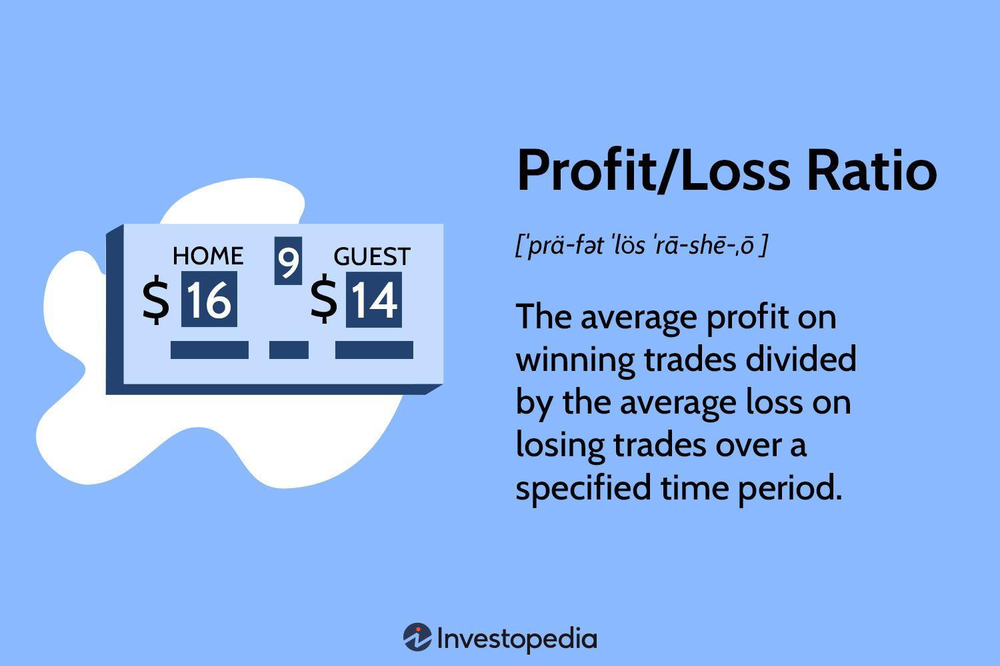

## Table of Contents

## What is a portfolio in the context of investments?

A portfolio in the context of investments is a collection of different investments that an individual or an institution owns. These investments can include stocks, bonds, mutual funds, real estate, and other assets. The purpose of a portfolio is to spread out the risk and potentially increase the return on investment. By having a mix of different types of investments, an investor can protect themselves against big losses if one type of investment does poorly.

Putting together a portfolio involves deciding how much money to put into each type of investment. This decision is based on the investor's goals, how much risk they are willing to take, and how long they plan to keep their investments. For example, a young person saving for retirement might have a portfolio with more stocks because they can handle more risk and have a long time to recover from any losses. On the other hand, someone closer to retirement might have more bonds because they want a safer, more stable investment.

## How do you calculate the profit or loss of a single investment?

To calculate the profit or loss of a single investment, you need to know two main things: the price you bought the investment for and the price you sold it for. The profit is the difference between the selling price and the buying price. If you sell the investment for more than you paid for it, you make a profit. If you sell it for less, you have a loss. For example, if you bought a stock for $50 and sold it for $70, your profit would be $70 - $50 = $20.

Sometimes, you also need to consider other costs like fees or commissions that you paid to buy or sell the investment. These costs can reduce your profit or increase your loss. To find the true profit or loss, subtract any fees or commissions from the selling price before calculating the difference. For instance, if you bought the same stock for $50 and paid a $2 fee, and then sold it for $70 with another $2 fee, your calculation would be $70 - $2 (selling fee) = $68, then $68 - $50 - $2 (buying fee) = $16. So, your actual profit would be $16 after accounting for the fees.

## What is the formula for calculating the total profit or loss of a portfolio?

To calculate the total profit or loss of a portfolio, you need to add up the profit or loss from each investment in the portfolio. Start by figuring out the profit or loss for each individual investment. You do this by subtracting the buying price from the selling price for each investment. If there are any fees or commissions, you need to subtract those too. Once you have the profit or loss for each investment, you add them all together to get the total profit or loss for the whole portfolio.

For example, imagine you have a portfolio with three investments. The first investment had a profit of $100, the second had a loss of $50, and the third had a profit of $200. To find the total profit or loss, you would add these amounts together: $100 + (-$50) + $200 = $250. So, the total profit for the portfolio would be $250. If the total is a positive number, that's your profit. If it's a negative number, that's your loss.

## How do you account for different types of assets (stocks, bonds, etc.) when calculating portfolio profit and loss?

When calculating the profit or loss of a portfolio with different types of assets like stocks, bonds, and real estate, you need to treat each asset the same way. For each asset, you find out how much you paid for it and how much you sold it for. Then, you subtract the buying price from the selling price to get the profit or loss for that asset. If there are any fees or costs, you subtract those too. After you figure out the profit or loss for each asset, you add them all together to get the total profit or loss for the whole portfolio.

For example, let's say you have a portfolio with stocks, bonds, and a piece of real estate. You bought the stocks for $1,000 and sold them for $1,200, so your profit from the stocks is $200. You bought the bonds for $500 and sold them for $450, so you had a loss of $50 on the bonds. And you bought the real estate for $100,000 and sold it for $110,000, so your profit from the real estate is $10,000. To find the total profit or loss for your portfolio, you add these amounts together: $200 (stocks) + (-$50) (bonds) + $10,000 (real estate) = $10,150. So, your total profit for the portfolio is $10,150.

## What role does the initial investment value play in calculating portfolio profit and loss?

The initial investment value is really important when you figure out how much money you made or lost from your portfolio. It's the starting point for each of your investments. You need to know how much you paid for each thing in your portfolio, like stocks or bonds, to find out if you made a profit or had a loss when you sold them. If you sell something for more than you paid for it, that's a profit. If you sell it for less, that's a loss. So, the initial investment value helps you see the difference between what you started with and what you ended up with.

When you want to know the total profit or loss for your whole portfolio, you add up the profits and losses from all your different investments. Each time, you start with the initial investment value to see how much you gained or lost on that specific investment. Then, you add all those amounts together. For example, if you made $100 on one stock and lost $50 on another, you'd add $100 and -$50 to get your total profit or loss. The initial investment value is key because it tells you where you started, so you can figure out where you ended up.

## How do you calculate the percentage return on a portfolio?

To figure out the percentage return on your whole portfolio, you need to know two things: how much money you made or lost, and how much money you started with. First, find out the total profit or loss of your portfolio by adding up the profit or loss from each investment. Then, take that total and divide it by the total amount of money you initially put into your portfolio. After you divide, multiply the result by 100 to turn it into a percentage. That's your percentage return.

For example, let's say you started with $10,000 and your total profit from all your investments is $1,500. To find the percentage return, you would divide $1,500 by $10,000, which gives you 0.15. Then, multiply 0.15 by 100 to get a percentage, which is 15%. So, your portfolio had a 15% return. This tells you how well your investments did compared to how much you started with.

## What are the common mistakes to avoid when calculating portfolio profit and loss?

One common mistake people make when figuring out their portfolio's profit and loss is forgetting to include all the costs. When you buy or sell investments, you might have to pay fees or commissions. These costs can make your profit smaller or your loss bigger. So, it's important to subtract these costs from your selling price before you calculate your profit or loss. If you don't, you might think you made more money than you really did.

Another mistake is not keeping track of the initial investment value for each asset in your portfolio. You need to know how much you paid for each investment to see if you made a profit or had a loss when you sold it. If you don't remember or record these amounts correctly, your calculations will be wrong. It's a good idea to keep good records of all your investments, including how much you paid and any fees, so you can figure out your true profit or loss accurately.

## How does rebalancing a portfolio affect its profit and loss calculations?

Rebalancing a portfolio means changing how much money you have in different investments to keep your portfolio in line with your goals. When you rebalance, you might sell some investments that have gone up in value and buy more of the ones that have gone down. This can change your profit and loss calculations because you are selling and buying at new prices. For example, if you sell a stock that has increased in value, you lock in a profit at that moment. But if you buy more of another investment that has gone down, you might have a loss on that part until it goes back up.

When you figure out the profit or loss of your portfolio after rebalancing, you need to think about the new values of your investments. The profit or loss you had before you rebalanced might not be the same anymore. If you sold something for a profit, that profit is now part of your portfolio's value. And if you bought something at a lower price, you might see a loss until that investment goes up again. So, rebalancing can make your portfolio's overall profit or loss look different, depending on what you sold and bought and at what prices.

## How can you use historical data to estimate future portfolio performance?

Using historical data to guess how your portfolio might do in the future is like looking at old weather reports to plan for next week's picnic. You look at how your investments did in the past, like how stocks or bonds went up or down over time. This can give you a good idea of what might happen next. For example, if a certain stock usually goes up during the summer, you might think it could do the same next summer. But remember, past results don't promise the future. Things like the economy, new laws, or big world events can change how your investments do.

To use historical data well, you need to look at a lot of information over a long time. This helps you see patterns and trends. You can use numbers like average returns, how much prices moved up and down, and how different investments acted together. Tools like charts and graphs can make it easier to see these patterns. But even with all this data, you should be careful. The future can be different from the past, so it's smart to keep checking and maybe change your portfolio as things change.

## What advanced metrics can be used to assess portfolio performance beyond simple profit and loss?

Beyond just looking at how much money you made or lost, there are other ways to see how well your portfolio is doing. One important measure is the Sharpe Ratio. This tells you how much extra return you got for the risk you took. A higher Sharpe Ratio means your investments did better than just sitting in a safe place like a savings account, considering the risk. Another useful metric is the Alpha, which shows if your portfolio did better or worse than what you would expect from the market. A positive Alpha means you did better than the market, and a negative Alpha means you did worse.

Another way to assess your portfolio's performance is by looking at the Beta. This measures how much your portfolio moves with the market. A Beta of 1 means your portfolio moves exactly with the market, while a Beta higher than 1 means it moves more than the market, showing it's riskier. A Beta less than 1 means it's less risky. You can also use the Standard Deviation to see how much your returns change over time. A higher Standard Deviation means your returns are more spread out, showing more risk. These metrics help you understand not just if you made money, but how you did it compared to the market and the risks you took.

## How do tax considerations impact the calculation of portfolio profit and loss?

Taxes can change how much money you really make or lose from your investments. When you sell an investment for more than you paid for it, you might have to pay capital gains tax on your profit. This tax can be different depending on how long you held the investment. If you held it for less than a year, it's a short-term capital gain, and you pay more tax on it. If you held it for more than a year, it's a long-term capital gain, and you pay less tax. So, when figuring out your real profit or loss, you need to subtract the tax you owe from your profit.

Sometimes, you can also use losses to help with your taxes. If you sell an investment for less than you paid for it, that's a capital loss. You can use these losses to lower your taxes by offsetting other gains or even some of your regular income. This can make your overall loss smaller because you're getting some money back through tax savings. So, when calculating your portfolio's profit and loss, remember to think about how taxes will affect your final numbers.

## How can risk-adjusted return measures like the Sharpe Ratio be integrated into portfolio profit and loss analysis?

The Sharpe Ratio is a way to see how well your investments are doing when you think about the risk you're taking. It compares the extra money you made (your return) to how much your investments went up and down (the risk). To use the Sharpe Ratio in your portfolio's profit and loss analysis, you first figure out your total profit or loss like you normally would. Then, you find out the Sharpe Ratio by taking your portfolio's return, subtracting the return of a safe investment like a savings account, and dividing that by the standard deviation of your portfolio's returns. This tells you if the extra money you made was worth the risk you took.

Using the Sharpe Ratio can help you see if your portfolio is doing well compared to just keeping your money in a safe place. If your Sharpe Ratio is high, it means you got a good return for the risk you took. If it's low, it might mean you're not getting enough extra return for the risk. So, when you look at your portfolio's profit and loss, you can also look at the Sharpe Ratio to see if you're happy with how much risk you're taking for the money you're making. This can help you decide if you should change your investments to get a better balance between risk and return.

## What is the understanding of profit and loss in portfolio management?

Profit and loss analysis serves as a foundational element of effective portfolio management. It provides investors with a framework to evaluate portfolio performance and make informed decisions to enhance returns while minimizing risks. Understanding the influences on profit and loss helps investors identify opportunities and threats within their portfolios, facilitating strategic adjustments.

A vital aspect of assessing portfolio performance is tracking individual asset contributions to the portfolio's overall profit and loss. This analysis helps determine the extent to which different securities contribute to returns or incur losses. Factors such as market [volatility](/wiki/volatility-trading-strategies), economic conditions, and company-specific news can significantly impact asset performance.

Balancing risk and reward is crucial for sustainable investment growth. Implementing risk management strategies can help mitigate potential losses while pursuing higher returns. This balance often involves a trade-off, as higher returns are typically associated with greater risk. Calculating the risk-adjusted return of a portfolio, using metrics like the Sharpe Ratio or Sortino Ratio, allows investors to evaluate performance relative to the risk undertaken. The Sharpe Ratio, for instance, is calculated as:

$$
\text{Sharpe Ratio} = \frac{R_p - R_f}{\sigma_p}
$$

where $R_p$ represents the portfolio return, $R_f$ is the risk-free rate, and $\sigma_p$ is the standard deviation of the portfolio's excess return.

Several tools and metrics assist in evaluating portfolio success. Benchmarking against market indices or peer groups provides valuable insights into relative performance, highlighting areas for potential improvement. Metrics such as alpha and beta offer further granularity, measuring a portfolio's excess return over a benchmark and its sensitivity to market movements, respectively.

Diversification stands out as a critical strategy in managing portfolio risk. By investing across various asset classes, sectors, or geographies, investors can reduce the impact of any single asset's poor performance. This non-correlation among assets helps stabilize overall portfolio returns. The concept of diversification can be mathematically expressed through the reduction in portfolio variance:

$$
\sigma_p = \sqrt{\sum_{i=1}^n \sum_{j=1}^n w_i w_j \sigma_i \sigma_j \rho_{ij}}
$$

where $w_i$ and $w_j$ are the asset weights, $\sigma_i$ and $\sigma_j$ their respective standard deviations, and $\rho_{ij}$ the correlation between asset $i$ and asset $j$.

In summary, understanding profit and loss in portfolio management involves a comprehensive evaluation of performance using a combination of asset analysis, risk-reward balancing, and strategic diversification. These approaches equip investors to navigate the complexities of financial markets successfully, aiming for optimal growth and risk control in their investment portfolios.

## What are Investment Calculation Techniques?

Investment calculation is a cornerstone of effective portfolio management, enabling investors to evaluate potential returns and assess the inherent risks of their decisions. A comprehensive understanding of key investment calculation strategies empowers investors to make informed decisions, optimize their portfolios, and achieve their financial objectives.

**Net Present Value (NPV) and Internal Rate of Return (IRR)**

Net Present Value (NPV) and Internal Rate of Return (IRR) are widely used metrics in investment calculation, both serving as critical tools for decision-making. NPV is calculated by discounting the expected cash flows of an investment to their present value, then subtracting the initial investment cost. Mathematically, NPV can be expressed as:

$$

NPV = \sum_{t=1}^{n} \frac{C_t}{(1 + r)^t} - C_0 
$$

where $C_t$ is the cash inflow at time $t$, $r$ is the discount rate, and $C_0$ is the initial investment. A positive NPV indicates that the projected earnings exceed the anticipated costs, making the investment potentially profitable.

IRR is the discount rate that makes the NPV of an investment zero, representing the expected annualized rate of return. It is particularly useful when comparing multiple investment opportunities. To find the IRR, one would solve the following equation for $r$:

$$

0 = \sum_{t=1}^{n} \frac{C_t}{(1 + r)^t} - C_0 
$$

Both NPV and IRR require accurate cash flow forecasting, highlighting the importance of precise financial modeling to predict investment outcomes effectively.

**Importance of Accurate Financial Modeling**

Accurate financial modeling is essential in investment analysis as it provides a structured approach to estimate future performance. Models incorporate various assumptions about market conditions, interest rates, and company growth, allowing investors to simulate potential scenarios and evaluate their impact on investment returns. The reliability of decisions hinges on the quality of these models, necessitating continuous learning and adaptation to improve forecasting techniques.

**Integrating Calculations into Daily Practices**

Investors can integrate these calculation techniques into their daily practices to enhance decision-making processes. By applying NPV and IRR systematically during portfolio evaluations, investors can prioritize projects and allocate resources efficiently. These tools also help assess the viability of new investments, enabling swift adjustments to portfolio strategies based on quantitative insights.

**Role of Technology and Software Tools**

Advancements in technology and software have greatly facilitated precise investment calculations, making complex analysis more accessible and manageable. Tools such as Python and financial modeling software like Excel or specialized platforms (e.g., Bloomberg Terminal, FactSet) enable investors to automate these calculations, ensuring accuracy and saving time. Python, for instance, offers libraries such as NumPy and Pandas for handling numerical data and performing quantitative analysis. A simple implementation to calculate NPV in Python might look like this:

```python
import numpy as np

def calculate_npv(cash_flows, discount_rate):
    npv = np.sum([cf / (1 + discount_rate)**t for t, cf in enumerate(cash_flows)])
    return npv

cash_flows = [-1000, 200, 300, 400, 500]
discount_rate = 0.1

npv = calculate_npv(cash_flows, discount_rate)
print(f"NPV: {npv}")
```
In this example, `calculate_npv` computes the NPV of a series of cash flows given a discount rate, illustrating the seamless integration of computation techniques into investment decision frameworks.

The use of these tools in investment calculation not only enhances accuracy but also provides the flexibility to analyze various investment scenarios rapidly. Leveraging cutting-edge technology, investors can stay ahead in a dynamic financial environment, making data-informed decisions that support sustained portfolio growth.

## References & Further Reading

[1]: Bergstra, J., Bardenet, R., Bengio, Y., & Kégl, B. (2011). ["Algorithms for Hyper-Parameter Optimization."](https://papers.nips.cc/paper/4443-algorithms-for-hyper-parameter-optimization) Advances in Neural Information Processing Systems 24.

[2]: ["Advances in Financial Machine Learning"](https://www.amazon.com/Advances-Financial-Machine-Learning-Marcos/dp/1119482089) by Marcos Lopez de Prado

[3]: ["Evidence-Based Technical Analysis: Applying the Scientific Method and Statistical Inference to Trading Signals"](https://www.amazon.com/Evidence-Based-Technical-Analysis-Scientific-Statistical/dp/0470008741) by David Aronson

[4]: ["Machine Learning for Algorithmic Trading"](https://github.com/stefan-jansen/machine-learning-for-trading) by Stefan Jansen

[5]: ["Quantitative Trading: How to Build Your Own Algorithmic Trading Business"](https://www.amazon.com/Quantitative-Trading-Build-Algorithmic-Business/dp/1119800064) by Ernest P. Chan