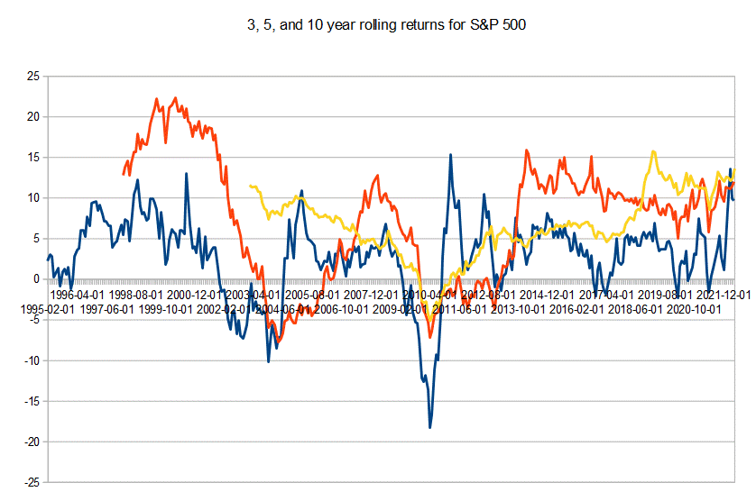

The S&P 500, or Standard & Poor's 500 Index, is a fundamental benchmark in the stock market, representing an aggregate measure of the performance of 500 of the largest publicly traded companies in the United States. This index is essential for investors and traders, as it serves as a barometer for the health of the U.S. economy and is a common reference point for investors assessing market returns. The components of the S&P 500 are selected based on market capitalization, sector representation, and liquidity, which provide a diversified representation of the overall stock market.

This article focuses on two key aspects related to the S&P 500: index calculation and algorithmic trading. Understanding how the S&P 500 is calculated is crucial for investors and traders, as it enables them to interpret the index's value accurately and make informed decisions. The index uses a market capitalization-weighted approach, meaning that companies with a higher market cap have a greater impact on the index's performance. Comprehending this weighting mechanism helps investors grasp why certain companies have more influence on the index's movements than others.



Algorithmic trading, using computerized systems to execute trades based on pre-set criteria, is becoming increasingly dominant within financial markets. Algorithms can process vast amounts of data and execute trades at high speeds, offering advantages in terms of efficiency and precision. Their growing influence is reshaping the landscape of trading, as they help capitalize on market opportunities quickly and with less human intervention.

As we explore the calculation of the S&P 500 and the role algorithms play in trading, we aim to provide insights into the mechanics and implications of these processes. Understanding these elements is vital for navigating today's dynamic markets, where technology and traditional investing strategy intersect. Recognizing the impact of both index calculation and algorithmic trading can greatly enhance one's ability to make strategic decisions in personal and institutional investments.

## Table of Contents

## Understanding the S&P 500

The S&P 500, or Standard & Poor's 500, is one of the most prominent stock market indices globally, representing 500 of the leading publicly traded companies in the United States. Established in 1957 by the credit rating agency Standard & Poor's, part of S&P Global, the index serves as a barometer for the U.S. equity markets and the broader economy. 

The S&P 500's composition includes companies across various industries, making it a comprehensive reflection of the market. The selection of companies is based on specific criteria, including market capitalization, liquidity, financial viability, and sector representation. To be included, a company must have a market capitalization of at least $14.6 billion, as per the latest figures, and must also be an American company with most of its revenues generated domestically. Furthermore, the company should have a public float of at least 10% of its shares outstanding. S&P Dow Jones Indices, the index's manager, rebalances the index periodically to ensure it remains representative of the market.

As a benchmark, the S&P 500 is pivotal for measuring the performance of investment portfolios, mutual funds, and ETFs. Investors and asset managers frequently compare their returns against the S&P 500 to gauge their success. Its relevance extends beyond the U.S., as it influences global financial markets significantly. The index provides insights into the economic health of the U.S. and, by extension, the world. Changes in the S&P 500 can affect investor sentiment internationally, underlining its impact on foreign exchange rates, commodity prices, and investment strategies worldwide.

Overall, the S&P 500's role as a benchmark and its influence on global markets underscore its importance in the financial world. Understanding its composition and criteria for inclusion is crucial for investors aiming to navigate the complex landscape of the stock market.

## The Calculation of the S&P 500 Index

The S&P 500 Index serves as a cornerstone of financial markets, and its calculation is based on the concept of a market capitalization-weighted index. This methodology emphasizes the size and influence of a company by weighting each stock in the index according to its total market value. Consequently, larger companies have a more significant impact on the index’s movements than smaller ones.

### Market Capitalization Weighted Index

Market capitalization, or market cap, is a measure of a company's total market value. It is calculated by multiplying the company's current stock price by its total outstanding shares. The formula for calculating the market cap is given by:

$$

\text{Market Capitalization} = \text{Stock Price} \times \text{Total Number of Outstanding Shares} 
$$

The S&P 500 is calculated by summing the market capitalizations of each of the 500 constituent companies, adjusting for the index divisor. The formula for the index value is represented as:

$$
\text{Index Value} = \frac{\sum (\text{Market Cap of each Component})}{\text{Index Divisor}}
$$

### Impact of Stock Price Changes and Market Cap Fluctuations

Fluctuations in stock prices directly influence a company’s market capitalization, thereby affecting the S&P 500 Index value. A rise in a company's stock price increases its market cap, leading to a higher index value, while a decline has the opposite effect. Since the index is weighted based on market capitalization, even minor fluctuations in the stock prices of the largest companies can significantly impact the index.

### Role of the Index Divisor

The index divisor is a critical component that ensures the continuity and usability of the S&P 500 Index. When calculating the index, the divisor is a figure that compensates for changes due to corporate actions like stock splits, dividends, or the addition and removal of companies. Without the divisor, these actions could lead to abrupt changes in the index value that do not reflect true economic shifts.

The divisor is adjusted so that such corporate events do not skew the index. For example, if a company in the index undergoes a 2-for-1 stock split, its market cap would seemingly halve. The divisor is adjusted to ensure the index value represents the consistent economic reality.

### Adjustments for Corporate Actions

To maintain its precise representation of the market, adjustments to the index components are necessary. Some of these include:

- **Stock Splits**: When a stock split occurs, the price of the stock is adjusted and the divisor modified to ensure the overall index value remains unchanged.

- **Dividends**: Cash dividends distributed do not alter the index. However, special dividends do require adjustment to reflect the changes in a company’s equity.

- **Mergers and Acquisitions**: These events often alter the market cap of the constituent companies, necessitating recalculations and adjustments in the divisor to maintain index continuity.

The careful calculation and adjustment mechanisms embedded in the S&P 500 Index ensure that it remains a faithful reflection of the underlying market dynamics, providing investors and traders with a reliable benchmark for measuring stock market performance.

## Algorithmic Trading and the S&P 500

Algorithmic trading, often referred to as "algo trading," is a trading strategy that uses computer algorithms to execute orders based on predefined criteria with minimal human intervention. The basic principles of [algorithmic trading](/wiki/algorithmic-trading) involve leveraging complex mathematical models and historical data to identify and exploit market opportunities. It relies heavily on the use of algorithms to process large volumes of data to detect trends, predict market movements, and execute trades at optimal conditions.

Algorithms in trading analyze vast amounts of market data, including historical price movements, trading volumes, and other publicly available indicators. By applying statistical and mathematical models, these algorithms can identify trends and trading signals that may not be apparent to human traders. For instance, algorithms can use moving averages or [momentum](/wiki/momentum) indicators to decide entry and [exit](/wiki/exit-strategy) points in the market. Python, being a popular language in the finance industry, is often used to implement such algorithms. Here's a simple example of a moving average crossover strategy implemented in Python:

```python
import pandas as pd

# Assuming `price_data` is a pandas DataFrame with a 'Close' column for stock prices
short_window = 40
long_window = 100

# Calculate moving averages
price_data['Short_MA'] = price_data['Close'].rolling(window=short_window, min_periods=1).mean()
price_data['Long_MA'] = price_data['Close'].rolling(window=long_window, min_periods=1).mean()

# Create signals
price_data['Signal'] = 0
price_data['Signal'][short_window:] = np.where(price_data['Short_MA'][short_window:] > price_data['Long_MA'][short_window:], 1, 0)

# Generate trading orders
price_data['Position'] = price_data['Signal'].diff()
```

One significant advantage of algorithmic trading in the context of the S&P 500 stocks is its ability to execute trades at a speed and frequency that is impossible for human traders. This high speed and accuracy can enable traders to take advantage of even the smallest market inefficiencies. Additionally, algo trading mitigates the emotional and psychological factors that often affect human trading decisions, thereby promoting more systematic and disciplined trading approaches.

However, algorithmic trading is not without its challenges. One of the main concerns is its contribution to market [volatility](/wiki/volatility-trading-strategies). High-frequency trading, a subset of algorithmic trading, can lead to issues such as flash crashes, where a rapid sell-off in a short period triggers large market movements. Ethical considerations also arise, such as the potential for market manipulation through trading practices like spoofing, where orders are placed with the intent to cancel them before execution to create a false sense of demand or supply.

Despite these challenges, the benefits of algorithmic trading, particularly during periods of high [liquidity](/wiki/liquidity-risk-premium), often outweigh the drawbacks. The use of automation allows for more efficient price discovery and liquidity provision in the financial markets, leading to potentially lower costs and better execution for traders and investors engaging with S&P 500 stocks.

## Strategies for Algorithmic Trading of the S&P 500

Algorithmic trading strategies for the S&P 500 leverage advanced mathematical models and computational technologies to execute trades with precision and speed. These strategies aim to capitalize on market inefficiencies, exploiting momentary price discrepancies and trends. Below are some of the most prevalent strategies employed by traders in the algorithmic trading space, particularly those focusing on the S&P 500.

**Trend-Following Strategies**

Trend-following strategies, also known as momentum strategies, rely on the presumption that stocks which have been moving in a certain direction will continue to do so. These strategies use technical indicators like moving averages or channels to identify buy and sell signals. A simple moving average crossover is one such strategy where a short-term moving average crosses above a long-term moving average indicating a buy signal and vice versa for a sell signal. 

```python
# Example of calculating moving average crossover in Python
import pandas as pd

def moving_average(data, window):
    return data.rolling(window=window).mean()

# Assume 'data' is a pandas DataFrame with S&P 500 historical prices
data['short_mavg'] = moving_average(data['Close'], window=20)
data['long_mavg'] = moving_average(data['Close'], window=50)
data['signal'] = 0
data['signal'][20:] = np.where(data['short_mavg'][20:] > data['long_mavg'][20:], 1, -1)
```

**Mean Reversion Strategies**

Mean reversion strategies are based on the principle that asset prices and historical returns eventually revert to their long-term mean or average level. This strategy involves identifying deviations from this average, with traders anticipating the return to mean to realize gains. A popular technique within this category is statistical [arbitrage](/wiki/arbitrage).

**Statistical Arbitrage**

Statistical arbitrage involves capitalizing on the price movements of related stocks that deviate from their historical price relationships. This strategy often uses a pair-trading approach, where two historically correlated stocks are traded simultaneously. For example, if one stock in the pair sells off, a trader might buy the fallen stock while shorting its paired stock.

**High-Frequency Trading (HFT)**

High-frequency trading is a subclass of algorithmic trading characterized by extremely high speeds and extremely short-term horizons for trade execution. [HFT](/wiki/high-frequency-trading-strategies) firms leverage proprietary algorithms and high-speed data networks to capitalize on minuscule price discrepancies. Despite its advantages in terms of speed and [volume](/wiki/volume-trading-strategy), HFT has been criticized for potentially exacerbating market volatility.

**Machine Learning and AI in Trading Algorithms**

Machine learning and AI technologies have emerged as influential tools in developing trading algorithms. By analyzing vast datasets, these technologies can identify complex patterns and generate predictive models, often improving the accuracy of trade signals. Algorithms can be trained to predict price movements by learning from historical data, considering factors such as market sentiment or economic indicators.

```python
# Example of a simple linear regression model for predicting stock prices
from sklearn.model_selection import train_test_split
from sklearn.linear_model import LinearRegression

# Assume 'features' is a DataFrame with selected features for prediction
X_train, X_test, y_train, y_test = train_test_split(features, data['Close'], test_size=0.2)

model = LinearRegression()
model.fit(X_train, y_train)
predictions = model.predict(X_test)
```

**Best Practices for Developing and Testing Algo Trading Models**

Developing robust algorithmic trading models involves rigorous testing and validation processes. Best practices include [backtesting](/wiki/backtesting), where strategies are tested against historical data to evaluate hypothetical trading performance. It is crucial to ensure that the backtesting environment accurately reflects real market conditions. Additionally, traders should employ out-of-sample testing for validating strategy robustness.

Risk management must be integral to any algorithmic strategy, incorporating limits on position sizes and predefined stop-loss levels. Continuous monitoring and fine-tuning are necessary to adapt strategies to changing market dynamics.

In conclusion, algorithmic trading strategies for the S&P 500 can significantly enhance trading efficiency and efficacy. By employing disciplined approaches and leveraging technological advancements, traders can potentially exploit market opportunities with increased precision.

## The Future of S&P 500 Calculation and Algorithmic Trading

The S&P 500 index is pivotal not only as a benchmark for assessing stock market performance but also as a standard for investment practices worldwide. As we look to the future, several key trends and innovations are likely to impact both its calculation and the practice of algorithmic trading.

### Innovations in Index Calculation Methodology

Current methodologies for calculating indices like the S&P 500 are based on market capitalization, which reflects the total market value of the included companies. However, advancements in computational power and data analytics may lead to more nuanced methodologies. For example, incorporating factors such as environmental, social, and governance ([ESG](/wiki/esg-investing)) criteria could become prevalent, broadening the understanding of investment risk and opportunity. Similarly, real-time data integration, leveraging high-frequency data streams, could enable more dynamic and accurate index updates, reducing latency in response to market movements.

### The Evolving Role of Technology

The role of technology in trading and index management is advancing at an unprecedented pace. Automation and real-time data analytics are facilitating more efficient trade executions and risk management strategies. In particular, the integration of blockchain technology possesses the potential to revolutionize settlement processes, offering transparency and reducing counterparty risks. Additionally, cloud computing and distributed ledger technologies can enhance the speed and security of trading operations, leading to more intricate trading strategies that were previously not feasible due to computational constraints.

### Regulatory Changes

As technology progresses, regulatory landscapes inevitably adapt. There is growing scrutiny concerning the impact of algorithmic trading on market volatility and fairness. Future regulations may focus on ensuring that algorithmic traders do not exploit market anomalies to the detriment of other participants. This could include tighter controls on algorithm testing, mandatory inclusion of market stabilization algorithms, or the introduction of "kill switches" to halt algorithms during periods of excessive volatility. Compliance with such regulations will require robust systems capable of auditing and adjusting algorithms in real-time.

### Future Trends in Automated Trading Systems

The rise of AI and [machine learning](/wiki/machine-learning) in finance signals a transformative period for automated trading systems. Predictive analytics powered by neural networks can discover hidden patterns within vast sets of market data, offering a predictive edge. Furthermore, the deployment of [reinforcement learning](/wiki/reinforcement-learning) can enhance algorithm performance, allowing systems to learn and adapt trading strategies dynamically based on real-time feedback loops. These AI-driven methodologies may redefine how traders approach market timing, asset allocation, and risk management.

### Growth Potential in AI-driven Trading Strategies

AI-driven trading strategies are positioned for significant growth as tools become more sophisticated and affordable. The integration of natural language processing could empower traders to incorporate macroeconomic indicators and news sentiment analysis directly into their trading algorithms, providing a more holistic view of potential market impacts. As AI continues to advance, the potential exists for fully autonomous trading systems that surpass human traders in strategic complexity and speed.

In conclusion, the future of the S&P 500's calculation and algorithmic trading is poised at the intersection of innovation and regulation. The implications of these advancements extend beyond improving indices and trading strategies—they hold the promise of reshaping investor behavior and market operations fundamentally. Understanding these trends is crucial for investors and professionals seeking to navigate the ever-evolving financial landscape.

## Conclusion

In summarizing the exploration of the S&P 500 and algorithmic trading, it is evident that understanding how the index is calculated is crucial for both investors and traders. The S&P 500, as a market capitalization-weighted index, serves as a fundamental benchmark for gauging the performance of the U.S. stock market. A comprehensive grasp of the methodologies used in its calculation, such as the role of the index divisor and adjustments for corporate actions, equips stakeholders with the knowledge to anticipate and interpret market movements more accurately.

Algorithmic trading's rise underscores the growing intersection of technology and finance. By leveraging data, trends, and mathematical models, algorithms enhance the speed and efficiency of trading, particularly with S&P 500 stocks. However, a balanced approach is necessary — one that respects traditional investment principles while embracing technological advancements, ensuring resilience against volatility and ethical considerations.

For both individual and institutional investors, staying informed and adaptable is vital in navigating the ever-evolving financial landscape. The integration of machine learning and [artificial intelligence](/wiki/ai-artificial-intelligence) in trading strategies promises growth, yet it also demands continual reassessment of strategies to leverage new technologies effectively. Ultimately, balancing advanced trading systems with established investment strategies can significantly impact both personal and institutional portfolios, steering them towards sustainable success in the dynamic markets of tomorrow.

## References & Further Reading

[1]: Siegel, J. J. (2003). ["Stocks for the Long Run: The Definitive Guide to Financial Market Returns & Long-Term Investment Strategies."](https://archive.org/details/stocksforlongrun0000sieg_o4p9) McGraw-Hill Education.

[2]: Bogle, J. C. (2017). ["The Little Book of Common Sense Investing: The Only Way to Guarantee Your Fair Share of Stock Market Returns."](https://www.amazon.com/Little-Book-Common-Sense-Investing/dp/1119404509) John Wiley & Sons.

[3]: Fabozzi, F. J., & Markowitz, H. (Eds.). (2002). ["The Theory and Practice of Investment Management."](https://onlinelibrary.wiley.com/doi/book/10.1002/9781118267028) Wiley.

[4]: Harris, L. (2003). ["Trading and Exchanges: Market Microstructure for Practitioners."](https://academic.oup.com/book/52292) Oxford University Press.

[5]: De Prado, M. L. (2018). ["Advances in Financial Machine Learning."](https://www.amazon.com/Advances-Financial-Machine-Learning-Marcos/dp/1119482089) Wiley.

[6]: Chan, E. (2009). ["Quantitative Trading: How to Build Your Own Algorithmic Trading Business."](https://github.com/ftvision/quant_trading_echan_book) Wiley Trading.

[7]: Bouchaud, J.-P., & Potters, M. (2000). ["Theory of Financial Risk and Derivative Pricing: From Statistical Physics to Risk Management."](https://www.cambridge.org/core/books/theory-of-financial-risk-and-derivative-pricing/5BBBA04CE72ED9E5E7C1C028D9A94FCB) Cambridge University Press.

[8]: Fama, E. F. (1965). ["The Behavior of Stock-Market Prices."](https://extranet.parisschoolofeconomics.eu/docs/ferriere-nathalie/fama1965.pdf) The Journal of Business, 38(1), 34-105.