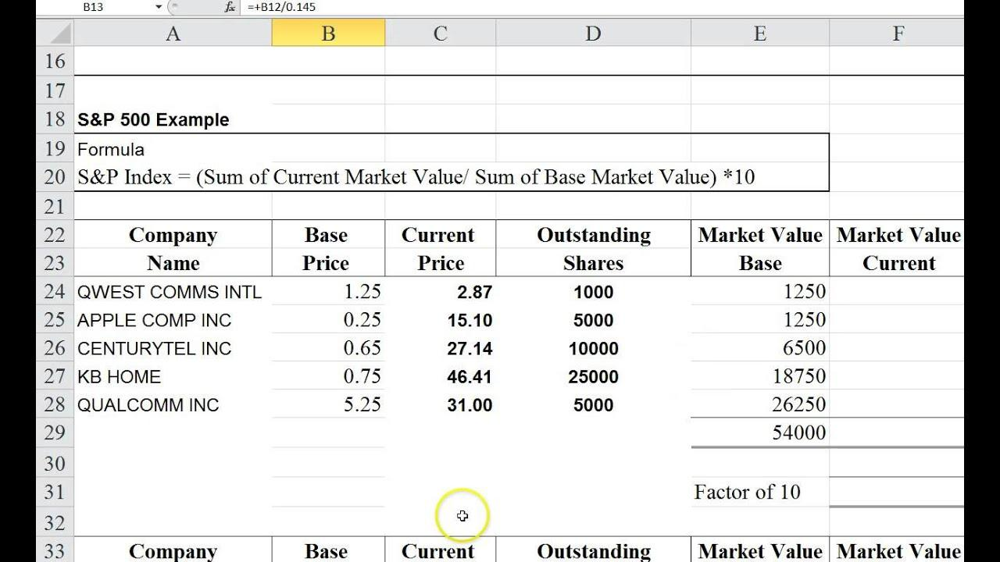

## Table of Contents

## What is the S&P 500 Index?

The S&P 500 Index is a stock market index that measures the stock performance of 500 large companies listed on stock exchanges in the United States. It is one of the most widely followed equity indices, providing a broad look at the overall health of the U.S. economy. The index is maintained by S&P Dow Jones Indices, a division of S&P Global.

The companies included in the S&P 500 are chosen based on their market size, liquidity, and industry representation. This means that the index covers a wide range of sectors, from technology and healthcare to finance and consumer goods. Investors often use the S&P 500 as a benchmark to compare the performance of their own investments, and it is also commonly used as the basis for various financial products like mutual funds and exchange-traded funds (ETFs).

## Why is the S&P 500 Index important for investors?

The S&P 500 Index is important for investors because it gives them a quick way to see how the overall U.S. stock market is doing. It includes 500 big companies from different industries, so it shows a broad picture of the economy. When investors want to know if their investments are doing well, they often compare them to the S&P 500. If their investments are doing better than the S&P 500, they might be happy. If not, they might need to think about changing their investments.

Another reason the S&P 500 is important is that it is used to create many investment products like mutual funds and ETFs. These products are based on the S&P 500 and let investors easily buy a piece of the whole index. This can be a good way for investors to spread out their risk because they are investing in a lot of different companies at once. So, the S&P 500 helps investors not only to measure their success but also to make smart investment choices.

## How is the S&P 500 Index calculated?

The S&P 500 Index is calculated using a method called market capitalization weighting. This means that the bigger a company is, the more it affects the index. The value of the index is found by adding up the total value of all the stocks in the index, but each stock's value is adjusted based on how many shares of that stock are out there. So, if a company has a lot of shares and each share is worth a lot, that company will have a bigger impact on the index.

To make this easier to understand, imagine you have a basket of fruits where the weight of each fruit matters. If you have a big watermelon and a small grape, the watermelon will make the basket much heavier than the grape. In the same way, big companies like Apple or Microsoft have a bigger "weight" in the S&P 500 than smaller companies. This method helps show how the overall value of these 500 big companies is changing over time.

## What are the components of the S&P 500 Index?

The S&P 500 Index is made up of 500 big companies that are listed on stock exchanges in the United States. These companies come from different industries like technology, healthcare, finance, and consumer goods. The companies in the index are chosen based on how big they are, how easy it is to buy and sell their stocks, and how well they represent their industry. This means that the S&P 500 gives a good overall picture of the U.S. economy.

Some of the well-known companies in the S&P 500 include Apple, Microsoft, Amazon, and Johnson & Johnson. These companies are part of the index because they are very large and important in their industries. The list of companies in the S&P 500 can change over time. If a company gets bigger or smaller, or if a new company becomes important, the people who manage the index might decide to add or remove companies to keep the index up to date.

## How often is the S&P 500 Index updated?

The S&P 500 Index is updated every time the stock market is open, which is usually Monday through Friday, except for holidays. This means the value of the index changes throughout the day as the prices of the stocks in the index go up or down. Investors can see these changes in real-time and use them to make decisions about their investments.

The list of companies in the S&P 500 can also change, but this happens less often. The people who manage the index, called the S&P Dow Jones Indices Committee, look at the companies every now and then to see if they should add new ones or take out old ones. They might do this if a company gets bigger or smaller, or if a new company becomes important. These changes usually happen a few times a year, but they can happen more often if something big happens in the market.

## What is the role of market capitalization in the S&P 500 Index calculation?

Market capitalization, or "market cap," plays a big role in how the S&P 500 Index is calculated. It's a way to figure out how much a company is worth by looking at the total value of all its shares. In the S&P 500, companies with a bigger market cap have a bigger effect on the index. This means that if a big company like Apple or Microsoft does well, it can pull the whole index up, and if it does badly, it can bring the index down.

The S&P 500 uses market cap weighting to make sure that the index reflects what's really happening in the market. If a company gets bigger or smaller, its weight in the index changes too. This keeps the index fair and gives investors a good idea of how the overall U.S. economy is doing. So, market cap is important because it helps the S&P 500 show a true picture of the market.

## How does the S&P 500 Index handle stock splits and dividends?

When a company in the S&P 500 does a stock split, it means they are dividing their shares into more pieces. But this doesn't change the total value of the company. To keep the index fair, the S&P 500 uses something called a divisor. When a stock splits, the divisor is changed so that the value of the index stays the same even though the number of shares has changed. This way, the index continues to show a true picture of the market.

Dividends are payments that companies sometimes give to their shareholders. When a company in the S&P 500 pays a dividend, the stock price usually goes down by the amount of the dividend on the day it's paid. But the S&P 500 is designed to show the total return, including dividends. So, the index keeps track of these dividends and adds them to the total value of the index over time. This means that the S&P 500 gives investors a full picture of how well the companies are doing, including both their stock prices and the money they pay out to shareholders.

## What is the difference between price return and total return for the S&P 500 Index?

The price return of the S&P 500 Index only looks at how the prices of the stocks in the index go up or down. It doesn't include any money that companies might pay to their shareholders, like dividends. So, if you just look at the price return, you're only seeing part of the picture. It's like looking at how much a fruit basket is worth by just looking at the prices of the fruits, without considering any extra money you might get from selling the fruits at a market.

The total return of the S&P 500 Index, on the other hand, includes both the changes in stock prices and the dividends that companies pay out. This gives you a fuller picture of how well the index is doing. It's like looking at the total value of the fruit basket, including the prices of the fruits and any extra money you might get from selling them. Investors often look at the total return because it shows the real growth of their investments over time, including all the money they might earn.

## How does the S&P 500 Index adjust for changes in the market?

The S&P 500 Index adjusts for changes in the market by using a method called market capitalization weighting. This means that bigger companies have a bigger effect on the index. If a company grows and becomes more valuable, its weight in the index goes up. If a company gets smaller, its weight goes down. This way, the index always shows what's really happening in the market. The people who manage the index, called the S&P Dow Jones Indices Committee, also keep an eye on the companies in the index. If a company stops being important or a new company becomes big, they might add or remove companies to keep the index up to date.

Another way the S&P 500 adjusts for market changes is by using a divisor to handle things like stock splits and dividends. When a company splits its stock, the divisor is changed so the index value stays the same even though the number of shares changes. When companies pay dividends, the index keeps track of this money and adds it to the total value of the index over time. This makes sure the index shows the full picture of how well the companies are doing, including both their stock prices and the money they pay out to shareholders.

## What are the criteria for a company to be included in the S&P 500 Index?

To be included in the S&P 500 Index, a company needs to meet certain rules set by the S&P Dow Jones Indices Committee. The main thing they look at is how big the company is, which is called its market capitalization. The company should be one of the biggest in the U.S., usually in the top 500. They also check if the company's stock is easy to buy and sell, which means it should be liquid. Another thing they consider is how well the company represents its industry. This helps make sure the index includes companies from different parts of the economy.

The S&P Dow Jones Indices Committee also looks at other things like how much of the company's stock is available to the public, called the float. They want to make sure most of the stock can be traded freely. The company should also be based in the U.S. and have its stocks listed on a major U.S. stock exchange like the New York Stock Exchange or Nasdaq. By following these rules, the S&P 500 can keep showing a good overall picture of the U.S. economy and stay up to date with changes in the market.

## How does the S&P 500 Index compare to other market indices like the Dow Jones Industrial Average?

The S&P 500 Index and the Dow Jones Industrial Average are both important ways to look at how the U.S. stock market is doing, but they are different in some ways. The S&P 500 includes 500 big companies from different industries, and it uses something called market capitalization weighting. This means that bigger companies have a bigger effect on the index. The S&P 500 gives a broad look at the U.S. economy because it includes so many companies from different sectors. It's often used as a benchmark to see how well other investments are doing.

The Dow Jones Industrial Average, or the Dow, is much smaller with only 30 big companies. It doesn't use market capitalization weighting. Instead, it uses something called price weighting, which means that companies with higher stock prices have a bigger effect on the index. The Dow is older and more focused on big, well-known companies, but it doesn't give as broad a picture of the economy as the S&P 500 does. Both indices are useful, but they show different things about the market, and investors might use them for different reasons.

## What advanced methodologies are used to ensure the accuracy of the S&P 500 Index calculation?

The S&P 500 Index uses a few smart ways to make sure its numbers are right. One big way is by using something called market capitalization weighting. This means that the value of the index is figured out by looking at how much each company is worth. Bigger companies have a bigger say in the index, which helps show what's really happening in the market. Another smart way is by using a divisor. When a company does a stock split or pays a dividend, the divisor changes to keep the index fair. This makes sure that the index shows the true value of the companies, even when their shares or dividends change.

The people who manage the S&P 500, called the S&P Dow Jones Indices Committee, also do a lot to keep the index accurate. They keep an eye on the companies in the index to see if they should add new ones or take out old ones. They look at things like how big a company is, how easy it is to buy and sell its stock, and how well it represents its industry. This helps make sure the index stays up to date with changes in the market. By using these methods, the S&P 500 can give investors a clear and accurate picture of how the U.S. economy is doing.

## How is the S&P 500 Index Calculated?

The S&P 500 Index serves as a cornerstone of financial markets, and its calculation is based on the concept of a market capitalization-weighted index. This methodology emphasizes the size and influence of a company by weighting each stock in the index according to its total market value. Consequently, larger companies have a more significant impact on the index’s movements than smaller ones.

### Market Capitalization Weighted Index

Market capitalization, or market cap, is a measure of a company's total market value. It is calculated by multiplying the company's current stock price by its total outstanding shares. The formula for calculating the market cap is given by:

$$

\text{Market Capitalization} = \text{Stock Price} \times \text{Total Number of Outstanding Shares} 
$$

The S&P 500 is calculated by summing the market capitalizations of each of the 500 constituent companies, adjusting for the index divisor. The formula for the index value is represented as:

$$
\text{Index Value} = \frac{\sum (\text{Market Cap of each Component})}{\text{Index Divisor}}
$$

### Impact of Stock Price Changes and Market Cap Fluctuations

Fluctuations in stock prices directly influence a company’s market capitalization, thereby affecting the S&P 500 Index value. A rise in a company's stock price increases its market cap, leading to a higher index value, while a decline has the opposite effect. Since the index is weighted based on market capitalization, even minor fluctuations in the stock prices of the largest companies can significantly impact the index.

### Role of the Index Divisor

The index divisor is a critical component that ensures the continuity and usability of the S&P 500 Index. When calculating the index, the divisor is a figure that compensates for changes due to corporate actions like stock splits, dividends, or the addition and removal of companies. Without the divisor, these actions could lead to abrupt changes in the index value that do not reflect true economic shifts.

The divisor is adjusted so that such corporate events do not skew the index. For example, if a company in the index undergoes a 2-for-1 stock split, its market cap would seemingly halve. The divisor is adjusted to ensure the index value represents the consistent economic reality.

### Adjustments for Corporate Actions

To maintain its precise representation of the market, adjustments to the index components are necessary. Some of these include:

- **Stock Splits**: When a stock split occurs, the price of the stock is adjusted and the divisor modified to ensure the overall index value remains unchanged.

- **Dividends**: Cash dividends distributed do not alter the index. However, special dividends do require adjustment to reflect the changes in a company’s equity.

- **Mergers and Acquisitions**: These events often alter the market cap of the constituent companies, necessitating recalculations and adjustments in the divisor to maintain index continuity.

The careful calculation and adjustment mechanisms embedded in the S&P 500 Index ensure that it remains a faithful reflection of the underlying market dynamics, providing investors and traders with a reliable benchmark for measuring stock market performance.

## References & Further Reading

[1]: Siegel, J. J. (2003). ["Stocks for the Long Run: The Definitive Guide to Financial Market Returns & Long-Term Investment Strategies."](https://archive.org/details/stocksforlongrun0000sieg_o4p9) McGraw-Hill Education.

[2]: Bogle, J. C. (2017). ["The Little Book of Common Sense Investing: The Only Way to Guarantee Your Fair Share of Stock Market Returns."](https://www.amazon.com/Little-Book-Common-Sense-Investing/dp/1119404509) John Wiley & Sons.

[3]: Fabozzi, F. J., & Markowitz, H. (Eds.). (2002). ["The Theory and Practice of Investment Management."](https://onlinelibrary.wiley.com/doi/book/10.1002/9781118267028) Wiley.

[4]: Harris, L. (2003). ["Trading and Exchanges: Market Microstructure for Practitioners."](https://academic.oup.com/book/52292) Oxford University Press.

[5]: De Prado, M. L. (2018). ["Advances in Financial Machine Learning."](https://www.amazon.com/Advances-Financial-Machine-Learning-Marcos/dp/1119482089) Wiley.

[6]: Chan, E. (2009). ["Quantitative Trading: How to Build Your Own Algorithmic Trading Business."](https://github.com/ftvision/quant_trading_echan_book) Wiley Trading.

[7]: Bouchaud, J.-P., & Potters, M. (2000). ["Theory of Financial Risk and Derivative Pricing: From Statistical Physics to Risk Management."](https://www.cambridge.org/core/books/theory-of-financial-risk-and-derivative-pricing/5BBBA04CE72ED9E5E7C1C028D9A94FCB) Cambridge University Press.

[8]: Fama, E. F. (1965). ["The Behavior of Stock-Market Prices."](https://extranet.parisschoolofeconomics.eu/docs/ferriere-nathalie/fama1965.pdf) The Journal of Business, 38(1), 34-105.