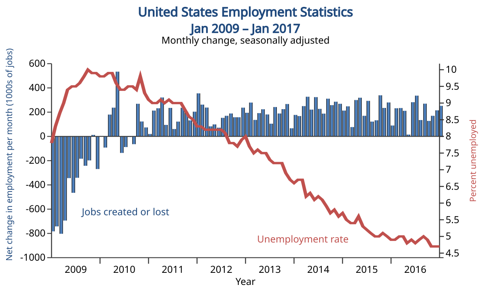

## Table of Contents

## What is the U.S. monthly unemployment rate?

The U.S. monthly unemployment rate is a number that tells us how many people are out of work and looking for a job each month. It is calculated by the U.S. Bureau of Labor Statistics. They look at how many people are not working but want to work, and then they compare that number to the total number of people in the workforce. This rate changes every month and can go up or down depending on what is happening in the economy.

In the most recent report, the unemployment rate was around 3.7%. This means that out of every 100 people who could be working, about 3 or 4 of them were looking for a job but couldn't find one. This number is important because it helps us understand how well the economy is doing. When the unemployment rate is low, it usually means more people have jobs and the economy is doing well. When it is high, it can mean that more people are struggling to find work.

## How is the unemployment rate calculated in the U.S.?

The unemployment rate in the U.S. is calculated by the U.S. Bureau of Labor Statistics. They use a big survey called the Current Population Survey to gather information about people's jobs. They ask a lot of people if they have a job, if they are looking for a job, or if they are not working and not looking for a job. From this information, they figure out how many people are in the labor force. The labor force is all the people who are working or looking for work.

To find the unemployment rate, they take the number of people who are unemployed and divide it by the total number of people in the labor force. Then, they multiply that number by 100 to turn it into a percentage. So, if 6 million people are unemployed and the labor force is 160 million people, the unemployment rate would be (6 million / 160 million) * 100, which equals 3.75%. This rate is released every month and helps us understand how many people are out of work and looking for jobs.

## What data sources are used to calculate the unemployment rate?

The unemployment rate in the U.S. is figured out using a big survey called the Current Population Survey. This survey is done by the U.S. Census Bureau for the Bureau of Labor Statistics. They ask around 60,000 households every month about their work situation. They want to know if people have a job, if they are looking for a job, or if they are not working and not looking for a job. This information helps them understand how many people are in the labor force, which is all the people who are working or looking for work.

From this survey, they count how many people are unemployed. To find the unemployment rate, they take the number of unemployed people and divide it by the total number of people in the labor force. Then, they multiply that number by 100 to turn it into a percentage. This rate is released every month and gives us a good idea of how many people are out of work and looking for jobs in the U.S.

## Who collects the data for the unemployment rate?

The data for the unemployment rate in the U.S. is collected by the U.S. Census Bureau. They do this through a big survey called the Current Population Survey. Every month, they ask about 60,000 households questions about their work situation. They want to know if people have a job, if they are looking for a job, or if they are not working and not looking for a job.

This information is then used by the Bureau of Labor Statistics to figure out the unemployment rate. They look at how many people are not working but want to work, and compare that number to the total number of people in the workforce. This helps them calculate the percentage of people who are unemployed and looking for work. The rate is released every month and gives us an idea of how the job market is doing in the U.S.

## What is the reference period for the unemployment rate calculation?

The reference period for the unemployment rate calculation in the U.S. is the week that includes the 12th day of the month. This means that when the U.S. Census Bureau asks people about their work situation, they are asking about what was happening during that specific week. This helps make sure that the data is consistent and up-to-date every month.

The information gathered during this reference period is used to calculate the unemployment rate. The Bureau of Labor Statistics takes the number of people who were unemployed during that week and divides it by the total number of people in the labor force. They then multiply this number by 100 to get the unemployment rate as a percentage. This rate is released to the public every month, giving us a snapshot of the job market's health.

## How does the U.S. define 'unemployed' for the purpose of calculating the unemployment rate?

In the U.S., someone is considered 'unemployed' if they do not have a job, have actively looked for work in the past four weeks, and are currently available to work. This definition is important because it helps the government figure out how many people are out of work and looking for a job. The U.S. Census Bureau asks people about their work situation during a specific week each month, and if they meet these three conditions, they are counted as unemployed.

The Bureau of Labor Statistics uses this information to calculate the unemployment rate. They take the number of people who are unemployed and divide it by the total number of people in the labor force, which includes everyone who is working or looking for work. This gives them a percentage that shows how many people are out of work and looking for jobs. This rate is released every month and helps us understand how the job market is doing.

## What is the labor force participation rate and how does it relate to the unemployment rate?

The labor force participation rate is the percentage of people who are either working or looking for work out of the total population that could be working. It tells us how many people are part of the labor force. If you are working or looking for a job, you are counted in the labor force. If you are not working and not looking for a job, you are not counted in the labor force.

The labor force participation rate is important because it helps us understand the unemployment rate better. The unemployment rate is the percentage of people in the labor force who are not working but are looking for a job. If the labor force participation rate goes down, it means fewer people are working or looking for work. This can make the unemployment rate look lower, even if the same number of people are out of work, because the total number of people in the labor force is smaller. So, looking at both rates together gives us a clearer picture of the job market.

## How are seasonal adjustments applied to the unemployment rate data?

Seasonal adjustments are used to make the unemployment rate data more accurate by taking out changes that happen every year at the same time. For example, more people might look for jobs after the holidays or during the summer. These regular changes can make the unemployment rate go up or down in a way that doesn't really show what's happening in the economy. By making seasonal adjustments, the Bureau of Labor Statistics can see the true trends in the job market without these yearly patterns getting in the way.

The Bureau of Labor Statistics uses special math formulas to make these adjustments. They look at unemployment data from many years to find out what the usual changes are during different times of the year. Then, they take these usual changes out of the current month's data. This way, they can see if the unemployment rate is really going up or down because of the economy, not just because it's a certain time of year. These adjusted numbers are what you usually see reported in the news and used by people who study the economy.

## What are the limitations and potential biases in the unemployment rate calculation?

The unemployment rate can have some limitations and biases that make it not always show the full picture of the job market. One big problem is that it only counts people who are looking for work as unemployed. If someone gives up looking for a job because they can't find one, they are not counted as unemployed anymore. This can make the unemployment rate look lower than it really is. Also, the unemployment rate doesn't tell us about people who are working part-time but want full-time jobs. These people are counted as employed, even if they are not happy with their job situation.

Another limitation is that the unemployment rate can be affected by who is included in the survey. The Current Population Survey only asks about 60,000 households, which is a small part of the whole country. If these households don't represent the whole population well, the unemployment rate might not be accurate. For example, if more people from one area or group are surveyed than others, it could change the results. Seasonal adjustments also try to take out yearly changes, but they might not always get it right, which can add more bias to the numbers.

Understanding these limitations is important because it helps us see that the unemployment rate is just one way to look at the job market. Other measures, like the labor force participation rate or underemployment rate, can give us a more complete picture. By looking at all these numbers together, we can get a better idea of how the economy is doing and how many people are really struggling to find good jobs.

## How does the U.S. unemployment rate compare to other economic indicators?

The U.S. unemployment rate is just one way to see how the economy is doing. It tells us how many people are out of work and looking for jobs, but it doesn't tell the whole story. Other economic indicators like the labor force participation rate, which shows how many people are working or looking for work, can give us a different view. If the labor force participation rate goes down, it might mean fewer people are looking for work, which can make the unemployment rate look better even if the same number of people are out of work. Also, the underemployment rate, which counts people who are working part-time but want full-time jobs, can show us that more people might be struggling than the unemployment rate alone suggests.

Another important indicator is the Gross Domestic Product (GDP), which measures the total value of all goods and services produced in the country. When the GDP is growing, it often means more jobs are being created, which can lead to a lower unemployment rate. But if the GDP is not growing or is shrinking, it might mean fewer jobs and a higher unemployment rate. The Consumer Price Index (CPI), which tracks the cost of living, can also affect the unemployment rate. If prices go up a lot, people might need to work more hours or find better jobs to keep up, which can change how we see the unemployment rate. By looking at all these indicators together, we get a better idea of the economy's health and how it impacts people's lives.

## What advanced statistical methods are used to refine unemployment rate estimates?

To make the unemployment rate more accurate, the Bureau of Labor Statistics uses a method called "model-based estimation." This means they use math models to guess the unemployment rate for smaller groups of people, like different states or types of workers. These models look at past data and current data to make better guesses. They also use something called "small area estimation," which helps them figure out the unemployment rate for areas that are not big enough to be well-represented in the main survey. This helps give a more detailed picture of unemployment across the country.

Another way they refine the unemployment rate is by using "time series analysis." This method looks at how the unemployment rate changes over time and tries to take out any patterns that happen every year, like more people looking for jobs after the holidays. By doing this, they can see the real changes in the job market without these yearly patterns getting in the way. They also use "smoothing techniques" to make the data less bumpy and more steady, which helps show clearer trends in the unemployment rate. All these methods together help make the unemployment rate numbers more reliable and useful for understanding the economy.

## How can one access historical data and forecasts of the U.S. unemployment rate?

To access historical data on the U.S. unemployment rate, you can visit the website of the U.S. Bureau of Labor Statistics. They have a section called "Databases, Tables & Calculators by Subject" where you can find the unemployment rate going back many years. You can choose the time period you want and download the data in different formats like Excel or PDF. This data is updated every month, so it's a good place to get the most recent numbers too. Libraries and universities might also have access to economic databases like FRED (Federal Reserve Economic Data), which is run by the St. Louis Fed and also has historical unemployment data.

For forecasts of the U.S. unemployment rate, you can look at reports from economic research organizations and government agencies. The Congressional Budget Office (CBO) and the Federal Reserve often publish forecasts about the future of the economy, including the unemployment rate. Private companies like Moody's Analytics and the Conference Board also provide forecasts that you can find on their websites or through news articles. These forecasts use different models and data to predict where the unemployment rate might be heading, but remember, they are just guesses and can change as new information comes in.

## What is the understanding of the U.S. Unemployment Rate?

The U.S. Bureau of Labor Statistics (BLS) calculates the unemployment rate primarily through the Current Population Survey (CPS), a monthly survey of about 60,000 households. This survey collects data on the labor force status, demographics, and other characteristics of the civilian noninstitutional population aged 16 years and older. The unemployment rate is represented as a percentage and is calculated using the formula:

$$
\text{Unemployment Rate} = \left( \frac{\text{Number of Unemployed Persons}}{\text{Labor Force}} \right) \times 100
$$

Understanding the types of unemployment is integral to comprehensively analyzing the labor market. Frictional unemployment occurs when individuals are temporarily between jobs or are entering the labor market for the first time. It is often considered a reflection of the natural job search process. Cyclical unemployment is directly related to economic downturns and fluctuations in the business cycle, where reduced demand for goods and services leads to layoffs. Structural unemployment arises from mismatches between workers' skills and the skills demanded by employers, often exacerbated by technological advancements and shifts in industries. Institutional unemployment is less commonly discussed but pertains to cases where institutional factors, such as government policies or labor market regulations, affect employment levels.

Despite the precise methodology used in determining unemployment rates, critics argue that official [statistics](/wiki/bayesian-statistics) may not convey the full extent of labor market challenges. One significant point of contention is the exclusion of discouraged workers—those who have stopped searching for work due to the perception that no jobs are available for them—from the labor force. Consequently, alternative measures like the U-4, U-5, and U-6 metrics are often used to provide a broader picture. For instance, the U-6 unemployment rate includes marginally attached workers (including discouraged workers) and those employed part-time for economic reasons, offering a more inclusive view of underemployment and labor market slack.

## References & Further Reading

[1]: Bureau of Labor Statistics. ["How the Government Measures Unemployment."](https://www.bls.gov/cps/cps_htgm.htm)

[2]: Bodie, Z., Kane, A., & Marcus, A. J. (2014). ["Investments"](https://www.mheducation.com/highered/product/Investments-Bodie.html). McGraw-Hill Education.

[3]: Cartea, Á., Jaimungal, S., & Penalva, J. (2015). ["Algorithmic and High-Frequency Trading"](https://assets.cambridge.org/97811070/91146/frontmatter/9781107091146_frontmatter.pdf). Cambridge University Press.

[4]: Piketty, T. (2014). ["Capital in the Twenty-First Century"](https://www.jstor.org/stable/j.ctt6wpqbc). Harvard University Press.

[5]: Engle, R. F., & Russell, J. R. (2010). ["The Econometrics of Ultra-High-Frequency Data."](https://www.jstor.org/stable/2999473) Econometric Society Monographs.