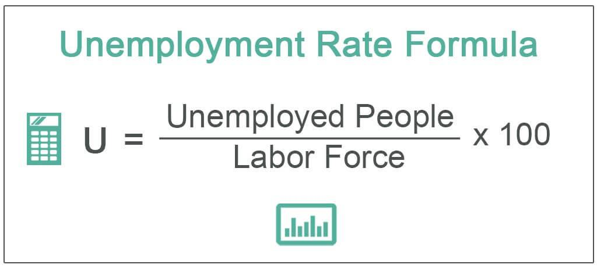

The unemployment rate is a pivotal economic indicator that provides insights into the labor market's health and, by extension, the overall economic climate. A low unemployment rate generally signals a robust economy with strong job creation, which often results in heightened investor confidence and increased consumer spending. Conversely, high unemployment can indicate economic distress, prompting caution among investors and impacting consumer behavior negatively. These fluctuations in consumer confidence and investor sentiment underscore the significance of unemployment data in gauging economic stability and growth prospects.

Algorithmic trading, which involves the use of computer algorithms to execute trades at high speed and volume, increasingly relies on economic indicators like the unemployment rate to make informed trading decisions. These sophisticated trading systems incorporate labor statistics to anticipate market trends and adjust trading strategies swiftly. By analyzing patterns in unemployment data, algorithmic traders aim to predict market movements and optimize their trading outcomes. 



This article examines the intricate relationship between labor statistics, the U.S. economy, and their consequential influence on algorithmic trading. Through this exploration, we highlight how significant economic indicators shape trading strategies and affect financial markets.

## Table of Contents

## Understanding U.S. Unemployment Rate

The U.S. Bureau of Labor Statistics (BLS) calculates the unemployment rate primarily through the Current Population Survey (CPS), a monthly survey of about 60,000 households. This survey collects data on the labor force status, demographics, and other characteristics of the civilian noninstitutional population aged 16 years and older. The unemployment rate is represented as a percentage and is calculated using the formula:

$$
\text{Unemployment Rate} = \left( \frac{\text{Number of Unemployed Persons}}{\text{Labor Force}} \right) \times 100
$$

Understanding the types of unemployment is integral to comprehensively analyzing the labor market. Frictional unemployment occurs when individuals are temporarily between jobs or are entering the labor market for the first time. It is often considered a reflection of the natural job search process. Cyclical unemployment is directly related to economic downturns and fluctuations in the business cycle, where reduced demand for goods and services leads to layoffs. Structural unemployment arises from mismatches between workers' skills and the skills demanded by employers, often exacerbated by technological advancements and shifts in industries. Institutional unemployment is less commonly discussed but pertains to cases where institutional factors, such as government policies or labor market regulations, affect employment levels.

Despite the precise methodology used in determining unemployment rates, critics argue that official [statistics](/wiki/bayesian-statistics) may not convey the full extent of labor market challenges. One significant point of contention is the exclusion of discouraged workers—those who have stopped searching for work due to the perception that no jobs are available for them—from the labor force. Consequently, alternative measures like the U-4, U-5, and U-6 metrics are often used to provide a broader picture. For instance, the U-6 unemployment rate includes marginally attached workers (including discouraged workers) and those employed part-time for economic reasons, offering a more inclusive view of underemployment and labor market slack.

## Role of Unemployment in the U.S. Economy

The unemployment rate serves as a crucial economic indicator, acting as a barometer for the U.S. economy's overall health. Its inverse relationship with economic performance is well-documented; as unemployment declines, economic activity typically increases, resulting in enhanced consumer spending and bolstered investment. This relationship underscores the multifaceted role unemployment plays within the economic framework.

When unemployment rates are low, consumer confidence tends to rise significantly. This correlation occurs because a larger segment of the population is gainfully employed, thereby possessing increased disposable income. With heightened consumer confidence, there is a propensity for increased expenditure on goods and services, driving economic growth through the stimulation of demand. This uptick in consumer spending can lead to a virtuous cycle of economic expansion, where increased demand leads to higher production levels, further job creation, and enhanced economic stability.

Conversely, high unemployment levels can have detrimental effects on the economy. Extended periods of elevated unemployment result in reduced consumer spending as individuals and households adjust their expenditures to align with diminished income levels. This contraction in consumer activity can precipitate an economic slowdown, compelling businesses to scale back production and investment due to decreased demand. In such scenarios, government intervention often becomes necessary to revitalize the economy.

Monetary and fiscal policies are typically employed as mechanisms to counteract the adverse impacts of high unemployment. Monetary policy measures, such as reducing interest rates and increasing the money supply, aim to stimulate borrowing and investment, thereby encouraging economic activity. On the fiscal front, government spending can be increased, and taxes lowered, to directly inject capital into the economy and stimulate demand. These interventions are designed to mitigate the negative spiral of low consumer spending and investment associated with high unemployment, ultimately aiming to restore economic equilibrium.

Understanding the role of unemployment in the U.S. economy highlights the delicate balance required to maintain economic health and stability. By monitoring unemployment rates and implementing appropriate policy measures, governments can aim to sustain economic growth while ensuring the labor market remains robust and resilient.

## Impact of Labor Statistics on Financial Markets

Unemployment data plays a crucial role in shaping financial markets by affecting asset prices, including stocks, bonds, and currencies. The unemployment rate is a key economic indicator that reflects the health of the labor market, and as such, it has a direct correlation with economic performance and investor sentiment.

Market reactions to announcements of unemployment data are often immediate but can be unpredictable. These reactions depend on how the actual reported figures align with investors' expectations and other concurrent economic factors. Positive surprises, where unemployment figures are lower than expected, generally lead to a bullish market reaction as they suggest a stronger economy. Conversely, negative surprises can trigger bearish market movements as they raise concerns over economic slowdown.

Algorithmic trading strategies incorporate unemployment data to forecast market movements and adjust positions swiftly. By leveraging pre-programmed codes and quantitative models, [algorithmic trading](/wiki/algorithmic-trading) systems can process unemployment announcements and execute trades at high speed, often outperforming manual trading in terms of efficiency and reaction time.

One common method used in algorithmic trading is event-driven trading, where the algorithms are designed to respond to economic events, including unemployment announcements. These algorithms utilize sophisticated models that potentially integrate historical data, statistical relationships, and predictive analytics to determine the impact of unemployment changes on various asset classes.

For instance, the price adjustment in stock markets, often post-unemployment data release, can be modeled using regression analysis to understand the relationship between unemployment rates and stock index movements. Additionally, in the foreign exchange market, the unemployment rate can influence currency value; a lower unemployment rate in one country relative to others can lead to an appreciation of that country’s currency, as it is indicative of stronger economic prospects.

Algorithmic traders frequently face the challenge of accounting for market [volatility](/wiki/volatility-trading-strategies) following unemployment data releases. Volatility can be quantified using measures like the standard deviation of returns, and algorithmic strategies may employ volatility filters to adapt to these changes and manage risks effectively. 

Ultimately, the integration of unemployment data into algorithmic trading models requires not only a deep understanding of economic indicators but also the ability to anticipate and react to market expectations and responses dynamically. This process of continuously refining and adapting algorithms is crucial for leveraging the opportunities presented by labor market statistics in financial markets.

## Algorithmic Trading and Economic Indicators

Algorithmic trading utilizes sophisticated pre-programmed strategies and quantitative analysis to execute trades with a high degree of efficiency and speed. At the core of these strategies are economic indicators that serve as essential inputs, influencing the timing and execution of trades. Among these indicators, unemployment rates play a significant role, providing traders with critical insights into economic conditions and market sentiments.

Economic indicators such as unemployment rates offer valuable data points for trading algorithms. These indicators provide information about the health of the economy, guiding algorithmic systems in identifying favorable trading opportunities. A decline in unemployment rates generally signals economic expansion, potentially increasing consumer spending and business investments. Conversely, rising unemployment rates might indicate economic contraction, prompting caution among investors and traders.

Trading strategies incorporating unemployment data include news-based trading, statistical [arbitrage](/wiki/arbitrage), and sentiment analysis. News-based trading algorithms analyze and react in real-time to economic announcements and news headlines, including unemployment figures. These algorithms can adjust trading positions within milliseconds of data releases, capitalizing on short-term market movements.

Statistical arbitrage involves the use of statistical methods to identify pricing inefficiencies across assets, often relying on economic indicators like unemployment rates to provide context for these inefficiencies. For instance, discrepancies in stock valuations may emerge following an unexpected change in unemployment statistics, presenting opportunities for arbitrage.

Sentiment analysis algorithms assess market sentiment by processing vast amounts of textual data from news reports, social media, and other sources. When unemployment data is released, sentiment analysis tools gauge the market's perception of this information, helping to predict potential market reactions. By identifying shifts in sentiment, these algorithms fine-tune trading strategies to align with the prevailing mood.

Python can be utilized to illustrate a basic framework for integrating unemployment data into an algorithmic trading strategy:

```python
import pandas as pd
import numpy as np
from sklearn.linear_model import LinearRegression

# Sample unemployment data - replace with actual data source
unemployment_data = pd.DataFrame({
    'Date': pd.date_range(start='1/1/2020', periods=12, freq='M'),
    'Unemployment_Rate': [3.5, 3.6, 3.8, 4.0, 4.4, 13.3, 11.1, 10.2, 8.4, 7.8, 6.9, 6.7]
})

# Sample stock data - replace with actual data source
stock_data = pd.DataFrame({
    'Date': pd.date_range(start='1/1/2020', periods=12, freq='M'),
    'Stock_Price': [300, 305, 310, 320, 315, 290, 300, 310, 325, 330, 340, 350]
})

# Merge datasets on Date
data = pd.merge(unemployment_data, stock_data, on='Date')

# Prepare data for modeling
X = np.array(data['Unemployment_Rate']).reshape(-1, 1)
y = np.array(data['Stock_Price'])

# Linear regression model as a simple approach
model = LinearRegression()
model.fit(X, y)

# Predict stock prices based on unemployment rate
predicted_prices = model.predict(X)

# Output the prediction results
data['Predicted_Stock_Price'] = predicted_prices
print(data)
```

The code above provides an elementary example of how unemployment rates could be integrated into a predictive stock price model using a linear regression approach. Algorithmic trading systems would typically use more advanced models and large datasets for their analyses.

## Challenges in Using Unemployment Data for Algorithmic Trading

Accurate and timely data is crucial for algorithmic trading, as these systems depend on the precision and promptness of economic indicators such as the unemployment rate. Delays or inaccuracies in unemployment data can significantly affect trading outcomes, leading to potential losses as algorithms may act on outdated or incorrect information. This issue underscores the necessity of having access to real-time data feeds and ensuring that algorithms are updated to interpret data accurately.

Moreover, markets may react unpredictably to new unemployment data, presenting a challenge for algorithmic traders. The complexity of these reactions arises from the interplay of various factors, including investor sentiment, geopolitical events, and concurrent economic reports. Algorithms must be programmed to rapidly assess and respond to these variables, often requiring advanced [machine learning](/wiki/machine-learning) techniques to improve predictive accuracy and speed in decision-making.

In addition to technical challenges, algorithmic trading firms must navigate regulatory compliance, which can add complexities to their operations. Financial markets are subject to stringent regulations aimed at preventing market manipulation and ensuring fair trading practices. Algorithms must be designed to comply with these regulations, which vary across jurisdictions and can change frequently. Non-compliance may result in fines or trading restrictions, impacting the firm’s operations and reputation.

Intense competition is another significant hurdle in the algorithmic trading landscape. With numerous firms employing sophisticated algorithms to gain competitive advantages, maintaining a leading edge requires continuous innovation and optimization of trading strategies. This competition drives the need for constant enhancement of trading models to incorporate the latest data analysis techniques, machine learning advancements, and cutting-edge technology infrastructure.

In conclusion, while unemployment data is a vital input for algorithmic trading, several challenges must be addressed to effectively leverage this information. Accurate and timely data acquisition, the unpredictable nature of market reactions, regulatory compliance, and the highly competitive environment necessitate relentless innovation and meticulous design of trading algorithms to succeed in modern financial markets.

## Case Studies: Unemployment Impact on Algorithmic Trading

The 2008 Financial Crisis marked a period of significant market volatility predominantly driven by soaring unemployment rates and the collapse of major financial institutions. During this time, the unemployment rate in the United States surged from 5% in December 2007 to a peak of 10% in October 2009, according to the U.S. Bureau of Labor Statistics. This economic instability had a profound impact on financial markets, triggering substantial shifts in trading strategies. Algorithmic trading, which relies on computational methods to execute trades, experienced heightened volatility as market [liquidity](/wiki/liquidity-risk-premium) fluctuated. Algorithmic systems, designed to exploit market inefficiencies, faced challenges adapting to sudden changes, such as rapid shifts in asset correlations and increased bid-ask spreads. The models used required constant recalibration to accommodate the dynamic economic landscape, emphasizing the necessity for more complex algorithms capable of real-time data analysis and decision-making.

During the COVID-19 pandemic, financial markets once again faced unprecedented unemployment spikes, causing substantial impacts on trading systems. In April 2020, the U.S. unemployment rate soared to 14.8%, the highest since the Great Depression, due to mass layoffs and business closures. This sudden surge in unemployment created immediate challenges for algorithmic traders. For example, volatility indexes such as the VIX spiked, and liquidity once more became a significant concern, as it did during the 2008 crisis. Algorithmic trading systems had to swiftly adapt to the rapidly evolving situation, incorporating real-time unemployment data and other economic indicators to recalibrate their strategies. These systems relied on techniques such as sentiment analysis to gauge market sentiment and adjust their algorithms accordingly. Moreover, machine learning models enhanced adaptability by ingesting extensive datasets to provide projections and identify emerging patterns in financial markets.

Both the 2008 Financial Crisis and the COVID-19 pandemic underscored the importance of integrating comprehensive economic data analysis within algorithmic trading frameworks. They highlighted the critical need for robust, adaptive systems capable of responding to labor market changes to optimize trading strategies and mitigate risks associated with high unemployment periods.

## Conclusion

The unemployment rate serves as a crucial economic indicator that significantly impacts financial markets and influences trading strategies. Its role is underscored by the need for algorithmic trading firms to constantly adapt to shifts in unemployment data, thereby maintaining a competitive edge in an ever-evolving market. Given the complexities and nuances of labor statistics, a comprehensive understanding allows traders to craft more resilient and effective trading strategies that leverage economic trends.

To maximize the utility of unemployment data, algorithmic trading systems integrate quantitative analysis with economic indicators. This involves incorporating various data inputs, including those related to labor statistics, into algorithms designed to execute trades with precision. The dynamic nature of the unemployment rate means that these algorithms must be flexible and adaptive, frequently updated to reflect real-time economic conditions and forecasts.

For traders and firms, a deep understanding of the unemployment rate goes beyond mere data analysis; it involves interpreting shifts in the labor market and anticipating potential impacts on asset prices. This understanding can help identify opportunities and mitigate risks associated with economic fluctuations.

Ultimately, by interpreting the numerous factors that contribute to unemployment trends, such as cyclical, structural, and frictional unemployment, traders can refine their strategies. This precision ensures they capitalize on economic movements, aligning trades with anticipated shifts in market sentiment.

Thus, as the global economy continues to evolve, the skills to interpret and utilize labor statistics remain essential. This knowledge supports the development of innovative and profitable trading methodologies, ensuring that traders stay ahead in a competitive landscape where market dynamics are closely tied to economic health indicators like the unemployment rate.

## References & Further Reading

[1]: Bureau of Labor Statistics. ["How the Government Measures Unemployment."](https://www.bls.gov/cps/cps_htgm.htm)

[2]: Bodie, Z., Kane, A., & Marcus, A. J. (2014). ["Investments"](https://www.mheducation.com/highered/product/Investments-Bodie.html). McGraw-Hill Education.

[3]: Cartea, Á., Jaimungal, S., & Penalva, J. (2015). ["Algorithmic and High-Frequency Trading"](https://assets.cambridge.org/97811070/91146/frontmatter/9781107091146_frontmatter.pdf). Cambridge University Press.

[4]: Piketty, T. (2014). ["Capital in the Twenty-First Century"](https://www.jstor.org/stable/j.ctt6wpqbc). Harvard University Press.

[5]: Engle, R. F., & Russell, J. R. (2010). ["The Econometrics of Ultra-High-Frequency Data."](https://www.jstor.org/stable/2999473) Econometric Society Monographs.