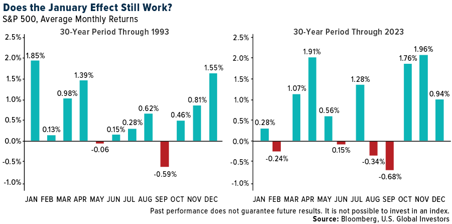
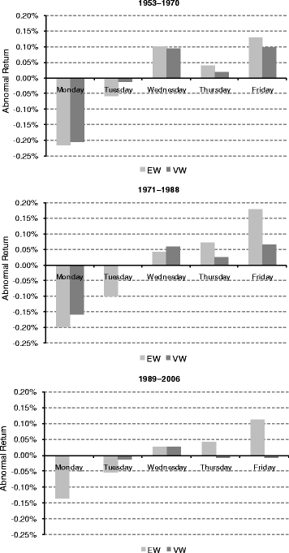
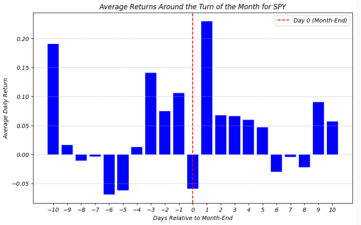
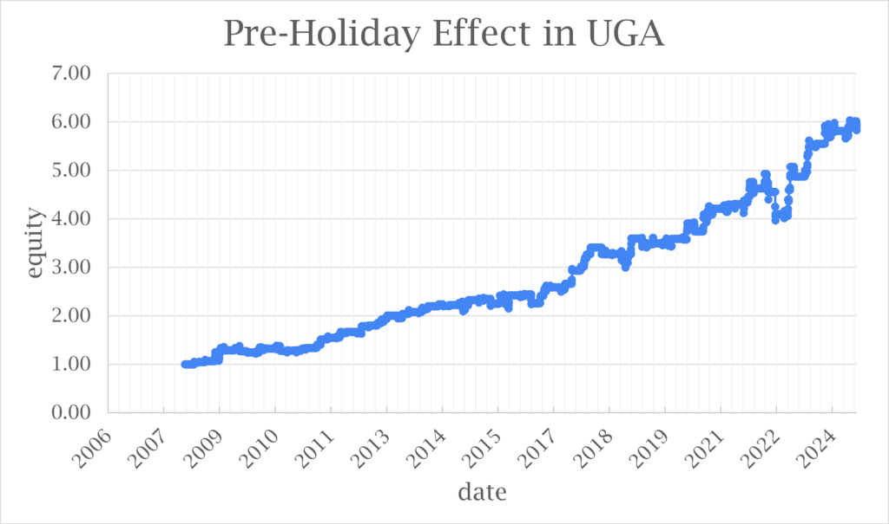
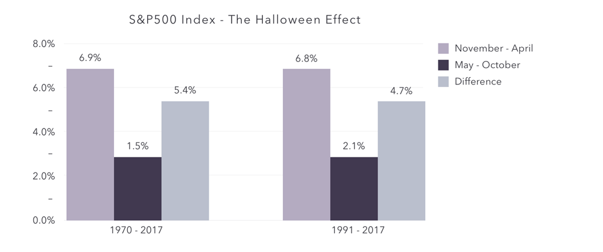

**Calendar effects** (or calendar anomalies) are systematic patterns in asset returns that coincide with specific times on the calendar – such as particular days of the week, months of the year, or holiday periods – in apparent violation of pure randomness or the Efficient Market Hypothesis (EMH). Researchers and quantitative analysts have long studied these anomalies, noting for example that stock returns tend to be abnormally low on Mondays and unusually high around turn-of-the-month days or certain holidays. The existence of calendar effects suggests that markets may not be perfectly efficient, as predictable seasonal patterns could, in theory, be exploited for profit. This report provides a technical deep-dive into the major calendar effects, their historical rationale and evidence, and how investors might exploit these patterns in practice. We also discuss the statistical techniques used to identify such effects and examine whether these strategies have held up in recent years.


## Table of Contents

## Major Calendar Anomalies and Their Evidence

Several calendar-based market anomalies have been documented in equities and other asset classes. Below we define the most prominent ones – including the January Effect, the Day-of-the-Week effect, the Turn-of-the-Month effect, the Holiday effect, and the “Sell in May” (Halloween) effect – and summarize the academic evidence and proposed explanations for each.

### January Effect (Turn-of-the-Year Effect)

The **January Effect** is the tendency for stock returns, especially in small-cap stocks, to be higher in January than in any other month. This pattern was first noted by Sidney Wachtel in the 1940s and later documented rigorously by Rozeff and Kinney (1976). In their study of U.S. stocks from 1904 to 1974, Rozeff and Kinney found the average return in January was about 3.5%, compared to only 0.5% in other months. Subsequent research confirmed that this effect was most pronounced in smaller-capitalization stocks, which often fell in price during December and rebounded strongly in January. The leading explanation is **tax-loss selling** and portfolio rebalancing: investors sell losing stocks in December to realize capital losses for tax purposes, putting downward pressure on those stocks, and then reinvest in the new year, causing a rebound in January. Behavioral factors like new-year optimism and the investing of year-end bonuses in January may also contribute.



The January Effect has been documented across many markets and time periods. Early empirical work by Keim (1983) showed that the excess returns of small firms occur almost entirely in January. International studies have found similar seasonality in other countries, though the magnitude varies depending on tax regimes and fiscal year-ends. Notably, the effect was historically strong in the mid-twentieth century; however, more recent analyses indicate it has weakened. As markets became aware of the anomaly, much of the predictable outperformance in January was arbitraged away or has shifted to earlier (some argue that small-cap outperformance now often occurs in late December as investors anticipate the January rally). A 2003 international study observed that **end-of-year effects remain significant primarily in small-cap indices**, and that calendar effects in large-cap stocks have **diminished since the late 1980s**. Indeed, after 1987 the classic January spike became far less reliable. Figure 1 illustrates this shift: from 1986–2017, January was no longer the top-performing month in U.S. or U.K. markets in terms of frequency of positive returns, in contrast to earlier decades when January dominated.

In theory, an investor could try to capture the January Effect by **buying stocks (especially small-cap or beaten-down stocks) in late December and selling by the end of January** once prices have presumably risen. An actionable strategy might involve shifting into a small-cap index (or a basket of prior-year losers) just before year-end, then rotating back out in late January. For example, pseudocode for a simple strategy could be:

```python
# Pseudocode: January Effect Strategy
if current_date == last_trading_day_of_December:
    buy_portfolio(target="SmallCapIndex", allocation=100%)
elif current_date == last_trading_day_of_January:
    sell_portfolio(target="SmallCapIndex")
```

Real-world implementations need to account for trading costs and risks – the effect does not guarantee a profit every year, and some years January can underperform. Nonetheless, historically this strategy added significant alpha in certain eras. Investors can backtest the January effect using historical data (e.g. the **Stocks-Daily-Price** or **Indices-Daily-Price** datasets on PapersWithBacktest) by comparing January returns to other months. Recent performance suggests caution: because the anomaly is now well-known, its **Sharpe ratio has diminished**. Still, niche applications remain – for instance, **adding a “January barometer” filter** to momentum strategies (avoiding momentum trades in January, when momentum profits often mean-revert) has been explored in quantitative strategies.

### Day-of-the-Week Effect (Weekend/Monday Effect)

One of the oldest observed calendar anomalies is the **Day-of-the-Week effect**, sometimes called the **Weekend Effect**. This effect refers to stocks tending to underperform on Mondays and outperform on certain other days (often Friday). Frank Cross (1973) first noted that **Mondays showed significantly lower average returns** than other weekdays, with many markets even exhibiting negative average returns on Monday. This was corroborated by later studies (e.g. French, 1980) that found **U.S. stock returns were on average negative on Mondays** but positive on the other four days of the week. In contrast, **Fridays** often showed above-average gains, leading to a weekend gap. A recent meta-analysis (Grebe and Schiereck, 2024) confirms that, across many studies, **Mondays (and to a lesser extent Tuesdays) tend to have lower returns, while Wednesdays and Fridays have higher returns on average**. Interestingly, that research found an unexpectedly strong mid-week effect (Wednesday outperformance) in addition to the more familiar Monday dip.



Several hypotheses attempt to explain the day-of-week effect. One hypothesis involves **investor psychology and information timing**: bad news is often released after market close on Fridays (since companies or analysts may prefer to reveal unfavorable news heading into a weekend), so by Monday’s open the accumulated negative news and pessimism lead to selling pressure. Additionally, investors might be more risk-averse or pessimistic on Mondays as the week begins, versus a more optimistic sentiment on Fridays ahead of the weekend. Another explanation is **short-selling and settlement** conventions: historically, short sellers would initiate positions late in the week and close them after the weekend, contributing to Monday price drops. However, many of these explanations are still debated.

The Monday effect has been observed in numerous equity markets worldwide and even in other asset classes. However, the magnitude and reliability of the pattern have varied over time. Studies in the 1980s found it quite robust; yet by the 1990s and 2000s the Monday effect had become less consistent. The 2024 meta-analysis noted that the effect was **most pronounced in the 1980s–1990s data** and has weakened in more recent decades. Moreover, differences across exchanges and countries have narrowed – the effect appears in many markets, suggesting a common behavioral or institutional driver, though some outlier markets (e.g. certain Asian markets) showed divergent patterns. As of today, while there is still evidence that average Monday returns are slightly lower (or Friday returns higher) in some indices, the **statistical significance is much reduced** after accounting for volatility and outliers. In fact, one study finds that outliers (a few big Monday crashes or big Friday rallies) can account for a large portion of the average difference, meaning the day-of-week effect may not be as dependable as simpler analyses suggest.

Traders have explored strategies like **avoiding long positions over the weekend** (to sidestep the Monday dip) or conversely, **buying on Monday afternoon to capture a “bounce” into the mid-week**. A straightforward strategy could be: *stay out of the market (or short the market) on Fridays at close, and buy in on Monday at the day’s low* if one expects Monday to be consistently weak and subsequent days to recover. Another approach is to trade an index only on specific days – e.g., hold an index fund Tuesday through Thursday, but close positions before the weekend. Using daily index data (such as the S\&P 500 from an **Indices-Daily-Price** dataset), one can test such rules by computing average returns for each weekday and running a **dummy-variable regression** of daily returns on weekday indicators. For example, a regression model $r_t = \alpha + \beta_1 D_{Mon} + \beta_2 D_{Tue} + ... + \beta_4 D_{Thu} + \varepsilon_t$ can estimate the weekday effects (with Friday as the baseline). If $\beta_1$ is significantly negative, that confirms Monday underperformance. In practice, transaction costs and overnight gap risk are critical. The profit from skipping Mondays might be small, so exploiting it requires low trading frictions. Modern high-frequency traders also arbitrage away intra-week patterns quickly. Overall, while the Monday effect still intrigues academics, **its usefulness as a trading signal today is questionable** – it may serve more as a caution (e.g. be mindful of weekend news risk) than a clear-cut trading rule.

### Turn-of-the-Month Effect

The **Turn-of-the-Month (TOTM) effect** refers to stocks showing disproportionately high returns in the few days surrounding the change of the month. Specifically, research defines the turn-of-the-month as the last trading day of a month and the first 3 (or first few) trading days of the next month. Remarkably, these few days account for a large portion of total monthly equity gains. An influential study by Lakonishok and Smidt (1988) first identified this effect in the Dow Jones Industrial Average over 1897–1986. Subsequent work by Xu and McConnell (2006) extended the analysis through 2005 and found that **essentially all of the excess market return from 1897–2005 was earned during the four-day turn-of-the-month interval**. In other words, on average, if you were invested only at the turn of each month and in cash the rest of the time, you would capture nearly the full equity risk premium over that 109-year span! This is a profound anomaly challenging traditional asset pricing, since it implies **zero reward for market risk during the other \~16 trading days** of the month.



The TOTM effect has proven to be *consistently present across eras and markets*. Studies find it in U.S. data for large-cap and small-cap stocks alike. Interestingly, the effect **is not confined to small or value stocks**, nor to any particular month transition (it’s not just a January effect in disguise – turn-of-month outperformance occurs throughout the year, not only at year-end). It’s also observed in international markets, suggesting a global behavioral or institutional cause. Various explanations have been proposed. One practical reason is **monthly cash flows**: many institutional investors (funds, pension plans) receive contributions or invest inflows at month-end/beginning, and employees’ retirement plan contributions often get invested around the turn of the month. This wave of automatic buying could drive prices up during those days. Some have also pointed to **window dressing and portfolio rebalancing**, where fund managers buy stocks at month-end to beautify their monthly reports, thus boosting prices. Whatever the cause, the persistence of TOTM returns is well documented and, unlike some anomalies, did not completely disappear after discovery. In fact, backtests updated to the present show the effect *still contributes significant risk-adjusted returns*. For example, a strategy that only holds the S\&P 500 during turn-of-the-month days from 1927–2025 yields a Sharpe ratio around 0.6 (annualized return \~4.7% with much lower volatility than buy-and-hold). This suggests that while arbitrage may have reduced the magnitude somewhat, a non-trivial edge remains even in recent decades.

A practical strategy to exploit this anomaly is quite direct: **be long equities during the turn-of-the-month period and reduce exposure during the mid-month**. For instance, an algorithm could buy an index (or a basket of liquid stocks) at the close of the last trading day of each month and sell at the close after the first three trading days of the new month. The code logic might resemble:

```python
# Pseudocode: Turn-of-the-Month Strategy
for each month:
    enter_date = last_trading_day_of_month(month)
    exit_date = third_trading_day_of_month(month+1)
    trade_equity(index="S&P500", action="BUY", date=enter_date)
    trade_equity(index="S&P500", action="SELL", date=exit_date)
```

One can backtest this using historical index data (e.g., the S\&P 500 from 1928–present, available via the **Indices-Daily-Price** dataset). Indeed, PapersWithBacktest provides a ready strategy example and backtest results for the turn-of-the-month effect, confirming its Sharpe ratio and drawdowns. Key considerations for implementation are transaction costs (though only two trades per month are required) and short-term tax implications if done with individual stocks or non-tax-sheltered accounts. Because this strategy is straightforward, it is accessible even to intermediate investors (for example, one could hold an S\&P 500 ETF around each month turn). The consistency of the TOTM effect makes it one of the more **actionable calendar anomalies**, but investors should stay vigilant: any sudden changes in institutional investment timing or fund flow patterns (or widespread adoption of the strategy) could erode the edge.

### Holiday Effect (Pre-Holiday Returns)

The **Holiday Effect** is the observed tendency for stock markets to exhibit abnormally high returns on the last trading day before a major holiday. In the U.S., for example, the trading day before holidays like Thanksgiving, Christmas, or Independence Day has historically shown significantly higher average returns (and a higher probability of a gain) than an ordinary trading day. One study found that **pre-holiday trading days generated mean returns 9 to 14 times larger than the average of other days**, a striking outperformance. Academic research by Kim and Park (1994) confirmed **abnormally high returns on the day before holidays** across all major U.S. exchanges (NYSE, AMEX, NASDAQ). They also found the effect present in the U.K. and Japan – notably, each country’s market had a holiday effect around its *own* holidays, even when dates did not align, implying the cause isn’t global macroeconomic events but rather local calendar psychology or microstructure. Unlike some other patterns, the holiday effect did **not** show a bias toward small-cap stocks – it was evident across large and small stocks alike. This suggests the effect might arise from something like **pre-holiday optimism or relaxed investor sentiment** that broadly lifts the market, rather than a risky-arbitrage exploited only in certain stocks.



Beyond the U.S., many international markets have demonstrated a pre-holiday rally effect. For instance, studies have noted the phenomenon in Canada, Australia, and across Europe. However, like other anomalies, it may have weakened over time. Some recent research indicates the holiday effect has **declined in magnitude in the past few decades** in various countries. This could be due to increased sophistication (traders arbitraging the predictable pre-holiday rise or front-running it) or simply a byproduct of fewer trading hours (some pre-holiday sessions are shortened, which historically showed positive drift). Additionally, alternative explanations have been proposed: one study ties it to **investor sentiment cycles**, noting that measured sentiment tends to be higher just before holidays when investors are in good moods. This aligns with behavioral finance theories – investors may feel optimistic and risk-seeking before festive occasions, bidding up prices.

A trader could attempt to capture the holiday effect by **going long shortly before holiday closes**. For example, one strategy might be to buy an index or a broad ETF at the close of the day *before* the holiday (or early in that session) and sell on the first trading day after the holiday, hoping to pocket the low-risk gain that often occurs into the holiday. However, the biggest gains typically occur *on* the last session before the market closes for the holiday, so another approach is to buy at the prior day’s close and sell just before the holiday early close. Pseudocode for a simplified approach could look like:

```python
# Pseudocode: Pre-Holiday Rally Strategy
for each market_holiday in calendar:
    holiday_eve = last_trading_day_before(market_holiday)
    buy(index_or_stock, on=holiday_eve_open)
    sell(index_or_stock, on=holiday_eve_close)
```

One can identify the major holidays and test if buying at the open and selling at the close on those dates yields excess returns on average. Using long historical daily data (e.g., from **Indices-Daily-Price**), this strategy can be backtested. In practice, the pre-holiday effect is small in absolute percentage terms (though large relative to an average daily return). Thus, transaction costs and timing are critical – the edge might be erased if trading isn’t precise. Moreover, because not every holiday rally occurs (there are instances of pre-holiday declines), risk management is needed; some traders limit this strategy to the most historically reliable holidays (e.g., perhaps Thanksgiving and Christmas in U.S. markets). Overall, the holiday effect exemplifies how even **non-economic factors like the calendar can momentarily shift investor behavior**, and nimble strategies might extract a modest profit from that shift.

### “Sell in May and Go Away” (Halloween Effect)

The phrase **“Sell in May and Go Away”** refers to an investing adage that the market’s strongest gains tend to occur in the winter months (roughly November through April), whereas the summer period (May through October) often yields lower returns. In academic terms, this is known as the **Halloween Effect**: the hypothesis that you can beat the market by investing only during winter months and moving to cash (or defensive assets) during the summer. In a seminal paper, Bouman and Jacobsen (2002) examined this effect across multiple countries and found it surprisingly pervasive. They reported that stock returns from November to April were significantly higher than from May to October in 36 out of 37 markets they studied – a pattern **not easily attributable to chance**. Updated research by Jacobsen and Zhang extended the analysis to **108 stock markets over centuries of data** and confirmed that the winter vs. summer return gap is real and large. On average, their study found the November–April period outperformed the May–Oct period by **4.5% per year** (in terms of average returns). Moreover, contrary to many anomalies that faded, they found the Halloween effect has persisted and even **increased in strength in recent decades**. Over the past 50 years in their sample, the winter-summer return difference widened to about 6.2% on average. This poses a puzzle: if “sell in May” is so widely known, why hasn’t arbitrage eliminated it? Possible explanations include **vacation cycles** (summer months see lower trading volumes and potentially less buying interest, as investors and traders take holidays) and **risk preferences** (some theorize that higher macro risk in summer – e.g., fiscal year budget debates, etc. – commands a premium, depressing equity prices).



The Halloween effect is observed in many major indices. For example, in the U.S., it has been noted that historically a large portion of the Dow Jones Industrial Average’s long-term gains came from November–April periods, with near-zero net return in May–Oct over many decades. In European markets, similar patterns are documented. Importantly, Bouman and Jacobsen found the effect could not be explained by small-sample bias or data mining – using over 300 years of U.K. stock data, the pattern still held, refuting the idea that it’s a recent fluke. They also checked whether it was driven by one or two outlier events (e.g., an October 1987 crash skewing the result) but found the effect broad-based. Some studies noted that the effect is *not particularly sector-specific* – it tends to appear in broad indices rather than being concentrated in, say, cyclicals or defensives. That suggests a common factor at play, potentially investor behavior or conventions that affect all stocks. However, there is debate: some analysts argue improved market liquidity and global arbitrage might have started to weaken this effect in the 2010s, so continuous monitoring is needed.

The strategy is straightforward: **rotate out of equities on May 1 and back into equities on November 1** (or late October). A trader following this rule is effectively holding stocks for six months of the year (Nov–Apr) and staying in cash or bonds for the other six months (May–Oct). Historically, this timing strategy has delivered equity-like returns with much lower drawdowns in many markets. For instance, an investor who put \$100 into the S\&P 500 only during each November–April and sat out May–Oct would have outperformed a buy-and-hold investor in terms of cumulative return over many decades, with shallower losses in bear markets. To implement, one can simply schedule two trades a year. A pseudo-code outline:

```python
# Pseudocode: Sell in May (Halloween) Strategy
if today == last_trading_day_of_April:
    sell_all_equities()
elif today == last_trading_day_of_October:
    buy_equities(target_allocation=100%)
```

Of course, one must consider transaction costs and tax impacts of semiannual trading. But since only two trades per year are made, costs are minimal compared to the potential benefit. The strategy can be enhanced by selecting the best asset to hold in the “off” months – some use bonds or other alternatives rather than pure cash to earn some yield from May–Oct. Notably, **PapersWithBacktest provides dataset resources** (e.g., monthly returns data derived from daily prices) to test this strategy on different indices. Backtests have shown that even as of recent years, a Sell-in-May strategy often outperformed the market on a risk-adjusted basis. However, one should be cautious: a handful of strong summers or weak winters can cause underperformance over shorter horizons. Thus, while the odds historically favor the Halloween indicator (Jacobsen and Zhang found it beat the market in >80% of 5-year subperiods studied), it’s not foolproof. As always with anomalies, widespread adoption could reduce its efficacy.

### Other Notable Calendar Effects

In addition to the major anomalies above, researchers have identified several other calendar-related patterns:

* **Santa Claus Rally:** This is the tendency for stocks to rise during the last week of December and first two trading days of January. It’s related to the year-end optimism and new-year positioning, and is sometimes considered a small subset of the broader January/turn-of-year effect. Traders sometimes go long in late December to capture this mini-rally.

* **October Effect:** A famous market superstition (not an “effect” in the statistical sense) is that October is a bad month for stocks due to historical crashes (1929 and 1987 both occurred in October). In reality, October’s average returns are not consistently poor (in fact, October has often been positive overall). However, volatility in October has historically been higher, and it is true that investors approach October with caution. This illustrates the difference between a **perceived anomaly** and a statistically verified one – the “October effect” is mostly psychological.

* **Presidential Cycle Effect:** In the U.S., some analysts note that the third year of a presidential term (the year before an election) tends to have above-average stock returns, possibly due to business-friendly policies or stimulus ahead of elections. While some data have shown higher returns in pre-election years, the sample size (given a 4-year cycle) is small, and recent cycles have not always followed the pattern. It remains an area of interest but with less consensus than the calendar effects discussed earlier.

Each of these is a piece of the broader theme: **seasonality in markets**. Some are backed by strong data, others are more anecdotal. For serious quantitative strategy development, the focus is usually on those with robust evidence (like turn-of-the-month or Halloween effect) rather than one-off quirks.

## Identifying Calendar Effects: Statistical Techniques

To rigorously determine whether a calendar effect is real and significant, researchers use a variety of statistical techniques:

* **Mean Return Comparisons:** A simple approach is to calculate the average return during the supposed anomaly periods versus the rest of the time. For example, average daily return on Mondays vs. all other days, or average January return vs. returns of other months. A *t-test* can assess if the difference in means is statistically significant. Early studies like Rozeff & Kinney (1976) used such comparisons to show January’s mean return was significantly higher than other months.

* **Dummy Variable Regressions:** As mentioned for the day-of-week effect, regression models with dummy variables for each time period allow testing the significance of each calendar indicator while controlling for overall market drift. For instance, a regression of daily returns on Monday, Tuesday, … Friday dummies (with one omitted) will yield coefficients that tell us the average excess return for each day-of-week compared to baseline. Similarly, one can include a January dummy in a regression of monthly returns to test the January effect, or dummies for turn-of-month days in a regression of daily returns. If the dummy’s coefficient is statistically different from zero (using standard errors or a bootstrap), that indicates an anomaly.

* **ANOVA / Seasonality Tests:** Analysis of variance can check if variability in returns is significantly explained by the calendar grouping (e.g., between-month variance vs within-month variance).

* **Non-parametric Tests:** Because return distributions are not perfectly normal, non-parametric tests (like the Wilcoxon rank-sum test or a signs test) are also used to verify anomalies (for example, testing if the probability of a positive return is higher on Fridays than other days).

* **Data Mining Corrections:** A crucial concern is that with so many possible calendar patterns to test, one might find an “anomaly” by pure chance (the multiple comparisons problem). Modern research often applies **data-snooping adjustments** (e.g., Bonferroni corrections) or advanced methods like the **Sullivan, Timmermann, and White (STW) bootstrap reality check** to ensure the effect is not a false discovery. Hansen, Lunde, and Nason (2003) proposed a robust test that **controls for all possible calendar effects simultaneously** to avoid spurious significance. They use a bootstrap methodology conditioned on each specific effect to achieve this. The result of such rigorous testing has been that some reported anomalies failed to pass the data-snooping hurdle, while others (notably turn-of-the-month and some holiday effects) remained significant across many markets.

In practice, quantitative analysts will often perform an *in-sample analysis* to detect a calendar pattern and then verify it *out-of-sample* or on a more recent dataset to check persistence. It’s also common to use **visual tools** – for example, plotting the cumulative return of an “anomaly strategy” over time. If a strategy that is long during anomaly periods and in cash otherwise shows a steadily rising equity curve (especially out-of-sample), that lends credence to the effect’s robustness. Many of the datasets on PapersWithBacktest (such as long-run equity index returns) are well-suited for such analyses, and the platform’s tools allow users to backtest these seasonal strategies with statistical rigor.

## Performance in Recent Years

A recurring theme in seasonality research is that once an anomaly is discovered and publicized, its edge may erode. Calendar effects, being relatively simple and well-known, are prime candidates for arbitrage attenuation. Indeed, as discussed, the **January Effect** is much less predictable now than pre-1990, and the **Monday effect** has largely disappeared in U.S. large-cap stocks in the 21st century (any Monday dip is often seen as a buying opportunity, quickly correcting). The **pre-holiday effect**, while still observable, may be smaller now than in the mid-20th century. There are exceptions: the **Sell in May/Halloween effect** has intriguingly persisted and even strengthened on a global scale up to the 2010s, possibly because it is tied to deep-rooted cycles like summer vacations that aren’t easily arbitraged away by a few professional traders. The **Turn-of-the-Month effect** also remains surprisingly strong; even if institutional investors try to spread out their month-end trades, many structural cash flows still occur around month-end, keeping that pattern alive.

From a performance standpoint, one should ask: if these effects are real, do they translate into *risk-adjusted* outperformance after costs? The backtests updated through 2025 on PapersWithBacktest suggest that some strategies based on calendar effects do yield positive risk-adjusted returns. For example, the turn-of-the-month strategy’s long-run Sharpe ratio of \~0.6, while not sky-high, is respectable given it involves being in the market only \~20% of the time (4 days out of \~21 each month). The Halloween effect strategy, in certain markets, has delivered higher cumulative returns than buy-and-hold with lower volatility – effectively boosting Sharpe by avoiding drawdowns in “Sell in May” periods. However, an important practical note: these strategies can go through **long periods of underperformance**. Anomalies are statistical tendencies, not ironclad rules; for instance, if one had sold in May 2020 amid a pandemic, they would have missed a huge summer rally that year. Thus, many quantitative managers incorporate calendar effects as **small tilts or filters** in larger strategies rather than as stand-alone trades. For instance, a momentum strategy might be modified to reduce exposure in January (mitigating the “January momentum crash” effect), or a long-term investor might simply be aware of the Monday effect when timing a trade (but not rely on it exclusively).

Finally, it’s worth addressing the **criticisms and risks**. Traditional finance theory (EMH) argues that any predictable calendar-based profit opportunity should vanish as investors take advantage of it. Some scholars have even argued that many calendar effects were artifacts of data mining and have no true underlying cause. The ongoing debate often pits behavioral finance (which attributes these anomalies to investor psychology, sentiment, or institutional practices) against rational explanations (which search for risk-based reasons or outright denial of the anomalies). While calendar effects do exist in historical data, **no one should assume they will continue indefinitely**. Market regimes change, and structural shifts (like the rise of algorithmic and high-frequency trading, global investing, or changes in tax laws and pension funding schedules) can alter or eliminate patterns. Therefore, any calendar-based strategy should be monitored and combined with sound risk management. They are best used as one ingredient in a quantitative strategy – adding a bit of seasonality insight to a strategy’s timing – rather than as a single “magic bullet.” As research continues (with tools like **out-of-sample testing, meta-analysis, and robust hypothesis testing**), we gain a clearer picture of which calendar effects are enduring market inefficiencies versus which are coincidences. For now, the major calendar anomalies remain a fascinating intersection of statistics, economics, and human behavior, offering both cautionary and opportunistic lessons for investors and quantitative analysts alike.

## References & Further Reading

[1]: Rozeff, M. S., & Kinney, W. R. (1976). ["Capital market seasonality: The case of stock returns."](https://www.sciencedirect.com/science/article/pii/0304405X76900283) Journal of Financial Economics, 3(4), 379-402. (Discusses the January effect and its implications on stock returns.)

[2]: French, K. R. (1980). ["Stock returns and the weekend effect."](https://www.sciencedirect.com/science/article/pii/0304405X80900215) Journal of Financial Economics, 8(1), 55-69. (Explores the weekend effect in stock returns.)

[3]: Keim, D. B. (1983). ["Size-related anomalies and stock return seasonality: Further empirical evidence."](https://www.sciencedirect.com/science/article/pii/0304405X83900259) Journal of Financial Economics, 12(1), 13-32. (Provides evidence on seasonal patterns in stock returns.)

[4]: Zhang, C., & Jacobsen, B. (2013). ["Are monthly seasonals real? A three century perspective."](https://academic.oup.com/rof/article-abstract/17/5/1743/1581343) International Journal of Finance & Economics, 18(4), 368-384. (Studies the persistence of calendar effects over three centuries.)

[5]: ["Algorithmic Trading: Winning Strategies and Their Rationale"](https://www.wiley.com/en-us/Algorithmic+Trading%3A+Winning+Strategies+and+Their+Rationale-p-9781118460146) by Ernest P. Chan. (Provides insights into algorithmic trading strategies including those based on calendar effects.)

[6]: ["Quantitative Trading: How to Build Your Own Algorithmic Trading Business"](https://books.google.com/books/about/Quantitative_Trading.html?id=j70yEAAAQBAJ) by Ernest P. Chan. (Discusses the setup and execution of algorithmic trading strategies.)