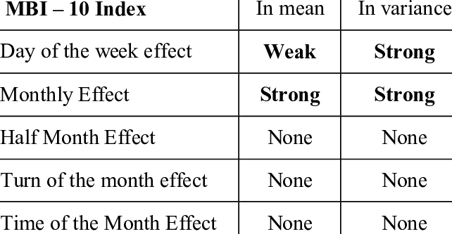

## Table of Contents

## What is the calendar effect?

The calendar effect is a pattern where certain days or months show different results in financial markets. For example, stocks might go up more often on Fridays than on Mondays. This happens because of how people act and feel on different days. Traders might be more hopeful at the end of the week, causing more buying.

This effect can also be seen in how stocks perform in different months. For instance, January often sees higher returns than other months. This is called the "January effect." People think it happens because investors sell losing stocks at the end of the year for tax reasons and then buy new stocks in January. Knowing about these patterns can help investors make better choices.

## How does the calendar effect influence financial markets?

The calendar effect can change how financial markets work by making certain days or months act differently. For example, stocks might do better on Fridays than on Mondays. This happens because people feel different on different days. On Fridays, traders might feel more hopeful and buy more stocks, pushing prices up. On Mondays, they might be less excited or worried about the week ahead, which can make stock prices go down.

Another way the calendar effect shows up is in how stocks perform in different months. January often sees bigger jumps in stock prices than other months. This is known as the "January effect." It happens because investors might sell stocks that lost value at the end of the year to save on taxes. Then, in January, they buy new stocks, which can push prices up. Knowing about these patterns can help investors decide when to buy or sell stocks.

## Can you explain the January effect as a type of calendar effect?

The January effect is a type of calendar effect where stock prices often go up more in January than in other months. It happens because some investors sell stocks that lost value at the end of the year. They do this to get a tax break. Then, in January, these investors buy new stocks with the money they got from selling the old ones. This buying can push stock prices up.

This pattern has been noticed by many people who study the stock market. They see that stocks, especially small ones, tend to do better in January. Knowing about the January effect can help investors make smarter choices. They might decide to buy stocks in January hoping to get a good deal, or they might sell stocks at the end of the year to take advantage of the tax benefits.

## What other calendar effects exist besides the January effect?

Besides the January effect, there's the Monday effect. This is when stocks often do worse on Mondays than other days of the week. People think it happens because traders might be less happy or more worried at the start of the week. They might sell more stocks on Mondays, which can make prices go down. Knowing about the Monday effect can help investors decide not to sell stocks on Mondays if they can help it.

Another calendar effect is the end-of-month effect. This is when stocks tend to do better at the end of the month. Some people think it's because companies want to look good at the end of the month for reports. So, they might buy more stocks to make their numbers look better. Investors who know about this might buy stocks near the end of the month to take advantage of this pattern.

There's also the turn-of-the-year effect, which is a bit like the January effect but focuses on the last few days of December and the first few days of January. During this time, stocks might go up because investors are hopeful about the new year. They might buy more stocks, thinking that the new year will bring good things. This can push stock prices up during this time.

## How do calendar effects impact investment strategies?

Calendar effects can change how people invest their money. If someone knows about the January effect, they might buy stocks at the start of January. They do this because they think stock prices will go up then. This can help them make more money. Knowing about the Monday effect might make someone not sell stocks on Mondays. They might wait until later in the week when prices might be better. By understanding these patterns, investors can pick better times to buy or sell.

These effects can also make investors think about the end of the month or the end of the year. If someone knows about the end-of-month effect, they might buy stocks near the end of the month. They think prices will go up then because companies want to look good in their reports. The turn-of-the-year effect might make someone buy stocks at the end of December or the start of January. They hope that the new year will bring good things and push stock prices up. By using this knowledge, investors can plan their moves better and maybe make more money.

## What are the historical origins of the calendar effect?

The calendar effect has been noticed for a long time. People started seeing that stocks did different things on different days or months. One of the earliest calendar effects people talked about was the January effect. It was first mentioned in the 1940s. Back then, people saw that stocks, especially small ones, went up more in January. They thought it was because investors sold losing stocks at the end of the year for tax reasons and then bought new stocks in January.

Over time, more calendar effects were found. The Monday effect was noticed in the 1970s. People saw that stocks often did worse on Mondays than other days. They thought it was because traders were less happy or more worried at the start of the week. The end-of-month effect and the turn-of-the-year effect were also found later. These effects showed that stocks could do better at certain times because of how people acted or felt. Knowing about these patterns helped investors make better choices about when to buy or sell stocks.

## How can investors identify and measure calendar effects in market data?

Investors can identify calendar effects by looking at past market data over long periods. They can use charts and graphs to see if stock prices go up or down more often on certain days or months. For example, they might look at how stocks did on Mondays compared to other days, or how they did in January compared to other months. By doing this, they can see if there are patterns that happen again and again. If they find that stocks usually go up in January, that could be a sign of the January effect.

To measure these effects, investors can use numbers to see how strong the patterns are. They might use something called "average returns" to see how much stocks go up or down on average during certain times. For example, they could find the average return for stocks on Mondays and compare it to the average return on other days. If the numbers show that stocks do worse on Mondays, that could be evidence of the Monday effect. By looking at these numbers over many years, investors can get a better idea of how reliable these calendar effects are and use that information to make better investment choices.

## What are the criticisms and limitations of the calendar effect theory?

Some people think the calendar effect is not always true. They say that just because stocks went up in January one year, it does not mean they will go up every January. Sometimes, the patterns people see might just be by chance. Also, if lots of people know about these patterns and start buying stocks at the same time, it might not work anymore. This is called the "self-fulfilling prophecy" problem. If everyone buys stocks in January because they think prices will go up, the prices might go up just because of that, not because of any real pattern.

Another problem is that the calendar effect might not be the same everywhere. What happens in one country's stock market might not happen in another country's market. Also, the effect might change over time. What used to be true might not be true anymore because the market changes. This makes it hard for investors to use the calendar effect to make good choices all the time. They have to keep checking to see if the patterns are still there.

## How do calendar effects vary across different countries and cultures?

Calendar effects can be different in different countries and cultures because people and markets work in different ways. For example, the January effect might be stronger in the United States because of how tax laws work there. People in the U.S. might sell stocks at the end of the year to get a tax break and then buy new stocks in January. But in another country, like Japan, the tax rules might be different, so the January effect might not be as strong or might not happen at all.

Also, holidays and cultural events can change how calendar effects work. In some countries, the end of the year might be a big time for celebrations, which can make people act differently in the stock market. For example, in China, the Lunar New Year might affect how people invest around that time. So, while some calendar effects might be seen in many places, they can be weaker or stronger depending on the country and its culture.

## What role do psychological factors play in the calendar effect?

Psychological factors play a big role in the calendar effect. People's feelings and behaviors can make stock prices go up or down at certain times. For example, on Mondays, people might feel less happy or more worried about the week ahead. This can make them sell more stocks, which pushes prices down. On Fridays, people might feel more hopeful and buy more stocks, making prices go up. These feelings can create patterns in the stock market that happen again and again.

Another way psychology affects the calendar effect is through how people react to the end of the year and the start of a new one. At the end of the year, some investors might sell stocks that lost value to get a tax break. This can make stock prices drop. Then, in January, people might feel hopeful about the new year and buy new stocks, which can push prices up. These psychological reactions to certain times of the year can create the calendar effects we see in the stock market.

## How have calendar effects evolved with changes in market structures and technology?

Calendar effects have changed over time because of new ways markets work and new technology. In the past, people had to call their broker to buy or sell stocks, which took time. Now, with computers and the internet, people can trade stocks quickly from anywhere. This means that calendar effects like the January effect might not be as strong because people can act on information faster. Also, more people know about these patterns now, so they might not work as well as before. If everyone buys stocks in January because they think prices will go up, the effect might not happen because too many people are doing the same thing.

Another way markets have changed is with new rules and better ways to see what's happening in the market. Governments and groups that watch over markets have made rules to make trading fair. This can change how calendar effects work. For example, if there are rules about how much stocks can go up or down in a day, it might stop big jumps in prices that used to happen at certain times. Also, with more data and better tools, people can see calendar effects more clearly and maybe use them to make better choices. But because so many people are looking at the same data, it can be harder for these effects to make a big difference in the market.

## What advanced statistical methods are used to study calendar effects in financial research?

Researchers use advanced statistical methods to study calendar effects in financial markets. One common method is regression analysis. This helps them see if stock prices go up or down at certain times because of the calendar or because of other things happening in the market. They can use something called "dummy variables" to show if it's Monday or January, for example. By doing this, they can see if these times really make a difference in stock prices.

Another method is time series analysis. This looks at how stock prices change over time and can help find patterns that happen again and again. Researchers might use something called "autoregressive integrated moving average" (ARIMA) models to predict how stock prices will move based on past data. They can also use "seasonal decomposition" to break down the data into parts that show trends, cycles, and calendar effects. These methods help researchers understand if calendar effects are real and how strong they are.

## References & Further Reading

[1]: Rozeff, M. S., & Kinney, W. R. (1976). ["Capital market seasonality: The case of stock returns."](https://www.sciencedirect.com/science/article/pii/0304405X76900283) Journal of Financial Economics, 3(4), 379-402. (Discusses the January effect and its implications on stock returns.)

[2]: French, K. R. (1980). ["Stock returns and the weekend effect."](https://www.sciencedirect.com/science/article/pii/0304405X80900215) Journal of Financial Economics, 8(1), 55-69. (Explores the weekend effect in stock returns.)

[3]: Keim, D. B. (1983). ["Size-related anomalies and stock return seasonality: Further empirical evidence."](https://www.sciencedirect.com/science/article/pii/0304405X83900259) Journal of Financial Economics, 12(1), 13-32. (Provides evidence on seasonal patterns in stock returns.)

[4]: Zhang, C., & Jacobsen, B. (2013). ["Are monthly seasonals real? A three century perspective."](https://academic.oup.com/rof/article-abstract/17/5/1743/1581343) International Journal of Finance & Economics, 18(4), 368-384. (Studies the persistence of calendar effects over three centuries.)

[5]: ["Algorithmic Trading: Winning Strategies and Their Rationale"](https://www.wiley.com/en-us/Algorithmic+Trading%3A+Winning+Strategies+and+Their+Rationale-p-9781118460146) by Ernest P. Chan. (Provides insights into algorithmic trading strategies including those based on calendar effects.)

[6]: ["Quantitative Trading: How to Build Your Own Algorithmic Trading Business"](https://books.google.com/books/about/Quantitative_Trading.html?id=j70yEAAAQBAJ) by Ernest P. Chan. (Discusses the setup and execution of algorithmic trading strategies.)