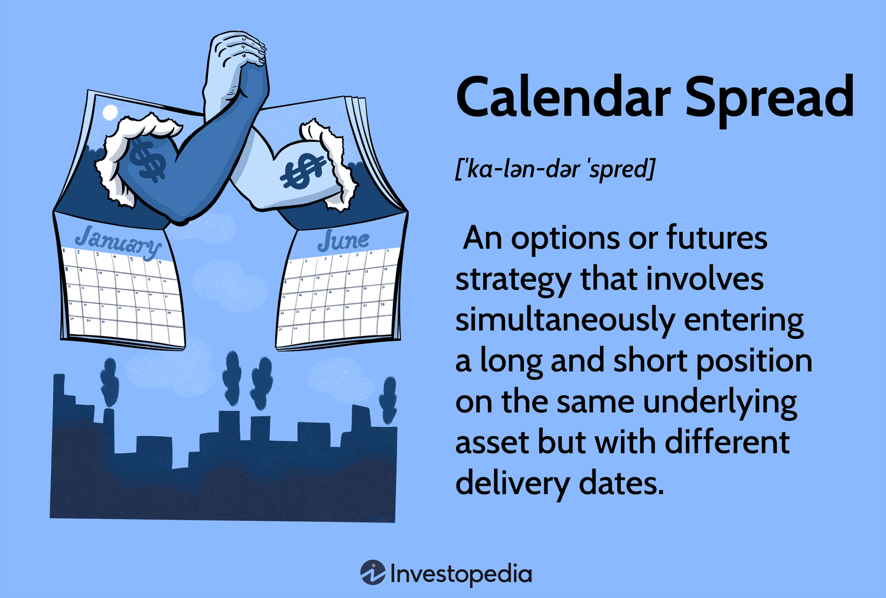

## Table of Contents

## What is a calendar spread in futures and options trading?

A calendar spread, also known as a time spread or horizontal spread, is a trading strategy used in futures and options markets. It involves simultaneously buying and selling two contracts of the same underlying asset but with different expiration dates. For example, you might buy a contract that expires in December and sell one that expires in September. The goal is to take advantage of the differences in time value between the two contracts. Traders use this strategy when they expect the price of the underlying asset to remain relatively stable or move in a predictable way over time.

The main advantage of a calendar spread is that it can be less risky than other trading strategies because it involves both a long and a short position. This can help to offset potential losses if the market moves against one of the positions. However, it's important to understand that the success of a calendar spread depends on the volatility and time decay of the options or futures contracts. If the market moves more than expected, or if the time decay doesn't work in your favor, the strategy might not be profitable. Therefore, it's crucial to carefully analyze market conditions and choose the right expiration dates for the contracts.

## How does a calendar spread work in the context of futures?

In futures trading, a calendar spread involves buying and selling two futures contracts for the same asset but with different expiration dates. For example, you might buy a futures contract that expires in six months and sell one that expires in three months. The idea is to make money from the difference in price between these two contracts over time. If the price of the near-term contract is higher than the longer-term one, you might expect the prices to converge as the near-term contract gets closer to expiration. This strategy can be useful if you think the price of the asset will stay about the same or move in a way you can predict.

The main benefit of using a calendar spread in futures is that it can be less risky than other trading strategies. This is because you are both buying and selling contracts, which can help balance out potential losses if the market moves against you. However, the success of this strategy depends on how the prices of the futures contracts change over time. If the market moves more than you expected, or if the prices don't change in the way you thought they would, you might not make a profit. It's important to carefully look at market conditions and pick the right expiration dates for your contracts to make this strategy work well.

## What are the key differences between a calendar spread in futures versus options?

In futures, a calendar spread involves buying and selling two futures contracts of the same asset but with different expiration dates. The goal is to profit from the price difference between these contracts over time. For example, if you buy a futures contract that expires in six months and sell one that expires in three months, you are betting that the price of the near-term contract will come closer to the price of the longer-term one as time passes. This strategy can be less risky because you are both buying and selling, which can help balance out any losses if the market moves against you.

In options, a calendar spread also involves buying and selling options of the same underlying asset but with different expiration dates. However, the main difference is that options have a time value that decays over time, which can affect the strategy. For example, you might buy a longer-term call option and sell a shorter-term call option. The goal is to profit from the faster time decay of the shorter-term option compared to the longer-term one. This strategy can be more complex because it depends on the [volatility](/wiki/volatility-trading-strategies) and time decay of the options, making it more sensitive to market changes than futures calendar spreads.

## What are the main advantages of using calendar spreads in trading?

One big advantage of using calendar spreads in trading is that they can be less risky than other strategies. This is because you are both buying and selling at the same time, which can help balance out any losses if the market moves against you. For example, if you buy a futures contract that expires later and sell one that expires sooner, you are betting on the price difference between them. If the market goes up or down a lot, the losses on one side can be offset by gains on the other side.

Another advantage is that calendar spreads can help you make money from the way prices change over time. In futures, you can profit from the price difference between contracts with different expiration dates. In options, you can take advantage of the time decay, where the value of the shorter-term option goes down faster than the longer-term one. This can be a good strategy if you think the price of the asset will stay about the same or move in a way you can predict.

## What are the potential risks and disadvantages associated with calendar spreads?

One risk of using calendar spreads is that they depend a lot on how the market moves over time. If the market moves more than you expected, or if it doesn't move in the way you thought it would, you might not make a profit. For example, in futures, if the price difference between the near-term and longer-term contracts doesn't change in your favor, you could lose money. In options, if the time decay doesn't work out as planned or if there's a big change in volatility, your strategy might not be successful.

Another disadvantage is that calendar spreads can be more complex to manage than simpler trading strategies. You need to keep a close eye on the market and make sure you choose the right expiration dates for your contracts. If you get it wrong, it can be hard to adjust your positions and you might end up losing money. Also, because you are holding both long and short positions, you need to be careful about margin requirements and how much money you have to put up to keep your trades open.

## How do you set up a basic calendar spread strategy?

To set up a basic calendar spread strategy, you first need to decide whether you want to use futures or options. Let's say you choose futures. You would then pick the same asset for both contracts, like oil or gold. Next, you need to choose two different expiration dates. For example, you might buy a futures contract that expires in six months and sell one that expires in three months. You're betting that the price of the near-term contract will get closer to the price of the longer-term one as time goes by. Make sure you have enough money in your account to cover the margin requirements for both positions.

For options, the process is similar, but you also need to think about the time decay of the options. You could buy a longer-term call option and sell a shorter-term call option on the same asset, like a stock. The idea is that the shorter-term option will lose its value faster than the longer-term one, and you can make money from this difference. Just like with futures, you need to pick the right expiration dates and keep an eye on the market. Make sure you understand how much money you need to keep in your account to hold both positions.

## What are some common indicators and signals used to initiate a calendar spread?

When setting up a calendar spread, traders often look at the price difference between the near-term and longer-term contracts. They might use technical indicators like moving averages or the Relative Strength Index (RSI) to see if the asset's price is likely to stay stable or move in a predictable way. For example, if the price of the near-term contract is much higher than the longer-term one, a trader might expect the prices to get closer as the near-term contract gets closer to expiring. They might also watch market trends and news to see if there are any big changes coming that could affect the asset's price.

In options trading, traders pay close attention to the time decay and volatility of the options. They might use the Implied Volatility (IV) to see how much the market expects the price of the asset to move. If the IV is high for the shorter-term option and low for the longer-term one, it could be a good time to set up a calendar spread. Traders also look at the Greeks, like Theta and Vega, to understand how time and volatility will affect their options. By keeping an eye on these indicators and signals, traders can make better decisions about when to start a calendar spread.

## How can market volatility affect the performance of a calendar spread?

Market volatility can really change how well a calendar spread works. When the market is moving a lot, it can make the price difference between the near-term and longer-term contracts bigger or smaller than you expected. If you're using futures, high volatility might mean the prices don't come together like you thought they would, which could lead to losses. In options, if the market gets more volatile, the value of the options can change a lot. This can be good or bad depending on whether you're buying or selling the options. If the market is too volatile, it can mess up your plan and make it hard to make money.

On the other hand, if the market is calm and not moving much, it can help your calendar spread do better. In futures, if the prices stay stable, the near-term contract might move closer to the longer-term one as it gets closer to expiring, which is what you want. In options, low volatility can make the time decay work in your favor, especially if you're selling the shorter-term option. The shorter-term option loses value faster than the longer-term one, which can help you make a profit. So, keeping an eye on how volatile the market is can help you decide if a calendar spread is a good idea right now.

## What advanced techniques can be used to optimize calendar spread strategies?

One advanced technique to optimize calendar spread strategies is to use delta hedging. This means you keep an eye on how much the price of your options or futures changes when the price of the underlying asset changes. If the delta of your position starts to move too much, you can buy or sell more contracts to balance it out. This can help you manage risk better and keep your strategy on track, even when the market is moving a lot.

Another technique is to adjust your positions based on changes in implied volatility. In options trading, if you see that the implied volatility of the shorter-term option is going up a lot compared to the longer-term one, you might want to close out the shorter-term option and open a new one with a different expiration date. This can help you take advantage of the changes in volatility and make your calendar spread more profitable. By paying attention to these details and making small changes, you can make your calendar spread strategy work better.

## How do you manage and adjust calendar spreads as market conditions change?

Managing and adjusting calendar spreads as market conditions change involves keeping a close eye on how the prices of your contracts are moving. If you're using futures, you might need to adjust your positions if the price difference between the near-term and longer-term contracts starts to change a lot. For example, if the near-term contract starts to get much cheaper than you expected, you might want to close out that position and open a new one with a different expiration date. This can help you stay on track with your strategy and avoid big losses. It's important to watch the market trends and news to see if there are any big changes coming that could affect the prices.

In options trading, managing your calendar spread means paying attention to the time decay and volatility of your options. If the implied volatility of the shorter-term option starts to go up a lot compared to the longer-term one, you might want to close out the shorter-term option and open a new one. This can help you take advantage of the changes in volatility and make your strategy more profitable. Also, if the delta of your position starts to move too much, you can use delta hedging to balance it out by buying or selling more contracts. By making these small adjustments based on what's happening in the market, you can keep your calendar spread working well.

## Can you explain the tax implications of trading calendar spreads?

Trading calendar spreads can have different tax implications depending on whether you are trading futures or options, and how long you hold your positions. For futures, any profits or losses are usually treated as 60% long-term capital gains and 40% short-term capital gains, no matter how long you hold the contracts. This is called the 60/40 rule. This can be good because long-term capital gains are often taxed at a lower rate than short-term gains. But, you need to keep track of all your trades and report them on your tax return.

For options, the tax rules can be more complicated. If you hold your options for less than a year, any profits are taxed as short-term capital gains, which are taxed at your regular income tax rate. If you hold them for more than a year, they can be taxed as long-term capital gains, which are usually taxed at a lower rate. But, if you're trading options as part of your business, the profits might be considered regular income instead of capital gains. It's a good idea to talk to a tax professional to make sure you're doing everything right and taking advantage of any tax benefits you can.

## What are some real-world examples of successful calendar spread trades?

One example of a successful calendar spread trade happened in the oil futures market. A trader noticed that the price of the near-term oil futures contract was much higher than the longer-term one. They decided to buy the longer-term contract and sell the near-term one, betting that the prices would get closer as the near-term contract got closer to expiring. Over the next few months, the prices did start to come together, and the trader was able to close out both positions for a nice profit. This worked out well because the market stayed pretty stable, and the price difference between the contracts changed in the way the trader expected.

Another example comes from the options market, where a trader used a calendar spread on a tech stock. They bought a call option that was set to expire in six months and sold a call option on the same stock that was set to expire in one month. The trader was hoping that the shorter-term option would lose value faster than the longer-term one, thanks to time decay. As it turned out, the stock price stayed about the same over the next month, and the shorter-term option did lose value faster. The trader was able to close out the shorter-term option at a lower price and keep the longer-term option, making a profit from the difference in time decay between the two options.

## What is the Execution Process?

To execute a calendar spread, a trader simultaneously buys and sells options of the same underlying asset, with identical strike prices but different expiration dates. Typically, this involves buying a longer-term option while selling a shorter-term option. For example, a trader might buy a call option expiring in three months and sell a call option on the same asset with a one-month expiry. This strategy is versatile and can be executed using call or put options, depending on the trader’s market outlook.

### Potential Returns and Risks

The profitability of calendar spreads largely arises from the differential rate at which the premiums of the two options decay over time. The shorter-term option, which is sold, generally decays quicker than the longer-term option purchased, potentially providing a net profit if the underlying asset's price remains relatively stable. Here's a simplified example of how time decay works in this context:

- Let $V_t$ represent the value of the option at time $t$.
- The rate of time decay, also known as Theta ($\Theta$), is typically higher for the short-term option.

The net Theta of a calendar spread is generally positive, implying that the position benefits from the passage of time:

$$
\Theta_{\text{spread}} = \Theta_{\text{short-term}} - \Theta_{\text{long-term}}
$$

However, the strategy is not without risks. Calendar spreads are vulnerable to significant price movements in the underlying asset. If the asset’s price diverges substantially from the strike price, both options might lose value, resulting in a potential loss. Additionally, changes in implied volatility can impact the spread's profitability; higher volatility might increase the value of the spread, while lower volatility can reduce it.

## References & Further Reading

[1]: Bergstra, J., Bardenet, R., Bengio, Y., & Kégl, B. (2011). ["Algorithms for Hyper-Parameter Optimization."](https://papers.nips.cc/paper/4443-algorithms-for-hyper-parameter-optimization) Advances in Neural Information Processing Systems 24.

[2]: ["Advances in Financial Machine Learning"](https://www.amazon.com/Advances-Financial-Machine-Learning-Marcos/dp/1119482089) by Marcos Lopez de Prado

[3]: ["Evidence-Based Technical Analysis: Applying the Scientific Method and Statistical Inference to Trading Signals"](https://www.amazon.com/Evidence-Based-Technical-Analysis-Scientific-Statistical/dp/0470008741) by David Aronson

[4]: ["Machine Learning for Algorithmic Trading"](https://github.com/PacktPublishing/Machine-Learning-for-Algorithmic-Trading-Second-Edition) by Stefan Jansen

[5]: ["Quantitative Trading: How to Build Your Own Algorithmic Trading Business"](https://books.google.com/books/about/Quantitative_Trading.html?id=j70yEAAAQBAJ) by Ernest P. Chan