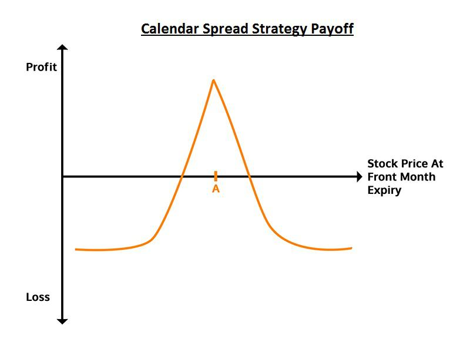

## Table of Contents

## What is calendar trading and how does it work?

Calendar trading, also known as calendar spread trading, is a strategy used in options and futures trading where a trader buys and sells two contracts with the same strike price but different expiration dates. The goal is to profit from the difference in time decay between the two contracts. For example, a trader might buy a longer-term option and sell a shorter-term option. If the price of the underlying asset stays relatively stable, the shorter-term option will lose value faster than the longer-term option, allowing the trader to make a profit.

This strategy can be used in various markets, including stocks, commodities, and currencies. It's considered a more advanced trading technique because it involves understanding how time affects the value of options and futures contracts. Traders need to carefully monitor market conditions and the specific characteristics of the contracts they are trading. While calendar trading can be profitable, it also carries risks, as unexpected market movements can lead to losses. Therefore, it's important for traders to have a solid understanding of the markets and to use risk management techniques.

## What are spread option strategies and why are they used?

Spread option strategies involve buying and selling different options contracts at the same time. The goal is to make money from the difference in price between the options. Traders use these strategies to reduce risk or to bet on specific market movements without spending too much money. For example, a trader might buy one option and sell another option with a different strike price or expiration date. This can help limit potential losses if the market moves against them.

These strategies are popular because they can be less risky than buying options outright. By balancing the purchase and sale of options, traders can create positions that are less sensitive to big swings in the market. Spreads can also be used to take advantage of expected changes in [volatility](/wiki/volatility-trading-strategies) or to profit from the passage of time. While they can be more complex to set up, spread option strategies offer traders more flexibility and control over their investments.

## How can beginners start with calendar trading?

Calendar trading might sound tricky, but beginners can start by learning the basics of options and futures. It's important to understand what options are and how their value changes over time. Options are like bets on whether a stock or commodity will go up or down by a certain date. When you do calendar trading, you buy one option that lasts longer and sell another that expires sooner. The idea is to make money from the difference in how fast these options lose value as time goes by.

To get started, beginners should practice with a demo account where they can trade without using real money. This helps them get used to how calendar spreads work without risking their savings. It's also a good idea to start with small amounts of money when you begin trading for real. Always keep learning and stay updated on market news because unexpected changes can affect your trades. Remember, calendar trading can be profitable, but it also has risks, so it's important to be careful and patient as you learn.

## What are the basic types of spread options and their uses?

Spread options are a way to trade by buying and selling different options at the same time. The main types are vertical spreads, horizontal spreads, and diagonal spreads. Vertical spreads involve options with the same expiration date but different strike prices. For example, you might buy a call option with a lower strike price and sell a call option with a higher strike price. This is called a bull call spread and it's used when you think the price of the stock will go up a little bit. Horizontal spreads, also known as calendar spreads, use options with the same strike price but different expiration dates. You might buy a longer-term option and sell a shorter-term option, hoping to profit from the difference in how fast they lose value. Diagonal spreads combine both, using options with different strike prices and different expiration dates. These are used when you have a more complex view of how the market might move.

Each type of spread has its own use. Vertical spreads are good for betting on the direction of the market without risking too much money. They can limit your losses if the market moves against you. Horizontal spreads, or calendar spreads, are useful when you think the market will stay pretty much the same for a while. They can make money from the passage of time, as the shorter-term option loses value faster than the longer-term one. Diagonal spreads are a bit more complex and are used when you have a specific idea about where the market might go and how fast it might get there. They can offer more flexibility but also require more skill to manage.

## What are the key differences between calendar spreads and vertical spreads?

Calendar spreads and vertical spreads are two types of option strategies that traders use, but they work in different ways. A calendar spread, also called a horizontal spread, involves buying and selling options with the same strike price but different expiration dates. For example, you might buy a longer-term option and sell a shorter-term one. The goal is to make money from the difference in how fast these options lose value over time. This strategy is good when you think the price of the stock will stay pretty much the same for a while.

On the other hand, a vertical spread uses options with the same expiration date but different strike prices. For instance, you could buy a call option with a lower strike price and sell a call option with a higher strike price. This is known as a bull call spread, and it's used when you think the price of the stock will go up a little bit. Vertical spreads help limit your risk because the money you make from selling the option can help cover the cost of buying the other one. So, while calendar spreads focus on time, vertical spreads focus on the price movement of the stock.

## How do you calculate the profit and loss of a calendar spread?

To calculate the profit and loss of a calendar spread, you need to look at the value of the options you bought and sold over time. When you set up a calendar spread, you buy a longer-term option and sell a shorter-term option with the same strike price. As time goes by, the shorter-term option loses value faster than the longer-term option. If the price of the stock stays pretty much the same, you can make money because the option you sold will lose more value than the option you bought. To figure out your profit, you subtract the cost of the longer-term option from the money you get from selling the shorter-term option, and then see how much the value of these options has changed.

However, if the price of the stock moves a lot, it can affect your calendar spread in different ways. If the stock price goes up or down a lot before the shorter-term option expires, you might lose money. For example, if the stock price goes up a lot, the shorter-term option you sold could become more valuable, and you might have to buy it back at a higher price. On the other hand, if the stock price stays stable or moves just a little bit, the calendar spread can be profitable. To calculate your loss, you need to add up how much you paid for the longer-term option and how much it cost you to close out the shorter-term option if its price went up.

## What are the risks associated with calendar trading and spread options?

Calendar trading and spread options can be tricky because they come with risks that you need to know about. One big risk is that the market might move in a way you didn't expect. If the price of the stock goes up or down a lot, it can mess up your calendar spread. For example, if you sold a shorter-term option and the stock price jumps up before it expires, you might have to buy it back at a higher price, which can lead to a loss. Also, if the stock price drops a lot, the longer-term option you bought might lose value too, making your trade unprofitable.

Another risk is that options lose value over time, which is called time decay. This can work in your favor with calendar spreads if the stock price stays stable, but it can also work against you if the market moves unexpectedly. If the shorter-term option you sold loses value faster than you thought, but the longer-term option you bought also loses value, you could end up losing money. It's important to keep an eye on how much time is left before the options expire and be ready to make changes to your trade if needed.

Lastly, managing these trades can be complicated. You need to understand how different factors like stock price, time, and market volatility affect the value of your options. If you don't keep a close watch on these things, you might miss the best time to close your trade or make adjustments. This can lead to bigger losses than you planned for. So, while calendar trading and spread options can be profitable, they require careful planning and constant attention to manage the risks properly.

## How can advanced traders optimize their calendar trading strategies?

Advanced traders can optimize their calendar trading strategies by paying close attention to the volatility of the underlying asset. They should choose options with the right level of volatility that matches their predictions. If they think the stock will stay pretty stable, they might pick options with lower volatility. But if they expect the stock to move around a lot, they might go for options with higher volatility. This way, they can make the most out of the difference in how fast the options lose value. Also, they can use tools like the Greeks, especially Theta and Vega, to understand how time and volatility will affect their trades. By keeping an eye on these, they can make better decisions about when to enter or [exit](/wiki/exit-strategy) their trades.

Another way advanced traders can improve their calendar trading is by adjusting their positions as the market changes. If the stock price starts moving in a way they didn't expect, they can roll their options. This means closing the current options and opening new ones with different expiration dates or strike prices. This can help them manage risk and maybe even turn a losing trade into a winning one. Also, they should always have a clear plan for managing their trades, including setting stop-loss orders to limit potential losses. By staying flexible and ready to make changes, advanced traders can optimize their calendar trading strategies and increase their chances of making a profit.

## What are some common mistakes to avoid in spread option trading?

One common mistake in spread option trading is not understanding the risks well enough. Spread options can seem less risky because you're buying and selling at the same time, but they can still lose money if the market moves the wrong way. If you don't know how much you could lose, you might end up risking more than you can afford. It's important to always know your maximum possible loss before you start trading.

Another mistake is not paying attention to time decay. Options lose value as they get closer to expiring, and this can affect your spread in different ways. If you don't keep track of how much time is left on your options, you might miss the best time to close your trade or make changes. Always have a plan for when you'll exit your trade, and be ready to adjust if the market doesn't go as you expected.

Lastly, many traders make the mistake of not managing their trades well. It's not enough to just set up a spread and then forget about it. You need to watch the market and be ready to make changes if things start to go wrong. This might mean closing the trade early, rolling the options to a different expiration date, or adjusting the strike prices. Good trade management can help you turn a losing trade into a winning one, or at least limit your losses.

## How do market conditions affect the performance of calendar and spread strategies?

Market conditions can have a big impact on how well calendar and spread strategies work. If the market stays pretty stable, calendar spreads can do well because the shorter-term option you sold will lose value faster than the longer-term option you bought. This means you can make money from the difference in how fast these options lose value over time. But if the market starts moving a lot, it can mess things up. If the stock price goes up or down a lot before the shorter-term option expires, you might lose money because the option you sold could become more valuable, and you'd have to buy it back at a higher price.

Spread strategies, like vertical spreads, are also affected by market conditions. If you think the stock price will go up a little bit and you set up a bull call spread, you'll do well if the market moves in the direction you expected. But if the stock price stays the same or goes down, your spread might lose money. The same goes for bear put spreads, which you use when you think the stock price will go down a little. If the market moves a lot more than you thought, it can lead to bigger losses than you planned for. So, it's really important to keep an eye on what's happening in the market and be ready to make changes to your trades if needed.

## What advanced techniques can be used to manage and adjust spread options?

One advanced technique for managing and adjusting spread options is rolling the positions. This means closing the current options and opening new ones with different expiration dates or strike prices. For example, if the stock price moves more than expected, you might roll the shorter-term option to a later date to give it more time to recover. Or, if the stock price stays stable, you might roll the longer-term option to a closer date to take advantage of faster time decay. Rolling can help you manage risk and possibly turn a losing trade into a winning one, but it's important to do it carefully because it can also increase your costs.

Another technique is using stop-loss orders to limit your losses. A stop-loss order automatically closes your trade if the price of the options reaches a certain level. This can help you avoid big losses if the market moves against you. You can set stop-loss orders for both the options you bought and the ones you sold, so you have control over your risk. It's a good idea to set these orders at levels that make sense for your trading plan, so you don't get stopped out too early or too late. By using stop-loss orders, you can protect your money and stay in control of your trades.

Lastly, advanced traders can use delta hedging to manage their spread options. Delta is a measure of how much the price of an option changes when the stock price changes. By buying or selling shares of the stock, you can balance out the delta of your options and make your spread less sensitive to big swings in the stock price. This can help you keep your trade profitable even if the market moves a lot. Delta hedging requires careful attention and constant adjustments, but it can be a powerful tool for managing your spread options and reducing risk.

## How can one use quantitative analysis to enhance calendar trading and spread option strategies?

Quantitative analysis can help make calendar trading and spread option strategies better by using math to figure out the best times to buy and sell options. For example, you can use historical data to see how the price of a stock has moved in the past and predict how it might move in the future. This can help you choose the right expiration dates and strike prices for your options. Also, by looking at things like volatility and time decay, you can set up your trades to take advantage of these factors. Using computer programs and math models, you can find the best combinations of options to use in your spreads and figure out the best times to make changes to your trades.

Another way quantitative analysis can help is by testing different strategies before you use them for real. You can use a computer to run simulations and see how your calendar spreads or vertical spreads would have done in the past. This can give you a good idea of how well your strategy might work in the future. By trying out different scenarios and adjusting your approach based on the results, you can fine-tune your strategies to make them more profitable. Quantitative analysis can also help you manage risk better by showing you how much you could lose in different situations, so you can make smarter decisions about when to enter or exit your trades.

## References & Further Reading

[1]: ["Options, Futures, and Other Derivatives"](https://www.pearson.com/en-us/subject-catalog/p/options-futures-and-other-derivatives/P200000005938/9780136939917) by John C. Hull

[2]: ["Option Volatility and Pricing: Advanced Trading Strategies and Techniques"](https://www.amazon.com/Option-Volatility-Pricing-Strategies-Techniques/dp/0071818774) by Sheldon Natenberg

[3]: ["Algorithmic Trading & DMA: An introduction to Direct Access Trading Strategies"](https://www.amazon.com/Algorithmic-Trading-DMA-introduction-strategies/dp/0956399207) by Barry Johnson

[4]: ["The Complete Guide to Option Pricing Formulas"](https://www.amazon.com/Complete-Guide-Option-Pricing-Formulas/dp/0786312408) by Espen Gaarder Haug

[5]: ["Trading and Exchanges: Market Microstructure for Practitioners"](https://www.amazon.com/Trading-Exchanges-Market-Microstructure-Practitioners/dp/0195144708) by Larry Harris