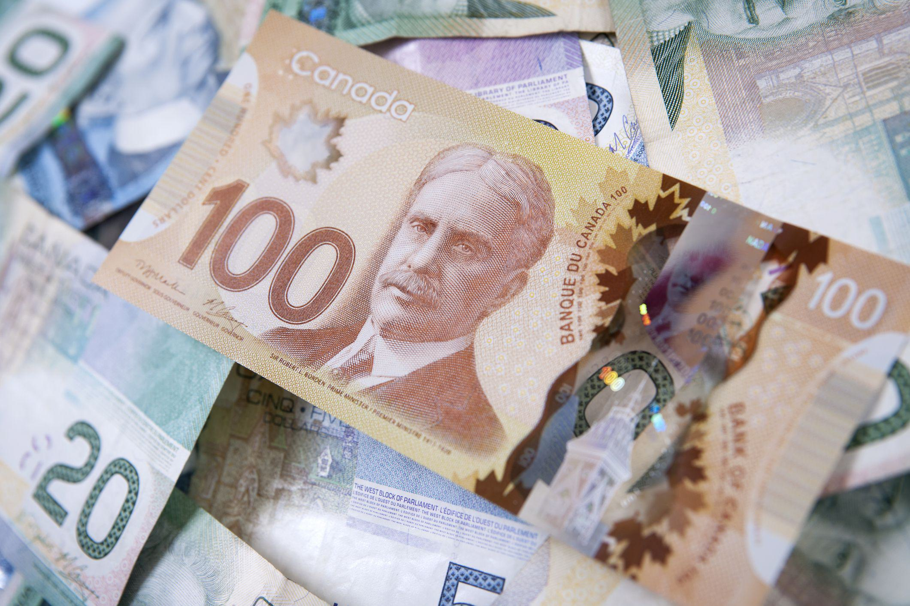

## Table of Contents

## What is a local currency?

A local currency is a type of money that is used in a specific area, like a town or a city. It is different from national money, like dollars or euros, because it is only used in that one place. People use local currency to buy things from local shops and businesses. This helps keep money in the community and supports local jobs.

Local currencies can help make a community stronger. When people use local money, more of it stays in the area instead of going to big companies outside. This can help small businesses grow and create more jobs. Local currencies also encourage people to shop locally and get to know their neighbors better.

## What is the Calgary Local Currency?

The Calgary Local Currency is a special kind of money that people in Calgary, Canada can use. It's called the "Calgary Dollar." People use Calgary Dollars to buy things from local shops and businesses in Calgary. This helps keep money in the city and supports local jobs.

Using Calgary Dollars is good for the community. When people spend Calgary Dollars, the money stays in Calgary instead of going to big companies outside the city. This helps small businesses in Calgary grow and create more jobs. It also encourages people to shop locally and get to know their neighbors better.

## Why was the Calgary Local Currency created?

The Calgary Local Currency, known as the Calgary Dollar, was created to help the local economy in Calgary, Canada. People wanted a way to keep money in their city instead of it going to big companies outside. By using Calgary Dollars, more money stays in Calgary and helps local businesses grow.

Using the Calgary Dollar also brings the community together. When people shop with local currency, they meet more of their neighbors and support local shops. This makes Calgary a stronger and friendlier place to live.

## How does the Calgary Local Currency work?

The Calgary Local Currency, called the Calgary Dollar, is a special kind of money that people in Calgary use. You can get Calgary Dollars by trading your Canadian dollars for them. You can do this at special places in Calgary or online. Once you have Calgary Dollars, you can use them to buy things from local shops and businesses that accept them. This helps keep money in Calgary and supports local jobs.

When you use Calgary Dollars, you help the community. More money stays in Calgary instead of going to big companies outside. This helps small businesses in Calgary grow and create more jobs. It also makes people want to shop locally and get to know their neighbors better. So, using Calgary Dollars is good for both the economy and the community in Calgary.

## Where can the Calgary Local Currency be used?

The Calgary Local Currency, called the Calgary Dollar, can be used at many places in Calgary. You can use it to buy things from local shops, cafes, and restaurants that accept it. Some farmers' markets and community events also take Calgary Dollars. You can find a list of places that accept Calgary Dollars on their website or at special places in Calgary where you can get them.

Using Calgary Dollars helps keep money in Calgary. When you spend Calgary Dollars at local businesses, the money stays in the city instead of going to big companies outside. This helps small businesses in Calgary grow and create more jobs. It also makes people want to shop locally and get to know their neighbors better. So, using Calgary Dollars is good for both the economy and the community in Calgary.

## How can someone obtain Calgary Local Currency?

You can get Calgary Local Currency, called Calgary Dollars, by trading your Canadian dollars for them. You can do this at special places in Calgary, like the Calgary Dollar office or at some local businesses that act as exchange points. You can also get Calgary Dollars online through their website. Just go to the website, choose how many Calgary Dollars you want, and pay with your Canadian dollars.

Once you have Calgary Dollars, you can use them to buy things from local shops and businesses in Calgary that accept them. This helps keep money in the city and supports local jobs. Using Calgary Dollars is a great way to help your community because it encourages people to shop locally and get to know their neighbors better.

## What are the benefits of using the Calgary Local Currency for local businesses?

Using the Calgary Local Currency, or Calgary Dollars, helps local businesses in Calgary a lot. When people spend Calgary Dollars at local shops, the money stays in the city. This means more money for local businesses instead of it going to big companies outside Calgary. This can help small businesses grow and make more money. When businesses do well, they can hire more people and create more jobs in Calgary.

Calgary Dollars also make the community stronger. When people use local currency, they are more likely to shop at local businesses and get to know their neighbors better. This can bring more customers to local shops and make people feel more connected to their community. So, using Calgary Dollars is good for both the businesses and the people who live in Calgary.

## What impact does the Calgary Local Currency have on the local economy?

The Calgary Local Currency, known as the Calgary Dollar, helps the local economy by keeping money in Calgary. When people use Calgary Dollars to buy things, the money stays in the city instead of going to big companies outside. This means more money stays in the community, which helps local businesses grow. When local businesses do well, they can hire more people, which creates more jobs in Calgary. This makes the economy stronger and helps more people in the city.

Using Calgary Dollars also makes the community stronger. When people spend local currency, they are more likely to shop at local shops and get to know their neighbors better. This can bring more customers to local businesses and make people feel more connected to their community. When people feel connected, they are more likely to support local businesses, which helps the economy even more. So, the Calgary Dollar is good for both the economy and the people who live in Calgary.

## How is the value of the Calgary Local Currency determined?

The value of the Calgary Local Currency, or Calgary Dollar, is set to be equal to the Canadian dollar. This means one Calgary Dollar is worth the same as one Canadian dollar. When you want to get Calgary Dollars, you trade your Canadian dollars for them at a rate of 1:1. This makes it easy for people to understand and use the local currency.

The value stays the same because the Calgary Dollar is designed to help the local economy, not to be a different kind of money with its own value. By keeping the value the same as the Canadian dollar, it encourages people to use it to support local businesses. This helps keep money in Calgary and makes the community stronger.

## What are the challenges faced in implementing and sustaining the Calgary Local Currency?

Implementing and sustaining the Calgary Local Currency, known as the Calgary Dollar, can be tough. One big challenge is getting enough people and businesses to use it. If not many people know about it or want to use it, it's hard for the currency to work well. Businesses might not want to accept it if they think it won't bring in enough customers. Also, people might not want to trade their Canadian dollars for Calgary Dollars if they're not sure they can use them easily.

Another challenge is keeping the value of the Calgary Dollar the same as the Canadian dollar. If people start to think the Calgary Dollar is worth less, they might not want to use it. This can make it hard to keep the currency going. Also, it takes a lot of work to keep the system running. There needs to be places where people can trade their Canadian dollars for Calgary Dollars, and someone has to manage all of this. If the people running the Calgary Dollar don't have enough help or money, it can be hard to keep it going strong.

## How does the Calgary Local Currency compare to other local currencies around the world?

The Calgary Local Currency, called the Calgary Dollar, is a lot like other local currencies around the world. Many places have their own local money, like the Ithaca HOUR in New York, the Bristol Pound in the UK, and the Chiemgauer in Germany. These currencies all work the same way: people trade their national money for local money and use it to buy things from local shops. This helps keep money in the community and supports local businesses. Just like the Calgary Dollar, these other local currencies are worth the same as their national money, making it easy for people to use them.

There are some differences, too. Some local currencies, like the Chiemgauer, have a special rule where the money loses value over time if you don't spend it. This rule is meant to make people spend their local money faster and keep it moving in the community. The Calgary Dollar doesn't have this rule, so it's simpler to use. Also, different places have different ways to make sure their local currency keeps going strong. Some, like the Bristol Pound, use technology like mobile apps to make it easier for people to use their local money. The Calgary Dollar mostly uses paper money and online trading, which can be a bit harder to use but still works well for the community.

## What future developments are planned for the Calgary Local Currency?

The people who run the Calgary Local Currency, called the Calgary Dollar, are always thinking about ways to make it better. They want to make it easier for people to use Calgary Dollars. One idea is to make a mobile app where people can trade their Canadian dollars for Calgary Dollars and use them to pay at local shops. This would make it more convenient for everyone and might get more people to use the local currency. They also want to work with more businesses in Calgary to accept Calgary Dollars, so people can use them in more places.

Another plan is to do more to tell people about the Calgary Dollar and why it's good for the community. They want to have more events and talks to show how using local money helps keep money in Calgary and supports local jobs. By getting more people to know about and use the Calgary Dollar, they hope to make the local economy even stronger. These future developments could help the Calgary Dollar grow and keep helping the city for a long time.

## Is there potential for integrating Algo Trading with the Calgary Dollar?

Algorithmic trading holds promise for enhancing the functionality and stability of the Calgary Dollar by maintaining equilibrium between this local currency and the Canadian dollar. By leveraging sophisticated algorithms, it becomes feasible to manage exchange rates effectively, thereby optimizing currency conversions and mitigating potential fluctuations.

To achieve equilibrium, algorithms can monitor market conditions and adjust exchange rates dynamically. For instance, the formula for calculating an optimized exchange rate might involve real-time analysis of supply and demand ratios:

$$
\text{Optimized Exchange Rate} = \frac{\text{Supply of Calgary Dollars}}{\text{Demand for Calgary Dollars}} \times \text{Base Currency Rate}
$$

This formula ensures that variations in either supply or demand are quickly addressed, maintaining rate stability and preventing extreme deviations.

Python code could potentially be employed to assist in this process:

```python
def calculate_optimized_rate(supply, demand, base_rate):
    optimized_rate = (supply / demand) * base_rate
    return optimized_rate

# Example variables
supply_of_calgary_dollars = 100000
demand_for_calgary_dollars = 95000
base_currency_rate = 1.05

# Calculate optimized rate
optimized_rate = calculate_optimized_rate(supply_of_calgary_dollars, demand_for_calgary_dollars, base_currency_rate)
print(f"Optimized Exchange Rate: {optimized_rate}")
```

Algorithmic trading also enhances transaction security and efficiency. By automating trading processes, these systems can reduce human error and lower transaction costs. Automated systems can swiftly execute trades at the most favorable conditions, further solidifying trust within the local currency environment.

Moreover, [algorithmic trading](/wiki/algorithmic-trading) brings in a layer of predictability and transparency, which are vital for community acceptance and regulatory compliance. As transactions become more efficient, users and merchants may perceive the Calgary Dollar as a more reliable and secure medium of exchange, thereby fostering greater community trust and participation.

## References & Further Reading

[1]: Seyfang, G. (2006). ["Sustainable consumption, the new economics and community currencies: Developing new institutions for environmental governance."](https://www.tandfonline.com/doi/full/10.1080/00343400600959173) Journal of Cleaner Production, 14(11-12), 1170-1179.

[2]: Lietaer, B., & Dunne, J. (2013). ["Rethinking Money: How New Currencies Turn Scarcity into Prosperity."](https://archive.org/details/rethinkingmoneyh0000liet) Berrett-Koehler Publishers.

[3]: North, P. (2010). ["Local Money: How to Make it Happen in Your Community."](https://www.amazon.com/Local-Money-Make-Happen-Community/dp/1900322528) Green Books.

[4]: Blanc, J. (2011). ["Classifying 'CCs': Community, complementary and local currencies' types and generations."](https://www.researchgate.net/publication/51014992_Classifying_CCs_Community_complementary_and_local_currencies'_types_and_generations) International Journal of Community Currency Research, 15, D4-D10.

[5]: DeFilippi, P. (2015). ["The Interplay between Decentralization and Privacy: The Case of Blockchain Technologies."](https://papers.ssrn.com/sol3/papers.cfm?abstract_id=2852689) Journal of Peer Production, 7. 

[6]: Guégan, D., Labys, W., & Razafitombo, H. D. (2014). ["A General Analysis of the Arbitrage Principle in Algorithmic Trading."](https://www.semanticscholar.org/paper/Sustainable-Development-Goal-%233%2C-%E2%80%9Chealth-and-and-Gu%C3%A9gan-Suz%C3%A1n/626c643dacedbcef9870f05b4802d947154d7730) SSRN Electronic Journal.

[7]: Dini, P., & Kioupkiolis, A. (2019). ["Community Currencies as Laboratories: Innovation, Digitization, and Governance."](https://eprints.lse.ac.uk/59307/1/__lse.ac.uk_storage_LIBRARY_Secondary_libfile_shared_repository_Content_Dini%2C%20P_Dini_Community_%20Currencies_Laboratories_2014_Dini_Community_%20Currencies_Laboratories_2014.pdf) Frontiers in Blockchain, 2.