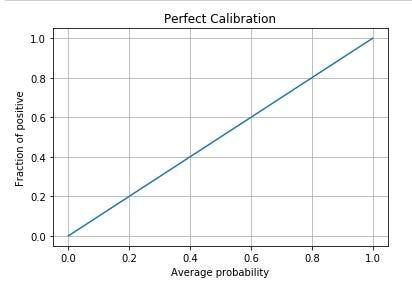

## Table of Contents

## What is a calibration layer in machine learning?

A calibration layer in machine learning is a technique used to improve the reliability of a model's predictions. When a model makes predictions, it often outputs probabilities or scores that indicate how confident it is in its predictions. However, these probabilities can sometimes be miscalibrated, meaning they do not accurately reflect the true likelihood of the event happening. A calibration layer helps to adjust these probabilities so that they more accurately represent the actual chances of the predicted outcomes.

For example, if a model predicts that an event has a 90% chance of occurring, but in reality, the event only happens 70% of the time, the model is overconfident. A calibration layer would adjust the model's output so that when it says 90%, it actually means closer to 70%. This is important because well-calibrated probabilities are crucial for decision-making processes in many applications, such as medical diagnoses, financial forecasting, and autonomous driving systems. By using a calibration layer, the model's predictions become more trustworthy and useful in real-world scenarios.

## Why is calibration important in machine learning models?

Calibration is important in machine learning models because it makes sure the probabilities the model gives are accurate. When a model says something has a 90% chance of happening, it should actually happen about 90% of the time. If the model is not calibrated well, it might say 90% but the thing only happens 70% of the time. This can cause big problems, especially in important areas like medicine or finance where people need to trust the model's predictions.

For example, if a doctor uses a model to decide if a patient needs urgent care, the model's probabilities need to be correct. If the model says there's a high chance of a serious condition but it's wrong too often, the doctor might not trust it. This could lead to wrong decisions and harm patients. By calibrating the model, we make sure the probabilities are more reliable, which helps everyone make better choices based on what the model says.

Calibration can be done in different ways, like using a calibration layer or other techniques. These methods adjust the model's output so it matches what happens in real life more closely. This makes the model more useful and trustworthy, which is why calibration is a key part of building good machine learning models.

## How does a calibration layer improve model performance?

A calibration layer improves model performance by making the model's predictions more reliable. When a model predicts the chance of something happening, like rain tomorrow, it gives a number, say 80%. If it actually rains 80% of the time when the model says 80%, the model is well-calibrated. But if it only rains 60% of the time, the model is overconfident. A calibration layer fixes this by adjusting the numbers the model gives so they match what happens in real life more closely. This makes people trust the model more because its predictions are more accurate.

For example, in a medical setting, a doctor might use a model to decide if a patient needs surgery. If the model says there's a 90% chance the patient has a serious condition, but it's wrong a lot, the doctor might not trust it. A calibration layer would adjust the model's predictions so that when it says 90%, it's much closer to being right 90% of the time. This helps doctors make better decisions and can save lives. By making the model's probabilities more accurate, a calibration layer makes the whole model more useful and trustworthy in important situations.

## What are the common methods used for model calibration?

One common method for model calibration is called Platt scaling. This method works by fitting a logistic regression model to the model's output scores. The logistic regression adjusts the scores so they better match the true probabilities. For example, if a model gives a score of $$s$$ for a prediction, Platt scaling uses a formula like $$P(y=1|s) = \frac{1}{1 + \exp(A \cdot s + B)}$$, where $$A$$ and $$B$$ are parameters learned from the data. This helps make the model's predictions more accurate.

Another method is called Isotonic regression. This method sorts the model's predictions and then adjusts them to be more in line with the actual outcomes. It does this by creating a step function that fits the data without making any assumptions about the shape of the relationship between the predictions and the true probabilities. Isotonic regression can be more flexible than Platt scaling but might need more data to work well.

A third method is called temperature scaling. This method adjusts the model's output by dividing the logits (the raw scores before they are turned into probabilities) by a temperature parameter $$T$$. The formula for this is $$P(y=i) = \frac{\exp(z_i/T)}{\sum_j \exp(z_j/T)}$$, where $$z_i$$ are the logits. By tuning the temperature $$T$$, the model's confidence can be adjusted to better match the true probabilities. Temperature scaling is often used in deep learning models because it's simple and effective.

## Can you explain the difference between Platt scaling and Isotonic regression for calibration?

Platt scaling and Isotonic regression are two different methods used to make a model's predictions more accurate. Platt scaling works by fitting a logistic regression to the model's output scores. It uses a formula like $$P(y=1|s) = \frac{1}{1 + \exp(A \cdot s + B)}$$, where $$A$$ and $$B$$ are parameters learned from the data. This method adjusts the scores so they better match the true probabilities. Platt scaling is simpler and works well when the relationship between the model's scores and the true probabilities is somewhat linear.

Isotonic regression, on the other hand, is more flexible and doesn't assume a linear relationship. It sorts the model's predictions and then adjusts them to be more in line with the actual outcomes. Isotonic regression creates a step function that fits the data without making any assumptions about the shape of the relationship between the predictions and the true probabilities. While this method can be more accurate, it might need more data to work well and can be more complex to implement.

Both methods aim to make the model's predictions more reliable, but they do it in different ways. Platt scaling is easier to use and works well in many cases, while Isotonic regression can be more accurate but requires more data and computational resources. Choosing between them depends on the specific needs of the project and the amount of data available.

## How do you assess if a model needs calibration?

To assess if a model needs calibration, you can look at how well its predicted probabilities match the actual outcomes. One way to do this is by using a reliability diagram, which plots the predicted probabilities against the actual frequencies of the events. If the model is well-calibrated, the points on the diagram should lie close to the perfect calibration line, which is a diagonal line from the bottom left to the top right of the plot. If the points are far from this line, it means the model's probabilities are not accurate and it needs calibration.

Another way to check for calibration is by calculating the Brier score, which measures the mean squared difference between the predicted probabilities and the actual outcomes. A lower Brier score means the model's predictions are more accurate. If the Brier score is high, it suggests that the model's probabilities are not well-calibrated and need adjustment. By using these methods, you can decide if a model needs a calibration layer to improve its reliability.

## What metrics are used to evaluate the effectiveness of calibration?

To evaluate how well a model's calibration works, people often use a reliability diagram. This diagram shows if the model's predicted chances match what actually happens. You plot the predicted probabilities on one axis and the actual outcomes on the other. If the points on the diagram are close to a straight line from the bottom left to the top right, the model is well-calibrated. If the points are far from this line, the model needs better calibration.

Another way to check calibration is by using the Brier score. This score measures how different the model's predicted probabilities are from what actually happens. The formula for the Brier score is $$BS = \frac{1}{N} \sum_{i=1}^{N} (f_i - o_i)^2$$, where $$f_i$$ is the predicted probability, $$o_i$$ is the actual outcome (0 or 1), and $$N$$ is the number of predictions. A lower Brier score means the model's predictions are more accurate and better calibrated. If the score is high, it shows the model's probabilities need to be adjusted to match reality better.

## How does calibration impact the reliability of probabilistic predictions?

Calibration makes the probabilities a model gives more trustworthy. When a model predicts the chance of something happening, like rain tomorrow, it gives a number, say 80%. If it actually rains 80% of the time when the model says 80%, the model is well-calibrated. But if it only rains 60% of the time, the model is overconfident. Calibration fixes this by adjusting the model's numbers so they match what happens in real life more closely. This makes people trust the model more because its predictions are more accurate.

To check if a model needs calibration, you can use a reliability diagram. This diagram shows if the model's predicted chances match what actually happens. If the points on the diagram are close to a straight line from the bottom left to the top right, the model is well-calibrated. Another way to check is by using the Brier score. This score measures how different the model's predicted probabilities are from what actually happens. The formula for the Brier score is $$BS = \frac{1}{N} \sum_{i=1}^{N} (f_i - o_i)^2$$, where $$f_i$$ is the predicted probability, $$o_i$$ is the actual outcome (0 or 1), and $$N$$ is the number of predictions. A lower Brier score means the model's predictions are more accurate and better calibrated.

## What are the challenges faced when implementing a calibration layer in deep learning models?

Adding a calibration layer to deep learning models can be tricky because it can make the model more complicated. When you put in a calibration layer, you need to think about how it will fit with the rest of the model. Sometimes, the calibration layer can make the model take longer to train or use more computer power. Also, if you don't have enough data, the calibration layer might not work well because it needs a lot of examples to learn from. This can be a problem because good calibration needs the layer to understand the difference between the model's guesses and what really happens.

Another challenge is choosing the right method for calibration. Different methods, like Platt scaling or Isotonic regression, work differently and might need different amounts of data or computer power. For example, Platt scaling uses a simple formula $$P(y=1|s) = \frac{1}{1 + \exp(A \cdot s + B)}$$ to adjust the model's scores, but it might not be as accurate as Isotonic regression, which can be more flexible but needs more data. Picking the wrong method can make the model's predictions less reliable. So, it's important to test different methods and see which one works best for your specific model and data.

## How can calibration be integrated into the training process of machine learning models?

Calibration can be added to the training of machine learning models by using special techniques during or after the training. One way to do this is by using a method called temperature scaling. In temperature scaling, you change the model's raw scores, called logits, by dividing them by a number called the temperature $$T$$. The formula for this is $$P(y=i) = \frac{\exp(z_i/T)}{\sum_j \exp(z_j/T)}$$, where $$z_i$$ are the logits. By adjusting the temperature, you can make the model's guesses more accurate. This can be done after the model is trained by finding the best temperature that makes the model's probabilities match what happens in real life.

Another way to include calibration in training is by using a method called Platt scaling. Platt scaling fits a simple formula to the model's scores to make them more accurate. The formula is $$P(y=1|s) = \frac{1}{1 + \exp(A \cdot s + B)}$$, where $$A$$ and $$B$$ are numbers learned from the data. You can train the model normally and then use a separate step to find the best $$A$$ and $$B$$ that make the model's predictions more reliable. Both of these methods help make sure the model's guesses about the chances of things happening are as correct as possible, which is important for making good decisions based on the model's predictions.

## What are some advanced techniques for calibration in ensemble methods?

In ensemble methods, where you combine several models to make better predictions, calibration can be tricky but important. One advanced technique is called Bayesian Model Averaging (BMA). In BMA, you treat each model in the ensemble as a hypothesis and use Bayes' theorem to figure out how much to trust each model's predictions. This helps make the combined predictions more accurate and well-calibrated. By considering the uncertainty of each model, BMA can adjust the final probabilities so they match what actually happens better.

Another technique is using stacked generalization, or stacking, with a focus on calibration. In stacking, you train a meta-model to combine the predictions from the base models in the ensemble. To make sure the final predictions are well-calibrated, you can use a calibration layer in the meta-model. For example, you might use Platt scaling on the meta-model's output with the formula $$P(y=1|s) = \frac{1}{1 + \exp(A \cdot s + B)}$$, where $$A$$ and $$B$$ are parameters learned from the data. This helps adjust the ensemble's combined predictions to be more reliable and accurate.

## How does calibration affect decision-making in applications like medical diagnosis or financial forecasting?

Calibration is very important for making good decisions in areas like medical diagnosis and financial forecasting. In medicine, when a doctor uses a model to decide if a patient needs treatment, the model's predictions need to be correct. If the model says there's a 90% chance a patient has a serious condition, but it's wrong a lot, the doctor might not trust it. A well-calibrated model adjusts its predictions so that when it says 90%, it's much closer to being right 90% of the time. This helps doctors make better choices and can save lives by making sure the right treatments are given at the right time.

In financial forecasting, calibration helps make sure the predictions about things like stock prices or market trends are reliable. If a model predicts a stock has a 70% chance of going up, but it only goes up 50% of the time, investors might lose money because they made decisions based on wrong information. By using calibration techniques like Platt scaling, which adjusts the model's scores with a formula like $$P(y=1|s) = \frac{1}{1 + \exp(A \cdot s + B)}$$, the model's predictions become more accurate. This helps investors make smarter choices and manage their risks better, leading to more successful financial strategies.