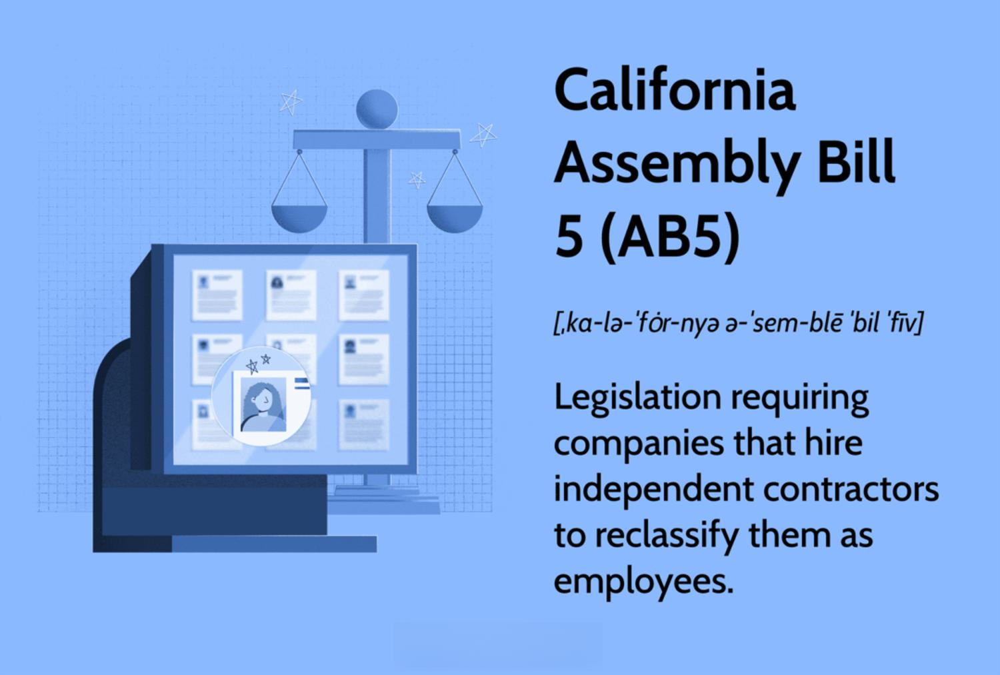

California Assembly Bill 5 (AB5) has significantly transformed the gig economy landscape by redefining how workers are classified within the state. Enacted in 2019, the primary objective of AB5 was to extend employee-like rights to gig workers who were previously categorized as independent contractors. This legislative change has ignited extensive legal and political debates concerning worker classification, revealing a complex interplay between labor rights and business models.

AB5's implementation has far-reaching ramifications for gig workers and businesses. For workers, the reclassification potentially offers benefits such as minimum wage guarantees, health benefits, and job security, which were often elusive under independent contractor status. However, not all gig workers view this shift favorably, as many appreciate the flexibility and autonomy that independent contractor status provides.

For businesses, particularly those heavily dependent on gig workers, AB5 necessitates a reassessment of their workforce structure. Companies may face increased operational costs as they comply with employment laws, which include providing benefits to workers reclassified as employees. This shift has prompted discussions about the sustainability of business models, particularly for companies relying on flexible labor.

The article aims to explore AB5's impact on various stakeholders, with a specific focus on algorithmic or algo trading in California. The legislation's implications for this sector highlight the broader challenges and adaptation strategies businesses must consider under this new regulatory framework. As legal and political debates continue, AB5 serves as a pivotal point in the ongoing conversation about labor rights and the evolving nature of work in a modern economy.

## Table of Contents

## What Is California Assembly Bill 5 (AB5)?

California Assembly Bill 5 (AB5) is a legislative measure enacted in 2019 in California, aimed at revising the classification of workers as either independent contractors or employees. This legislation emerged in response to growing concerns about the rights of gig economy workers, particularly those associated with companies like Uber and Lyft. The central objective of AB5 is to ensure that gig workers are granted rights and benefits typically reserved for employees, such as health insurance, minimum wage, and other employment protections.

The core mechanism through which AB5 seeks to achieve its goals is the implementation of the ABC Test. The ABC Test provides three essential criteria that businesses must satisfy to classify a worker as an independent contractor:

1. **Autonomy**: The worker must be free from the control and direction of the hiring entity in connection with the performance of the work, both under the contract for the performance of the work and in fact.

2. **Business Scope**: The worker must perform work that is outside the usual course of the hiring entity’s business. This criterion ensures that businesses do not misclassify workers who are integral to their primary functions as contractors to avoid providing employee benefits.

3. **Independent Trade**: The worker must be customarily engaged in an independently established trade, occupation, or business of the same nature as the work performed for the hiring entity. This criterion implies that the worker has an existing business or offers their services to the marketplace, independent of the work performed for the business that hires them.

AB5's introduction marks a significant shift in the labor market's framework, promoting fairness and stability by ensuring that workers who meet these criteria receive the appropriate classification and consequent benefits. However, its implementation poses challenges and necessitates adaptations from various industries, particularly those heavily reliant on flexible labor models.

## Understanding the ABC Test

The ABC Test is a fundamental component of California Assembly Bill 5 (AB5), establishing specific criteria for the classification of workers as independent contractors, rather than employees. This classification is essential because it determines the rights and benefits the workers are entitled to, such as minimum wage, health insurance, and job security.

The ABC Test consists of three main criteria:

1. **Autonomy from Control**: The worker must be free from the control and direction of the hiring entity in connection with the performance of the work, both under the contract for the performance of the work and in fact. This criterion assesses the level of independence the worker possesses, focusing on whether control over how the work is conducted is exercised by the hiring company.

2. **Work Outside the Usual Course of Business**: The worker must perform work that is outside the usual course of the hiring entity’s business. For instance, if a delivery company hires a freelance graphic designer to create its logo, this work falls outside the usual delivery services, thus fulfilling this part of the test.

3. **Independent Business or Trade**: The worker must be customarily engaged in an independently established trade, occupation, or business of the same nature as the work performed for the hiring entity. This criterion ensures that the worker independently performs similar work for other companies, indicating a business-centric relationship rather than an employer-employee relationship.

The implications of the ABC Test are widespread, affecting a variety of sectors. By requiring businesses to classify workers more accurately, industries from manufacturing to digital technology must reassess their workforces and potentially reconfigure operational models to comply with the legislation. For example, companies that extensively use freelance workers or contractors need to carefully evaluate their business practices to ensure compliance with AB5, thus avoiding potential legal and financial repercussions. This test impacts traditional and gig economy companies alike, as it reshapes the labor market and redefines the nature of contractual engagements in California.

## Impact on Gig Workers

California Assembly Bill 5 (AB5) seeks to redefine the classification of gig workers, providing them with employee-like rights such as minimum wage, health benefits, and job security. However, the legislation's reception among gig workers is mixed. While some acknowledge the benefits it offers, many value the flexibility, autonomy, and entrepreneurial spirit that comes with being classified as independent contractors. These workers often fear that the constraints associated with employment status—such as fixed schedules and increased oversight—could undermine the freedom that initially attracted them to gig work.

This legislative shift has compelled companies that heavily depend on gig workers to re-evaluate their employment structures. Businesses must now consider whether to classify their workforce as employees to ensure compliance with AB5. This reclassification necessitates offering benefits and adhering to employment laws, a move that could increase operational costs and administrative burdens. Consequently, companies are exploring alternative operational models that might allow them to retain the desired flexibility while complying with regulatory requirements.

The tension between the desire for flexibility and the need for job security underscores a central challenge in regulating the gig economy. The impact of AB5 on gig workers illustrates the complexity of balancing these competing interests while adapting to the evolving landscape of work and employment.

## Impact on Businesses

California Assembly Bill 5 (AB5) has presented substantial challenges for businesses reliant on gig workers. The reclassification of independent contractors as employees mandates compliance with employment laws, necessitating the provision of benefits such as minimum wage, health insurance, and job security, which were traditionally reserved for employees. This shift significantly impacts operational costs for these businesses, as they must either adjust their financial structures to accommodate these new expenses or overhaul their employment models.

For companies heavily leveraged on gig work, such as those in ride-sharing, delivery services, and freelance platforms, the cost implications are profound. The transition from independent contractors to employees implies not only direct costs like salaries and benefits but also indirect costs associated with human resource management and administrative overheads. This increase in operational expenditure might compel companies to increase prices for consumers, a move that could affect their competitive positioning in the market. The equation illustrating the total cost (TC) increase for businesses due to reclassification might be represented as:

$$
TC = FC + VC + B
$$

Where:
- $FC$ represents fixed costs associated with compliance to employment laws.
- $VC$ is the variable cost, which scales with the number of employees due to benefits and wages.
- $B$ denotes other incurred costs such as administrative expenses.

The financial burden induced by AB5 has led some companies to argue that these expenses could disrupt their business models. The intricacy of adhering to the rigorous classification standards, such as the ABC Test, requires that businesses either fundamentally alter how they operate or contend with significant financial penalties. Consequently, some businesses have sought adaptations, such as restructuring their workforce, relying more on automation, or even lobbying for legislative changes, exemplified by Proposition 22. The balance between compliance and maintaining profitability remains a formidable challenge in California under AB5.

## AB2257 and Proposition 22: Amendments and Additional Legislation

Assembly Bill 2257 (AB2257) and Proposition 22 represent significant legislative responses to California Assembly Bill 5 (AB5), addressing the complexities and criticisms associated with worker classification.

Introduced in 2020, AB2257 aimed to refine aspects of AB5 by providing specific exemptions for certain occupations from the stringent ABC Test. This test determines whether a worker is considered an independent contractor or an employee. In particular, AB2257 carved out exemptions for job categories such as freelance writers, musicians, and photographers. The exemptions were designed to recognize the distinct nature of work in these fields, where independence and flexibility are often integral to the professionals involved. For example, freelance writers who submit 35 or fewer articles per year to a single publication are exempted under AB2257, addressing the concerns of media professionals who feared losing autonomy under the original provisions of AB5.

Proposition 22 was a landmark measure passed by California voters in November 2020. It allowed app-based companies like Uber and Lyft to maintain their drivers as independent contractors, countering some of AB5's impacts. This proposition emerged after significant campaigning and financial investment by the gig companies, which argued that driver flexibility was paramount. Proposition 22 introduced specific benefits and protections for these workers, such as minimum earnings guarantees and health care subsidies, without fully transitioning them to employee status. This hybrid model sought to bridge the needs for worker benefits with the existing business models of app-based companies.

These legislative modifications underscore the complexity of worker classification within evolving economic landscapes. The tension between securing worker rights and maintaining business flexibility highlights the contentious nature of this legislative area. The ongoing debates and adjustments reflect broader societal discussions on the future of work and employment in a rapidly changing economy.

## The Role of Algorithmic Trading Under AB5

California Assembly Bill 5 (AB5) has introduced significant changes to workforce classification within the state, with implications for companies engaged in [algorithmic trading](/wiki/algorithmic-trading). These firms typically rely on a flexible workforce, harnessing a mix of employees and independent contractors to develop, maintain, and optimize trading algorithms. AB5's focus on redefining worker classification impacts their operational setup by potentially altering how they can legally engage their workforce.

One of the core elements of AB5 is the ABC Test, which provides a framework to determine whether a worker should be classified as an employee or an independent contractor. The test's criteria are particularly challenging for algorithmic trading firms as they often need to hire specialists for short-term, project-based work. This requirement could force these companies to reclassify many of their contractors as employees, thereby increasing labor costs due to mandatory employee benefits and protections.

Tech companies engaged in algorithmic trading must also contend with regulatory challenges posed by AB5. For instance, the increased operational costs associated with reclassification might lead to prioritizing fewer, more significant projects or reallocating resources to other jurisdictions with more favorable regulatory environments. Additionally, these companies must consider compliance hurdles, involving legal guidance to navigate these new requirements and ensure adherence while maintaining operational efficiency.

Algorithmic trading firms need to re-evaluate their workforce strategies to comply with AB5 without compromising on innovation or competitiveness. This may necessitate investing in a stable core team of employees for critical functions while finding creative ways to engage contractors within the new legal framework. For example, developing robust partnership programs with independent trading algorithm developers who operate their own businesses could satisfy the "B" clause of the ABC Test (work outside the usual business).

From an industry perspective, standardizing classification procedures can reduce ambiguity and enforce fair labor practices. However, it could also stifle the flexibility that algorithmic trading firms value, impacting their ability to rapidly adapt to market changes and develop cutting-edge solutions. This dichotomy poses an ongoing strategic dilemma for tech companies trying to balance the stability offered by employees with the adaptability provided by independent contractors.

## Challenging AB5: Legal and Political Battles

California Assembly Bill 5 (AB5) has encountered substantial opposition and legal challenges from various industries, notably trucking and journalism, due to concerns over its operational feasibility and implications on free speech. The trucking industry has been particularly vocal, arguing that the reclassification of independent contractor drivers into employees disrupts the operational and economic model of the sector. Much of this discontent stems from interpretations of the Federal Aviation Administration Authorization Act (FAAAA), which pre-empts state laws related to the price, route, or service of motor carriers. In 2021, a federal court issued an injunction in favor of the California Trucking Association, temporarily exempting the trucking industry from AB5's provisions, reflecting the ongoing legal struggles.

Journalism also faces hurdles under AB5, with concerns that it curtails freelance journalists' ability to work flexibly, thereby affecting their freedom of expression. Freelancers argue that the bill's stipulations limit the number of articles they can submit to outlets while remaining classified as independent contractors, posing a threat to their income and diverse reportage. These challenges underscore questions about the economic viability and structural adaptations required by these industries under the new legislation.

The legislative terrain around AB5 is further complicated by political interventions and additional statutes, such as Proposition 22, which sought to carve out exceptions for app-based transportation and delivery companies. Court cases continue to test the legislation, reflecting an evolving discourse on labor rights. Advocates of AB5 argue that the bill ensures fair treatment and benefits for workers who have long been disadvantaged by the independent contractor model. However, critics cite increased costs and reduced flexibility as drawbacks, emphasizing the need for a balanced approach to modern economic models and worker classifications.

This legal and political battleground highlights broader societal and economic questions regarding the nature of labor rights in an economy increasingly dominated by flexible and gig-based employment models. The ongoing evolution of policy around AB5 may offer insights into newer frameworks capable of accommodating both workers' rights and businesses' operational needs in a rapidly changing economic landscape.

## Conclusion

California Assembly Bill 5 (AB5) marks a significant shift in how the state approaches gig employment. By enforcing stricter criteria for worker classification through the ABC Test, AB5 aims to secure employment rights such as minimum wage and health benefits for gig workers who might otherwise be classified as independent contractors. This legislative change underscores the ongoing tension between ensuring worker protections and preserving the flexibility that many gig workers and businesses value.

The transition that AB5 mandates poses substantial challenges for businesses, as they must carefully adjust their employment structures to meet compliance requirements without compromising operational efficiency. This reassessment often comes with increased costs, both in terms of offering employee benefits and in adhering to complex labor regulations.

Looking ahead, ongoing legal interpretations and potential future amendments will play critical roles in defining AB5's enduring impact. The introduction of further legislation, such as Proposition 22 and AB2257, illustrates the dynamic and contentious nature of this legislative framework. These developments will likely continue to influence how gig workers are classified, impacting the broader economic landscape and the viability of various business models. As the legal environment evolves, stakeholders will need to remain agile, adapting to new standards and expectations to thrive in California's changing employment landscape.

## References & Further Reading

[1]: ["California Assembly Bill 5 (AB5)"](https://www.investopedia.com/california-assembly-bill-5-ab5-4773201) - California Legislative Information.

[2]: ["Comparative Analysis of the Impact of Assembly Bill 5 on the Gig Economy"](https://www.forbes.com/councils/forbesfinancecouncil/2020/01/10/how-california-assembly-bill-5-affects-the-gig-economy/) by Naomi Ron - Golden Gate University.

[3]: ["AB2257: Worker Classification Exemption"](https://leginfo.legislature.ca.gov/faces/billNavClient.xhtml?bill_id=201920200AB2257) - California Legislative Information.

[4]: ["Proposition 22: App-Based Drivers as Contractors"](https://ballotpedia.org/California_Proposition_22,_App-Based_Drivers_as_Contractors_and_Labor_Policies_Initiative_(2020)) - Official California Voter Information Guide.

[5]: ["Dynamically Changing Employment Classification Laws and Algorithmic Work"](https://journals.law.harvard.edu/crcl/wp-content/uploads/sites/80/2020/10/Rogers.pdf) - The Brookings Institution.

[6]: ["Quantitative Trading: How to Build Your Own Algorithmic Trading Business"](https://www.amazon.com/Quantitative-Trading-Build-Algorithmic-Business/dp/1119800064) by Ernest P. Chan

[7]: ["Algorithmic and High-Frequency Trading"](https://www.cambridge.org/us/universitypress/subjects/mathematics/mathematical-finance/algorithmic-and-high-frequency-trading) by Álvaro Cartea, Sebastian Jaimungal, and José Penalva