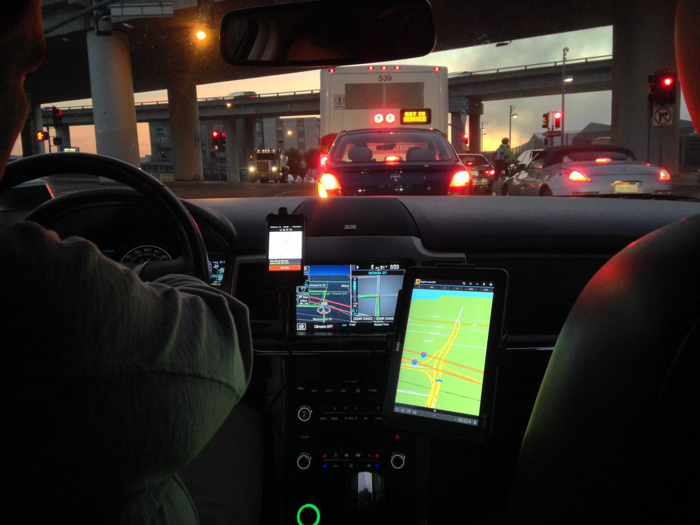

The gig economy has fundamentally transformed traditional labor markets, particularly through the provision of flexible work opportunities that appeal to millions of workers, notably in California. This transformation offers individuals the ability to choose their work hours and environments, meeting diverse needs and preferences unfulfilled by conventional employment structures. California, hosting a substantial portion of gig economy activities, has become a crucial battleground for the evolution of labor laws that address these new industry dynamics.

One of the central figures in this evolving landscape is California's Proposition 22, legislation that significantly influences how gig workers, particularly app-based drivers, are classified. Proposition 22 was primarily introduced as a response to California Assembly Bill 5 (AB5), which sought to reclassify many gig workers as employees rather than independent contractors. The rationale behind Prop 22 revolves around maintaining the flexibility associated with gig work while introducing standards such as minimum earnings guarantees and healthcare subsidies for these workers.

Understanding Prop 22 is crucial for navigating the legal and practical realities faced by gig workers and companies like Uber and Lyft. These businesses and their operational models thrive on the flexibility afforded by the independent contractor classification. However, this classification is not without controversy, as it curtails access to comprehensive employee benefits and protections, sparking legal challenges and public debates.

Beyond its immediate impact on gig workers, Proposition 22 also reflects broader implications for labor laws, especially as technological advancements reshape industries. App-based work can be compared with other evolving sectors, such as algorithmic trading, where flexibility and contract-based roles are becoming more prevalent. Drawing parallels between the gig economy and emerging fields of work sheds light on potential future adaptations of labor laws designed to balance innovation with worker protection.

In this context, California's Proposition 22 serves not only as a pivotal moment in labor law history but also as a template for future discussions on how to harmonize the competing demands of flexibility and worker rights in an increasingly digitized and dynamic economy. As the legal landscape continues to evolve, understanding the nuances of Prop 22 will be essential for stakeholders seeking to navigate the challenges and opportunities presented by the modern gig economy.

## Table of Contents

## Understanding Proposition 22

Proposition 22 is a pivotal regulation that establishes the classification of app-based drivers, such as those working for Uber and Lyft, as independent contractors rather than employees. This classification is significant because it enables drivers to retain the flexibility that many associate with gig work, while also setting forth specific labor and wage policies to ensure a baseline of worker benefits.

The introduction of Proposition 22 was primarily a response to California's Assembly Bill 5 (AB5), which sought to impose stricter criteria for classifying workers as independent contractors. AB5 aimed to expand employee status to include many gig workers, thereby granting them access to traditional employment benefits such as minimum wage protections, healthcare, and unemployment insurance. However, this reclassification was met with opposition from gig economy giants, who argued that it threatened their operational models and the flexibility valued by their workforce.

Proposition 22, passed in November 2020 through a ballot measure, included several stipulations to reinforce its classification framework while offering some worker benefits. Under this legislation, app-based drivers are assured minimum earnings calculated as 120% of the local minimum wage, compensation for vehicle expenses, and access to healthcare subsidies if they meet a threshold of weekly driving hours. For instance, if the local minimum wage is $w$ per hour, drivers would earn at least $1.2 \times w$ per hour for engaged time, defined as time spent driving to or transporting passengers.

The proposition's implementation has not been without legal disputes. Critics argue that the measure insufficiently addresses the need for comprehensive worker protections, challenging its constitutionality and fairness. Despite these challenges, the California Supreme Court's recent decision to uphold Proposition 22 confirms its continued applicability, providing a framework that appeases both business interests and a baseline level of driver benefits.

The legal affirmation of Proposition 22 not only impacts the state's gig economy but also sets a precedent for other regions grappling with similar labor classifications. As such, it represents a critical juncture in the ongoing debate over how best to balance the labor needs of evolving business models with worker rights and protections.

## Implications for Gig Workers in California

Proposition 22 presents a complex landscape for gig workers in California by blending elements of both employee and independent contractor models. While it brings certain advantages, it equally withholds several benefits typically associated with traditional employment. One of the primary attractions of Prop 22 is the flexibility it offers gig workers, enabling them to set their own schedules and choose the quantity of work they wish to undertake. However, this flexibility comes at a cost, as gig workers are predominantly classified as independent contractors under this legislation, excluding them from accessing comprehensive employee rights such as workers' compensation and unemployment insurance.

The debate around Proposition 22 persistently underscores the disparities in benefits and protections compared to those available in traditional employment settings. For example, although gig workers under Prop 22 are entitled to a guaranteed minimum level of earnings and healthcare subsidies, these provisions fall short of the full spectrum of benefits like health insurance, retirement plans, and paid leave, which are accessible to full-time employees. This situation creates a significant gap in the social safety net for gig workers and has been a focal point for critics who argue that this model does not do enough to protect workers' rights.

The discourse surrounding Proposition 22 continues to evolve, with various stakeholders, including worker advocacy groups and unions, advocating for reforms. These groups argue for legislative amendments to either revise or enhance Prop 22’s provisions, aiming for a more balanced approach that combines the flexibility of gig work with the essential protections typical of traditional employment.

Future legislative and union efforts are likely to focus on addressing these disparities by potentially introducing new laws or provoking revisions to existing ones. The evolving nature of gig work and its regulatory environment suggests that stakeholder negotiations and potential legal challenges will continue to shape the labor landscape for gig workers in California. The ultimate aim of these efforts is to ensure that gig workers can enjoy both the autonomy that comes with independent contracting and the security inherent in traditional employment frameworks.

## Economic and Business Perspectives on Prop 22

Uber, Lyft, and other gig-based enterprises experience significant economic advantages under Proposition 22, which classifies their drivers as independent contractors rather than employees. This classification allows these companies to reduce operational costs associated with traditional employee benefits like health insurance and workers' compensation. A study by the UC Berkeley Labor Center found that if workers were treated as employees, it would increase labor costs for these companies by 20-30% due to added benefits and protections. 

This cost-saving measure promotes a scalable and flexible business model that is pivotal to the gig economy's expansion. The ability to adjust the workforce in real-time without the constraints of traditional employment agreements allows companies to respond rapidly to market demands. This flexibility supports operational efficiency and innovation, fostering continuous growth and adaptation in a competitive marketplace.

However, this business model is not without challenges. Regulatory and legal issues persist, as there is ongoing scrutiny over the rights of gig workers. In 2021, the California Supreme Court's ruling reaffirming Prop 22's legality emphasized the importance of compliance with state laws, yet the legal battles are far from over. For instance, some argue that Prop 22 limits workers' rights and access to essential benefits, prompting calls for legislative amendments or new laws that could mitigate these concerns. 

The equilibrium between maintaining business flexibility and protecting worker rights remains a topic of significant debate. Companies like Uber and Lyft argue that the freedom offered by Prop 22 aligns with the preferences of many gig workers who prioritize flexibility. However, labor advocates highlight the disparities between gig work and traditional employment, pointing to a need for enhanced protections to ensure fair compensation and benefits.

Balancing these interests is essential for the sustainable development of the gig economy. As the conversation progresses, it is likely that both businesses and policymakers will need to collaborate to forge a path that acknowledges technological advancements while safeguarding worker interests.

## Algorithmic Trading in the Gig Economy

Algorithmic trading has increasingly adopted the gig economy model, appealing to individuals who prioritize flexibility and the ability to work independently. Traders employing algorithms often engage in trading as independent contractors rather than traditional employees, akin to the app-based drivers affected by California's Proposition 22. This contractual framework allows algo traders to dictate their schedules, much like gig drivers select their rides, emphasizing the shared ethos of autonomy and temporal flexibility. 

However, this flexibility comes with unique challenges, particularly regarding regulatory compliance, risk management, and financial safeguards. Traders must adhere to complex financial regulations, such as those imposed by the U.S. Securities and Exchange Commission (SEC) and the Commodity Futures Trading Commission (CFTC), which govern trading practices to ensure market integrity and protect investors. Compliance with these regulations requires a thorough understanding of financial laws and robust systems to monitor and report trading activities accurately. For instance, implementing risk management strategies through algorithms necessitates constant monitoring and adjustments based on market conditions, requiring both technological proficiency and financial acumen.

The parallels between Prop 22 and [algorithmic trading](/wiki/algorithmic-trading) offer valuable insights into potential adaptations in labor laws. Proposition 22 exempts app-based drivers from certain labor protections typically reserved for employees, which could set a precedent for how independent contractors like algo traders are treated under labor regulations. For instance, if gig economy legislation were to expand its scope to include sectors like finance, it might necessitate a reevaluation of protections such as unemployment benefits or insurance, traditionally unavailable to independent contractors. 

Understanding these parallels helps project how gig economy principles might extend into other technologically driven sectors. As financial markets continue to evolve, the legal frameworks governing who qualifies as a worker may require revisions to accommodate new types of employment relationships fostered by technological advancements. This continuous adaptation will be crucial for ensuring that innovation in sectors like algorithmic trading does not outpace the development of labor protections essential for maintaining fair and equitable employment practices.

## Conclusion

Proposition 22 serves as a significant milestone in the regulation of gig economy labor laws in California. By affirming the classification of app-based drivers as independent contractors, this legislation provides businesses with a framework that supports operational flexibility and scalability. While this clarity is advantageous for companies like Uber and Lyft, it also opens up a landscape fraught with ongoing legal and regulatory challenges.

The dynamic between gig work principles and technological advancements, such as algorithmic trading, holds the potential to significantly reshape future labor markets. Both sectors prioritize flexibility and contract-based engagements, yet they face shared challenges in regulatory compliance and risk management. For instance, just as algorithmic traders must account for financial safeguards in fluctuating markets, gig platforms must navigate the complexities of worker protections and benefits.

Sustainable growth in these sectors hinges on striking a balance between fostering innovation and ensuring adequate protection for workers. As the gig economy and technological landscapes continue to evolve, future legislative efforts and policy adaptations will play a critical role in shaping labor markets that are equitable and forward-thinking. The challenge lies in crafting regulations that support both economic growth and fair labor standards in an ever-changing digital economy.

## References & Further Reading

[1]: Dubal, V. B. (2020). ["The Drive to Precarity: A Political History of Work, Regulation, & Labor Advocacy in San Francisco's Gig Economy."](https://www.researchgate.net/publication/343125110_The_Drive_to_Precarity_A_Political_History_of_Work_Regulation_Labor_Advocacy_in_San_Francisco's_Taxi_Uber_Economies) Berkeley Journal of Employment and Labor Law.

[2]: Rogers, B., & Donini, A. (2020). ["Proposition 22 and the Push to Classify Workers as 'Independent Contractors'."](https://www.washingtonpolicy.org/publications/detail/the-constitutionality-of-california-proposition-22-classifying-gig-workers-as-independent-contractors-to-be-decided-by-the-california-supreme-court) Harvard Law Review Blog.

[3]: Ridesharing Law Update. ["The Impacts of California's Proposition 22 on Gig Workers."](https://www.reuters.com/legal/legalindustry/californias-prop-22-classifying-ride-sharing-drivers-independent-contractors-is-2024-08-22/) University of Chicago Law Review Online.

[4]: Mishel, L. (2020). ["Uber and Lyft Are Losing Proposition 22: Here’s Why That’s Important."](https://www.sciencedirect.com/science/article/pii/S2589004220311305) Economic Policy Institute.

[5]: ["Revolutionizing Labor Law with Proposition 22."](https://www.callaborlaw.com/entry/california-supreme-court-upholds-proposition-22-what-it-means-for-gig-economy-workers-and-companies) The New York Times.

[6]: ["Platform Work and the New Workplace Tyranny."](https://global-workplace-law-and-policy.kluwerlawonline.com/2021/03/31/platform-work-and-the-employment-relationship-a-global-overview/) Organization Studies.

[7]: Sundararajan, A. (2016). ["The Sharing Economy: The End of Employment and the Rise of Crowd-Based Capitalism."](https://www.jstor.org/stable/j.ctt1c2cqh3) MIT Press.

