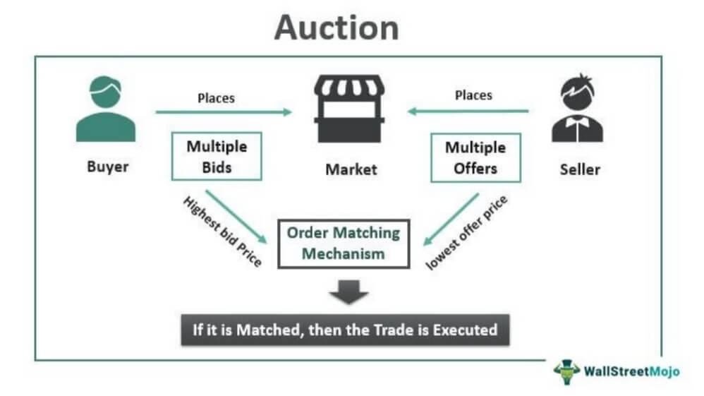

Understanding different market mechanisms is a fundamental aspect for investors and traders navigating today's complex financial ecosystems. Among these mechanisms, the call auction trading process, along with continuous market systems, stands out due to their pivotal roles in financial markets. Call auctions consolidate buy and sell orders which are executed at pre-specified times and at a uniform price, contrasting with continuous markets where trades are executed as orders are received. As financial markets continue to evolve with advancements in technology, the relevance of these trading processes in optimizing trading strategies has become increasingly apparent. Algorithmic trading, which uses data and pre-defined rules for making trading decisions, further exemplifies this evolution. It helps in optimizing order placement and timing by assessing vast amounts of market data, thereby aligning with the periodic nature of call auctions or providing flexibility in continuous markets. The aim of this article is to explore the call auction trading process, its working mechanisms, and how these processes are integrated with algorithmic trading to enhance trading efficiency and strategy optimization.

## Table of Contents



## What is Call Auction Trading?

Call auction trading is a process in financial markets where buy and sell orders are aggregated and executed at predetermined times at a single uniform price. Unlike continuous trading, where trades occur immediately as orders are matched, call auctions occur at specific intervals, typically marking the opening or closing of a trading session. This method is commonly employed in major stock exchanges to provide a defined structure to the trading day, enhancing market stability.

In the call auction system, all buy and sell orders are submitted during a designated call phase, with the execution price determined once trading actually commences. During this phase, traders do not have information about the execution price, which is only established once orders are matched. This uniform pricing serves to consolidate liquidity and minimize volatility that may arise from fragmented trading over time. The primary objective of a call auction is to determine a price that maximizes the total volume of transactions executed, ensuring optimal market functioning.

Mathematically, the process can be framed as an optimization problem. Let $Q_b(p)$ and $Q_s(p)$ represent quantities of buy and sell orders at price $p$, respectively. The equilibrium price $P_e$ is the price that maximizes the total executed volume $V$, defined as:

$$
V = \min(Q_b(P_e), Q_s(P_e))
$$

This fosters efficient price discovery by consolidating trades at a single point in time, potentially reducing transaction costs and enhancing transparency.

Call markets are integral during the opening and closing sessions of trading on major exchanges like the New York Stock Exchange (NYSE) and the Tokyo Stock Exchange (TSE). During these intervals, a large [volume](/wiki/volume-trading-strategy) of orders is concentrated, providing optimal conditions for price setting and market stability. By concentrating trading into discrete moments, call auctions provide critical periodic [liquidity](/wiki/liquidity-risk-premium), smoothing price transitions and limiting undue fluctuations at the market's open and close.

## Mechanics of the Call Auction Process

In the call auction trading process, traders participate by submitting their buy and sell orders during a designated call phase. During this phase, traders do not have visibility on the eventual execution price of their orders. Instead, they rely on the mechanism inherent to call auctions to determine the final price. Once the call phase concludes, all orders are processed and matched at a predetermined auction time. The defining feature of a call auction is the computation of a single price that clears the greatest possible trade volume, which is a characteristic known as the clearing price.

The clearing price is found by identifying the price point at which the number of shares demanded by buyers equals the number of shares available from sellers, thereby maximizing the trading volume. This process can be visualized using a simple supply and demand model where the intersection of aggregated supply and demand curves determines the optimal transaction price. Mathematically, this can be represented by optimizing the trade volume $V$ as follows:

$$
V = \max \left( \sum_{i=1}^{n} \min(Q_{\text{buy\_i}}, Q_{\text{sell\_i}}) \right)
$$

where $Q_{\text{buy\_i}}$ is the quantity of the $i$-th buy order at a given price and $Q_{\text{sell\_i}}$ is the quantity of the corresponding sell orders.

Beyond just matching trades, market makers are fundamental to call auctions, as they provide liquidity and ensure that the auction operates smoothly. Their role includes maintaining order in the market by being ready to buy and sell a security when sufficient orders are not present, thus preventing significant price deviations and fostering a stable market environment. Their active participation helps in bridging the gap between supply and demand during the times of low liquidity, mitigating the risk of extreme [volatility](/wiki/volatility-trading-strategies), and enhancing the robustness of the call auction process.

## Advantages of Call Auction Systems

Call auctions offer significant advantages over continuous trading systems through their unique approach to order execution:

1. **Increased Market Liquidity**: One of the primary benefits of call auction systems is their ability to pool small orders to facilitate larger trades, thereby increasing market liquidity. By aggregating buy and sell orders at predetermined intervals, call auctions create a more liquid environment where trades that may not have been possible in a fragmented continuous market can seamlessly occur.

2. **Improved Price Discovery and Transparency**: Call auctions enhance price discovery and transparency by consolidating all orders into a single transaction price. This uniform pricing mechanism allows for a clear market consensus at each auction, reducing the noise and potential for price manipulation that can occur in continuous trading. The simultaneous matching of orders based on supply and demand dynamics provides a more accurate reflection of a security's value at that specific time.

3. **Reduced Transaction Costs**: By concentrating orders into single transactions, call auctions can significantly reduce the transaction costs associated with trading. The efficiency of processing multiple orders at a single price reduces the bid-ask spread and diminishes the market impact costs. This results in cost savings for traders and investors, making call auctions an attractive alternative to continuous trading, particularly for institutional investors managing large volumes. 

The aggregation and periodic execution characteristics of call auctions present a strategic advantage for those seeking liquidity, cost efficiency, and transparent pricing, thus playing a pivotal role in modern financial marketplaces.

## Call Auctions vs. Continuous Trading

Continuous trading markets and call auction systems represent two primary methods of executing trades in financial markets, each with distinct characteristics and benefits. Continuous trading markets facilitate real-time order matching, allowing trades to be executed instantly whenever buy and sell orders align. This approach offers participants significant flexibility, enabling them to respond immediately to market developments and adjust their positions as needed. 

In contrast, call auctions concentrate trading activity at specified times, usually at the market's open and close, or during specially designated sessions. During these periods, buy and sell orders are aggregated and matched at a single clearing price. This consolidation results in improved liquidity by pooling orders, potentially providing better price stability and reducing price volatility compared to continuous trading.

The structured nature of call auctions can lead to more efficient price discovery, as the accumulation of multiple orders over a set period provides a clearer picture of buy and sell interest at different price levels. Additionally, the singular transaction price determined in these auctions enhances market transparency and aligns with auction theory's principles, where goods are sold at a price that maximizes the volume traded while minimizing the spread between buyers and sellers.

Participants in financial markets must weigh the benefits and drawbacks of each system. Continuous trading provides near-instantaneous execution, which is crucial in high-frequency trading strategies and volatile markets where rapid reaction times are necessary. Conversely, call auctions may appeal to those who prioritize reduced transaction costs and minimal market impact during execution. The choice between these trading mechanisms will depend on the individual's or institution's specific trading objectives and risk tolerance. 

In summary, continuous trading markets and call auction systems each offer unique advantages. Traders must select the method that best aligns with their strategic goals, considering the trade-off between the adaptability of continuous trading and the liquidity and potential cost benefits of call auctions.

## Role of Algorithmic Trading in Call Auctions

Algorithmic trading plays a significant role in the functionality and efficiency of call auctions by analyzing vast amounts of market data to make informed trading decisions. Algorithms are programmed to process historical and real-time data to identify potential trading opportunities and make predictions about future market movements. This capability allows them to optimize order placement and timing, which is critical in call auctions due to their periodic nature.

In call auctions, where trades are executed at a single uniform price at specified times, the timing and size of orders can greatly influence the auction outcome. Algorithms can be tailored to assess the liquidity, price trends, and market sentiment to decide the optimal timing for placing orders. These algorithms can include [machine learning](/wiki/machine-learning) models, which are trained to recognize complex patterns in data that might be imperceptible to human traders.

Moreover, [algorithmic trading](/wiki/algorithmic-trading) enhances the efficiency of trading strategies by automating the decision-making process and reducing the risk of human error. Algorithms can swiftly react to market conditions and adjust strategies accordingly, ensuring that traders can capitalize on favorable conditions during the call auction process.

For example, consider an algorithm that continuously monitors the [order book](/wiki/order-book-trading-strategies) and price trends to predict the likely auction price. The algorithm can use a weighted moving average, calculated as:

$$
WMA_t = \frac{\sum_{i=1}^{n} w_i p_{t-i+1}}{\sum_{i=1}^{n} w_i}
$$

where $p_{t-i+1}$ is the price at time $t-i+1$, and $w_i$ represents the weight assigned to each price, giving more importance to recent prices. This information can help optimize the bid or ask prices submitted during the auction.

Python algorithms can be implemented to facilitate these processes. For instance, an algorithm can be developed to analyze historical data and dynamically adjust order limits based on predicted volatility:

```python
import numpy as np
import pandas as pd

# Simulated function for call auction analysis
def call_auction_analysis(data):
    # Calculate weighted moving average
    weights = np.arange(1, len(data) + 1)
    wma = np.dot(data['price'], weights) / weights.sum()

    # Determine order size based on volatility
    volatility = data['price'].pct_change().std()
    order_size = max(1, int(100 / volatility))

    return wma, order_size

# Example usage with simulated data
data = pd.DataFrame({
    'price': [100, 102, 105, 103, 101]
})
predicted_price, optimal_order_size = call_auction_analysis(data)
print(f"Predicted Auction Price: {predicted_price}, Optimal Order Size: {optimal_order_size}")
```

This code calculates the weighted moving average of prices to anticipate the auction price and adjusts the order size based on market volatility.

Algorithmic trading is not only pivotal in optimizing individual strategies in call auctions but also contributes to overall market efficiency. It ensures that available information is systematically and swiftly processed, enhancing liquidity and stability within the market. As algorithms become more sophisticated with advancements in technology, their role in call auctions is expected to expand, providing even greater precision and reliability in trading activities.

## Technological Innovations Shaping Call Auctions

Technological innovations are critically reshaping the landscape of call auction trading, enhancing its functionality and efficiency. Among these advancements, [artificial intelligence](/wiki/ai-artificial-intelligence) (AI) and machine learning play a pivotal role by providing sophisticated predictive analytics. These technologies analyze historical and real-time data to forecast market trends and price movements with remarkable accuracy. By leveraging pattern recognition and statistical analysis, AI can anticipate fluctuations in asset prices, enabling investors to optimize their participation in call auctions. This results in more informed decision-making and potentially higher returns by aligning trading strategies with anticipated market conditions.

Blockchain technology further advances call auctions by ensuring transparency and security. Its decentralized and immutable nature allows for a clear and tamper-proof record of transactions. Each transaction recorded on a blockchain is verifiable and traceable, reducing the potential for fraud and increasing trust among participants. Blockchain's transparency ensures that all stakeholders have access to the same information, promoting fairer trading practices and reducing information asymmetry. Additionally, its security features safeguard against unauthorized alterations, thus maintaining the integrity of the auction process.

Smart contracts, built on blockchain platforms, introduce automation in order matching during call auctions. These self-executing contracts contain the terms of the agreement between buyers and sellers, coded directly into lines of blockchain code. Once predetermined conditions are met, such as a specific price level, the contract automatically executes the trade. This automation enhances the speed and reliability of transactions, minimizing human intervention and errors. Smart contracts facilitate faster settlement times, encouraging greater participation and liquidity in call auctions by providing a seamless trading experience.

Together, AI, blockchain, and smart contracts are transforming call auction trading by increasing its accuracy, security, and efficiency. As these technologies continue to evolve, they promise to further refine the mechanisms of call auctions, offering traders a robust toolset for navigating modern financial markets.

## Conclusion

Call auctions serve as an essential mechanism within financial markets, offering distinctive advantages compared to continuous trading systems. By aggregating buy and sell orders and executing them at a single price, call auctions enhance market liquidity, improve price discovery, and provide a transparent trading environment. This systematic approach minimizes volatility and facilitates efficient trading, especially during market opening and closing sessions.

The integration of algorithmic trading with call auction systems significantly enhances their effectiveness. Algorithms, by analyzing vast amounts of market data, optimize order placement and timing, which aligns well with the periodic nature of call auctions. This not only maximizes trade volumes but also ensures that traders can achieve better price outcomes by leveraging advanced data-driven strategies.

For traders and investors, comprehending these sophisticated trading mechanisms is crucial. An understanding of call auctions, coupled with the ability to utilize algorithmic strategies, empowers participants to navigate today's dynamic trading environments. The combined strength of these approaches enables market participants to make informed decisions that may lead to optimized returns and reduced transaction costs. As financial markets continue evolving with technological advancements, staying informed about these mechanisms is imperative for maintaining a competitive edge.

## References & Further Reading

[1]: Amihud, Y., Mendelson, H., & Lauterbach, B. (1997). ["Market Microstructure and Securities Values: Evidence from the Tel Aviv Stock Exchange."](https://www.sciencedirect.com/science/article/pii/S0304405X97000214) Journal of Financial Economics, 45(3), 365-390.

[2]: Madhavan, A. (1992). ["Trading Mechanisms in Securities Markets."](https://onlinelibrary.wiley.com/doi/abs/10.1111/j.1540-6261.1992.tb04403.x) The Journal of Finance, 47(2), 607-641.

[3]: Schwartz, R. A., & Francioni, R. (2004). ["Equity Markets in Action: The Fundamentals of Liquidity, Market Structure & Trading"](https://books.google.com/books/about/Equity_Markets_in_Action.html?id=fPV16sxH8oUC). Wiley.

[4]: Gomber, P., Schweickert, U., & Theissen, E. (2015). ["Liquidity and Price Discovery in Call Auction and Continuous Trading Systems."](https://www.italianhousesforsale.com/property-in-italy/property-for-sale-in-passignano-sul-trasimeno-perugia-umbria-ge9048/) Economic Modelling, 48, 226-237.

[5]: Lopez de Prado, M. (2018). ["Advances in Financial Machine Learning."](https://www.amazon.com/Advances-Financial-Machine-Learning-Marcos/dp/1119482089) Wiley.

[6]: Bank for International Settlements. (2016). ["Market Liquidity – Resilient or Fleeting?"](https://www.bis.org/publ/cgfs55.pdf) 

[7]: Chan, E. (2009). ["Quantitative Trading: How to Build Your Own Algorithmic Trading Business."](https://github.com/ftvision/quant_trading_echan_book) Wiley.