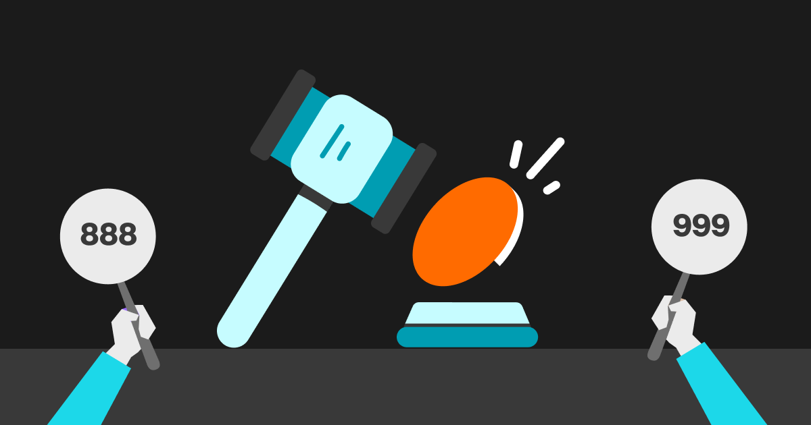

## Table of Contents

## What is a call auction?

A call auction is a way to set the price of a stock or other security at certain times during the trading day. Instead of buying and selling happening all the time, everyone who wants to buy or sell a stock puts in their orders at the same time. Then, a special person or computer looks at all the orders and decides on one price that makes the most people happy. This price is called the auction price, and all the trades happen at this price.

Call auctions are used at the start and end of the trading day, and sometimes during the day too. They help make sure that the price of a stock is fair and reflects what most people think it should be. This can be especially helpful when there's a lot of excitement or uncertainty about a stock, because it stops the price from moving too wildly. By using a call auction, the stock market can be more stable and fair for everyone.

## How does a call auction differ from continuous trading?

A call auction and continuous trading are two different ways to buy and sell stocks. In a call auction, everyone who wants to buy or sell a stock puts in their orders at the same time. Then, a special person or computer looks at all the orders and picks one price that works for the most people. This price is used for all the trades that happen during the auction. Call auctions usually happen at the start and end of the trading day, or when there's a big event that might affect the stock's price.

Continuous trading is different because buying and selling can happen all the time during the trading day. Instead of waiting for a specific time, people can trade whenever they want. The price of the stock can change a lot because it's based on the latest trades. This can make the price go up and down quickly, which is good for some people but can be risky for others. Continuous trading is what most people think of when they imagine the stock market, with lots of activity happening all day long.

## What are the main purposes of conducting a call auction?

The main purpose of conducting a call auction is to set a fair price for a stock at certain times of the trading day. Instead of letting the price jump around wildly, a call auction gathers all the buy and sell orders at once and finds a price that works for the most people. This helps make sure that the price of the stock reflects what everyone thinks it should be, not just what a few people want.

Call auctions are also used to help keep the stock market stable, especially during times when there's a lot of excitement or uncertainty about a stock. By pausing trading and using a call auction, the market can avoid big price swings that might happen if everyone was trading at the same time. This can be really helpful at the start and end of the trading day, or when there's big news that could affect a stock's price.

## Can you explain the process of a call auction?

A call auction happens when everyone who wants to buy or sell a stock puts in their orders at the same time. This usually happens at the start and end of the trading day, or during big events that might affect the stock's price. People say how many shares they want to buy or sell, and what price they're willing to pay or accept. All these orders go into a big list, and a special person or computer looks at the list to find a price that makes the most people happy.

Once the special person or computer finds the best price, that price is used for all the trades that happen during the auction. This price is called the auction price. If you wanted to buy at a higher price or sell at a lower price, you still get the auction price. This way, everyone gets a fair deal, and the stock's price stays stable. After the auction is over, trading can go back to normal, with people buying and selling whenever they want.

## What types of securities typically use call auctions?

Call auctions are used for many types of securities, like stocks, bonds, and exchange-traded funds (ETFs). Stocks are the most common type of security that uses call auctions. They are used at the start and end of the trading day to set a fair price for the stock before and after regular trading hours. This helps make sure that the price of the stock reflects what most people think it should be, not just what a few people want.

Bonds and ETFs can also use call auctions, especially when there's a lot of excitement or uncertainty about them. For example, if there's big news that might affect the price of a bond or an [ETF](/wiki/etf-trading-strategies), a call auction can help keep the price stable. By pausing trading and using a call auction, the market can avoid big price swings that might happen if everyone was trading at the same time. This can be really helpful for making sure that the price stays fair and stable for everyone.

## How is the equilibrium price determined in a call auction?

In a call auction, the equilibrium price is the price that makes the most people happy. It's found by looking at all the buy and sell orders that people put in at the same time. The special person or computer adds up all the shares that people want to buy and all the shares that people want to sell at different prices. The goal is to find a price where the number of shares people want to buy equals the number of shares people want to sell. This price is called the equilibrium price because it balances out the supply and demand for the stock.

Once the special person or computer finds this equilibrium price, it becomes the auction price. All the trades that happen during the auction will be at this price. If you wanted to buy at a higher price or sell at a lower price, you still get the auction price. This way, everyone gets a fair deal, and the stock's price stays stable. After the auction is over, trading can go back to normal, with people buying and selling whenever they want.

## What are the advantages of using a call auction mechanism?

Using a call auction helps set a fair price for a stock by gathering all the buy and sell orders at the same time. Instead of letting the price jump around wildly, a call auction finds a price that works for the most people. This means the stock's price reflects what everyone thinks it should be, not just what a few people want. It's like taking a big group vote on the stock's price, making sure it's fair and balanced.

Call auctions also help keep the stock market stable, especially during times when there's a lot of excitement or uncertainty about a stock. By pausing trading and using a call auction, the market can avoid big price swings that might happen if everyone was trading at the same time. This can be really helpful at the start and end of the trading day, or when there's big news that could affect a stock's price. It's a way to make sure the market stays calm and fair for everyone.

## What are the potential disadvantages or limitations of call auctions?

One potential disadvantage of call auctions is that they can slow down trading. Instead of letting people buy and sell stocks whenever they want, everyone has to wait for the auction to finish. This can be frustrating for people who want to trade quickly, especially if they think the price of a stock is going to change a lot soon. It's like having to wait in line when you want to do something right away.

Another limitation is that call auctions might not always find the best price for a stock. Even though they try to make everyone happy, sometimes the auction price can be different from what the stock would be worth if people were trading all the time. This can happen if there's not enough information about the stock, or if the auction happens at a time when not many people are trading. It's like trying to guess the right price when you don't have all the pieces of the puzzle.

## How do call auctions impact market liquidity and volatility?

Call auctions can impact market liquidity by temporarily pausing trading to gather all buy and sell orders at the same time. This pause can make it harder for people to trade quickly, which might reduce the number of trades happening. If fewer people are trading, it can make the market less liquid, meaning it's harder to buy or sell stocks without affecting their price. On the other hand, call auctions can help increase liquidity at the start and end of the trading day by setting a fair price that encourages more people to trade.

When it comes to volatility, call auctions can help reduce big price swings. By collecting all the orders and finding a price that makes the most people happy, call auctions can keep the price of a stock from moving too wildly. This is especially helpful during times of big news or excitement about a stock. However, call auctions can also lead to more volatility right after the auction ends, as people start trading again and the price can change quickly based on new trades.

## What role do call auctions play in opening and closing market sessions?

Call auctions play a big role in setting the price of stocks at the start and end of the trading day. At the opening of the market, a call auction helps find a fair price for the stock before regular trading begins. Everyone who wants to buy or sell puts in their orders at the same time, and a special person or computer looks at all the orders to find a price that works for the most people. This helps make sure the price of the stock reflects what everyone thinks it should be, not just what a few people want. It's like taking a big group vote on the stock's price to make sure it's fair and balanced.

At the end of the trading day, another call auction happens to set the closing price of the stock. This closing price is important because it's used to figure out how much money people have made or lost that day. Just like at the opening, everyone puts in their orders at the same time, and the special person or computer finds a price that balances out the supply and demand. By using a call auction to close the market, it helps keep the price stable and fair, even if there's been a lot of excitement or uncertainty about the stock during the day.

## Can you discuss any notable case studies or examples where call auctions were effectively used?

One notable example of call auctions being effectively used is in the New York Stock Exchange (NYSE). The NYSE uses call auctions at the start and end of each trading day to set the opening and closing prices of stocks. This helps make sure that the prices are fair and reflect what most people think they should be. For example, if there's big news about a company overnight, the call auction at the opening can help set a stable price for the stock before regular trading begins. This keeps the market calm and fair, even when there's a lot of excitement or uncertainty.

Another example is the use of call auctions during times of high market volatility, like during the financial crisis of 2008. Some stock exchanges used call auctions to pause trading and find a fair price for stocks when the market was very unstable. By gathering all the buy and sell orders at the same time, call auctions helped prevent big price swings and kept the market from getting too wild. This was important for keeping the market stable and making sure that the prices of stocks were as fair as possible during a very tough time.

## What advanced strategies can traders employ during a call auction?

Traders can use different strategies during a call auction to try and get the best price for their stocks. One strategy is to place their orders early in the auction period. By doing this, traders can influence the auction price because their orders are part of the first set of data the special person or computer looks at. If a trader thinks the stock's price will go up, they might put in a buy order at a higher price to push the auction price up. On the other hand, if they think the price will go down, they might put in a sell order at a lower price to push the auction price down.

Another strategy is to use limit orders during the call auction. A limit order lets a trader say the highest price they're willing to pay to buy a stock or the lowest price they're willing to accept to sell a stock. By using limit orders, traders can make sure they get a price they're happy with, even if it's different from the auction price. This can be helpful if a trader thinks the auction price might not be the best price for the stock. By setting a limit order, they can still get a fair deal and protect themselves from big price swings.

## What is Call Auction Trading?

Call auction trading is a process in financial markets where buy and sell orders are aggregated and executed at predetermined times at a single uniform price. Unlike continuous trading, where trades occur immediately as orders are matched, call auctions occur at specific intervals, typically marking the opening or closing of a trading session. This method is commonly employed in major stock exchanges to provide a defined structure to the trading day, enhancing market stability.

In the call auction system, all buy and sell orders are submitted during a designated call phase, with the execution price determined once trading actually commences. During this phase, traders do not have information about the execution price, which is only established once orders are matched. This uniform pricing serves to consolidate liquidity and minimize volatility that may arise from fragmented trading over time. The primary objective of a call auction is to determine a price that maximizes the total volume of transactions executed, ensuring optimal market functioning.

Mathematically, the process can be framed as an optimization problem. Let $Q_b(p)$ and $Q_s(p)$ represent quantities of buy and sell orders at price $p$, respectively. The equilibrium price $P_e$ is the price that maximizes the total executed volume $V$, defined as:

$$
V = \min(Q_b(P_e), Q_s(P_e))
$$

This fosters efficient price discovery by consolidating trades at a single point in time, potentially reducing transaction costs and enhancing transparency.

Call markets are integral during the opening and closing sessions of trading on major exchanges like the New York Stock Exchange (NYSE) and the Tokyo Stock Exchange (TSE). During these intervals, a large [volume](/wiki/volume-trading-strategy) of orders is concentrated, providing optimal conditions for price setting and market stability. By concentrating trading into discrete moments, call auctions provide critical periodic [liquidity](/wiki/liquidity-risk-premium), smoothing price transitions and limiting undue fluctuations at the market's open and close.

## What are the Mechanics of the Call Auction Process?

In the call auction trading process, traders participate by submitting their buy and sell orders during a designated call phase. During this phase, traders do not have visibility on the eventual execution price of their orders. Instead, they rely on the mechanism inherent to call auctions to determine the final price. Once the call phase concludes, all orders are processed and matched at a predetermined auction time. The defining feature of a call auction is the computation of a single price that clears the greatest possible trade volume, which is a characteristic known as the clearing price.

The clearing price is found by identifying the price point at which the number of shares demanded by buyers equals the number of shares available from sellers, thereby maximizing the trading volume. This process can be visualized using a simple supply and demand model where the intersection of aggregated supply and demand curves determines the optimal transaction price. Mathematically, this can be represented by optimizing the trade volume $V$ as follows:

$$
V = \max \left( \sum_{i=1}^{n} \min(Q_{\text{buy\_i}}, Q_{\text{sell\_i}}) \right)
$$

where $Q_{\text{buy\_i}}$ is the quantity of the $i$-th buy order at a given price and $Q_{\text{sell\_i}}$ is the quantity of the corresponding sell orders.

Beyond just matching trades, market makers are fundamental to call auctions, as they provide liquidity and ensure that the auction operates smoothly. Their role includes maintaining order in the market by being ready to buy and sell a security when sufficient orders are not present, thus preventing significant price deviations and fostering a stable market environment. Their active participation helps in bridging the gap between supply and demand during the times of low liquidity, mitigating the risk of extreme [volatility](/wiki/volatility-trading-strategies), and enhancing the robustness of the call auction process.

## What is the role of algorithmic trading in call auctions?

Algorithmic trading plays a significant role in the functionality and efficiency of call auctions by analyzing vast amounts of market data to make informed trading decisions. Algorithms are programmed to process historical and real-time data to identify potential trading opportunities and make predictions about future market movements. This capability allows them to optimize order placement and timing, which is critical in call auctions due to their periodic nature.

In call auctions, where trades are executed at a single uniform price at specified times, the timing and size of orders can greatly influence the auction outcome. Algorithms can be tailored to assess the liquidity, price trends, and market sentiment to decide the optimal timing for placing orders. These algorithms can include [machine learning](/wiki/machine-learning) models, which are trained to recognize complex patterns in data that might be imperceptible to human traders.

Moreover, [algorithmic trading](/wiki/algorithmic-trading) enhances the efficiency of trading strategies by automating the decision-making process and reducing the risk of human error. Algorithms can swiftly react to market conditions and adjust strategies accordingly, ensuring that traders can capitalize on favorable conditions during the call auction process.

For example, consider an algorithm that continuously monitors the [order book](/wiki/order-book-trading-strategies) and price trends to predict the likely auction price. The algorithm can use a weighted moving average, calculated as:

$$
WMA_t = \frac{\sum_{i=1}^{n} w_i p_{t-i+1}}{\sum_{i=1}^{n} w_i}
$$

where $p_{t-i+1}$ is the price at time $t-i+1$, and $w_i$ represents the weight assigned to each price, giving more importance to recent prices. This information can help optimize the bid or ask prices submitted during the auction.

Python algorithms can be implemented to facilitate these processes. For instance, an algorithm can be developed to analyze historical data and dynamically adjust order limits based on predicted volatility:

```python
import numpy as np
import pandas as pd

# Simulated function for call auction analysis
def call_auction_analysis(data):
    # Calculate weighted moving average
    weights = np.arange(1, len(data) + 1)
    wma = np.dot(data['price'], weights) / weights.sum()

    # Determine order size based on volatility
    volatility = data['price'].pct_change().std()
    order_size = max(1, int(100 / volatility))

    return wma, order_size

# Example usage with simulated data
data = pd.DataFrame({
    'price': [100, 102, 105, 103, 101]
})
predicted_price, optimal_order_size = call_auction_analysis(data)
print(f"Predicted Auction Price: {predicted_price}, Optimal Order Size: {optimal_order_size}")
```

This code calculates the weighted moving average of prices to anticipate the auction price and adjusts the order size based on market volatility.

Algorithmic trading is not only pivotal in optimizing individual strategies in call auctions but also contributes to overall market efficiency. It ensures that available information is systematically and swiftly processed, enhancing liquidity and stability within the market. As algorithms become more sophisticated with advancements in technology, their role in call auctions is expected to expand, providing even greater precision and reliability in trading activities.

## References & Further Reading

[1]: Amihud, Y., Mendelson, H., & Lauterbach, B. (1997). ["Market Microstructure and Securities Values: Evidence from the Tel Aviv Stock Exchange."](https://www.sciencedirect.com/science/article/pii/S0304405X97000214) Journal of Financial Economics, 45(3), 365-390.

[2]: Madhavan, A. (1992). ["Trading Mechanisms in Securities Markets."](https://onlinelibrary.wiley.com/doi/abs/10.1111/j.1540-6261.1992.tb04403.x) The Journal of Finance, 47(2), 607-641.

[3]: Schwartz, R. A., & Francioni, R. (2004). ["Equity Markets in Action: The Fundamentals of Liquidity, Market Structure & Trading"](https://books.google.com/books/about/Equity_Markets_in_Action.html?id=fPV16sxH8oUC). Wiley.

[4]: Gomber, P., Schweickert, U., & Theissen, E. (2015). ["Liquidity and Price Discovery in Call Auction and Continuous Trading Systems."](https://www.italianhousesforsale.com/property-in-italy/property-for-sale-in-passignano-sul-trasimeno-perugia-umbria-ge9048/) Economic Modelling, 48, 226-237.

[5]: Lopez de Prado, M. (2018). ["Advances in Financial Machine Learning."](https://www.amazon.com/Advances-Financial-Machine-Learning-Marcos/dp/1119482089) Wiley.

[6]: Bank for International Settlements. (2016). ["Market Liquidity – Resilient or Fleeting?"](https://www.bis.org/publ/cgfs55.pdf) 

[7]: Chan, E. (2009). ["Quantitative Trading: How to Build Your Own Algorithmic Trading Business."](https://github.com/ftvision/quant_trading_echan_book) Wiley.