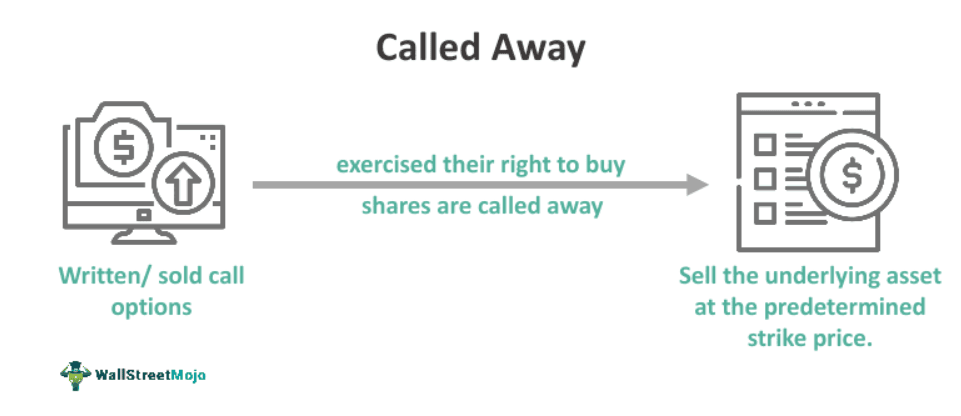

In the world of finance, understanding the "call away mechanism" and "call away" is essential for grasping the fundamentals of options trading and the functioning of various financial contracts. These terms primarily relate to the processes involved when options or certain securities—like callable bonds—are exercised or redeemed under specific conditions.

The call away mechanism is a pivotal aspect of options trading, particularly concerning call options. A call option grants the buyer the right, but not the obligation, to purchase an underlying asset at a predetermined strike price on or before a specified expiration date. When such an option is exercised, the seller is compelled to sell the asset at the strike price, which might be different from its current market value. This mechanism underscores a critical aspect of options trading, where both anticipation of market movements and strategic planning play vital roles.



This concept is also applicable to callable bonds, where issuers retain the right to redeem the bonds before maturity. Issuers typically exercise this option when interest rates drop, enabling them to refinance at lower costs. As such, the call away mechanism influences both how financial markets operate and how investors might experience returns from their investments.

Moreover, call away scenarios are integral to algorithmic trading, or algo trading. In this context, algorithms can be programmed to automatically respond to market movements, including triggering a call away when certain conditions are met. This integration can lead to optimized trading strategies and efficient risk management, emphasizing the significance of the call away mechanism in modern finance.

A firm understanding of these concepts provides insights into market dynamics and aids in developing effective investment strategies. Being aware of how call away mechanisms function can help traders and investors navigate the complexities of trading environments, optimize portfolios, and ultimately achieve their financial goals.

## Table of Contents

## Understanding the Call Away Mechanism

The call away mechanism plays a pivotal role in options trading, representing the fulfillment of a financial contract when a specific condition is met. This mechanism intricately binds both the option buyer and seller through a legally enforceable agreement. When an option is exercised by the buyer, the seller is obligated to deliver the underlying asset at a predetermined strike price. This transaction results in the option being 'called away' from the seller.

In practical terms, consider a call option where the underlying asset is a stock. If the market price of the stock rises above the strike price of the call option, the holder of the option may choose to exercise it. This decision compels the seller to deliver the stock at the strike price, despite the potential for a higher market value. This requirement could impact the seller's return on investment, particularly if the asset appreciates significantly after the call away action is initiated.

Moreover, the call away mechanism is not exclusive to options trading but also extends to fixed income securities, specifically callable bonds. Callable bonds provide issuers with the right to redeem the bonds before their maturity date. This typically occurs when interest rates decline, allowing the issuer to re-borrow at lower rates. For investors holding these bonds, a call option exercised by the issuer can result in the termination of anticipated interest earnings. Consequently, understanding the call away feature in bonds is essential for assessing reinvestment risk and calibrating investment strategies.

This mechanism's significance is amplified by its capacity to influence market dynamics. Investors and traders must anticipate potential obligations and adjust their portfolios accordingly. Recognizing when an option or bond is likely to be called away can mitigate unexpected market movements and financial surprises. This foresight allows for strategic planning and enhances the ability to navigate the complexities of both equity and fixed income markets.

## Call Away Scenarios in Options Trading

In options trading, the term "called away" is particularly relevant to scenarios involving call options. A call option grants the buyer the right, but not the obligation, to purchase an underlying asset at a predetermined price, known as the strike price, before the option's expiration. When the buyer exercises this right, the option seller, or writer, is obliged to sell the underlying shares at the strike price, regardless of the current market value. This obligation can lead to substantial implications for the seller, particularly when the market price of the stock exceeds the strike price, resulting in a loss potential.

The mechanics of being called away are predominantly associated with American-style options. Unlike European-style options, which can only be exercised at expiration, American-style options allow the holder to exercise the option at any point before expiration. This flexibility increases the likelihood of a call option being exercised, especially when the stock price rises significantly above the strike price.

For example, consider an investor who has written a call option with a strike price of $50 on shares currently trading at $45. If the stock price surges to $60, the buyer is incentivized to exercise the option, resulting in the investor selling the shares at $50, potentially missing out on $10 per share of additional market appreciation.

To mitigate the potential drawbacks of being called away, investors often employ strategic planning. One common approach is covered call writing, where an investor holds the underlying stock and simultaneously writes call options against it. This strategy generates income through premiums and provides a buffer against moderate price declines but carries the risk of having the shares called away if the stock price experiences a substantial uptick.

Additionally, investors may adopt protective strategies, such as purchasing call options themselves to offset potential obligations or employing stop-loss measures to limit downside risk. By carefully managing their portfolios and staying informed about market trends, traders can better anticipate when call options might be exercised and adapt their strategies accordingly to optimize returns and minimize losses.

## The Role of Callable Bonds

Callable bonds are a type of fixed-income investment that provide issuers the flexibility to redeem the bonds before their maturity date. This feature is particularly beneficial for issuers in declining [interest rate](/wiki/interest-rate-trading-strategies) environments, as it allows them to refinance their debt at lower costs. This prepayment option is akin to refinancing a mortgage when interest rates drop – issuers can opt to retire the older, higher-interest bonds and reissue new ones at more favorable rates.

For investors, holding callable bonds introduces additional considerations and potential risks. Since these bonds can be redeemed by the issuer before maturity, investors face the risk of losing out on future interest payments initially anticipated over the bond's full term. This is often referred to as "reinvestment risk," where the proceeds from the called bond may need to be reinvested in a lower-yielding environment, thus potentially reducing the overall return on investment.

The yield on callable bonds is typically higher than that of comparable non-callable bonds to compensate investors for the added risk of early redemption. Investors must carefully assess the terms and conditions of callable bonds, including the call schedule, which outlines when the issuer can redeem the bonds and any premium that might be offered above the face value as an incentive for early redemption.

Understanding these elements is crucial for investors as it enables them to manage portfolio expectations and align their investment strategies with risk tolerance. Callable bonds can offer attractive yields but require savvy management and awareness of market conditions to mitigate inherent risks effectively. As interest rates fluctuate, actively monitoring these factors can empower investors to adapt their strategies to optimize returns while safeguarding against potential losses due to early bond calls.

## Call Away in Algorithmic Trading

Algorithmic trading, or algo trading, utilizes computer algorithms to execute trades automatically based on a set of predefined rules. The integration of the call away mechanism into algo trading strategies allows traders to automate responses to events where options are exercised. This automation can greatly enhance the efficiency and effectiveness of trading operations.

When an option is exercised in a call away scenario, the exercise obligation—such as delivering an asset or settling in cash—needs to be fulfilled promptly and accurately. Manual execution in such fast-moving markets is challenging, so [algorithmic trading](/wiki/algorithmic-trading) provides a reliable solution. Traders can incorporate logic within their algo systems to monitor positions continuously, match them against option exercise events, and execute the necessary trades immediately upon exercise notifications.

For example, consider a scenario where a trader has written a covered call. If the market conditions cause the call to be exercised, an algorithm can automatically execute the requisite delivery or cash settlement while simultaneously adjusting remaining portfolio positions to align with the updated market situation.

Moreover, the call away response strategy can be programmed using mathematical models and [machine learning](/wiki/machine-learning) techniques to predict the probability of being called away. These predictions help in preemptively managing risks and optimizing returns. Here's a simplified Python pseudocode illustrating how an algorithm might respond to a call event:

```python
def call_away_monitor(portfolio, market_data):
    for option in portfolio.options:
        if option.is_exercised(market_data):
            execute_trade(portfolio, option)
            adjust_portfolio(portfolio, option)

def execute_trade(portfolio, option):
    # logic to handle asset delivery or cash settlement
    if option.type == 'call':
        deliver_asset(portfolio, option)

def adjust_portfolio(portfolio, option):
    # logic to rebalance the portfolio
    portfolio.rebalance()

call_away_monitor(trader_portfolio, current_market_data)
```

This integration of call away mechanisms into algo trading provides numerous benefits, including enhanced risk management and improved execution speeds, thereby reducing the adverse effects of latency and human error. The capability to quickly adapt to market changes allows traders to maintain optimal portfolio alignment and ensures compliance with trading strategies designed to capitalize on specific market conditions. As algorithmic trading becomes more prevalent, the inclusion of call away scenarios offers competitive advantages in maintaining robust and dynamic trading systems.

## Investor Considerations and Strategies

Investors engaged in options trading and callable securities must be vigilant about the implications of being called away, as this can have significant effects on their long-term investment strategies. One of the primary concerns is the loss of potential gains if assets are called away at less than current market value. This highlights the importance of strategic planning and risk management in investment portfolios.

### Diversification and Hedging Techniques

To mitigate the risks associated with callable securities, investors are encouraged to diversify their portfolios. Diversification involves spreading investments across various asset classes and instruments, reducing the impact of any single adverse event on the overall portfolio. By holding a mix of equities, bonds, and other assets, investors can cushion the effects of market [volatility](/wiki/volatility-trading-strategies) and avoid overexposure to any particular risk, such as interest rate changes impacting callable bonds or specific stock movements affecting options.

In addition, employing hedging techniques can protect against potential downsides. Hedging involves taking positions in financial instruments, like options, which can offset losses in the primary investment. For example, by purchasing put options on a stock they own, investors can reduce the impact of being called away at a lower price. This strategy acts as an insurance policy, limiting losses if the market moves unfavorably.

### Proactive Market Monitoring and Strategic Planning

Effective risk management also requires proactive monitoring and analysis of market conditions. Investors should stay informed about factors that could lead to assets being called away, such as changes in interest rates or significant price movements in underlying securities. Tools such as technical analysis and financial modeling can help predict when certain call away scenarios might occur.

Using Python, investors can automate parts of this process through algorithms that track market data and alert them to potential call away risks. Here’s an example of how one might set up an alert for callable bonds when interest rates drop below a certain threshold, prompting the issuer to potentially call the bonds:

```python
import requests

def get_current_interest_rate():
    response = requests.get("http://api.example.com/interest-rate")
    return response.json()['rate']

def check_callable_bond_risk(interest_rate, threshold=3.0):
    if interest_rate < threshold:
        print("Potential callable bond risk. Interest rate:", interest_rate)
    else:
        print("Interest rate stable:", interest_rate)

current_rate = get_current_interest_rate()
check_callable_bond_risk(current_rate)
```

By leveraging technology, investors can gain timely insights, enabling them to adjust their strategies accordingly. Reacting promptly to market signals can prevent unnecessary losses and ensure that investment goals are met despite the dynamic nature of financial markets.

In summary, maintaining a diversified portfolio, employing hedging strategies, and actively monitoring market conditions are critical components for managing the risk of being called away. These practices help investors safeguard their investments, ensure flexibility in their strategies, and maintain resilience against unexpected market developments.

## Conclusion

Understanding the call away mechanism is crucial for investors and traders engaging with options and fixed income securities. These concepts enable them to make well-informed decisions while optimizing their trading strategies. In options trading, being aware of the possibility of having positions called away ensures that traders are prepared for potential obligations. This preparation is vital in maintaining control over investment outcomes and maximizing returns, even when the underlying market conditions lead to unexpected exercises.

Moreover, in the context of callable bonds, understanding the call away mechanism equips investors with the knowledge required to manage reinvestment risk and adjust their portfolios adequately. Investors can strategize effectively by anticipating interest rate changes and potential bond calls, thereby aligning their expectations with market dynamics.

With the increasing prevalence of algorithmic trading, incorporating call away scenarios into automated systems provides traders with distinct advantages. These automated strategies can seamlessly execute trades or adjust positions to accommodate options exercises, thereby reducing manual intervention and minimizing trading risks. Ultimately, leveraging algorithmic solutions to integrate call away mechanisms allows for greater efficiency and precision in trading, offering competitive benefits in the fast-paced financial markets.

## References & Further Reading

[1]: Hull, J. C. (2017). ["Options, Futures, and Other Derivatives"](https://www.semanticscholar.org/paper/Options%2C-Futures%2C-and-Other-Derivatives-Hull/89bdee500c8623864fc9eb7a471546aa713acc44). Pearson Education Limited.

[2]: Black, F., & Scholes, M. (1973). ["The Pricing of Options and Corporate Liabilities"](https://www.cs.princeton.edu/courses/archive/fall09/cos323/papers/black_scholes73.pdf). Journal of Political Economy, 81(3), 637-654.

[3]: Fabozzi, F. J. (2007). ["Fixed Income Analysis"](https://www.amazon.com/Fixed-Income-Analysis-Frank-Fabozzi/dp/047005221X). Wiley.

[4]: Lopez de Prado, M. (2018). ["Advances in Financial Machine Learning"](https://www.amazon.com/Advances-Financial-Machine-Learning-Marcos/dp/1119482089). Wiley.

[5]: Jansen, S. (2020). ["Machine Learning for Algorithmic Trading: Predictive Models to Extract Signals from Market and Alternative Data for Systematic Trading Strategies with Python"](https://www.amazon.com/Machine-Learning-Algorithmic-Trading-alternative/dp/1839217715). Packt Publishing.