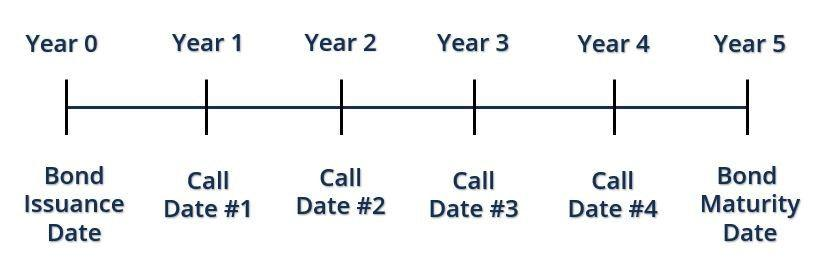

## Table of Contents

## What is a call date in financial terms?

A call date in financial terms is a specific date when a bond or other debt instrument can be redeemed by the issuer before it reaches its maturity date. This is known as calling the bond. The issuer might decide to call the bond if interest rates drop, allowing them to reissue new bonds at a lower interest rate, which saves them money.

When a bond is called, the investor gets their principal back, along with any interest that has accrued up to the call date. However, this can be disappointing for investors if the bond was offering a high interest rate, as they might struggle to find a similar investment with as good a return. The terms of the call, including the call date, are usually set out in the bond's indenture or prospectus, so investors know what to expect.

## How does a call date function in a bond or loan agreement?

A call date in a bond or loan agreement is like a special day when the person who borrowed the money can pay it back early. If you're the one who lent the money, this means you might get your money back sooner than you expected. The call date is written down in the agreement so everyone knows when this can happen. It's kind of like a calendar reminder for when the borrower can choose to end the loan early.

For the borrower, having a call date can be a good thing because if they can find a way to borrow money cheaper later on, they can pay off the old loan and start a new one with lower payments. But for the person who lent the money, it might not be so great. They might have to find a new place to put their money, and maybe they won't find one that pays them back as well as the old loan did. So, the call date is important because it gives the borrower a chance to save money, but it can also change plans for the lender.

## What is the significance of a call date for investors?

A call date is important for investors because it's the day when the company that borrowed money can pay it back early. If an investor bought a bond, they might be expecting to get interest payments until the bond's official end date. But if the company decides to use the call date to pay back the bond early, the investor gets their money back sooner. This can be good if they need the money right away, but it can also be a problem if they were counting on the interest payments for a longer time.

The reason a company might want to use a call date is usually because they can borrow money more cheaply somewhere else. If interest rates go down, the company can pay off the old bond and take out a new one with lower interest payments. This is great for the company, but it can leave investors in a tricky spot. They might have to find a new place to invest their money, and it might not pay as well as the bond they just got called. So, knowing about the call date helps investors plan better and understand the risks of their investments.

## Can you explain the difference between a call date and a maturity date?

A call date and a maturity date are two different things when it comes to bonds or loans. A call date is a specific day when the company that borrowed the money can choose to pay it back early. This means if you're an investor, you might get your money back before you expected. The company might do this if they can borrow money cheaper somewhere else because interest rates have gone down.

On the other hand, a maturity date is the official end date of the bond or loan. This is the day when the company has to pay back the money they borrowed, no matter what. Investors know they will get their money back on this date, along with any final interest payments. So, while a call date gives the borrower a chance to end the loan early, the maturity date is the set finish line for the loan.

## How is a call date typically set in a financial instrument?

A call date is set when the bond or loan is first created. The people who make the bond decide on the call date and write it down in the bond's agreement. This date is usually chosen based on when the company thinks it might be able to borrow money more cheaply. They might look at what's happening with interest rates and guess when they might go down. The call date is important because it tells everyone involved when the company can choose to pay back the money early.

Once the call date is set, it's shared with everyone who might want to buy the bond. This way, investors know that the company might decide to pay back the bond early on that specific date. If interest rates do go down, the company might use the call date to get out of the old bond and start a new one with lower interest payments. This can be good for the company but might not be so great for the investors if they were counting on the interest payments for longer.

## What are the potential benefits of including a call date in a financial agreement?

Including a call date in a financial agreement can be really helpful for the company that borrowed the money. It gives them a chance to pay back the loan early if they find a better deal. For example, if interest rates go down, the company can use the call date to pay off the old loan and start a new one with lower interest payments. This can save them a lot of money over time. It's like getting a chance to switch to a cheaper plan before the old one is finished.

For investors, knowing about the call date can help them plan better. They understand that the company might pay back the loan early, so they can be ready for that. If they get their money back sooner than expected, they can look for other places to invest it. Even though it might mean they don't get as much interest as they hoped, being prepared can help them make the best of the situation. So, a call date can be a useful tool for both the company and the investors if they use it wisely.

## What are the risks associated with a call date for both issuers and investors?

For issuers, the main risk with a call date is that they might not be able to take advantage of it if interest rates don't drop as expected. If they call the bond and then interest rates go up, they could end up paying more on a new loan than they would have on the old one. Also, if the market conditions change and they can't issue new bonds, they might be stuck with the old, higher interest rates. This means they need to be really sure about the timing and the market before they decide to call a bond.

For investors, the biggest risk is that they might lose out on future interest payments if the bond is called early. They might have been counting on that money for their plans, so getting it back sooner than expected can be a problem. They then have to find a new place to invest their money, and it might not pay as well as the bond they just lost. This can be especially tough if the bond had a high interest rate and it's hard to find something similar. So, investors need to be ready for the possibility that their investment might end earlier than they thought.

## How does the call date impact the yield of a bond?

When a bond has a call date, it can change how much money investors make from it, which is called the yield. If a company decides to pay back the bond early on the call date, the investor gets their money back sooner than they expected. This means they might not get all the interest payments they were hoping for, so the total amount of money they earn from the bond could be less than if it went all the way to the maturity date.

Because of this risk, bonds with call dates often have to offer a higher interest rate to attract investors. This is called a call premium. Investors know there's a chance the bond might be called early, so they want to be paid more for taking that risk. If the bond is called and they have to find a new place to invest their money, the new investment might not pay as well as the old bond did, so the higher interest rate helps make up for that possibility.

## What are the legal and contractual considerations when setting a call date?

When setting a call date in a bond or loan agreement, it's important to follow the legal and contractual rules. The call date has to be written down clearly in the agreement so everyone knows when the borrower can pay back the money early. This part of the agreement, called the indenture or prospectus, must say exactly when the call date is and any rules about how it can be used. If the call date isn't written down properly, it could cause problems later on, like disagreements or even lawsuits between the borrower and the investors.

The call date also needs to be fair to both the borrower and the investors. The borrower should think about what might happen if they decide to use the call date, like if they can really save money by borrowing at a lower interest rate later. For investors, it's important that they know about the call date so they can plan their investments. If the call date isn't set fairly, it could make investors less likely to buy the bond because they might feel like the risk is too high. So, making sure the call date is clear and fair in the agreement helps everyone understand what might happen and avoid legal issues.

## How can investors protect themselves against the risks of a callable bond?

Investors can protect themselves against the risks of a callable bond by looking closely at the bond's agreement. They should pay attention to the call date and understand when the company might choose to pay back the bond early. By knowing this, investors can plan better and be ready if the bond gets called. They might also want to look for bonds that offer a higher interest rate to make up for the risk of the bond being called early. This is called a call premium, and it can help investors earn more money if the bond does get called.

Another way investors can protect themselves is by diversifying their investments. This means they shouldn't put all their money into callable bonds. Instead, they can spread their money across different types of investments, like stocks or other bonds that don't have a call date. This way, if one bond gets called early, they won't lose out on all their expected interest payments. By being careful and planning ahead, investors can handle the risks of callable bonds and still make good choices with their money.

## What are the market conditions that might influence the decision to call a bond on its call date?

Market conditions can play a big role in whether a company decides to call a bond on its call date. The main thing they look at is interest rates. If interest rates have gone down since the bond was issued, the company might want to call the bond and issue a new one at the lower rate. This can save them a lot of money on interest payments over time. They might also look at how the economy is doing. If things are going well and they think they can borrow money more easily, they might decide to call the bond.

Another important [factor](/wiki/factor-investing) is the company's own financial situation. If they have a lot of extra cash, they might use it to pay off the bond early and avoid paying more interest. They might also think about how their credit rating has changed. If their credit rating has gotten better, they might be able to get a better deal on a new bond, which would make calling the old one a smart move. So, the decision to call a bond depends on a mix of what's happening in the market and how the company itself is doing.

## How do advanced financial models account for the call date in pricing callable securities?

Advanced financial models use special math to figure out the price of callable securities, which are bonds that can be paid back early by the company that borrowed the money. These models take into account the call date, which is the day when the company can choose to pay back the bond early. They look at how likely it is that the company will call the bond on that date. To do this, they use something called option pricing theory, which is a way of figuring out the value of choices or options, like the choice to call a bond. The models also consider how interest rates might change in the future, because if rates go down, the company might want to call the bond and borrow money more cheaply.

These models also think about how much money the bond will pay back if it's called early, compared to if it goes all the way to the end, which is called the maturity date. They look at the difference between the interest rate the bond is paying now and what the company might be able to get on a new bond. If the company can save a lot of money by calling the bond and issuing a new one, the models will show that the bond might be called. This helps investors understand the risk of the bond being called early and what it might mean for their investment. By using these models, investors and companies can make better decisions about buying and selling callable securities.

## What is the Call Date and What Are Its Implications?

The call date of a callable bond is the specific date on which the issuer has the right, but not the obligation, to redeem the bond before its maturity. This feature significantly impacts the bond’s yield and valuation, influencing investment strategies based on prevailing and anticipated [interest rate](/wiki/interest-rate-trading-strategies) trends.

The influence of the call date on a bond's yield is often analyzed through metrics like yield-to-call (YTC) and yield-to-maturity (YTM). Yield-to-call represents the return an investor would earn if the bond were called on the earliest possible call date, taking into account the call price, while yield-to-maturity calculates the return if the bond is held until its scheduled maturity date. Evaluating both yields allows investors to assess the attractiveness of a bond relative to potential returns under different scenarios:

$$
\text{Yield-to-Call} = \frac{C + \frac{(CP - P)}{t_c}}{\frac{(CP + P)}{2}}
$$

Where:
- $C$ is the annual coupon payment,
- $CP$ is the call price,
- $P$ is the purchase price,
- $t_c$ is the time in years until the call date.

Callable bonds may include call protection periods, which safeguard investors by prohibiting the issuer from exercising the call option within a certain time frame after issuance. This offers a temporary buffer against reinvestment risk, as it ensures that investors receive the scheduled coupon payments without interruption for the duration of the protection period.

Interest rate trends play a crucial role in the issuer's decision to call a bond. If interest rates decline, the issuer might opt to redeem the bond and reissue new debt at a lower rate, which poses reinvestment risk to investors who are forced to reinvest the proceeds at reduced yields. Conversely, when interest rates rise, issuers are less likely to call bonds, providing a form of interest rate stability for investors as the bonds are likely to continue yielding returns closer to the original YTM.

Strategic analysis by investors includes monitoring yield-to-call alongside broader interest rate forecasts to construct portfolios that optimize yield amidst different market conditions, balancing the potential benefits of higher yields against the risks of early redemption.

## What is the impact of interest rates on callable bonds?

Callable bonds are significantly influenced by fluctuations in interest rates, which affect issuers' decisions to call bonds before maturity and contribute to yield [volatility](/wiki/volatility-trading-strategies). As a result, understanding interest rate trends is crucial when developing investment strategies involving callable bonds.

When interest rates decline, issuers find calling bonds attractive to refinance at a lower cost, leading to a high likelihood of callable bonds being redeemed. This scenario presents reinvestment risk for investors, as they must reinvest the principal in a lower-rate environment, potentially reducing their future income. The reinvestment risk underscores the importance of evaluating yield-to-call and yield-to-maturity metrics. Yield-to-call (YTC) estimates the yield an investor receives if the bond is called at the earliest call date, calculated as follows:

$$
YTC = \left( \frac{\text{Coupon Payment} + \frac{\text{Call Price} - \text{Purchase Price}}{\text{Years to Call}}}{\frac{\text{Call Price} + \text{Purchase Price}}{2}} \right)
$$

Conversely, in a rising interest rate environment, issuers are disinclined to call bonds due to the availability of cheaper capital in prior arrangements, thus providing stability and continuity of income for investors. Under these circumstances, callable bonds may experience less price volatility compared to non-callable bonds, as the call option holds less value.

Investment strategies involving callable bonds should therefore align with current and projected interest rate trends. By analyzing economic indicators, central bank policies, and market forecasts, investors can anticipate potential interest rate movements and adjust their bond portfolios accordingly. This approach helps in managing the balance between yield volatility and reinvestment risks while maintaining a diversified investment portfolio.

Understanding the implications of interest rate changes on callable bonds is essential for optimizing investment outcomes, making strategic adjustments, and effectively managing risks associated with callable bond holdings.

## References & Further Reading

[1]: ["Fixed Income Analysis"](https://en.wikipedia.org/wiki/Fixed_income_analysis) by Frank J. Fabozzi

[2]: ["The Handbook of Fixed Income Securities"](https://www.amazon.com/Handbook-Fixed-Income-Securities-Ninth/dp/1260473899) by Frank J. Fabozzi and Steven V. Mann

[3]: ["Advances in Financial Machine Learning"](https://www.amazon.com/Advances-Financial-Machine-Learning-Marcos/dp/1119482089) by Marcos Lopez de Prado

[4]: ["Quantitative Trading: How to Build Your Own Algorithmic Trading Business"](https://www.amazon.com/Quantitative-Trading-Build-Algorithmic-Business/dp/1119800064) by Ernest P. Chan

[5]: ["Algorithmic Trading: Winning Strategies and Their Rationale"](https://www.amazon.com/Algorithmic-Trading-Winning-Strategies-Rationale-ebook/dp/B00CY5HC0U) by Ernest P. Chan

[6]: ["Interest Rates, Prices and Liquidity"](https://www.cambridge.org/core/books/interest-rates-prices-and-liquidity/4CB9AA02127375A2AC79793B7CF47F6E) by Jean Tirole

[7]: ["Fixed-Income Securities: Valuation, Risk, and Risk Management"](https://vdoc.pub/download/fixed-income-securities-valuation-risk-and-risk-management-5f1o51bqivt0) by Pietro Veronesi