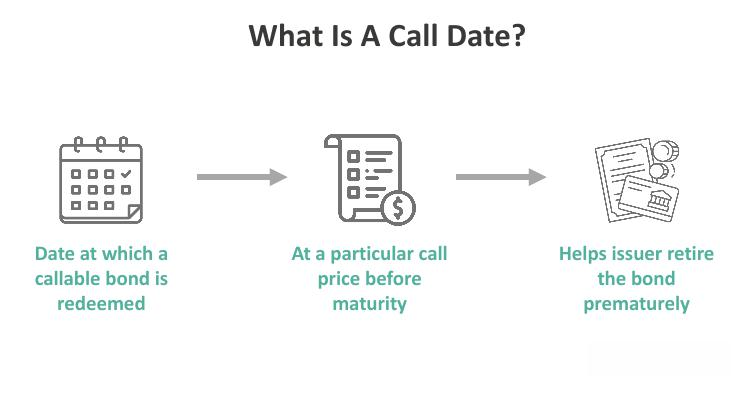

Callable bonds and algorithmic trading play significant roles in the landscape of modern investments, each providing distinct opportunities and challenges for investors and issuers. Callable bonds are a unique form of fixed-income securities that grant issuers the option to redeem the bonds before their scheduled maturity date. This option influences both the yield an investor expects to earn and the strategies deployed to manage these bonds. For issuers, callable bonds offer the flexibility to refinance debt or adjust financial obligations when interest rate environments change, making them an attractive financing tool. However, this same flexibility presents risks to the investor, primarily the potential for early redemption that could lead to reinvestment challenges, albeit often associated with the potential for higher yields as compensation.

Algorithmic trading, a transformative force in financial markets, employs sophisticated software to conduct trade execution based on predefined rules and algorithms. The advantages of algorithmic trading include unprecedented speed, high precision, and the ability to swiftly adapt to evolving market conditions. By automating the trading process, algorithmic trading minimizes human error and bias, thus optimizing market operations and portfolio management.



An integrated approach that combines callable bonds with algorithmic trading strategies can optimize portfolio performance under various market scenarios. This combination allows for a dynamic approach where portfolios are continually adjusted to mitigate risks and capitalize on fleeting market opportunities. Such integration ensures that portfolios remain well-diversified and adaptive to interest rate volatility, ultimately enhancing returns while managing risk effectively.

## Table of Contents

## Understanding Callable Bonds

Callable bonds represent a unique category of fixed-income securities that include an embedded call option, allowing issuers the discretion to redeem the bonds prior to their maturity dates. This feature provides issuers with strategic financial flexibility, enabling them to refinance existing debt at advantageous terms if interest rates decline. Such actions can lead to significant cost savings and more agile management of financial obligations.

For investors, callable bonds come with the inherent risk of early redemption, which can interrupt expected income streams. However, this potential drawback is often compensated by offering higher yields compared to non-callable bonds. This yield premium serves as an incentive for investors to accept the associated risks.

Several key features distinguish callable bonds. The call date is a critical component, as it specifies when the issuer is first permitted to redeem the bond. Understanding the call date is crucial for investors since it impacts the bond's yield calculations and potential returns. Alongside this, call protection periods offer temporary security against redemption, during which the issuer cannot exercise the call option. This period provides a window of predictability for the bondholders regarding their investment horizon.

Analyzing yield-to-call (YTC) is essential for investors to evaluate potential returns if the bond is called before its maturity. The YTC calculation considers the bond price, coupon payments, call price, and the timeframe until the call date. This analysis offers a more nuanced understanding of the investment's return profile compared to yield-to-maturity calculations, which assume the bond will remain outstanding until the maturity date irrespective of the callable nature. Understanding these components helps investors make informed decisions and align callable bonds with their broader investment strategies.

## Call Date and Its Implications

The call date of a callable bond is the specific date on which the issuer has the right, but not the obligation, to redeem the bond before its maturity. This feature significantly impacts the bond’s yield and valuation, influencing investment strategies based on prevailing and anticipated [interest rate](/wiki/interest-rate-trading-strategies) trends.

The influence of the call date on a bond's yield is often analyzed through metrics like yield-to-call (YTC) and yield-to-maturity (YTM). Yield-to-call represents the return an investor would earn if the bond were called on the earliest possible call date, taking into account the call price, while yield-to-maturity calculates the return if the bond is held until its scheduled maturity date. Evaluating both yields allows investors to assess the attractiveness of a bond relative to potential returns under different scenarios:

$$
\text{Yield-to-Call} = \frac{C + \frac{(CP - P)}{t_c}}{\frac{(CP + P)}{2}}
$$

Where:
- $C$ is the annual coupon payment,
- $CP$ is the call price,
- $P$ is the purchase price,
- $t_c$ is the time in years until the call date.

Callable bonds may include call protection periods, which safeguard investors by prohibiting the issuer from exercising the call option within a certain time frame after issuance. This offers a temporary buffer against reinvestment risk, as it ensures that investors receive the scheduled coupon payments without interruption for the duration of the protection period.

Interest rate trends play a crucial role in the issuer's decision to call a bond. If interest rates decline, the issuer might opt to redeem the bond and reissue new debt at a lower rate, which poses reinvestment risk to investors who are forced to reinvest the proceeds at reduced yields. Conversely, when interest rates rise, issuers are less likely to call bonds, providing a form of interest rate stability for investors as the bonds are likely to continue yielding returns closer to the original YTM.

Strategic analysis by investors includes monitoring yield-to-call alongside broader interest rate forecasts to construct portfolios that optimize yield amidst different market conditions, balancing the potential benefits of higher yields against the risks of early redemption.

## Impact of Interest Rates on Callable Bonds

Callable bonds are significantly influenced by fluctuations in interest rates, which affect issuers' decisions to call bonds before maturity and contribute to yield [volatility](/wiki/volatility-trading-strategies). As a result, understanding interest rate trends is crucial when developing investment strategies involving callable bonds.

When interest rates decline, issuers find calling bonds attractive to refinance at a lower cost, leading to a high likelihood of callable bonds being redeemed. This scenario presents reinvestment risk for investors, as they must reinvest the principal in a lower-rate environment, potentially reducing their future income. The reinvestment risk underscores the importance of evaluating yield-to-call and yield-to-maturity metrics. Yield-to-call (YTC) estimates the yield an investor receives if the bond is called at the earliest call date, calculated as follows:

$$
YTC = \left( \frac{\text{Coupon Payment} + \frac{\text{Call Price} - \text{Purchase Price}}{\text{Years to Call}}}{\frac{\text{Call Price} + \text{Purchase Price}}{2}} \right)
$$

Conversely, in a rising interest rate environment, issuers are disinclined to call bonds due to the availability of cheaper capital in prior arrangements, thus providing stability and continuity of income for investors. Under these circumstances, callable bonds may experience less price volatility compared to non-callable bonds, as the call option holds less value.

Investment strategies involving callable bonds should therefore align with current and projected interest rate trends. By analyzing economic indicators, central bank policies, and market forecasts, investors can anticipate potential interest rate movements and adjust their bond portfolios accordingly. This approach helps in managing the balance between yield volatility and reinvestment risks while maintaining a diversified investment portfolio.

Understanding the implications of interest rate changes on callable bonds is essential for optimizing investment outcomes, making strategic adjustments, and effectively managing risks associated with callable bond holdings.

## Strategies for Managing Callable Bond Investments

Callable bond investments require careful strategies to maximize returns while managing potential risks associated with early redemption. To effectively handle callable bonds, investors should integrate several key strategies into their investment approach.

**Call Schedules and Risk Monitoring:**
The ability to understand and consistently monitor call schedules is crucial in anticipating and managing call risks. Call schedules outline when an issuer has the right to redeem bonds before their maturity date. Investors can use this information to estimate the timelines and likelihood of calls based on current financial conditions and interest rate trends. Monitoring these schedules allows investors to plan accordingly, minimizing the surprise element of a call and enabling preemptive adjustments to their portfolios.

**Portfolio Diversification:**
Diversification remains a fundamental pillar in reducing investment risk across asset classes, including callable bonds. By holding a well-diversified portfolio, investors can cushion the financial impact in case of unexpected bond calls. A diversified approach ensures that if one bond is called, the overall portfolio is not significantly affected, maintaining a more stable income flow and capital preservation.

**Callable Bond Ladders:**
Creating a callable bond ladder is a strategic method to manage reinvestment risks while ensuring consistent income streams. A bond ladder involves purchasing multiple callable bonds with varying maturity dates, which provides the flexibility to reinvest portions of the portfolio at different times and, potentially, at more favorable interest rates. This staggering of maturities helps mitigate the risk associated with reinvestment when interest rates fluctuate.

Here is a simple Python example to illustrate the concept of a bond ladder:

```python
import numpy as np

# Assume bond payment schedules
payments = np.array([100, 100, 100, 100, 1000])  # Final payment includes principal

# Assuming an interest rate of 3%
interest_rate = 0.03

def bond_ladder_value(payments, interest_rate):
    # Calculate the present value of cash flows for each year
    cash_flows = [payment / ((1 + interest_rate) ** year) for year, payment in enumerate(payments, start=1)]
    return sum(cash_flows)

ladder_value = bond_ladder_value(payments, interest_rate)
print(f"The present value of the bond ladder's cash flows is: {ladder_value:.2f}")
```

**Issuers' Financial Stability:**
Assessing the financial stability of bond issuers is vital in estimating the likelihood of early calls. Issuers with robust financial positions are more likely to call bonds to refinance at lower rates, especially when interest rates decline. Evaluating their capital structure, credit ratings, and recent financial performance can provide insights into potential call actions. Investors should prioritize bonds from issuers with a favorable financial outlook to lower the risk associated with unforeseen calls.

Implementing these strategies ensures that investors can effectively manage the complexities involved with callable bonds, maintaining a balance between yield optimization and risk management.

## The Role of Algorithmic Trading

Algorithmic trading utilizes computer algorithms to automatically execute trades based on a set of predetermined instructions, encompassing variables such as timing, price, or quantity. This automation delivers significant advantages, including enhanced speed and precision in executing trades, and enables immediate responses to market changes. The incorporation of technology allows sophisticated data analysis and real-time decision-making, which significantly improves trading efficiency.

One of the primary benefits of [algorithmic trading](/wiki/algorithmic-trading) is its speed. Algorithms can process vast amounts of data and perform complex calculations in a fraction of a second, which is substantially faster than human traders. This rapid execution is crucial in high-frequency trading environments where market opportunities can disappear in milliseconds.

In terms of strategies, algorithmic trading supports a diverse range of methodologies. Statistical [arbitrage](/wiki/arbitrage), for example, involves exploiting price discrepancies between correlated trading instruments. This strategy requires algorithms to identify and execute trades within these narrow windows of opportunity. Trend following is another common strategy that algorithms can implement by identifying and capitalizing on trends in the market data. Additionally, risk management is integral to algorithmic trading strategies, as algorithms can be programmed to include stop-loss orders or to adjust positions dynamically to limit potential losses.

Algorithmic trading enhances callable bond strategies by optimizing execution. In the context of callable bonds, executing trades with speed and precision becomes essential, especially considering the bond's sensitivity to interest rate changes. Algorithmic systems can be programmed to monitor these fluctuations and adjust positions accordingly. This capability is particularly advantageous in volatile markets, where swift and informed decisions can prevent losses and ensure favorable outcomes.

The integration of algorithmic trading with callable bond investments can lead to more efficient portfolio management. Algorithms can be used to detect undervalued callable bonds by analyzing real-time data feeds and market trends, which humans may not identify as quickly. Additionally, the dynamic nature of algorithms allows for continuous reassessment of bond holdings, ensuring that portfolios are optimally positioned despite changing market conditions. Through this synergy, investors can capitalize on transient market opportunities, potentially enhancing overall portfolio returns.

## Integrating Callable Bonds and Algo Trading

Integrating callable bonds with algorithmic trading presents a synergistic approach to enhancing investment performance in modern financial markets. Algorithmic trading, which utilizes sophisticated software to execute trades based on predefined criteria, provides a substantial advantage in identifying all potential investment opportunities, including those presented by callable bonds.

Callable bonds, due to their embedded option for issuers to redeem before maturity, often require agile strategies to optimize potential returns. Algorithms can be programmed to scan vast datasets in real-time, identifying callable bonds that are undervalued or priced inefficiently compared to similar securities. This real-time data processing and analysis capability allows traders to capitalize on fleeting market inefficiencies that human traders may miss due to the sheer [volume](/wiki/volume-trading-strategy) of data or slower reaction times.

Incorporating algorithmic trading into the management of callable bonds allows for dynamic adjustments in response to shifts in interest rates, which significantly impact the decision-making process surrounding callable bonds. Interest rate volatility can affect the likelihood of a bond being called by issuers, creating reinvestment risks. Algorithmic systems can continuously monitor interest rate trends and adjust investment allocations or hedging strategies accordingly, minimizing potential losses and maintaining portfolio stability.

Furthermore, the integration of algorithmic trading with callable bonds can maximize returns by exploiting transient market opportunities. Algorithms can be designed to implement complex trading strategies that involve [statistical arbitrage](/wiki/statistical-arbitrage) or other advanced techniques, rapidly executing trades to benefit from temporary price discrepancies between callable bonds and other correlated assets.

In practice, implementing this integration involves combining quantitative models with algorithmic systems capable of executing high-frequency trades. The process includes setting up algorithms that:

1. **Identify Undervalued Bonds**: Algorithms can utilize criteria such as credit spreads, historical volatility, and yield comparisons to flag undervalued callable bonds.

2. **Monitor Interest Rates**: Programs can be developed to react instantaneously to interest rate changes, adjusting portfolios to protect against, or take advantage of, anticipated issuer actions on callable bonds.

3. **Automate Trading Decisions**: Programming algorithms to execute trades based on predefined rules ensures that strategic objectives are met without the latency associated with human intervention.

4. **Optimize Portfolio Diversification**: Algorithms can assist in balancing investment across various bonds to achieve diversification, reducing risks specific to callable bonds being redeemed.

By integrating callable bonds with algorithmic trading, investors can employ a proactive and robust strategy that not only adjusts to market dynamics in real-time but also improves overall portfolio performance. This symbiosis leverages the speed and precision of technology, aligning bond trading with the broader context of systematic, data-driven decision making in market investments.

## Conclusion

Callable bonds and algorithmic trading provide a potent mix for modern portfolios by combining the flexibility and potential yield enhancements of callable bonds with the efficiency and precision of algorithmic trading. Understanding the mechanics and risks of each component is crucial for optimizing returns. 

Callable bonds, by their nature, introduce complexities due to the issuer's option to redeem before maturity, impacting yield calculations and investment strategies. Investors must be adept in assessing metrics like yield-to-call and yield-to-maturity to gauge potential returns and risks associated with early redemption. Algorithmic trading supplements this process by enabling rapid and precise adjustments to portfolio compositions, informed by real-time market data.

Integrating these strategies offers diversification and adapts dynamically to changing market conditions. Through algorithmic trading, investors can swiftly identify mispriced callable bonds, ensuring that portfolios are continuously optimized. This integration allows for seizing transient market opportunities, thus enhancing overall portfolio performance.

Robust risk management is essential when leveraging these tools effectively. By understanding the interplay between callable bonds and algorithmic trading, investors can develop a balanced strategy that mitigates risks such as interest rate volatility and reinvestment challenges while capitalizing on the strengths of each approach. This holistic strategy ensures a well-rounded portfolio capable of adapting to diverse financial landscapes.

## References & Further Reading

[1]: ["Fixed Income Analysis"](https://en.wikipedia.org/wiki/Fixed_income_analysis) by Frank J. Fabozzi

[2]: ["The Handbook of Fixed Income Securities"](https://www.amazon.com/Handbook-Fixed-Income-Securities-Ninth/dp/1260473899) by Frank J. Fabozzi and Steven V. Mann

[3]: ["Advances in Financial Machine Learning"](https://www.amazon.com/Advances-Financial-Machine-Learning-Marcos/dp/1119482089) by Marcos Lopez de Prado

[4]: ["Quantitative Trading: How to Build Your Own Algorithmic Trading Business"](https://www.amazon.com/Quantitative-Trading-Build-Algorithmic-Business/dp/1119800064) by Ernest P. Chan

[5]: ["Algorithmic Trading: Winning Strategies and Their Rationale"](https://www.amazon.com/Algorithmic-Trading-Winning-Strategies-Rationale-ebook/dp/B00CY5HC0U) by Ernest P. Chan

[6]: ["Interest Rates, Prices and Liquidity"](https://www.cambridge.org/core/books/interest-rates-prices-and-liquidity/4CB9AA02127375A2AC79793B7CF47F6E) by Jean Tirole

[7]: ["Fixed-Income Securities: Valuation, Risk, and Risk Management"](https://vdoc.pub/download/fixed-income-securities-valuation-risk-and-risk-management-5f1o51bqivt0) by Pietro Veronesi