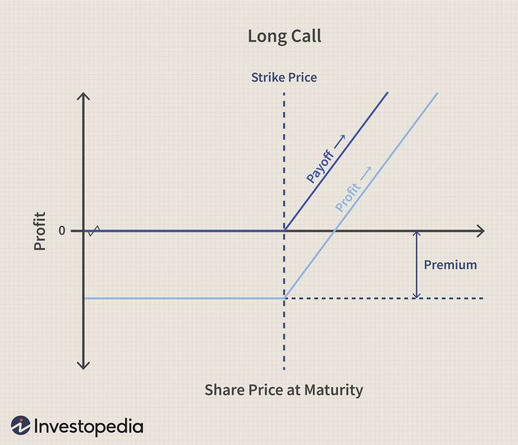

## Table of Contents

## What is a call option in finance?

A call option in finance is a contract that gives the buyer the right, but not the obligation, to buy a specific asset at a set price within a certain time period. The asset could be stocks, commodities, or currencies. The set price is called the strike price, and the time period is known as the expiration date. People buy call options when they think the price of the asset will go up. If the price does go up, they can buy the asset at the lower strike price and then sell it at the higher market price to make a profit.

However, if the price of the asset doesn't go up as expected, the buyer of the call option might not use their right to buy the asset. In this case, they would lose the money they paid for the option, which is called the premium. The seller of the call option, on the other hand, gets to keep the premium no matter what happens. Selling call options can be riskier because if the asset's price does go up, the seller has to sell the asset at the lower strike price, which could lead to a loss.

## How does a call option work?

A call option is like a special ticket that lets you buy something at a fixed price, even if the price goes up later. Imagine you want to buy a toy that costs $10 now, but you think it might cost $15 next month. You can buy a call option for that toy at $10. If the price goes up to $15, you can use your option to buy the toy for $10 and then sell it for $15, making a $5 profit. But if the price stays the same or goes down, you don't have to buy the toy, and you only lose the small amount you paid for the option.

When you buy a call option, you pay a fee called the premium. This is the price of the option itself. The person who sells you the option gets to keep this premium no matter what happens. If you decide to use your option and buy the toy at the lower price, the seller has to sell it to you at that price, even if it's worth more now. But if you don't use your option, the seller keeps the premium and doesn't have to do anything else. So, buying a call option can be a way to make money if you think the price of something will go up, but it also means you could lose the money you paid for the option if you're wrong.

## What are the key components of a call option?

A call option has a few important parts that you need to know about. The first part is the strike price. This is the price at which you can buy the asset if you decide to use your option. If the market price of the asset goes above the strike price, you can buy it at the lower strike price and then sell it at the higher market price to make a profit. The second part is the expiration date. This is the last day you can use your option. If you don't use it by this date, the option becomes worthless.

The third part is the premium. This is the price you pay to buy the call option. It's like a fee for having the right to buy the asset at the strike price. The premium is set by how much the asset is expected to go up in price and how much time is left until the expiration date. The last part is the underlying asset. This is the thing you have the right to buy with your call option. It could be a stock, a commodity, or even a currency. Knowing these parts helps you understand how call options work and how you can use them.

## What is the difference between a call option and a put option?

A call option and a put option are like two sides of the same coin in the world of finance. A call option gives you the right to buy something at a set price before a certain date. You would buy a call option if you think the price of the thing will go up. For example, if you buy a call option for a stock at $50 and the stock price goes up to $60, you can buy the stock at $50 and sell it at $60 to make a profit. But if the price stays the same or goes down, you don't have to buy it and you only lose the money you paid for the option.

On the other hand, a put option gives you the right to sell something at a set price before a certain date. You would buy a put option if you think the price of the thing will go down. For example, if you buy a put option for a stock at $50 and the stock price drops to $40, you can buy the stock at the lower market price of $40 and then sell it at the higher strike price of $50 to make a profit. If the price stays the same or goes up, you don't have to sell it and you only lose the money you paid for the option. So, call options are for when you think prices will go up, and put options are for when you think prices will go down.

## How is the price of a call option determined?

The price of a call option, which is called the premium, depends on several things. One big thing is the difference between the current price of the thing you can buy with the option and the price set in the option, which is called the strike price. If the current price is much higher than the strike price, the option is worth more because it's more likely you can make a profit. Another important thing is how much time is left until the option expires. The more time left, the more valuable the option is because there's more chance for the price to go up.

Other things that affect the price of a call option are how much the price of the thing can change, which is called [volatility](/wiki/volatility-trading-strategies), and the general level of interest rates. If the price of the thing is expected to move a lot, the option is more valuable because there's a bigger chance it will go above the strike price. Higher interest rates can also make the option more valuable. All these things together help decide how much you have to pay for a call option.

## What are the risks associated with trading call options?

Trading call options can be risky because you might lose the money you paid for the option. This money is called the premium, and you pay it to have the right to buy something at a set price. If the price of that thing doesn't go up like you thought it would, you won't use your option and you'll lose the premium. It's like betting on a horse race and losing your bet. The risk is that the price might stay the same or go down, and then you're out the money you paid for the option.

Another risk is that options have an expiration date. If the price of the thing doesn't go up before this date, your option becomes worthless. It's like having a ticket to a concert that you can only use on a certain day. If you can't go on that day, the ticket is no good anymore. Also, if you're the one selling the call option, you could lose a lot more money. If the price goes up a lot, you have to sell the thing at the lower price you set in the option, and that could mean a big loss for you.

## What strategies can be used with call options?

One common strategy with call options is called buying a call. This means you think the price of something will go up, so you buy an option to buy it at a lower price later. If you're right and the price does go up, you can buy the thing at the lower price and then sell it at the higher price to make money. But if you're wrong and the price stays the same or goes down, you lose the money you paid for the option. It's like betting on a horse race, but instead of betting on a horse, you're betting on the price of something going up.

Another strategy is selling a call, also known as writing a call. This is when you think the price of something won't go up much or at all, so you sell someone else the right to buy it from you at a set price. You get to keep the money they pay for the option, which is called the premium. If the price doesn't go up, you keep the premium and don't have to do anything else. But if the price does go up a lot, you have to sell the thing at the lower price you set, and that could mean losing money. It's like selling insurance; you hope nothing bad happens, but if it does, you have to pay up.

A third strategy is called a covered call. This is when you own something, like a stock, and you sell someone else the right to buy it from you at a set price. You still get to keep the premium, but if the price goes up a lot, you have to sell your stock at the lower price. This can limit how much money you can make if the price goes way up, but it also gives you some extra money from the premium. It's like renting out something you own; you get extra money now, but you might have to give it up later if the price is right.

## What is a call auction and how does it differ from continuous trading?

A call auction is a way to set the price of something by gathering all the buy and sell orders at a specific time and then finding a price that makes the most people happy. It's like a big meeting where everyone says what they want to buy or sell, and then someone figures out the best price that matches up as many buyers and sellers as possible. This happens at set times during the day, like at the start or end of trading, and it's used to make sure the price is fair and stable.

Continuous trading is different because it happens all the time, not just at certain times. In continuous trading, buyers and sellers can trade with each other whenever they want during trading hours. The price can change a lot because it's based on what people are willing to buy or sell at any moment. This can make prices move up and down quickly, but it also means you can trade whenever you want, not just at set times like in a call auction.

## How are call auctions used in financial markets?

Call auctions are used in financial markets to set a fair price for a stock or other asset at specific times during the trading day. They are often used at the opening and closing of the market to make sure the price starts and ends at a level that reflects what most people think it should be. In a call auction, all the buy and sell orders are collected and then matched up to find a price that works for as many people as possible. This helps to avoid big jumps in price and keeps the market stable.

For example, at the opening of the stock market, a call auction might be used to set the starting price for the day. This is important because it makes sure the price is fair and based on what everyone wants to buy or sell at that time. Call auctions are also used for stocks that don't trade very often, like those of smaller companies. By using a call auction, these stocks can still have a fair price set, even if there aren't many people trading them all the time.

## What are the advantages and disadvantages of call auctions?

Call auctions have some good things about them. They help set a fair price for something by looking at all the buy and sell orders at one time. This can make the price more stable and stop it from jumping around a lot. Call auctions are especially helpful at the start and end of the trading day because they make sure the price is right based on what everyone wants. They are also good for stocks that don't trade often, because they can still get a fair price even if not many people are buying or selling.

But call auctions also have some downsides. One big problem is that you can only trade at certain times, not whenever you want. This can be frustrating if you want to buy or sell something right away. Also, because everyone's orders are matched up at one time, it can take longer to get your trade done. If the market is moving fast, waiting for a call auction might mean you miss out on a good price. So, while call auctions can help keep prices fair and stable, they can also be less flexible and slower than trading all the time.

## How do market makers influence the outcomes of call auctions?

Market makers are important people in call auctions because they help make sure there are enough buyers and sellers. They do this by putting in their own orders to buy or sell the thing being auctioned. If there are more people wanting to buy than sell, market makers might put in orders to sell, and if there are more people wanting to sell than buy, they might put in orders to buy. This helps balance out the orders and makes it easier to find a price that works for everyone.

Because market makers add their own orders, they can affect the final price in a call auction. If they think the price should be higher, they might put in orders to buy at a higher price, which can push the final price up. If they think the price should be lower, they might put in orders to sell at a lower price, which can bring the final price down. So, market makers play a big role in making sure the call auction works smoothly and that the price is fair.

## What advanced techniques can be used to optimize trading in call auctions?

One advanced technique to optimize trading in call auctions is called order placement strategy. This means thinking carefully about when and at what price to put in your order. If you want to buy something, you might put in your order just before the auction starts, so you can see what other people are doing and then decide on the best price. If you want to sell, you might do the same thing, but you'll be looking for the highest price you can get. Another part of this strategy is using limit orders, where you say the highest or lowest price you're willing to trade at. This can help you get a better price, but it also means your order might not get filled if the auction price is outside your limit.

Another technique is called order splitting. This is when you break up your big order into smaller ones and put them in at different times or prices. This can help you get a better average price for your trade because you're not putting all your eggs in one basket. It can also make it harder for other people to know what you're doing, which can be useful if you're trading a lot of something. By using these advanced techniques, you can try to get the best possible price in a call auction, but remember, there's always some risk involved in trading.

## References & Further Reading

[1]: Black, F., & Scholes, M. (1973). ["The Pricing of Options and Corporate Liabilities."](https://www.cs.princeton.edu/courses/archive/fall09/cos323/papers/black_scholes73.pdf) The Journal of Political Economy, 81(3), 637-654.

[2]: Hasbrouck, J. (1991). ["Measuring the Information Content of Stock Trades."](https://www.jstor.org/stable/2328693) Journal of Finance, 46(1), 179-207.

[3]: Harris, L. (1996). ["Does a Large Minimum Price Variation Encourage Order Exposure?"](https://www.semanticscholar.org/paper/Does-a-Large-Minimum-Price-Variation-Encourage-Harris/c0265eb867f8f89cbc81670cdf63cc7afc66f4a1) Journal of Financial and Quantitative Analysis, 31(3), 407-418.

[4]: Aldridge, I. (2013). ["High-Frequency Trading: A Practical Guide to Algorithmic Strategies and Trading Systems"](https://www.wiley.com/en-us/High-Frequency+Trading%3A+A+Practical+Guide+to+Algorithmic+Strategies+and+Trading+Systems%2C+2nd+Edition-p-9781118343500). Wiley.

[5]: Yadav, P. K. (1992). ["Volume, Volatility, and Price Patterns around the Ex-Dividend Day: Evidence from Indian Stock Market."](https://www.sciencedirect.com/science/article/pii/S0890838905800071) The Journal of Financial Research, 15(3), 363-374.