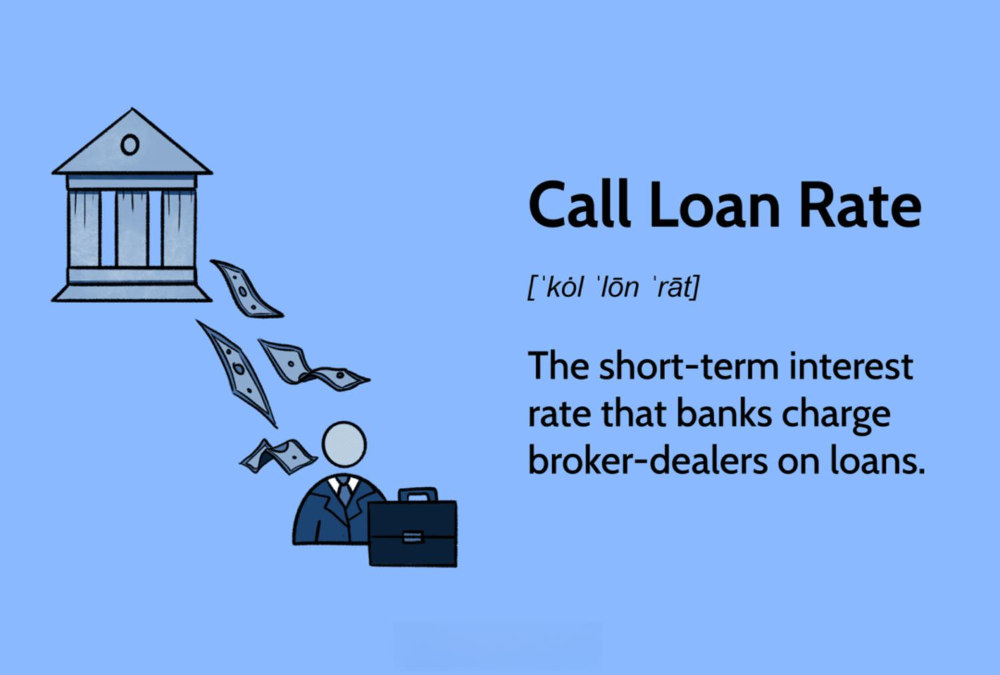

In today's financial landscape, interest rates and trading strategies are pivotal in shaping investment success. As financial markets evolve, understanding these elements becomes increasingly essential for traders, investors, and financial professionals. This article explores the intricacies of three critical components: call loan rates, finance interest rates, and algorithmic trading, each playing a vital role in the trading ecosystem.

Call loan rates represent short-term interest rates charged by banks on loans to broker-dealers. These rates fluctuate daily based on market conditions and policy changes. They are pivotal in impacting margin accounts and form the foundation for brokerage firms to finance their clients’ margin transactions, thus influencing margin interest charges. The determination of call loan rates and their implications for traders will be thoroughly examined to offer insight into their operational significance.



Finance interest rates are another cornerstone of the financial environment, intimately linked to the broader economic system. From affecting loan conditions to shaping investment strategies, interest rates are influenced by central bank policies and broader economic indicators. Understanding the relationship between these rates and market dynamics is crucial for informed trading decisions, presenting both opportunities and challenges for those operating in the financial sector.

Algorithmic trading (or algo trading) is a transformative force in modern trading strategies, employing automation and sophisticated computer algorithms to execute trades based on predefined criteria. This innovation enhances trading efficiency, reduces costs, and minimizes human error. By incorporating elements such as interest rates into their calculations, algorithmic strategies can optimize trading positions, a topic that will be explored in detail.

As technology and financial instruments continue to evolve, the interplay between interest rates and algorithmic trading presents both challenges and opportunities. With a focus on the future trends in call loan rates and algo trading, this article aims to provide a comprehensive understanding of how these elements interact and influence the trading environment. By exploring these components, traders and financial professionals can better adapt to upcoming challenges and capitalize on the opportunities they present. Join us as we explore the opportunities and challenges presented by this dynamic landscape.

## Table of Contents

## Understanding Call Loan Rates

Call loan rates are a crucial component of the financial system, representing the short-term interest rates that banks charge broker-dealers for loans. These loans are typically used to finance margin accounts, allowing brokerages to extend credit to their clients for trading purposes. The call loan rate is a daily fluctuating rate, influenced by various market conditions and policy changes, which directly impacts the cost of margin trading for investors.

The determination of call loan rates involves several factors, including the prevailing [interest rate](/wiki/interest-rate-trading-strategies) environment, the supply and demand for funds, and the creditworthiness of the borrowing institution. Central banks' monetary policies, such as changes in the federal funds rate, also play a significant role in setting the call loan rates. When central banks adjust interest rates to manage economic growth or inflation, the call loan rates concurrently adjust to reflect these changes.

For broker-dealers and financial professionals, understanding call loan rates is essential due to their impact on trading costs and profitability. These rates serve as a foundation for calculating the margin interest charges applied to clients' margin accounts. When call loan rates increase, the cost of borrowing for margin trading rises, potentially affecting investors' trading strategies and market participation.

To calculate the interest on a margin account, the formula used typically is:

$$
\text{Interest} = (\text{Borrowed Amount} \times \text{Call Loan Rate}) \times \left(\frac{\text{Days Borrowed}}{360}\right)
$$

This equation highlights how fluctuations in the call loan rate can affect the overall interest paid by investors utilizing margin accounts. Therefore, keeping abreast of changes in call loan rates is vital for traders aiming to manage costs effectively and optimize their trading positions.

From a financial planning perspective, broker-dealers must strategically manage their financing costs to maintain competitiveness and profitability. An understanding of call loan rates aids financial professionals in making informed decisions, both regarding operational strategies and the structuring of client offerings to ensure efficient cost management and alignment with prevailing market conditions.

## Finance Interest Rates and Market Dynamics

Interest rates are a pivotal element of the financial ecosystem, influencing a myriad of economic activities including loans, savings, and investment strategies. Central banks, such as the Federal Reserve in the United States, are primarily responsible for establishing interest rates through monetary policy tools. These institutions aim to manage inflation, stabilize currency, and achieve sustainable economic growth.

Factors that influence interest rate decisions by central banks include inflation rates, economic growth indicators, employment figures, and global economic conditions. For instance, high inflation may prompt central banks to raise interest rates to curb excessive price increases, while slow economic growth might lead to a cut in rates to stimulate borrowing and investment.

The implication of interest rate decisions on trading activities cannot be overstated. Traders closely monitor these decisions as they impact market [liquidity](/wiki/liquidity-risk-premium) and financial asset pricing. An increase in interest rates often leads to a strengthening of the currency, making exports more expensive but attracting foreign capital investment due to higher returns. Conversely, a reduction in rates tends to weaken the currency but can boost stock markets as borrowing costs decrease, leading to potentially higher corporate profits.

Understanding the intricate relationship between finance interest rates and economic indicators is crucial for informed trading. For example, the yield curve, which graphically represents the yields across different maturities of government debt, can signal economic expectations. A normal upward-sloping yield curve suggests healthy economic growth, whereas an inverted yield curve might indicate a potential recession. Traders often use these signals to adjust their strategies accordingly.

Moreover, changes in interest rates affect the valuation models for various financial instruments. For instance, in the discounted cash flow (DCF) model used to value stocks, the discount rate, often reflective of the current interest rates, is a crucial input. An increase in rates raises the discount rate, which subsequently lowers the present value of future cash flows, potentially leading to a decrease in stock valuations.

In summary, interest rates serve as a vital barometer for economic health, affecting a wide range of financial activities and market dynamics. Traders who grasp the nuances of interest rate movements and their economic implications can position themselves advantageously in the complex landscape of financial trading.

## Algorithmic Trading: The Role of Automation

Algorithmic trading, commonly known as algo trading, utilizes computer software to automatically execute trading orders according to a set of predefined criteria. This approach harnesses computational algorithms to optimize efficiency, reduce transaction costs, and diminish human error, which are key advantages over traditional manual trading.

One of the primary benefits of [algorithmic trading](/wiki/algorithmic-trading) is its ability to enhance trading efficiency. Computers can process massive amounts of data and execute trades at speeds unattainable by human traders. This rapid execution reduces the market impact of large trades and allows traders to take advantage of fleeting market opportunities. Furthermore, the use of automation minimizes operational costs by reducing the need for constant human oversight and manual intervention.

Algorithmic trading also significantly curtails human error, which can arise from delayed decision-making, emotional biases, or fatigue. By adhering strictly to algorithms, algo trading ensures that decisions are made consistently and based solely on logic and data, eliminating subjective biases.

There are various types of algorithms employed in trading, each serving different strategies. Trend-following algorithms capitalize on [momentum](/wiki/momentum) by buying assets expected to rise and selling those expected to fall. Statistical [arbitrage](/wiki/arbitrage) algorithms, on the other hand, seek to exploit price discrepancies between correlated securities, aiming for profit from the convergence of their prices.

Interest rates play an integral role in the construction and execution of these algorithms. For instance, trend-following algorithms may incorporate interest rate changes as signals for entering or exiting positions, while [statistical arbitrage](/wiki/statistical-arbitrage) strategies might adjust their models for interest rate differentials between assets.

Python is a favored language for developing algorithmic trading systems due to its powerful libraries such as NumPy and pandas for data manipulation, and the availability of quantitative finance libraries like Quantlib. An example of a simple moving average crossover algorithm in Python might look like this:

```python
import pandas as pd

def moving_average_crossover(data, short_window=40, long_window=100):
    """
    Determines buy and sell signals based on moving average crossover strategy.

    Parameters:
    - data: A pandas DataFrame with 'Date' and 'Price' columns.
    - short_window: Integer for short moving average window.
    - long_window: Integer for long moving average window.

    Returns:
    - signals: A pandas DataFrame containing the original data plus 'Signal' column.
    """
    signals = pd.DataFrame(index=data.index)
    signals['Price'] = data['Price']

    # Create short and long simple moving average columns
    signals['Short_MA'] = signals['Price'].rolling(window=short_window, min_periods=1).mean()
    signals['Long_MA'] = signals['Price'].rolling(window=long_window, min_periods=1).mean()

    # Create signals
    signals['Signal'] = 0.0
    signals['Signal'][short_window:] = np.where(signals['Short_MA'][short_window:] > signals['Long_MA'][short_window:], 1.0, 0.0)

    # Generate trading orders
    signals['Position'] = signals['Signal'].diff()

    return signals
```

In conclusion, algorithmic trading presents an automated approach to executing trades, bolstered by efficiency and precision. By leveraging the capabilities of algorithms tailored to different strategies, traders can navigate the market more adeptly, including considerations of interest rate impacts. The integration of technology and finance in such a manner continues to evolve, offering significant opportunities and challenges alike.

## Interplay Between Interest Rates and Algo Trading

Interest rates significantly influence algorithmic trading strategies, particularly in risk management and profitability optimization. Algorithms are designed to swiftly respond to market changes, and fluctuations in interest rates are no exception. These rates affect the cost of borrowing and the expected returns on investments, which algorithms can integrate into their trading decisions to adjust portfolios promptly.

The impact of interest rate changes is profound on fixed-income securities, for instance. An increase in interest rates typically leads to a decrease in bond prices, which algorithms can anticipate and act upon. Using historical data and predictive models, algorithms can forecast interest rate trends and adjust their trades accordingly. For instance, if an algorithm detects an upward trend in rates, it might short-sell bonds to capitalize on the anticipated decline in bond prices.

In more complex trading algorithms, interest rate differentials are key components. These algorithms engage in [carry](/wiki/carry-trading) trades, borrowing in currencies with low interest rates and investing in those with higher rates. The profitability of such strategies is closely tied to movements in interest rates. A sudden change in the interest rate landscape can reverse the benefits of a carry trade, leading to swift algorithmic adjustments.

Consider a case study of the 2008 financial crisis when central banks around the world slashed interest rates to stimulate economic activity. Algorithms that were programmed to exploit interest rate differentials had to quickly modify their strategies to cope with the changing environment. Some algorithms might have switched focus to equities or commodities and reduced reliance on interest rate predictions, highlighting the need for flexibility in algorithmic designs.

Another significant aspect is the use of interest rates in models like the Black-Scholes option pricing model, where the risk-free interest rate is a parameter in calculating option prices. Changes in interest rates directly affect these calculations, prompting algorithms to recalibrate their pricing mechanisms and hedging strategies.

A Python implementation of a simple interest rate differential model might look like this:

```python
import numpy as np

# Parameters
domestic_interest_rate = 0.02 # 2%
foreign_interest_rate = 0.05 # 5%
exchange_rate_initial = 1.5

# Simple differential calculation
def interest_rate_differential(domestic_rate, foreign_rate, initial_exchange):
    differential = foreign_rate - domestic_rate
    expected_future_exchange_rate = initial_exchange * (1 + differential)
    return expected_future_exchange_rate

future_exchange_rate = interest_rate_differential(domestic_interest_rate, foreign_interest_rate, exchange_rate_initial)
print(f"Expected future exchange rate: {future_exchange_rate}")
```

This model helps evaluate the potential profit from a carry trade by estimating the future exchange rate based on the interest rate differential. As the financial environment evolves, algorithms continuously adapt to integrate new data and optimize trading positions, underscoring their dependency on accurate interest rate forecasts. Interest rates remain a pivotal [factor](/wiki/factor-investing) in shaping algorithmic trading outcomes, necessitating sophisticated strategies to maintain competitiveness.

## Future Trends and Considerations

As technology and financial instruments evolve, the landscape of interest rates and trading strategies is subject to significant change. The integration of advanced technologies into financial markets presents both challenges and opportunities for traders and institutions. This section explores these developments, focusing on call loan rates and algorithmic trading with an emphasis on sustainable finance.

**Call Loan Rates and Algorithmic Trading Developments**

Call loan rates, which are pivotal in margin financing, are expected to undergo shifts influenced by changes in monetary policies, market liquidity, and global economic conditions. The increasing frequency of policy adjustments by central banks, driven by economic uncertainty and the need to control inflation, affects these rates considerably. Traders and institutions must stay attuned to macroeconomic indicators that signal potential rate changes.

Algorithmic trading stands at the forefront of financial innovation, employing [machine learning](/wiki/machine-learning) and [artificial intelligence](/wiki/ai-artificial-intelligence) to create more adaptive and intelligent trading algorithms. These technologies allow algorithms to better predict market movements and respond dynamically to fluctuations in interest rates, including call loan rates. Advanced machine learning models, such as [reinforcement learning](/wiki/reinforcement-learning), can further enhance the ability of algorithms to optimize trading strategies in volatile markets.

**Sustainable Finance: Opportunities and Challenges**

The shift towards sustainable finance is another emerging trend impacting the trading ecosystem. Investors and institutions are increasingly prioritizing environmental, social, and governance ([ESG](/wiki/esg-investing)) criteria. This shift necessitates the development of novel trading models and strategies that integrate ESG considerations without compromising on financial performance.

Algorithmic trading systems can be developed to incorporate ESG factors. For instance, algorithms can be programmed to favor trades with companies that have robust sustainability practices or to avoid sectors with negative environmental impacts. This presents a unique opportunity for traders to align investment strategies with ethical considerations while potentially accessing new markets and client bases.

**Adapting to the Future**

For traders and financial institutions to thrive amidst these shifts, a proactive approach is necessary. This includes investing in technology and talent capable of navigating and capitalizing on rapid changes. Moreover, collaboration between financial institutions and technology providers will be crucial in developing comprehensive systems that leverage data analytics and machine learning to anticipate interest rate changes and optimize trading strategies.

Continuous education on emerging technologies and market trends will empower traders to remain competitive. By embracing innovation and sustainability, the financial sector can not only mitigate risks but also discover new avenues for growth in the increasingly complex trading environment.

In conclusion, the confluence of technological advances, shifting interest rate landscapes, and the rise of sustainable finance necessitates a forward-thinking approach by traders and institutions. By strategically adapting to these changes, market participants can enhance their trading operations and contribute to a more resilient financial system.

## Conclusion

Understanding the dynamics of call loan rates, finance interest rates, and algorithmic trading is crucial for contemporary traders looking to achieve success in ever-evolving markets. Call loan rates, which are short-term interest rates charged by banks to broker-dealers, significantly affect margin accounts and, consequently, the trading strategies employed by financial professionals. Traders who comprehend the intricacies of these rates can better adjust their strategies to account for daily fluctuations resulting from market conditions and policy changes.

Finance interest rates, broader than call loans, impact various aspects of the financial system, influencing everything from consumption and investment to inflation and economic growth. Traders who pay keen attention to how central banks adjust these rates in response to economic indicators can make more informed decisions, aligning their strategies with macroeconomic trends. This involves a thorough understanding of economic principles and staying updated with financial news.

Algorithmic trading presents traders with tools to automate the execution of orders based on specific criteria. By leveraging technological advancements, algorithms can efficiently process vast amounts of data, make rapid decisions, and minimize errors, providing traders with a competitive edge. Incorporating interest rate data into these algorithms further refines their effectiveness, allowing for optimized trading positions that adeptly respond to rate changes.

Aligning strategies with prevailing interest rate trends and harnessing algorithmic trading methodologies enables traders to elevate their market positions. This alignment not only optimizes trading outcomes but also supports risk management, a key component of sustainable financial practices. Continuous education and adaptation are fundamental. As financial markets evolve with technology, traders must stay informed and flexible to navigate complexities and seize new opportunities. In doing so, they ensure their strategies remain relevant and profitable in a dynamic trading environment.

## References & Further Reading

[1]: Mishkin, F. S. (2018). ["The Economics of Money, Banking, and Financial Markets"](https://www.pearsonhighered.com/assets/preface/0/1/3/4/0134855388.pdf) (12th Edition). Pearson.

[2]: Aldridge, I. (2013). ["High-Frequency Trading: A Practical Guide to Algorithmic Strategies and Trading Systems"](https://books.google.com/books/about/High_Frequency_Trading.html?id=8QpIsVUMhmEC). Wiley.

[3]: Hull, J. C. (2018). ["Options, Futures, and Other Derivatives"](https://www.semanticscholar.org/paper/Options%2C-Futures%2C-and-Other-Derivatives-Hull/89bdee500c8623864fc9eb7a471546aa713acc44) (10th Edition). Pearson.

[4]: Lopez de Prado, M. (2018). ["Advances in Financial Machine Learning"](https://www.amazon.com/Advances-Financial-Machine-Learning-Marcos/dp/1119482089). Wiley.

[5]: Chan, E. (2009). ["Quantitative Trading: How to Build Your Own Algorithmic Trading Business"](https://github.com/ftvision/quant_trading_echan_book). Wiley.

[6]: Shreve, S. E. (2004). ["Stochastic Calculus for Finance I: The Binomial Asset Pricing Model"](https://link.springer.com/book/10.1007/978-0-387-22527-2). Springer.

[7]: Kissell, R. (2014). ["The Science of Algorithmic Trading and Portfolio Management"](https://www.sciencedirect.com/book/9780124016897/the-science-of-algorithmic-trading-and-portfolio-management). Academic Press.