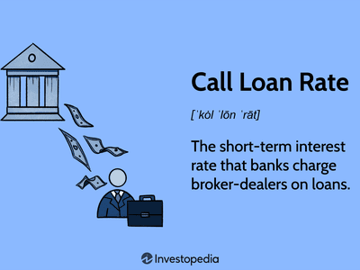

In the fast-paced world of finance, understanding the interplay between interest rates, call money rates, and algorithmic trading is crucial for investors and traders. As global markets evolve with technological advancements and economic fluctuations, these elements have become vital components in shaping trading strategies and financial decisions. Interest rates, set by central banks, serve as pivotal tools for managing inflation and ensuring economic stability, influencing a wide range of financial instruments and assets. Meanwhile, call money rates, or the short-term interest rates at which banks lend to each other, directly impact the costs of borrowing for traders and investors, affecting liquidity and market dynamics.

Algorithmic trading, a technological innovation, revolutionizes market transactions by employing sophisticated computer algorithms to execute orders at unprecedented speed and accuracy. The integration of these technologies within financial markets allows for more efficient trading processes, optimized investment strategies, and enhanced risk management. This convergence of economic data and advanced trading methodologies underscores the necessity for a comprehensive understanding of how interest rates and call money rates interact with algorithmic trading to form the backbone of contemporary financial systems.



This article aims to explore these interconnected components, shedding light on their significance in modern trading and financial markets. By examining the mechanisms and interactions of interest rates, call money rates, and algorithmic trading, readers will gain insights into their collective impact on market trends and trading practices. The following sections will delve into each element individually and explore their integration, offering a clear perspective on how these factors coalesce to influence financial markets today. By the end of this article, readers will have a thorough understanding of the foundational elements that drive current financial systems and the strategies employed to navigate this complex landscape.

## Table of Contents

## Understanding Interest Rates and Call Money Rates

Interest rates are fundamental instruments employed by central banks worldwide to influence economic activities. They are pivotal in controlling inflation, encouraging savings and investments, and maintaining economic stability. Central banks like the Federal Reserve in the United States, the European Central Bank in the Eurozone, and others globally set benchmark interest rates that serve as references for various financial transactions. By adjusting these rates, central banks influence the cost of borrowing and the incentive to save, thus steering economic growth.

The call money rate is a short-term interest rate paid by financial institutions when they borrow funds on an overnight basis to meet temporary liquidity requirements. It is a vital component of the interbank money market, where banks lend and borrow funds from one another to manage their liquidity positions. This rate is particularly important for brokerages that need margin loans to facilitate trading activities. Changes in the call money rate can have significant implications for investor borrowing costs, impacting trading strategies and financial market dynamics.

The mechanism by which central banks influence interest rates typically involves open market operations, reserve requirements, and discount rate adjustments. By buying or selling government securities, central banks can alter the money supply, influencing short-term interest rates. For instance, purchasing securities injects liquidity into the banking system, generally leading to lower interest rates. Conversely, selling securities extracts liquidity, often resulting in higher rates.

Mathematically, the relationship between interest rates and other economic variables can be expressed through various models. The Fisher equation, for example, describes the relationship between nominal interest rates, real interest rates, and inflation:

$$
i = r + \pi
$$

Where:
- $i$ is the nominal interest rate,
- $r$ is the real interest rate,
- $\pi$ is the expected inflation rate.

This equation underscores the importance of considering inflationary expectations when analyzing interest rates, as inflation can erode the purchasing power of returns on investments.

Understanding both interest rates and the call money rate is essential for grasping the intricacies of financial markets. They determine the cost of credit, influence investment decisions, and are integral to monetary policy frameworks. These rates, by affecting the broader financial ecosystem, ultimately bear on economic growth and stability. Financial institutions, investors, and policymakers monitor these rates closely to adapt to changing economic conditions, illustrating their critical role within the financial ecosystem.

## Algorithmic Trading: The Technological Frontier

Algorithmic trading, a hallmark of modern financial markets, employs sophisticated computer algorithms to execute trades with remarkable speed and precision. These algorithms are programmed to follow specific instructions, allowing them to process vast amounts of data and execute trades within milliseconds—a feat unattainable by human traders. The design of these algorithms hinges on leveraging information such as price, timing, and market conditions to optimize trading decisions.

The fundamental advantage of [algorithmic trading](/wiki/algorithmic-trading) lies in its ability to minimize human error and exploit market inefficiencies. Algorithms are capable of conducting high-frequency trading ([HFT](/wiki/high-frequency-trading-strategies)), where they perform a large number of trades in a short time to capitalize on small price fluctuations. This speed not only enhances efficiency but also helps in achieving better pricing as algorithms can execute buy and sell orders very quickly, reducing transaction costs.

Precision is another critical component of algorithmic trading. By utilizing mathematical models and statistical analyses, algorithms can evaluate trading opportunities with great accuracy. For instance, algorithms use strategies like mean reversion, which assume that asset prices will revert to their historical averages. By analyzing historical data, an algorithm can predict deviation from mean trends and initiate trades accordingly.

The integration of big data and [machine learning](/wiki/machine-learning) is indispensable to optimizing these trading strategies. Big data enables algorithms to digest immense volumes of market information, including news articles, social media sentiment, and historical pricing data, enhancing their decision-making capabilities. Machine learning further refines this process by allowing algorithms to learn from past trades and adapt to changing market conditions. For example, an algorithm can be trained using supervised learning techniques to identify profitable trading patterns and continuously improve its performance based on newly acquired data.

Practical examples of algorithmic trading include market-making, [arbitrage](/wiki/arbitrage), and trend-following strategies. In market-making, algorithms provide [liquidity](/wiki/liquidity-risk-premium) to the markets by continuously quoting buy and sell prices, [earning](/wiki/earning-announcement) a spread. Arbitrage exploits price discrepancies for the same asset across different markets, while trend-following involves algorithms identifying and capitalizing on market trends.

Python, a preferred language in algorithmic trading, offers numerous libraries such as Pandas for handling data, NumPy for numerical computations, and scikit-learn for building machine learning models. Here is a simple Python code snippet illustrating how one might implement a moving average crossover strategy—a common algorithmic trading strategy:

```python
import numpy as np
import pandas as pd

def moving_average_crossover(data, short_window=40, long_window=100):
    signals = pd.DataFrame(index=data.index)
    signals['price'] = data['close']
    signals['short_mavg'] = data['close'].rolling(window=short_window, min_periods=1, center=False).mean()
    signals['long_mavg'] = data['close'].rolling(window=long_window, min_periods=1, center=False).mean()
    signals['signal'] = 0.0
    signals['signal'][short_window:] = np.where(signals['short_mavg'][short_window:] > signals['long_mavg'][short_window:], 1.0, 0.0)   
    signals['positions'] = signals['signal'].diff()
    return signals

# Example usage with a DataFrame 'data' containing historical prices
signals = moving_average_crossover(data)
```

This algorithm determines buy or sell signals by comparing short-term and long-term moving averages of asset prices, facilitating timely reaction to market trends.

The technological frontier of algorithmic trading continues to expand with advancements in data processing and [artificial intelligence](/wiki/ai-artificial-intelligence), promising increased efficiency and innovation in financial markets.

## Integration of Interest Rates and Algorithmic Trading

Integrating [interest rate](/wiki/interest-rate-trading-strategies) data with algorithmic trading strategies provides traders a sophisticated approach to improving investment outcomes. Interest rates, which indicate the cost of borrowing money, can significantly influence asset prices and market movements. As such, accurately anticipating changes in these rates allows traders to make informed decisions based on expected shifts in economic conditions. 

Algorithms utilized in trading can be programmed to incorporate various economic indicators, including interest rates. For example, an algorithm might use historical interest rate data to predict future rate movements by analyzing patterns and trends. It could employ statistical methods such as time series analysis or machine learning techniques like regression models to forecast interest rate changes. Once a projected trend is identified, the algorithm can execute trading strategies aligned with these expectations, optimizing portfolio returns.

Python, a versatile programming language, is particularly adept at handling such tasks. For instance, a trader could use a Python script to retrieve real-time interest rate data, apply a machine learning model to predict future rates, and accordingly adjust positions in interest-sensitive financial instruments like bonds or interest rate derivatives. Below is a simple example of how Python could facilitate such a process using a linear regression model:

```python
import numpy as np
import pandas as pd
from sklearn.linear_model import LinearRegression

# Generate some sample interest rate data
data = {'Interest_Rate': [1.5, 1.6, 1.7, 1.8, 2.0],
        'Market_Index': [1.2, 1.4, 1.5, 1.7, 1.9]}
df = pd.DataFrame(data)

# Separate features and target
X = df[['Interest_Rate']]
y = df['Market_Index']

# Create and train the model
model = LinearRegression()
model.fit(X, y)

# Predict future market index based on a new interest rate
new_interest_rate = np.array([[2.1]])
predicted_index = model.predict(new_interest_rate)

print(f"Predicted Market Index: {predicted_index[0]}")
```

This code illustrates a basic approach in which a linear regression model predicts market index values based on historical interest rate data. Advanced algorithms might incorporate more complex models, such as neural networks, to better capture nonlinear relationships between interest rates and market behavior.

There are numerous real-world applications showcasing this synergy between interest rates and algorithmic trading. For example, hedge funds often develop quantitative models that automatically adjust their trading positions in response to expected interest rate changes derived from central bank announcements or economic reports. Such strategies have proven successful in managing risk and capturing opportunities arising from interest rate [volatility](/wiki/volatility-trading-strategies).

In conclusion, the intersection of interest rates and algorithmic trading exemplifies the powerful potential of combining economic insights with technological advancements. By leveraging interest rate data within sophisticated algorithms, traders can gain significant advantages in anticipating market trends and executing timely investment decisions. This integration underscores the importance of technological proficiency and economic intelligence in modern trading.

## Challenges and Opportunities in Modern Trading

As trading technology continues to rapidly evolve, traders encounter several notable challenges alongside promising opportunities. Regulatory changes are a significant hurdle; global markets are subject to differing and sometimes conflicting regulatory frameworks. These regulations may impose limitations on trading strategies, liquidity risks, and capital requirements. For instance, the implementation of the Markets in Financial Instruments Directive II (MiFID II) in the European Union has introduced stringent reporting and transparency requirements, compelling trading firms to invest in compliance infrastructure and adapt their strategies accordingly. 

Additionally, the complexity of modern trading systems poses another challenge. As systems integrate with various technologies, ranging from high-frequency trading algorithms to decentralized finance platforms, maintaining system integrity, security, and performance becomes vital. Sophisticated risk management practices and constant monitoring are essential to counter system vulnerabilities and operational risks. 

On the opportunity side, the rise of Artificial Intelligence (AI) and blockchain technology offers transformative potential. AI enables the development of intelligent trading algorithms that can analyze vast datasets, recognize complex patterns, and predict market movements with high accuracy. These algorithms enhance decision-making by providing traders with actionable insights and allowing the automation of trading processes. Machine learning models can be employed to continually refine these algorithms, ensuring adaptability to market dynamics.

Consider the following Python example, which demonstrates a simplistic model of how machine learning can aid algorithmic trading:

```python
import numpy as np
from sklearn.model_selection import train_test_split
from sklearn.ensemble import RandomForestClassifier

# Sample dataset with market indicators
X = np.array([[0.5, 0.6, 0.8],
              [0.1, 0.4, 0.9],
              [0.2, 0.8, 0.5],
              ...])
y = np.array([1, 0, 0, ...])  # 1 for a positive future trend, 0 otherwise

# Splitting the dataset
X_train, X_test, y_train, y_test = train_test_split(X, y, test_size=0.2, random_state=42)

# Using a Random Forest Classifier for prediction
clf = RandomForestClassifier(n_estimators=100, random_state=42)
clf.fit(X_train, y_train)

# Predicting future trends
predictions = clf.predict(X_test)
```

Furthermore, blockchain technology introduces opportunities for increasing transparency and efficiency in trading practices. By utilizing decentralized ledger systems, blockchain can streamline settlement processes, reduce fraud risk, and enable real-time transaction verifications. The tokenization of assets on blockchain platforms democratizes access to investments, broadening participation in financial markets.

Preparing for future market shifts involves a strategic approach to adopting emerging technologies. Traders can harness AI and blockchain to gain a competitive edge by staying ahead of innovation curves and continuously integrating technological advancements into their trading strategies. Additionally, developing collaborative ecosystems and partnerships can facilitate technological growth and compliance adherence, ensuring an alignment with evolving market needs. 

In summary, while modern trading offers formidable challenges, it equally provides expansive opportunities through advanced technologies, allowing traders who adeptly navigate this landscape to gain significant advantages.

## Conclusion

A thorough understanding of interest rates, call money rates, and algorithmic trading is essential for navigating today's financial markets. Interest rates, set by central banks, act as tools to control inflation and ensure economic stability. They influence the cost of borrowing and the yield on investments, rendering them crucial for financial decision-making. Call money rates, being the cost at which banks lend to brokers, directly affect the borrowing costs for investors, thus impacting their trading strategies.

Algorithmic trading, leveraging advanced computer algorithms, enables the execution of trades with unprecedented speed and precision. This technological advancement allows traders to analyze large volumes of data, including fluctuations in interest and call money rates, facilitating informed decision-making and optimized market strategies.

Investors and traders who adeptly integrate these elements can capitalize on the synergies between evolving economic trends and technological innovations in trading. By understanding the intricate dynamics of interest rates and the swift execution capabilities of algorithmic trading, market participants can anticipate movements and adjust their strategies promptly.

Remaining well-informed and adaptable are key in the rapidly shifting financial landscape. As technology continues to evolve, embracing these advancements while understanding core financial principles will empower traders and investors to not only navigate but thrive amid the complexities of modern finance. Markets today demand a blend of economic insight and technological acumen, where those who remain flexible and informed can achieve superior outcomes.

## References & Further Reading

[1]: Bergstra, J., Bardenet, R., Bengio, Y., & Kégl, B. (2011). ["Algorithms for Hyper-Parameter Optimization."](https://papers.nips.cc/paper/4443-algorithms-for-hyper-parameter-optimization) Advances in Neural Information Processing Systems 24.

[2]: Lopez de Prado, M. (2018). ["Advances in Financial Machine Learning."](https://books.google.com/books/about/Advances_in_Financial_Machine_Learning.html?id=oU9KDwAAQBAJ) John Wiley & Sons.

[3]: Aronson, D. R. (2007). ["Evidence-Based Technical Analysis: Applying the Scientific Method and Statistical Inference to Trading Signals."](https://onlinelibrary.wiley.com/doi/book/10.1002/9781118268315) Wiley.

[4]: Jansen, S. (2020). ["Machine Learning for Algorithmic Trading."](https://github.com/stefan-jansen/machine-learning-for-trading) Packt Publishing.

[5]: Chan, E. P. (2009). ["Quantitative Trading: How to Build Your Own Algorithmic Trading Business."](https://github.com/ftvision/quant_trading_echan_book) John Wiley & Sons.