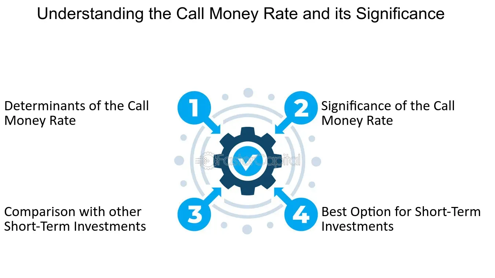

## Table of Contents

## What is the call money rate?

The call money rate is the interest rate that banks charge each other for short-term loans. These loans are usually for one day and help banks manage their daily cash needs. When a bank has extra money, it can lend it to another bank that needs money. The call money rate is important because it helps banks work smoothly and keep the financial system stable.

This rate can change every day based on how much money banks need and how much they have. It is often influenced by the central bank's policies. For example, if the central bank wants to control inflation, it might increase the call money rate to make borrowing more expensive. This rate is a key part of the money market and helps show the overall health of the banking system.

## How does the call money rate affect the economy?

The call money rate can have a big impact on the economy. When the call money rate is low, it means banks can borrow money from each other cheaply. This makes it easier for banks to lend money to businesses and people. When businesses can borrow money easily, they can grow and create more jobs. People can also borrow money to buy things like houses or cars. So, a low call money rate can help the economy grow.

On the other hand, when the call money rate is high, it costs more for banks to borrow money from each other. This can make banks more careful about lending money. They might charge higher interest rates to businesses and people, which can make it harder for them to borrow. When it's harder to borrow money, businesses might not grow as much, and people might not buy as many big things. This can slow down the economy. The central bank often changes the call money rate to help control how fast the economy grows and to keep inflation in check.

## Who are the primary participants in the call money market?

The main players in the call money market are banks and financial institutions. Banks often need to borrow money to meet their daily cash needs, and they can do this by borrowing from other banks that have extra money. These short-term loans help banks manage their cash flow and keep the financial system running smoothly.

Sometimes, other financial institutions like investment firms or brokerages also take part in the call money market. They might need short-term funds to meet their own needs or to take advantage of investment opportunities. The call money market is important because it allows these institutions to quickly get the money they need and helps keep the financial system stable.

## What is the difference between the call money rate and other interest rates?

The call money rate is the [interest rate](/wiki/interest-rate-trading-strategies) that banks charge each other for very short-term loans, usually just for one day. This rate helps banks manage their daily cash needs and keep the financial system stable. Other interest rates, like the prime rate or mortgage rates, are used for longer-term loans. The prime rate is the rate that banks charge their best customers, like big businesses, for loans. Mortgage rates are what people pay when they borrow money to buy a house. These rates are usually much higher than the call money rate because they are for longer periods and involve more risk.

The call money rate is also different because it can change every day based on how much money banks need and have. It's influenced a lot by the central bank's policies. For example, if the central bank wants to control inflation, it might raise the call money rate to make borrowing more expensive. Other interest rates, like savings account rates or credit card rates, might not change as often and are influenced by different factors. Savings account rates are what banks pay people for keeping their money in the bank, and credit card rates are what people pay when they borrow money on their credit cards. These rates are set by banks and can be affected by the overall economy and competition between banks.

## How is the call money rate determined?

The call money rate is set by how much money banks need and how much they have. When banks need more money, they borrow from other banks that have extra. The rate they agree on is the call money rate. It can change every day because the amount of money banks need can change a lot. If many banks need money at the same time, the rate goes up. If fewer banks need money, the rate goes down.

The central bank also plays a big role in setting the call money rate. The central bank can change the amount of money in the system by buying or selling government bonds. If the central bank wants to make borrowing more expensive to control inflation, it might sell bonds and take money out of the system. This makes the call money rate go up. If the central bank wants to help the economy grow, it might buy bonds and put more money into the system. This makes the call money rate go down. So, the call money rate is influenced by what banks do and what the central bank does.

## What role does the central bank play in influencing the call money rate?

The central bank has a big role in setting the call money rate. It can change the amount of money in the banking system by buying or selling government bonds. When the central bank buys bonds, it puts more money into the system. This makes it easier for banks to borrow from each other, so the call money rate goes down. On the other hand, when the central bank sells bonds, it takes money out of the system. This makes it harder for banks to borrow, so the call money rate goes up.

The central bank uses these actions to help control the economy. If the economy is growing too fast and causing inflation, the central bank might raise the call money rate to make borrowing more expensive. This can slow down the economy and help control inflation. If the economy is not growing enough, the central bank might lower the call money rate to make borrowing cheaper. This can help the economy grow by making it easier for businesses and people to borrow money. So, the central bank's actions have a big impact on the call money rate and the overall economy.

## Can you explain the daily operations of the call money market?

The call money market works every day to help banks manage their money. Banks need to have enough cash to handle all their daily activities, like giving out loans or paying for things. Sometimes, a bank might not have enough cash, so it borrows from another bank that has extra. They agree on a rate, called the call money rate, for this short-term loan. This loan is usually just for one day, so the borrowing bank can use the money and then pay it back the next day.

The call money rate changes every day based on how much money banks need and how much they have. If many banks need money, the rate goes up because there's more demand. If fewer banks need money, the rate goes down because there's less demand. The central bank also affects the call money rate by adding or taking away money from the system. If the central bank wants to make borrowing more expensive, it might take money out of the system, which makes the call money rate go up. If it wants to make borrowing cheaper, it might add money to the system, which makes the call money rate go down.

## How do fluctuations in the call money rate impact financial institutions?

Fluctuations in the call money rate can have a big impact on financial institutions like banks. When the call money rate goes up, it costs more for banks to borrow money from each other. This can make banks more careful about lending money to businesses and people. They might charge higher interest rates on loans to cover their higher borrowing costs. This can make it harder for businesses to grow and for people to buy things like houses or cars, which can slow down the economy.

On the other hand, when the call money rate goes down, it's cheaper for banks to borrow money. This can make banks more willing to lend money because their borrowing costs are lower. They might offer lower interest rates on loans, which can help businesses grow and people buy things they need. This can help the economy grow faster. So, the call money rate is important for financial institutions because it affects how much they pay to borrow and how much they can lend to others.

## What are the historical trends of the call money rate?

The call money rate has changed a lot over the years. In the past, it used to be very high, especially during times when the economy was not doing well. For example, in the late 1970s and early 1980s, the call money rate was very high because the central bank was trying to control inflation. During these times, the rate could go above 20%. When the rate is high, it means banks have to pay a lot to borrow money from each other, which can slow down the economy.

Over time, the call money rate has gone down. In the 1990s and 2000s, the rate was much lower, often around 5% or less. This was because the central bank wanted to help the economy grow by making borrowing cheaper. After the 2008 financial crisis, the call money rate dropped even more, sometimes getting close to 0%. This very low rate was meant to help the economy recover by making it easier for banks to lend money. So, the call money rate has had big ups and downs, and it shows how the central bank tries to manage the economy.

## How do global economic conditions affect the call money rate?

Global economic conditions can have a big impact on the call money rate. When the world economy is doing well, more money moves around the world. This can make it easier for banks to get money, so the call money rate might go down. But if there are problems in the world economy, like a big crisis or a lot of uncertainty, banks might want to keep more money for themselves. This can make it harder for banks to borrow money from each other, so the call money rate might go up.

The actions of other countries' central banks also affect the call money rate. If a big central bank, like the one in the United States or Europe, changes its interest rates, it can change how much money moves around the world. For example, if the U.S. central bank raises its rates, money might move to the U.S. because people can get better returns there. This can make it harder for banks in other countries to get money, so their call money rate might go up. So, the call money rate is not just affected by what happens in one country, but by what happens all over the world.

## What are the risks associated with lending and borrowing at the call money rate?

When banks lend and borrow money at the call money rate, there are some risks involved. One big risk is that the call money rate can change a lot from day to day. If a bank borrows money at a low rate and then the rate goes up, it can cost them more to pay back the loan. This can make it hard for the bank to make money. Another risk is that the bank they borrowed from might need the money back quickly. If a bank can't pay back the loan right away, it could have problems.

There's also the risk that comes from the overall economy. If the economy is not doing well, banks might need more money than usual. This can make the call money rate go up, which can be bad for banks that need to borrow. If a bank can't get the money it needs, it might have to stop lending to businesses and people, which can hurt the economy even more. So, while the call money market helps banks manage their money, it also comes with risks that they need to be careful about.

## How can financial analysts predict changes in the call money rate?

Financial analysts can predict changes in the call money rate by looking at many different things. They pay attention to what the central bank is doing. If the central bank is buying or selling a lot of bonds, it can change how much money is in the system. Analysts also look at how the economy is doing. If the economy is growing fast, banks might need more money, which can make the call money rate go up. They also watch what's happening in other countries because global economic conditions can affect the call money rate too.

Another way analysts predict changes is by using data and models. They look at past data to see how the call money rate has changed before and what caused those changes. They use this information to make models that can help them guess what might happen next. These models take into account things like inflation, economic growth, and what other central banks are doing. By putting all this information together, analysts can make better guesses about where the call money rate is headed.

## What is the relationship between interest rates and call money rates?

Interest rates are fundamental instruments employed by central banks worldwide to influence economic activities. They are pivotal in controlling inflation, encouraging savings and investments, and maintaining economic stability. Central banks like the Federal Reserve in the United States, the European Central Bank in the Eurozone, and others globally set benchmark interest rates that serve as references for various financial transactions. By adjusting these rates, central banks influence the cost of borrowing and the incentive to save, thus steering economic growth.

The call money rate is a short-term interest rate paid by financial institutions when they borrow funds on an overnight basis to meet temporary [liquidity](/wiki/liquidity-risk-premium) requirements. It is a vital component of the interbank money market, where banks lend and borrow funds from one another to manage their liquidity positions. This rate is particularly important for brokerages that need margin loans to facilitate trading activities. Changes in the call money rate can have significant implications for investor borrowing costs, impacting trading strategies and financial market dynamics.

The mechanism by which central banks influence interest rates typically involves open market operations, reserve requirements, and discount rate adjustments. By buying or selling government securities, central banks can alter the money supply, influencing short-term interest rates. For instance, purchasing securities injects liquidity into the banking system, generally leading to lower interest rates. Conversely, selling securities extracts liquidity, often resulting in higher rates.

Mathematically, the relationship between interest rates and other economic variables can be expressed through various models. The Fisher equation, for example, describes the relationship between nominal interest rates, real interest rates, and inflation:

$$
i = r + \pi
$$

Where:
- $i$ is the nominal interest rate,
- $r$ is the real interest rate,
- $\pi$ is the expected inflation rate.

This equation underscores the importance of considering inflationary expectations when analyzing interest rates, as inflation can erode the purchasing power of returns on investments.

Understanding both interest rates and the call money rate is essential for grasping the intricacies of financial markets. They determine the cost of credit, influence investment decisions, and are integral to monetary policy frameworks. These rates, by affecting the broader financial ecosystem, ultimately bear on economic growth and stability. Financial institutions, investors, and policymakers monitor these rates closely to adapt to changing economic conditions, illustrating their critical role within the financial ecosystem.

## References & Further Reading

[1]: Bergstra, J., Bardenet, R., Bengio, Y., & Kégl, B. (2011). ["Algorithms for Hyper-Parameter Optimization."](https://papers.nips.cc/paper/4443-algorithms-for-hyper-parameter-optimization) Advances in Neural Information Processing Systems 24.

[2]: Lopez de Prado, M. (2018). ["Advances in Financial Machine Learning."](https://books.google.com/books/about/Advances_in_Financial_Machine_Learning.html?id=oU9KDwAAQBAJ) John Wiley & Sons.

[3]: Aronson, D. R. (2007). ["Evidence-Based Technical Analysis: Applying the Scientific Method and Statistical Inference to Trading Signals."](https://onlinelibrary.wiley.com/doi/book/10.1002/9781118268315) Wiley.

[4]: Jansen, S. (2020). ["Machine Learning for Algorithmic Trading."](https://github.com/stefan-jansen/machine-learning-for-trading) Packt Publishing.

[5]: Chan, E. P. (2009). ["Quantitative Trading: How to Build Your Own Algorithmic Trading Business."](https://github.com/ftvision/quant_trading_echan_book) John Wiley & Sons.