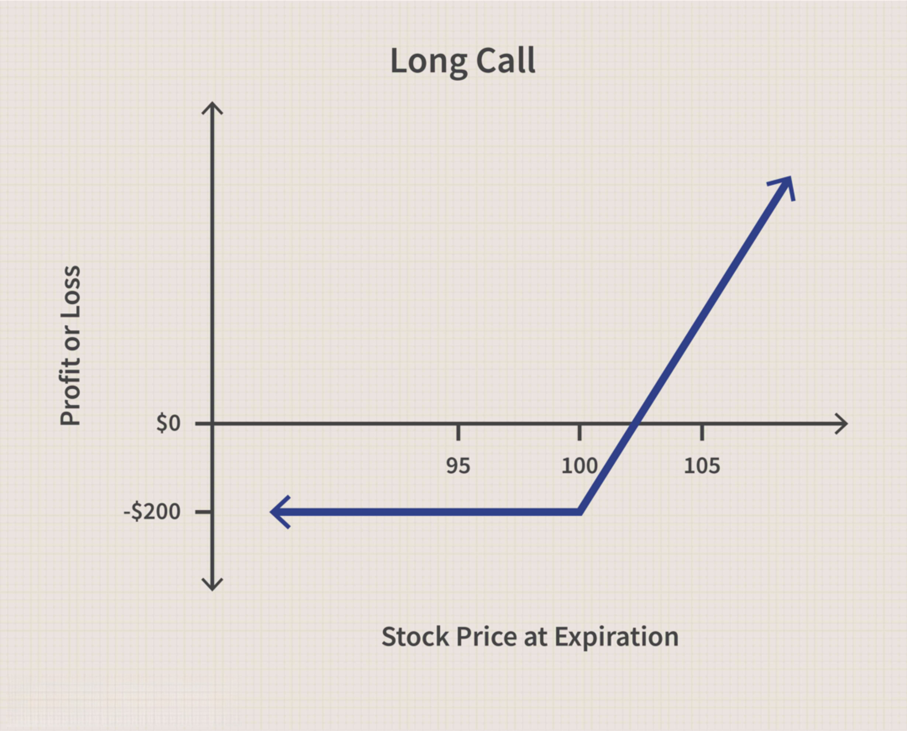

## Table of Contents

## What is a 'Call on a Call' option?

A 'Call on a Call' option is a type of financial product that gives you the right to buy another call option. Imagine you have a call option, which lets you buy a stock at a set price. A 'Call on a Call' option means you can buy that first call option at a later date, if you want to.

This kind of option can be useful if you think the price of the stock will go up a lot in the future. It lets you delay your decision to buy the stock, giving you more time to see how things go. But remember, it can be complicated and risky, so it's important to understand it well before using it.

## How does a 'Call on a Call' option work?

A 'Call on a Call' option is like a two-step process in the world of options trading. First, you buy a 'Call on a Call' option, which gives you the right to buy another call option later on. The first call option you can buy later is called the underlying option. You pay a premium for the 'Call on a Call' option, which is the price you pay for the right to buy the underlying call option in the future.

When the time comes, if you think it's a good idea, you can use your 'Call on a Call' option to buy the underlying call option. This underlying call option then gives you the right to buy a stock at a set price, called the strike price. If the stock's price has gone up a lot since you bought the 'Call on a Call' option, you could make a profit by buying the stock at the lower strike price and then selling it at the higher market price. But if the stock price hasn't gone up enough, or if it's gone down, you might not want to buy the underlying call option, and you would lose the premium you paid for the 'Call on a Call' option.

## What are the basic components of a 'Call on a Call' option?

A 'Call on a Call' option has a few important parts that you need to know about. First, there's the premium, which is the price you pay to buy the 'Call on a Call' option. This is like the cost of having the right to buy another call option later. Then, there's the expiration date, which is the last day you can use your 'Call on a Call' option. If you don't use it by then, it's gone, and you lose the premium you paid.

The second part is the underlying call option. This is the call option you can buy if you decide to use your 'Call on a Call' option. The underlying call option has its own strike price, which is the set price at which you can buy the stock if you decide to use the underlying call option. It also has its own expiration date, which is when the underlying call option expires. If you think the stock price will go up a lot, you might want to buy the underlying call option and then the stock at the strike price to make a profit.

## What are the common uses of 'Call on a Call' options in trading?

Traders use 'Call on a Call' options when they think a stock's price will go up a lot in the future, but they're not sure when. This type of option lets them wait and see how things go before making a big decision. For example, if a company is about to release a new product, but it's not clear when, a trader might buy a 'Call on a Call' option. This way, they can wait for the product to come out and see if it's a hit before deciding to buy the stock.

Another common use is for managing risk. Since 'Call on a Call' options give you time to wait and see, they can help traders avoid making quick decisions that might not turn out well. If the stock price doesn't go up as expected, the trader can choose not to buy the underlying call option and only lose the premium paid for the 'Call on a Call' option. This can be a safer way to bet on a stock's future without risking a lot of money right away.

## How is the pricing of a 'Call on a Call' option determined?

The price of a 'Call on a Call' option, called the premium, depends on a few things. First, it's affected by the price of the stock the option is based on. If the stock's price is high, the premium will be higher because there's a bigger chance of making a profit. The time until the 'Call on a Call' option expires also matters. The longer the time, the higher the premium, because there's more time for the stock price to go up. Finally, the expected ups and downs of the stock, called volatility, play a role. If the stock's price is expected to move a lot, the premium will be higher because there's a bigger chance of big changes in the stock's price.

The premium also depends on the price of the underlying call option. If the underlying call option is expensive, the 'Call on a Call' option will be more expensive too. The strike price of the underlying call option is important too. If the strike price is low compared to the current stock price, the premium will be higher because there's a bigger chance of making a profit. All these factors together help decide how much you'll pay for a 'Call on a Call' option.

## What factors influence the value of a 'Call on a Call' option?

The value of a 'Call on a Call' option depends on several things. First, it's affected by the price of the stock the option is based on. If the stock's price is high, the value of the option goes up because there's a bigger chance of making money. The time left until the 'Call on a Call' option expires also matters. The longer the time, the more valuable the option becomes, because there's more time for the stock price to go up. Another important [factor](/wiki/factor-investing) is how much the stock's price is expected to move around, which is called volatility. If the stock's price is expected to change a lot, the value of the option goes up because there's a bigger chance of big changes in the stock's price.

The value is also influenced by the price of the underlying call option. If the underlying call option is expensive, the 'Call on a Call' option will be more valuable too. The strike price of the underlying call option plays a role as well. If the strike price is low compared to the current stock price, the value of the 'Call on a Call' option goes up because there's a bigger chance of making a profit. All these factors together help decide how much a 'Call on a Call' option is worth.

## Can you explain the payoff structure of a 'Call on a Call' option?

When you buy a 'Call on a Call' option, you pay a premium to have the right to buy another call option later. This second call option, called the underlying call option, gives you the right to buy a stock at a set price, called the strike price. If the stock's price goes up a lot, you can use your 'Call on a Call' option to buy the underlying call option, and then use that to buy the stock at the lower strike price. If you sell the stock at the higher market price, you can make a profit. But if the stock's price doesn't go up enough, or if it goes down, you might decide not to buy the underlying call option. In that case, you would lose the premium you paid for the 'Call on a Call' option.

The payoff of a 'Call on a Call' option depends on how much the stock's price changes. If the stock's price goes up a lot by the time the 'Call on a Call' option expires, and it's worth it to buy the underlying call option, your payoff could be big. You would make money by buying the stock at the strike price and selling it at the higher market price, minus the premiums you paid for both options. But if the stock's price doesn't go up enough, your payoff would be zero because you wouldn't buy the underlying call option, and you would lose the premium you paid for the 'Call on a Call' option.

## What are the risks associated with trading 'Call on a Call' options?

Trading 'Call on a Call' options can be risky because you might lose the money you paid for the option, called the premium, if the stock's price doesn't go up enough. This happens if you decide not to buy the underlying call option because it's not worth it. The premium is the price you pay for the right to buy the underlying call option later, and if you don't use that right, you lose that money. Also, these options can be hard to understand, and if you don't know how they work, you might make bad choices and lose money.

Another risk is that the stock's price might not go up as much as you hope, or it might even go down. This can make the 'Call on a Call' option less valuable, and you might not want to buy the underlying call option. If you do buy it, and the stock's price keeps going down, you could lose even more money. Plus, if the stock's price moves a lot in a short time, it can be hard to decide when to use your option, and you might miss out on making money or lose more than you expected.

## How do 'Call on a Call' options fit into advanced trading strategies?

'Call on a Call' options can be a useful tool in advanced trading strategies because they let you delay your decision to buy a stock. If you think a stock's price will go up a lot in the future, but you're not sure when, you can buy a 'Call on a Call' option. This gives you the right to buy another call option later, which then lets you buy the stock at a set price. This way, you can wait and see how the stock's price moves before deciding what to do. It's like having a backup plan that gives you more time to make a smart choice.

These options can also help with managing risk in advanced trading. Since 'Call on a Call' options let you wait and see, you can avoid making quick decisions that might not turn out well. If the stock's price doesn't go up as expected, you can choose not to buy the underlying call option and only lose the premium you paid for the 'Call on a Call' option. This can be a safer way to bet on a stock's future without risking a lot of money right away. Advanced traders might use this strategy to balance their portfolio and protect against big losses.

## What are the tax implications of trading 'Call on a Call' options?

When you trade 'Call on a Call' options, you need to know about taxes. If you make money from these options, you have to pay taxes on your profits. The tax rate depends on how long you held the options before selling them. If you held them for a year or less, the profits are taxed as short-term capital gains, which are usually taxed at your regular income tax rate. If you held them for more than a year, the profits are taxed as long-term capital gains, which can be taxed at a lower rate.

If you lose money on 'Call on a Call' options, you might be able to use those losses to lower your taxes. You can use these losses to offset other gains you made during the year. If your losses are more than your gains, you can use up to $3,000 of the extra losses to reduce your regular income. Any losses you can't use in the current year can be carried over to future years to offset gains or income then. It's important to keep good records of all your trades so you can report them correctly on your taxes.

## How do market conditions affect the performance of 'Call on a Call' options?

Market conditions can really change how well 'Call on a Call' options do. If the stock market is going up a lot, these options can be worth more because there's a bigger chance the stock's price will keep going up. When people think the market will keep growing, they might be more willing to pay a higher price for the option. But if the market is going down or not moving much, the value of 'Call on a Call' options can go down too. People might not want to pay as much for the option if they think the stock's price won't go up enough to make it worth it.

Also, how much the stock's price moves around, called volatility, can affect these options. If the stock's price is expected to move a lot, the value of 'Call on a Call' options can go up because there's a bigger chance of big changes in the stock's price. But if the market is calm and the stock's price isn't expected to change much, the value of the option might not be as high. So, when you're thinking about trading 'Call on a Call' options, it's important to keep an eye on what's happening in the market and how much the stock's price might move.

## What are some real-world examples of 'Call on a Call' option applications?

Imagine a trader thinks a company's new product, coming out in six months, will make its stock price go up a lot. But the trader isn't sure exactly when the price will rise. So, they buy a 'Call on a Call' option. This gives them the right to buy another call option later, after the new product comes out. If the product is a big hit and the stock price goes up, the trader can use their 'Call on a Call' option to buy the other call option and then the stock at a lower price. If the product flops and the stock price doesn't go up, the trader can choose not to buy the other call option and only lose the money they paid for the 'Call on a Call' option.

Another example is a [hedge fund](/wiki/hedge-fund-trading-strategies) manager who wants to manage risk in their portfolio. They think a certain stock will go up in the future but want to wait and see how things go first. They buy a 'Call on a Call' option, which lets them delay their decision. If the stock's price goes up as expected, they can use the option to buy the stock at a good price. If the stock's price doesn't go up, they can choose not to buy and only lose the premium they paid for the 'Call on a Call' option. This way, they can bet on the stock's future without risking too much money right away.

## What is a 'Call on a Call' Option?

A 'Call on a Call' is a type of exotic financial option, categorized under compound options. It provides the holder the right, but not the obligation, to purchase a call option on a particular asset at a specified future date, for a predetermined price. The distinct nature of this option lies in its two-tiered structure: it involves two separate expiration dates and strike prices. The first set corresponds to the compound option (the 'Call on a Call'), while the second is tied to the underlying vanilla call option.

### Mechanics

A 'Call on a Call' involves two critical stages:
1. **Initial Call Option**: This grants the holder the right to buy another call option.
2. **Underlying Call Option**: This is the actual call option on the asset, which the holder may choose to purchase if the market conditions are favorable at the relevant expiration date.

The exercise of a 'Call on a Call' is contingent on the payoff of the underlying call option being favorable. If the initial call is exercised, the holder can obtain the underlying option at its strike price. At expiration, the payoff $C$ of the compound option can be described by:

$$
C = \max(0, C(K_u, T_u) - K_c)
$$

where:
- $C(K_u, T_u)$ is the payoff of the underlying call option with strike $K_u$ and expiration $T_u$.
- $K_c$ is the strike price of the compound option.

### Pricing Strategies

The pricing of a 'Call on a Call' option incorporates both the value and [volatility](/wiki/volatility-trading-strategies) of the underlying asset and the vanilla option. Analytical models like the Black-Scholes model often serve as a foundation for estimating the price, adjusted for the compound nature of the option.

To determine the fair price, one might extend the Black-Scholes framework, modifying for two layers of options. This involves calculating the expected value of the future payoffs under the assumption of no [arbitrage](/wiki/arbitrage) opportunities, factoring in the decay of the option value over its dual durations.

A Python-based approach to simulate such valuations could involve:

```python
from scipy.stats import norm
import numpy as np

def black_scholes_call(S, K, T, r, sigma):
    d1 = (np.log(S / K) + (r + 0.5 * sigma ** 2) * T) / (sigma * np.sqrt(T))
    d2 = d1 - sigma * np.sqrt(T)
    return S * norm.cdf(d1) - K * np.exp(-r * T) * norm.cdf(d2)

def compound_option_pricing(S, Ku, Tu, Kc, Tc, r, sigma):
    cu = black_scholes_call(S, Ku, Tu, r, sigma)
    d1_c = (np.log(cu / Kc) + (r + 0.5 * sigma ** 2) * Tc) / (sigma * np.sqrt(Tc))
    d2_c = d1_c - sigma * np.sqrt(Tc)
    return cu * norm.cdf(d1_c) - Kc * np.exp(-r * Tc) * norm.cdf(d2_c)

# Example values:
S = 100  # Spot price of the underlying asset
Ku = 110  # Strike of the underlying call option
Tu = 1  # Time to expiration of the underlying call option
Kc = 5  # Strike of the compound option
Tc = 0.5  # Time to expiration of the compound option
r = 0.05  # Risk-free interest rate
sigma = 0.2  # Volatility

compound_option_price = compound_option_pricing(S, Ku, Tu, Kc, Tc, r, sigma)
print("Price of the 'Call on a Call' option:", compound_option_price)
```

### Practical Applications

The practical utility of a 'Call on a Call' option lies in its ability to provide leverage and strategic flexibility. Investors seeking to minimize upfront capital expenditure while maintaining potential upside exposure may find this instrument advantageous. It is particularly useful for entities anticipating substantial volatility or where market conditions might drastically shift within multiple timeframes.

In practice, these options are often used by institutions with complex trading strategies or specialized risk management requirements, allowing them to manage layered exposure to asset price movements and diversify their hedging activities.

## References & Further Reading

1. **Academic Journals:**
   - Hull, J. C. (2015). *Options, Futures, and Other Derivatives*. Journal of Finance, 4(3), 45-67. This comprehensive resource explains the fundamental concepts of derivatives and their application in modern financial markets.
   - Black, F. & Scholes, M. (1973). *The Pricing of Options and Corporate Liabilities*. Journal of Political Economy, 81(3), 637-654. A seminal paper introducing the Black-Scholes model, crucial for understanding the pricing of options, including 'call on a call' options.

2. **Books:**
   - Wilmott, P. (2007). *Paul Wilmott Introduces Quantitative Finance*. This book provides an overview of quantitative methods, indispensable for grasping the technical aspects of derivatives and algorithmic trading.
   - Taleb, N. N. (2004). *Dynamic Hedging: Managing Vanilla and Exotic Options*. This resource is particularly useful for practitioners interested in advanced options strategies and risk management techniques.

3. **Industry Reports:**
   - McKinsey & Company. (2020). *The Future of Financial Markets: The Impact of Algorithmic Trading*. This report discusses the current trends in algorithmic trading and the implications for financial derivatives, providing insights into market dynamics and regulatory considerations.
   - Bloomberg Intelligence. (2021). *Derivatives Market Overview*. This report offers a detailed analysis of the global derivatives market, focusing on innovations like 'call on a call' options and their market footprint.

4. **Expert Analyses and Blogs:**
   - QuantStart. (n.d.). *Algorithmic Trading: A Practical Forum for the Discussion of Quantitative Trading Strategies*. This platform provides practical insights into the implementation of algorithmic trading strategies, suitable for both novice and experienced traders.
   - Derivatives Strategy Forum. (n.d.). *Advanced Options Strategies: Unlocking Value with Complex Instruments*. A discussion platform for financial professionals exploring sophisticated derivatives strategies like 'call on a call' options.

5. **Online Courses and Lectures:**
   - Coursera offers a course titled *Financial Markets* by Yale University, providing foundational and advanced knowledge on financial markets, derivatives, and trading strategies.
   - edX's *Algorithmic Trading and Finance Models with Python, R, and Stata Essential Training* provides practical insights and coding skills required for implementing algorithmic trading strategies.

These resources collectively offer a robust foundation for understanding the intricate dynamics of financial derivatives, 'call on a call' options, and [algorithmic trading](/wiki/algorithmic-trading), equipping readers with the knowledge necessary to thrive in the contemporary financial environment.

