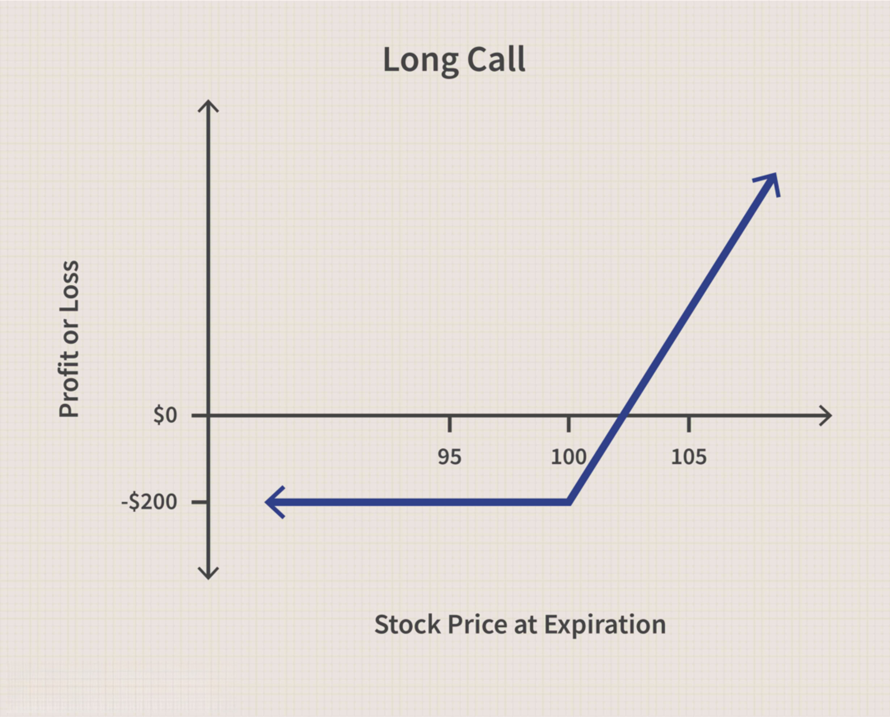

## Table of Contents

## What is a call option?

A call option is a type of financial contract that gives you the right, but not the obligation, to buy a specific stock or asset at a set price within a certain time period. Think of it like a reservation at a restaurant. You pay a small fee to reserve the right to buy a meal at a set price, but if you decide not to eat there, you only lose the reservation fee.

For example, if you buy a call option for a stock that's currently trading at $50, and the option has a strike price of $55, you can buy the stock at $55 even if its market price goes up to $60. If the stock price stays below $55, you can let the option expire and only lose the money you paid for the option. This way, call options can be a way to bet on a stock going up without having to buy the stock itself.

## How does a call option work?

A call option is like a ticket that lets you buy something at a set price before a certain date. Imagine you want to buy a toy that costs $10, but you think the price might go up. You can buy a call option for that toy with a price of $10. If the toy's price goes up to $15, you can use your call option to buy it for $10, saving you money. But if the toy's price stays the same or goes down, you don't have to buy it, and you only lose the small amount you paid for the call option.

When you buy a call option, you pay a fee called the premium. This fee gives you the right to buy the item at the strike price, which is the set price you agreed on. The call option has an expiration date, which is the last day you can use it. If the item's price is higher than the strike price before the expiration date, you can make a profit by buying the item at the lower strike price and then selling it at the higher market price. If the item's price doesn't go up, you can let the option expire without using it, and you'll only lose the premium you paid.

## What are the basic components of a call option?

A call option has three main parts: the premium, the strike price, and the expiration date. The premium is the price you pay to buy the call option. It's like a small fee that gives you the right to buy something later. The strike price is the set price at which you can buy the item if you choose to use your call option. If the item's price goes above the strike price, you can buy it at the lower strike price and save money or make a profit. The expiration date is the last day you can use your call option. If you don't use it by this date, the option becomes worthless, and you lose the premium you paid.

Using a call option is like having a special ticket. Imagine you want to buy a toy that costs $10, but you think the price might go up. You can buy a call option for that toy with a strike price of $10. If the toy's price goes up to $15 before the expiration date, you can use your call option to buy the toy for $10, saving you money. But if the toy's price stays the same or goes down, you don't have to buy it, and you only lose the small amount you paid for the call option. This way, call options can be a way to bet on something going up in price without having to buy it right away.

## What is the difference between a call option and a put option?

A call option and a put option are two types of financial contracts, but they work in opposite ways. A call option gives you the right to buy something at a set price before a certain date. It's like a ticket that lets you buy a toy for $10 even if the toy's price goes up to $15. You pay a small fee for this ticket, and if the toy's price goes up, you can use the ticket to buy the toy at the lower price and save money. If the toy's price doesn't go up, you can let the ticket expire and only lose the small fee you paid.

On the other hand, a put option gives you the right to sell something at a set price before a certain date. Imagine you own a toy that you bought for $10, and you think its price might go down. You can buy a put option that lets you sell the toy for $10 even if its price drops to $5. You pay a small fee for this option, and if the toy's price goes down, you can use the put option to sell the toy at the higher set price and save money. If the toy's price stays the same or goes up, you can let the option expire and only lose the small fee you paid. So, call options are for betting that prices will go up, while put options are for betting that prices will go down.

## Who are the parties involved in a call option contract?

In a call option contract, there are two main parties: the buyer and the seller. The buyer, also known as the holder, is the person who pays a small fee, called the premium, to get the right to buy something at a set price before a certain date. The buyer hopes that the price of the item will go up so they can buy it at the lower set price and make a profit.

The seller, also known as the writer, is the person who gets the premium from the buyer. In return, the seller has to sell the item to the buyer at the set price if the buyer decides to use the option. The seller hopes that the price of the item will stay the same or go down, so the buyer won't use the option, and the seller can keep the premium as profit.

## What are the potential benefits of buying a call option?

Buying a call option can be a smart move if you think the price of something will go up. It's like getting a special ticket that lets you buy an item at a lower price even if its market price goes higher. This can save you money or help you make a profit. For example, if you buy a call option for a toy with a set price of $10 and the toy's price goes up to $15, you can use your option to buy the toy for $10 and then sell it for $15, making a $5 profit. Plus, the most you can lose is the small fee you paid for the call option, so it's a way to bet on something going up without risking a lot of money.

Another benefit of buying a call option is that it gives you flexibility. You don't have to use the option if the price doesn't go up like you hoped. If the toy's price stays at $10 or goes down, you can just let the option expire and only lose the small fee you paid. This means you can try to make money from rising prices without having to buy the item outright and tie up a lot of money. It's like having a safety net that lets you test your predictions about future price changes without big risks.

## What are the risks associated with call options?

Buying a call option can be risky because you might lose the money you paid for it. The fee you pay for the call option is called the premium, and if the price of the item doesn't go up like you hoped, you can't use the option to make money. When the option expires, you lose the whole premium. It's like buying a ticket to a concert that gets canceled; you can't get your money back.

Another risk is that call options can be hard to understand and use correctly. If you don't know how they work or if you make a mistake, you could lose more money than you planned. It's important to learn about call options and maybe even talk to a financial advisor before you start using them. It's like trying to play a new game without reading the rules first; you might not do well and could end up losing.

## How is the price of a call option determined?

The price of a call option, called the premium, is figured out by looking at a few important things. One big thing is how much the price of the item might change, called [volatility](/wiki/volatility-trading-strategies). If the price of the item moves around a lot, the premium will be higher because there's a bigger chance the price will go up a lot. Another thing is how long the option lasts, called the time to expiration. The longer the time, the higher the premium, because there's more time for the price to go up. The difference between the current price of the item and the strike price of the option also matters. If the strike price is a lot lower than the current price, the premium will be higher.

Another thing that affects the price of a call option is the [interest rate](/wiki/interest-rate-trading-strategies). Higher interest rates can make the premium go up a bit. Also, if people think the price of the item will go up a lot, called market sentiment, the premium might be higher. All these things together help decide how much you have to pay for a call option. It's like figuring out the cost of a bet on a game; you have to think about how likely it is to win and how much you could win.

## What is the significance of the expiration date in a call option?

The expiration date of a call option is super important because it's the last day you can use the option to buy something at the set price. It's like a deadline for your special ticket. If you think the price of the item will go up before this date, you can use the option to buy it at a lower price and make money. But if the price doesn't go up like you hoped, you have to decide by the expiration date whether to use the option or let it expire.

If you don't use the call option by the expiration date, it becomes worthless, and you lose the money you paid for it. It's like a coupon that you have to use before it runs out. The expiration date adds a bit of pressure because you have to keep an eye on the price of the item and decide what to do before time runs out. This makes call options a bit tricky but also exciting because you're trying to guess what will happen in the future.

## Can you explain the concept of 'in the money', 'at the money', and 'out of the money' for call options?

When you buy a call option, you want the price of the item to go up so you can buy it at a lower set price. If the current price of the item is higher than the set price (strike price) of your call option, it's called 'in the money'. This means you can use your option to buy the item at a lower price and then sell it at the higher market price, making a profit. It's like having a coupon that lets you buy something cheaper than everyone else.

If the current price of the item is the same as the set price of your call option, it's called 'at the money'. This means you wouldn't make or lose money if you used the option right now because you'd be buying the item at the same price it's selling for. It's like having a coupon for an item that's on sale for the same price as the coupon.

If the current price of the item is lower than the set price of your call option, it's called 'out of the money'. This means you wouldn't want to use your option because you'd be buying the item at a higher price than it's selling for. You'd lose money if you used it. It's like having a coupon for an item that's cheaper without the coupon.

## How can call options be used as part of a broader investment strategy?

Call options can be a useful tool in a broader investment strategy because they let you bet on the price of something going up without having to buy it right away. Imagine you think the price of a toy will go up in the next few months. Instead of buying the toy now, you can buy a call option for it. If the toy's price does go up, you can use the option to buy the toy at the lower set price and then sell it for a profit. This way, you can make money from the price going up without spending a lot of money upfront. It's like having a small bet on the toy's price going up.

Using call options can also help you manage risk in your investment strategy. Since the most you can lose is the small fee you pay for the option, it's a way to try to make money without risking a lot. For example, if you already own some toys and you think their prices might go up, you can buy call options on more toys. This way, if the prices do go up, you can make more money from the options. But if the prices don't go up, you only lose the small fee you paid for the options. It's like having insurance that lets you try to make more money without putting all your money at risk.

## What advanced strategies involve the use of call options, such as spreads and combinations?

Call options can be used in advanced strategies like spreads and combinations to manage risk and potentially increase profits. One common strategy is the call spread, where you buy one call option and sell another call option with a higher strike price on the same item and with the same expiration date. This can help limit your risk because the money you get from selling the second option can offset the cost of the first option. It's like buying a ticket to a concert and then selling a ticket to the same concert for a higher price to someone else; if the concert gets more popular, you can still make money, but if it doesn't, you lose less.

Another strategy is the call combination, where you buy a call option and also buy a put option on the same item. This is called a straddle, and it's used when you think the price of the item will move a lot but you're not sure which way. If the price goes up a lot, you can use the call option to make money, and if it goes down a lot, you can use the put option. It's like betting on a horse race where you think one horse will either win by a lot or lose by a lot; you're covered either way. These strategies can be tricky, so it's important to understand them well before trying them out.

## What is a Deep Dive into Call Options?

A call option is a financial derivative that provides the holder the right (but not the obligation) to purchase an underlying asset at a predetermined price, known as the strike price, on or before a specific expiration date. This differs from a put option, which gives the holder the right to sell an asset at the strike price within the same timeframe. 

### Components of a Call Option

1. **Strike Price**: This is the price at which the holder of the call option can buy the underlying asset. It is a critical factor in determining the intrinsic value of the option. An in-the-money call option has a strike price below the current market price of the underlying asset, while an out-of-the-money option has a strike price above the market price.

2. **Expiration Date**: This refers to the date on which the option becomes void, and the holder can no longer exercise their right to purchase the asset. Options can have varying expiration periods, ranging from a few days to several years.

3. **Premium**: The premium is the price paid by the buyer to the seller (writer) for the call option. It is influenced by multiple factors, including the underlying asset's current price, strike price, time to expiration, volatility, and prevailing interest rates.

### Scenarios for Purchasing Call Options

Investors might purchase call options for several reasons, including:

- **Speculation**: Traders who anticipate a rise in the price of the underlying asset can purchase call options to profit from this potential increase. By paying a relatively small premium, they can control a larger value of stock, amplifying potential returns if their expectations are correct.

- **Hedging**: Investors holding a short position in an asset may buy call options as a hedge against adverse price movements. This provides a form of insurance, allowing them to lock in the current price and limit potential losses.

### Examples of Hedging and Speculation

For example, consider a trader who expects the stock of XYZ Corporation to rise from its current price of $100. By purchasing a call option with a strike price of $105 and a premium of $3 expiring in one month, they speculate on the price increase. If the stock rises to $110, the trader can exercise the option and purchase shares at $105, capturing a profit of $2 per share (excluding the premium paid). 

For hedging, suppose an investor has a significant short position in XYZ shares. They can purchase call options to protect against upward price swings, effectively capping their losses.

### Risks and Rewards of Trading Call Options

The rewards of trading call options include the potential for significant profits with limited initial investment. The buyer's loss is limited to the premium paid, while the potential gain can be substantial if the asset's price surges. However, this also presents risks. Options can expire worthless if the asset price does not move as expected, resulting in a total loss of the premium. Additionally, the time decay of options can erode their value as the expiration date approaches.

Mathematically, the payoff $P$ for a call option can be represented as:

$$
P = \max(S - K, 0) - \text{Premium}
$$

where $S$ is the stock price at expiration and $K$ is the strike price. This formula highlights how the call option's value is contingent on the stock price exceeding the strike price.

## References & Further Reading

[1]: Hull, J. C. (2018). ["Options, Futures, and Other Derivatives"](https://www.semanticscholar.org/paper/Options%2C-Futures%2C-and-Other-Derivatives-Hull/89bdee500c8623864fc9eb7a471546aa713acc44). Pearson.

[2]: Black, F., & Scholes, M. (1973). ["The Pricing of Options and Corporate Liabilities."](https://www.cs.princeton.edu/courses/archive/fall09/cos323/papers/black_scholes73.pdf) Journal of Political Economy, 81(3), 637-654.

[3]: Lopez de Prado, M. (2018). ["Advances in Financial Machine Learning"](https://www.amazon.com/Advances-Financial-Machine-Learning-Marcos/dp/1119482089). Wiley.

[4]: Chan, E. (2008). ["Quantitative Trading: How to Build Your Own Algorithmic Trading Business"](https://github.com/ftvision/quant_trading_echan_book). Wiley.

[5]: Jansen, S. (2020). ["Machine Learning for Algorithmic Trading"](https://github.com/stefan-jansen/machine-learning-for-trading). Packt Publishing.

[6]: Aronson, D. R. (2006). ["Evidence-Based Technical Analysis: Applying the Scientific Method and Statistical Inference to Trading Signals"](https://www.amazon.com/Evidence-Based-Technical-Analysis-Scientific-Statistical/dp/0470008741). Wiley.

[7]: Aitken, M. & Harris, F. H. deB. (2002). ["Algorithmic Trading and Information"](https://papers.ssrn.com/sol3/papers.cfm?abstract_id=2440671). Pacific-Basin Finance Journal.