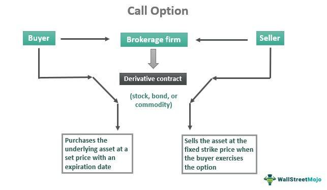

## Table of Contents

## What is a call option?

A call option is a financial contract that gives you the right, but not the obligation, to buy a specific stock or asset at a set price within a certain time period. Imagine you think a stock's price will go up. You can buy a call option to purchase that stock at today's price, even if the price goes up later. If the stock price does go up, you can buy it at the lower price you agreed on and then sell it at the higher market price, making a profit.

However, if the stock price doesn't go up or even goes down, you don't have to buy the stock. You can just let the option expire, and the most you'll lose is the money you paid for the option itself. This makes call options a way to bet on a stock going up without having to buy the stock outright, which can be less risky and require less money upfront.

## How does a call option work?

A call option is like a ticket that lets you buy a stock at a certain price, called the strike price, before a specific date, known as the expiration date. If you think a stock's price will go up, you can buy a call option. Let's say the stock is currently $50, and you buy an option to buy it at $50 anytime in the next month. If the stock price goes up to $60, you can use your option to buy the stock at $50 and then sell it at $60, making a $10 profit per share, minus the cost of the option.

However, if the stock price stays at $50 or goes down, you don't have to buy the stock. You can just let the option expire, and the most you'll lose is the money you paid for the option. This makes call options a way to bet on a stock going up without having to buy the stock outright, which can be less risky and require less money upfront. It's like a safety net that limits your losses while still giving you the chance to make a profit if the stock price rises.

## What are the key components of a call option?

A call option has several key parts that you need to know about. The first part is the strike price, which is the price you can buy the stock at if you decide to use your option. For example, if the strike price is $50, you can buy the stock at $50 no matter how high the stock price goes. The second part is the expiration date, which is the last day you can use your option. If you don't use it by this date, the option becomes worthless.

Another important part is the premium, which is the price you pay to buy the option. This is like the cost of your ticket to possibly buy the stock later. The premium depends on things like how far away the expiration date is and how likely it is that the stock price will go above the strike price. The last part is the underlying asset, which is the stock or other thing you have the option to buy. Knowing these parts helps you understand how call options work and how you can use them.

## What is the difference between a call option and a put option?

A call option and a put option are two different types of options contracts. A call option gives you the right, but not the obligation, to buy a stock or asset at a set price within a certain time. This is useful if you think the price of the stock will go up. You can buy the stock at the lower price you agreed on and then sell it at the higher market price, making a profit. If the stock price doesn't go up, you can just let the option expire and only lose the money you paid for the option.

On the other hand, a put option gives you the right, but not the obligation, to sell a stock or asset at a set price within a certain time. This is helpful if you think the price of the stock will go down. You can buy the stock at the current market price and then use your put option to sell it at the higher price you agreed on, making a profit. If the stock price doesn't go down, you can let the option expire and only lose the money you paid for the option. So, call options are for betting on a stock going up, while put options are for betting on a stock going down.

## How is the price of a call option determined?

The price of a call option, also called the premium, depends on a few key things. One big thing is how much the stock's price is above or below the strike price. If the stock's price is already higher than the strike price, the option is worth more because you can buy the stock at a lower price than it's currently worth. Another important thing is how much time is left until the option expires. The more time left, the more the option is worth because there's more time for the stock's price to go up.

There are also other things that affect the price of a call option. One is how much the stock's price tends to move around, called [volatility](/wiki/volatility-trading-strategies). If the stock's price moves a lot, the option is worth more because there's a bigger chance the stock's price will go above the strike price. Another thing is the general level of interest rates. Higher interest rates can make the option a bit more valuable. All these things together help decide how much you have to pay for a call option.

## What is the Black-Scholes model and how is it used in call option pricing?

The Black-Scholes model is a way to figure out how much a call option should cost. It was created by economists Fischer Black and Myron Scholes in the 1970s. The model uses math to predict the price of the option based on things like the current stock price, the strike price, how long until the option expires, how much the stock's price moves around (volatility), and the interest rate. It's like a recipe that takes these ingredients and mixes them to come up with the price of the option.

People use the Black-Scholes model to help them decide if a call option is a good deal. If the model says the option should cost $5, but you can buy it for $4, it might be a good buy. The model helps traders and investors make smarter choices by giving them a way to compare the price of an option to what it should be worth. But remember, the model isn't perfect because it makes some guesses about the future, like how the stock's price will move. So, it's a useful tool, but not the only thing to consider when buying options.

## What factors affect the price of a call option?

The price of a call option, which is also called the premium, depends on several things. One big [factor](/wiki/factor-investing) is how the stock's price compares to the strike price. If the stock's price is higher than the strike price, the option is worth more because you can buy the stock at a lower price than it's currently worth. Another important factor is how much time is left until the option expires. The more time left, the more valuable the option is because there's more time for the stock's price to go up.

There are also other things that affect the price of a call option. One is the stock's volatility, which means how much its price tends to move around. If the stock's price moves a lot, the option is worth more because there's a bigger chance the stock's price will go above the strike price. Another factor is the interest rate. Higher interest rates can make the option a bit more valuable. All these factors together help decide how much you have to pay for a call option.

## How does time to expiration influence call option pricing?

The time left until a call option expires is a big deal when it comes to figuring out how much the option should cost. The more time there is until the option expires, the more valuable it becomes. This is because there's more time for the stock's price to go up above the strike price. If you have a long time before the option expires, there's a bigger chance that the stock will hit a higher price, making the option worth more.

On the other hand, if the option is about to expire soon, it's usually worth less. There's less time for the stock's price to move up, so the chance of making a profit from the option goes down. This is why options that are close to expiring are cheaper than those with more time left. The time to expiration is one of the key things that traders look at when deciding how much to pay for a call option.

## What is implied volatility and how does it impact call option pricing?

Implied volatility is a guess about how much a stock's price might move around in the future. It's not something you can see directly, but it's figured out from the price of the option itself. When people buy and sell options, they're making guesses about how much the stock's price will change. Implied volatility is like a thermometer for these guesses. If everyone thinks the stock's price will move a lot, the implied volatility goes up.

When implied volatility is high, it means people think the stock's price will move a lot, and this makes call options more expensive. That's because there's a bigger chance the stock's price will go above the strike price, making the option more valuable. On the other hand, if implied volatility is low, it means people think the stock's price won't move much, so call options are cheaper. Traders look at implied volatility to help them decide if an option is a good deal or not.

## What are the Greeks in options trading and how do they relate to call options?

In options trading, the Greeks are a set of measures that help traders understand how different things can affect the price of an option, like a call option. They're called the Greeks because they use Greek letters. The main ones are Delta, Gamma, Theta, Vega, and Rho. Delta tells you how much the option's price will change if the stock's price moves up or down. Gamma shows how Delta itself changes when the stock's price moves. Theta tells you how much the option loses value as time goes by. Vega shows how the option's price changes with the stock's volatility. Rho tells you how the option's price changes with interest rates.

These Greeks are super helpful for people trading call options because they give a quick way to see how different things might affect the option's price. For example, if you know the Delta of your call option, you can guess how much the option's price will go up if the stock's price goes up. If you're worried about time running out, Theta can tell you how much the option's value might drop each day. And if you think the stock's price might start moving around a lot more, Vega can help you see how that might make your call option more valuable. By keeping an eye on these Greeks, traders can make smarter choices about when to buy or sell their call options.

## How can one use call options for hedging purposes?

People use call options for hedging to protect themselves from a stock's price going down. Imagine you own a stock and you're worried its price might drop. You can buy a call option with a strike price that's higher than where the stock is now. If the stock's price does go down, you can still sell it at the higher strike price you agreed on in the call option. This way, you limit how much money you could lose if the stock's price falls.

But if the stock's price goes up instead, you don't have to use the call option. You can just let it expire and keep your stock. The most you'll lose is the money you paid for the call option, which is usually less than losing money on the stock itself. So, call options can act like insurance for your stocks, helping you sleep better at night knowing you're protected if things go south.

## What advanced strategies involve call options and how are they implemented?

One advanced strategy using call options is called a "covered call." This is when you own a stock and you sell a call option on that stock. The idea is to make some extra money from the premium you get for selling the option. If the stock's price stays below the strike price by the time the option expires, you keep the premium and the stock. But if the stock's price goes above the strike price, the person who bought the option can make you sell them the stock at the lower strike price. You still keep the premium, but you miss out on any extra profit from the stock's price going higher.

Another strategy is called a "bull call spread." This is when you buy a call option with a lower strike price and sell another call option with a higher strike price, both on the same stock and with the same expiration date. The goal is to make money if the stock's price goes up, but not as much as it would with just buying a call option. You pay less for the spread because the premium you get from selling the higher strike option helps cover the cost of buying the lower strike option. If the stock's price goes up a lot, your profit is limited to the difference between the two strike prices, minus the net cost of the spread.

A third strategy is the "long call calendar spread." This involves buying a call option with a longer expiration date and selling a call option with a shorter expiration date, both at the same strike price. The idea is to make money from the difference in time value between the two options. If the stock's price stays around the strike price, the shorter-term option will lose value faster than the longer-term option, letting you make a profit. But if the stock's price moves a lot in either direction, you could lose money on this strategy.

## What are the fundamentals of option pricing?

Options are financial contracts that grant the buyer the right, but not the obligation, to buy or sell an underlying asset at a predetermined price within a specified timeframe. This section addresses fundamental concepts in option pricing, focusing on call and put options, key components involved in their valuation, and the leading models utilized in the options market, such as the Black-Scholes model.

# to Call and Put Options

Call options provide the holder with the right to purchase the underlying asset at a specified price, known as the strike price, before the option expires. Conversely, put options afford the holder the right to sell the underlying asset at the strike price within the option's lifetime. These options are used for hedging purposes, to speculate on future price movements, or to engage in complex trading strategies.

### Key Components in Option Pricing

1. **Strike Price:** This is the predetermined price at which the option holder can buy (call) or sell (put) the underlying asset. The strike price is central to determining the intrinsic value of an option.

2. **Expiration Date:** Options have a finite life and must be exercised within this period. The expiration date is crucial since it influences the time value of options. Longer expirations generally provide more opportunities for the underlying asset to reach favorable prices.

3. **Volatility:** This represents the price fluctuations of the underlying asset. Volatility is a vital input in option pricing models, as it affects the probability of the option finishing in-the-money (ITM). 

4. **Risk-Free Rate:** The risk-free rate, often represented by government bond yields, is used in models to discount the expected payoff of an option to present value.

5. **Dividends:** Expected dividends during the option's life can affect pricing, particularly for options on stocks. The models need to incorporate expected dividend payouts when calculating option prices.

### Overview of Popular Option Pricing Models

The **Black-Scholes model**, developed by Fischer Black, Myron Scholes, and Robert Merton, stands as the cornerstone of modern option pricing. It provides a mathematical formula for estimating the price of European-style options, which can only be exercised at expiration. The model assumes a constant volatility and no [arbitrage](/wiki/arbitrage) opportunities, and it simplifies complex market phenomena using the following formula:

$$
C = S_0 \cdot N(d_1) - X \cdot e^{-rT} \cdot N(d_2)
$$

Where:
- $C$ is the call option price.
- $S_0$ is the current price of the underlying asset.
- $X$ is the strike price.
- $r$ is the risk-free interest rate.
- $T$ is the time to expiration.
- $N$ is the cumulative distribution function of the standard normal distribution.
- $d_1 = \frac{\ln(\frac{S_0}{X}) + (r + \frac{\sigma^2}{2})T}{\sigma \sqrt{T}}$
- $d_2 = d_1 - \sigma \sqrt{T}$

The Black-Scholes model revolutionized financial markets by providing a systematic way to estimate option prices, leading to more efficient market operations.

### The Concept of Implied Volatility and Its Importance

Implied volatility (IV) indicates the market's forecast of a likely movement in an asset's price and is derived from the market price of an option, using model-based computations such as the Black-Scholes formula. Unlike historical volatility, which looks backward, implied volatility is forward-looking and adjusts as market expectations change. It is a critical input for traders and investors, signaling market sentiment and potential future volatility in asset prices.

Implied volatility significantly influences option premiums—higher IV results in higher option prices due to increased uncertainty regarding the underlying asset's future price.

In conclusion, option pricing fundamentals encapsulate essential elements such as strike prices, expiration dates, and volatility, integrated through models exemplified by Black-Scholes. This foundational understanding of option valuation significantly contributes to effective strategic decision-making in the financial markets.

## What are the financial models used for call option pricing?

Financial models for call option pricing play a vital role in understanding and implementing strategies in the options market. These models provide the framework to assess the fair value of call options, allowing traders and investors to make informed decisions. 

One of the most renowned models in this context is the Black-Scholes model, developed by Fischer Black, Myron Scholes, and Robert Merton in the early 1970s. This model lays the foundation for modern financial theory on options pricing. The Black-Scholes formula calculates the theoretical price of European call options, assuming that the market follows a geometric Brownian motion with constant volatility and [interest rate](/wiki/interest-rate-trading-strategies). The formula is:

$$
C = S_0 N(d_1) - X e^{-rT} N(d_2)
$$

where:
- $C$ is the call option price.
- $S_0$ is the current price of the underlying asset.
- $X$ is the strike price of the option.
- $r$ is the risk-free interest rate.
- $T$ is the time to maturity (in years).
- $N(\cdot)$ is the cumulative distribution function of the standard normal distribution.
- $d_1 = \frac{\ln(S_0/X) + (r + \sigma^2/2)T}{\sigma \sqrt{T}}$
- $d_2 = d_1 - \sigma \sqrt{T}$
- $\sigma$ is the volatility of the returns of the underlying asset.

Despite its widespread use, the Black-Scholes model has limitations such as assuming constant volatility and interest rates, which often do not hold in real markets. To overcome these limitations, advanced models have been developed. These include the Heston model, which incorporates stochastic volatility, and the Cox-Ross-Rubinstein binomial options pricing model, which provides a more flexible framework by allowing for the adjustment of volatility and interest rates over time.

Application of these models within [algorithmic trading](/wiki/algorithmic-trading) systems enhances the efficiency of pricing options. Algorithms can quickly compute theoretical prices for a wide range of options using these models, enabling traders to exploit arbitrage opportunities or adjust portfolios in real-time to shift market conditions. For instance, many algorithmic strategies utilize the Greeks (derived from the Black-Scholes model) to assess and manage the sensitivities of an option's price to various market factors.

Case studies highlight the practical applications of these pricing models. For example, financial institutions often use the Black-Scholes and Heston models within their trading algorithms to manage large portfolios of options. These models help institutions in monitoring risk and in making trade decisions based on the theoretical value versus market value discrepancies. In practice, firms integrate these models with other data-driven insights and market trend analyses to optimize their trading strategies.

Python libraries such as NumPy and SciPy facilitate the implementation of these pricing models. Here's a basic Python snippet to calculate European call option prices using the Black-Scholes formula:

```python
import numpy as np
from scipy.stats import norm

def black_scholes_call(S0, X, T, r, sigma):
    d1 = (np.log(S0 / X) + (r + 0.5 * sigma**2) * T) / (sigma * np.sqrt(T))
    d2 = d1 - sigma * np.sqrt(T)
    call_price = (S0 * norm.cdf(d1)) - (X * np.exp(-r * T) * norm.cdf(d2))
    return call_price

# Example usage:
S0 = 100  # Current stock price
X = 100   # Strike price
T = 1     # Time to expiration in years
r = 0.05  # Risk-free interest rate
sigma = 0.2  # Volatility

call_price = black_scholes_call(S0, X, T, r, sigma)
print(f"The call option price is: {call_price:.2f}")
```

This example demonstrates the ease with which sophisticated models can be integrated and used within algorithmic trading systems, underscoring the importance of these financial models for both individual traders and large institutions.

## What are some real-world applications and case studies?

Financial institutions have been leveraging the intersection of financial derivatives, option pricing, and algorithmic trading to enhance their trading strategies and risk management frameworks. The integration of these components is pivotal for optimizing financial operations and improving profit margins. This section explores real-world applications and case studies, illustrating these integrations along with extracted lessons and best practices.

One notable example is investment banks such as Goldman Sachs and Morgan Stanley, which extensively utilize algorithmic trading to automate the execution of complex trading strategies. These firms apply sophisticated models for pricing derivatives, including options, and integrate them into algorithmic systems to execute trades at optimal prices. In these systems, real-time data feeds inform algorithms that assess market conditions, allowing for dynamic pricing strategies that are quicker and more efficient than manual trading.

Consider a case study involving the application of the Black-Scholes model, a fundamental model for option pricing, within an algorithmic framework. A [hedge fund](/wiki/hedge-fund-trading-strategies) may use the Black-Scholes equation:

$$
C = S_0N(d_1) - Xe^{-rT}N(d_2)
$$

$$
d_1 = \frac{\ln(S_0/X) + (r + \sigma^2/2)T}{\sigma \sqrt{T}}
$$

$$
d_2 = d_1 - \sigma \sqrt{T}
$$

where $C$ is the call option price, $S_0$ is the current stock price, $X$ is the strike price, $r$ is the risk-free interest rate, $T$ is the time to maturity, $\sigma$ is the volatility of the stock, and $N$ is the cumulative distribution function of the standard normal distribution. By embedding this model into an algorithm, the hedge fund can dynamically price options based on real-time inputs of market variables, thereby optimizing their trading decisions.

Beyond optimizing pricing strategies, algorithms also play a crucial role in risk management. For instance, [quantitative trading](/wiki/quantitative-trading) firms like Renaissance Technologies use [machine learning](/wiki/machine-learning) models that continuously assess the risk exposure of their derivative portfolios. These firms have developed high-frequency trading algorithms that execute trades in milliseconds to capitalize on microscopic market inefficiencies, demonstrating the robustness of the integration of option pricing models in real-time trading systems.

Through these applications, several lessons and best practices have emerged:

1. **Data Integration**: Real-time data accuracy and speed are vital. Institutions leveraging high-frequency trading must ensure seamless integration of market data to maintain the efficacy of their algorithmic trading models.

2. **Model Validation**: Continuous validation and back-testing of pricing models against historical market data are essential to ensure their predictive sufficiency and alignment with market behavior.

3. **Risk Management**: Developing robust frameworks for assessing and mitigating risk in automated trading activities is critical. Efficiently managing computational risks and potential system failures is crucial for minimizing loss.

4. **Regulatory Compliance**: Adhering to financial regulations is non-negotiable. The implementation of rigorous compliance checks within the trading algorithms facilitates transparency and ensures adherence to legal standards.

In summary, the integration of financial derivatives, option pricing, and algorithmic trading leads to significant advancements in trading efficiency and strategy optimization. The experiences of leading financial institutions underline the importance of data integrity, model accuracy, risk management, and regulatory compliance in successfully implementing these systems. As technology and models continue to evolve, ongoing adaptation and refinement of these elements will be crucial for maintaining competitive advantages in the financial markets.

## References & Further Reading

[1]: Black, F., & Scholes, M. (1973). ["The Pricing of Options and Corporate Liabilities."](https://www.cs.princeton.edu/courses/archive/fall09/cos323/papers/black_scholes73.pdf) Journal of Political Economy, 81(3), 637-654.

[2]: Hull, J. C. (2018). ["Options, Futures, and Other Derivatives"](https://www.semanticscholar.org/paper/Options%2C-Futures%2C-and-Other-Derivatives-Hull/89bdee500c8623864fc9eb7a471546aa713acc44) (10th ed.). Pearson.

[3]: Merton, R. C. (1973). ["Theory of Rational Option Pricing."](https://www.jstor.org/stable/3003143) The Bell Journal of Economics and Management Science, 4(1), 141-183.

[4]: Wilmott, P. (2006). ["Paul Wilmott Introduces Quantitative Finance"](https://www.amazon.com/Paul-Wilmott-Quantitative-Finance-Set/dp/0470018704) (2nd ed.). Wiley.

[5]: Narang, R. K. (2013). ["Inside the Black Box: A Simple Guide to Quantitative and High-Frequency Trading"](https://onlinelibrary.wiley.com/doi/book/10.1002/9781118662717) (2nd ed.). Wiley.