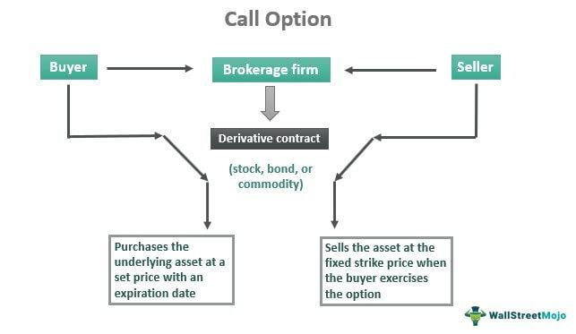

Financial derivatives are complex financial instruments that derive their value from underlying assets such as stocks, bonds, commodities, or indices. These contracts play a pivotal role in financial markets by offering mechanisms for risk management, speculation, and arbitrage. Derivatives enable market participants to hedge against potential losses due to price fluctuations, thus promoting market stability and efficiency. Among the most common types of derivatives are options, specifically put contracts and call options, which provide versatile tools for traders to formulate strategies that align with their investment goals and risk appetite.

Put contracts and call options are foundational components in options trading. A put option gives the holder the right, but not the obligation, to sell an underlying asset at a predetermined price before a specified expiration date. This makes them vital instruments for hedging against declines in asset prices. Conversely, a call option grants the right to purchase an underlying asset at a set price within a certain timeframe, allowing traders to capitalize on potential price increases. By employing these options, traders can construct diverse strategies, from conservative hedges to aggressive position leveraging, to navigate different market conditions.



Algorithmic trading has emerged as a transformative approach to modern trading, offering heightened levels of efficiency and precision. Through the use of complex algorithms and computer programs, this method automates the trading process, analyzing vast amounts of market data to identify opportunities and execute trades with minimal human intervention. The speed and accuracy afforded by algorithmic trading significantly enhance the effectiveness of trading strategies, allowing for real-time market responsiveness and reduced error margins.

This article aims to explore the integration of financial derivatives, particularly put contracts and call options, with algorithmic trading. It will elucidate how combining these instruments with algorithmic strategies can maximize trading efficiency and optimize risk management. Through an in-depth examination, the article will provide insights into the benefits and challenges of this integration, emphasizing the potential for improving market strategies by merging human insight with technological precision.

## Table of Contents

## Understanding Financial Derivatives

Financial derivatives are financial instruments whose value is derived from underlying assets, indices, or rates. These instruments are crucial in the financial markets as they facilitate risk management, price discovery, and arbitrage opportunities. The primary types of financial derivatives include futures, options, swaps, and forwards.

**Types of Financial Derivatives:**

1. **Futures Contracts**: A futures contract is a legally binding agreement to buy or sell a specific quantity of a commodity or financial instrument at a predetermined price at a future date. These contracts are standardized and traded on exchanges, which mitigates counterparty risk and enhances liquidity.

2. **Options Contracts**: Options provide the holder the right, but not the obligation, to buy (call option) or sell (put option) an asset at a predetermined price before a specific expiration date. Options strategies can be crafted to profit from movements in underlying asset prices without the obligation of execution.

3. **Swaps**: Swaps are agreements between two parties to exchange cash flows or other financial instruments over a defined period. The most common type is an interest rate swap, where fixed and floating rate interest payments are exchanged, aiding in managing interest rate exposure.

4. **Forward Contracts**: These are customized contracts between two parties to buy or sell an asset at a specified future date for a price agreed upon today. Unlike futures, forwards are not traded on exchanges and thus bear higher counterparty risk.

**Role in Risk Management and Speculation:**

Financial derivatives play a dual role in financial markets by aiding in risk management and enabling speculation. Businesses use derivatives for hedging to protect against adverse price movements in commodities, currencies, interest rates, and other financial variables. For example, an airline might use futures contracts to lock in fuel prices, thus shielding itself from price [volatility](/wiki/volatility-trading-strategies). Conversely, derivatives allow speculators to bet on price movements, aiming to profit from their predictions about future market conditions.

**Examples of Use in Risk Hedging and Market Exposure:**

Derivatives are powerful tools for hedging. For instance, a farmer can enter a futures contract to sell wheat at a fixed price, thus securing a predictable revenue despite future market fluctuations. Similarly, multinational companies might use currency swaps to manage exposure to foreign exchange risk, ensuring that exchange rate changes do not adversely affect their cash flows.

Beyond hedging, derivatives are used to gain exposure to various markets efficiently. Investors might use options to obtain leveraged exposure to stocks without the necessity of owning the underlying asset or employ swaps to gain access to divergent [interest rate](/wiki/interest-rate-trading-strategies) environments in different countries.

**Opportunities Presented by Financial Derivatives:**

The use of derivatives opens multiple opportunities for market participants. Through [arbitrage](/wiki/arbitrage), traders can exploit price discrepancies between markets, thereby maintaining market efficiency. By leveraging derivatives, investors can design sophisticated trading strategies that align with specific risk and return profiles.

Derivatives also facilitate price discovery, as the information derived from trading volumes and price movements in derivatives markets can offer insights into the expectations of market participants regarding future movements of underlying assets. This predictive capability is invaluable for making informed trading and investment decisions.

In essence, financial derivatives constitute a pivotal component of modern financial markets, providing comprehensive tools for risk management and a gateway to strategic market opportunities.

## Put Contracts and Call Options Explained

Put contracts and call options are fundamental instruments in options trading, serving as the backbone of various trading strategies. A put option gives the holder the right, but not the obligation, to sell a specified amount of an underlying asset at a predetermined price, known as the strike price, before the option's expiration date. Conversely, a call option grants the holder the right to buy the underlying asset at the strike price within the specified time frame.

The primary distinction between put and call options lies in their respective purposes. Put options are generally used by traders to hedge against price declines in the underlying asset. For instance, an investor who holds a portfolio of stocks might purchase put options as a form of insurance against a potential market downturn. If the stock prices fall, the value of the put options increases, offsetting some or all of the losses on the stock portfolio.

Call options, on the other hand, are typically employed to speculate on potential price increases in the underlying asset. For example, if a trader anticipates that a particular stock will rise in value, they might buy call options to gain leverage on this potential increase. If the stock price exceeds the strike price before the expiration date, the call option can be exercised for a profit, or it can be sold at a premium above its purchase price.

To illustrate, consider a trader who purchases a call option for a stock with a strike price of $100. If the stock's market price rises to $120, the trader can exercise the option to buy the stock at $100 and sell it at the market price, securing a profit.

The pricing and risk management of options heavily rely on the Greeks, which are critical tools for traders. The Greeks are quantitative measures that describe how the price of an option changes in response to various factors:

- Delta ($\Delta$): Measures the sensitivity of an option's price to a $1 change in the price of the underlying asset.
- Gamma ($\Gamma$): Represents the rate of change of delta with respect to changes in the underlying price.
- Theta ($\Theta$): Quantifies the sensitivity of the option's price to the passage of time, often referred to as time decay.
- Vega ($\nu$): Indicates the sensitivity of the option's price to changes in the volatility of the underlying asset.
- Rho ($\rho$): Measures the sensitivity of an option's price to changes in interest rates.

These Greeks allow traders to strategize around the pricing dynamics of options, managing potential risks and optimizing their investment outcomes. In summary, put contracts and call options are invaluable tools in financial markets, providing mechanisms for both hedging and speculative ventures, with the Greeks offering a robust framework for pricing and risk management.

 to Algorithmic Trading

Algorithmic trading, often referred to as algo trading, is the use of computer algorithms to automate trading strategies, encompassing tasks such as the analysis of market data, identification of trading opportunities, and execution of trades. It has emerged as a pivotal component of modern financial markets due to its ability to process vast amounts of data swiftly and make investment decisions at speeds unmatched by human traders.

At its core, [algorithmic trading](/wiki/algorithmic-trading) relies on predefined criteria and mathematical models to make decisions. These algorithms can incorporate complex strategies, including [statistical arbitrage](/wiki/statistical-arbitrage), [market making](/wiki/market-making), and [trend following](/wiki/trend-following), among others. The key advantage of this approach is the elimination of human emotions and errors, which can lead to improved trading accuracy and efficiency.

The process of algorithmic trading is typically divided into three main stages: data analysis, opportunity identification, and trade execution. In the data analysis phase, algorithms utilize historical and real-time data to discern patterns and trends. This often involves techniques such as time-series analysis, [machine learning](/wiki/machine-learning), and technical analysis. Python, a popular programming language in finance, offers powerful libraries like NumPy and Pandas for data manipulation and analysis, enabling traders to build sophisticated models. 

Once opportunities are identified, algorithms can swiftly execute trades, benefiting from their ability to make rapid calculations and decisions. For instance, a basic algorithm for identifying moving average crossovers in stock prices can be coded as follows in Python:

```python
import pandas as pd

# Sample Data: Loading stock price data
data = pd.read_csv('stock_prices.csv')
data['Short_MA'] = data['Close'].rolling(window=40).mean()
data['Long_MA'] = data['Close'].rolling(window=100).mean()

# Generate signals
data['Signal'] = 0
data['Signal'][40:] = np.where(data['Short_MA'][40:] > data['Long_MA'][40:], 1, 0)

# Execute trades
buy_signals = data[data['Signal'] == 1]
sell_signals = data[data['Signal'] == 0]
```

In this snippet, the algorithm identifies when a shorter moving average crosses above a longer moving average, signalling a potential buy opportunity.

The benefits of algorithmic trading are primarily rooted in its speed, precision, and scalability. High-frequency trading, a subset of algorithmic trading, exemplifies speed by conducting thousands of trades per second. This allows traders to capitalize on fleeting price inefficiencies across markets. Additionally, the precision of algorithms ensures adherence to strategy specifications without deviation, effectively managing risk and improving consistency in results.

Moreover, algorithmic trading enables scalability, allowing traders to monitor and manage thousands of securities simultaneously, which would be implausible manually. This aspect is vital for firms managing large portfolios and seeking to optimize returns across diverse asset classes. Notably, the increase in trading efficiency reduces transaction costs and improves [liquidity](/wiki/liquidity-risk-premium), contributing to more stable market environments.

Despite its numerous advantages, algorithmic trading also requires robust technological infrastructure and a thorough understanding of both quantitative methods and market mechanics. The complexity involved in developing and maintaining reliable algorithms necessitates expertise in areas such as computer science, [statistics](/wiki/bayesian-statistics), and financial engineering.

In summary, algorithmic trading represents a transformative force in financial markets, driving advancements in speed, accuracy, and efficiency. As technology continues to evolve, its role in enhancing trading strategies and processes is poised to expand, further embedding it as a cornerstone of modern trading operations.

## Integrating Financial Derivatives and Algorithmic Trading

Algorithmic trading significantly enhances the use of financial derivatives, such as options, by automating complex strategies and executing trades with speed and precision. The integration of algorithms in derivatives trading allows traders to leverage sophisticated mathematical models and real-time data analysis to identify market opportunities and manage risks efficiently.

One prominent example of algorithmic strategy in derivatives trading is delta hedging. This strategy involves maintaining a portfolio of options and their underlying assets such that the portfolio's overall delta — the rate of change of the portfolio's value with respect to changes in the price of the underlying asset — is neutral. By constantly adjusting the portfolio's composition, traders can mitigate risk from price movements in the underlying asset. Algorithmic trading systems allow for real-time monitoring and adjusting of delta positions by automatically buying or selling derivatives and underlying assets based on their computed delta values, using mathematical models like the Black-Scholes equation, which estimates options pricing:

$$
C(S, t) = N(d_1)S - N(d_2)Ke^{-rt}
$$

where:
- $C$ is the call option price,
- $S$ is the current stock price,
- $K$ is the strike price,
- $r$ is the risk-free interest rate,
- $t$ is the time to maturity,
- and $N(d_1)$ and $N(d_2)$ are the values of the cumulative distribution function of the standard normal distribution.

Volatility arbitrage is another algorithmic strategy often used in derivatives trading. This strategy exploits variations between the implied volatility of options and the forecasted future volatility of the underlying asset. By using historical data and predictive models, algorithmic systems identify discrepancies to execute trades to profit from this spread. For instance, when implied volatility is higher than expected future volatility, traders might sell option contracts and hedge their positions with corresponding underlying assets.

Case studies have demonstrated the efficacy of algorithmic trading in enhancing derivatives markets. For example, a [hedge fund](/wiki/hedge-fund-trading-strategies) utilizing algorithmic strategies increased its annual return by effectively employing delta hedging to minimize risk exposure. Similarly, a trading firm specializing in volatility arbitrage leveraged algorithms to forecast volatility trends accurately, yielding profitable trades even in uncertain market conditions.

The success of algorithmic trading in financial derivatives can be attributed to its ability to process large datasets, execute strategies without the delay associated with human decision-making, and adapt quickly to market conditions. The convergence of financial derivatives and algorithmic trading continues to offer traders innovative ways to optimize their investments and manage risks efficiently.

## Benefits and Challenges of Algo Trading in Derivatives

Algorithmic trading has revolutionized how financial markets operate, particularly in the trading of derivatives. This integration offers several benefits, alongside certain challenges that participants must navigate. 

### Benefits of Algo Trading in Derivatives

**Increased Efficiency:** Algorithmic trading automates the execution of trading strategies with minimal human intervention. This significantly reduces the time required to execute trades, allowing traders to capitalize on fleeting market opportunities. Algorithms can process vast amounts of market data almost instantaneously, identifying trends and trading signals that would be arduous and time-consuming for humans.

**Risk Management:** One of the primary advantages of algorithmic trading in derivatives is its contribution to superior risk management practices. Algorithms can be programmed to monitor positions continuously and execute pre-defined risk management strategies. For example, algorithms can implement dynamic hedging strategies that adjust positions instantaneously in response to market movements, thereby mitigating risks more effectively than manual trading strategies.

**Trading Precision:** Algorithms can execute trades with precision and accuracy, ensuring adherence to predetermined trading parameters. This precision minimizes human errors that can occur in manual trading, such as incorrect order sizes or delayed execution. Algorithms can also optimize order execution by slicing large orders into smaller ones to minimize market impact, commonly referred to as "order execution algos."

### Challenges Faced in Algo Trading

**Technological Demands:** Successful implementation of algorithmic trading systems necessitates sophisticated technology infrastructure, including powerful computing capabilities and high-speed internet connections. The development, testing, and deployment of algorithms require significant technical expertise and ongoing maintenance to ensure they function correctly in varying market conditions.

**Regulatory Compliance:** The use of algorithms in trading is subject to stringent regulatory requirements aimed at ensuring market integrity and protecting investors. Traders must ensure their algorithms comply with all relevant regulations, including those pertaining to market manipulation and information security. Regulatory bodies, such as the Securities and Exchange Commission (SEC) in the United States, provide guidelines that must be adhered to, posing a challenge for firms to remain compliant.

**Market Volatility:** While algo trading offers the advantage of quickly adapting to market changes, high-frequency trading initiatives can also exacerbate market volatility. Algorithms that react to similar signals can lead to rapid, significant market movements, potentially resulting in loss scenarios, exemplified by flash crashes. Therefore, ensuring adequate safeguards, such as volatility controls and circuit breakers, is crucial.

### Risks and Mitigation Strategies

- **Risk of Overfitting:** Algorithms might be fine-tuned to past market data but fail to perform well in new scenarios. To mitigate this risk, traders should employ robust backtesting and seek to incorporate machine learning techniques that improve generalization.

- **System Failures:** Technical glitches or system outages can disrupt trading activities. Establishing redundant systems and comprehensive disaster recovery protocols can alleviate the risk of system failures.

- **Cybersecurity Threats:** The digital nature of algorithmic trading exposes systems to potential cyber threats. Implementing stringent cybersecurity measures, including encryption and regular security audits, is essential to safeguard trading systems.

In conclusion, while algorithmic trading in derivatives presents remarkable advantages in terms of efficiency, precision, and risk management, it also necessitates addressing significant technological, regulatory, and volatility challenges. Effective mitigation strategies are key to leveraging these benefits while minimizing associated risks.

## Conclusion

The exploration of financial derivatives, including put and call options, highlights their essential role in managing risk and facilitating speculative strategies in financial markets. These instruments provide traders with the ability to hedge against market downturns and pursue gains, thus adding layers of strategy to trading portfolios. The introduction of algorithmic trading significantly augments these capabilities, offering unparalleled speed, precision, and efficiency in trade execution. By automatically analyzing vast amounts of market data and executing trades at optimal instances, algorithms mitigate the latency associated with human decision-making, thus maximizing the potential advantages derivable from derivative trading.

Integrating algorithmic trading with financial derivatives presents several pronounced benefits. It enhances risk management by allowing complex, real-time analyses of market conditions and adaptive strategies like delta hedging and volatility arbitrage. Algorithm-driven trading reduces the chances of human error and subjectivity, enabling the automation of rigorous strategic trading systems that can operate continuously and efficiently across global markets.

Looking forward, the convergence of human strategy with machine precision offers promising prospects for trading. The synergy between sophisticated derivative instruments and the capabilities of advanced algorithmic systems will likely redefine trading paradigms. As computational power and machine learning methodologies evolve, the depth and accuracy of market predictions will improve, leading to even more refined trading strategies. However, traders must remain vigilant of the challenges, such as technological demands and regulatory compliance, to harness these advancements effectively. The future of trading, therefore, lies in a balanced integration of human intelligence and algorithmic prowess, paving the way for an era of more dynamic and strategically robust financial markets.

## References & Further Reading

1. Hull, J. C. (2018). *Options, Futures, and Other Derivatives*. Pearson. This book provides a comprehensive overview of derivatives markets, including detailed explanations of options, futures, swaps, and risk management techniques.

2. Black, F., & Scholes, M. (1973). "The Pricing of Options and Corporate Liabilities." *Journal of Political Economy*, 81(3), 637–654. This seminal paper introduces the Black-Scholes model, a cornerstone in options pricing.

3. Hull, J. C. (2016). *Risk Management and Financial Institutions*. Wiley. This text covers the application of derivatives in risk management and discusses financial institution-specific risk management techniques.

4. Aldridge, I. (2013). *High-Frequency Trading: A Practical Guide to Algorithmic Strategies and Trading Systems*. Wiley. This book provides insights into the implementation and functioning of algorithmic and high-frequency trading systems.

5. Narang, R. K. (2009). *Inside the Black Box: A Simple Guide to Quantitative and High-Frequency Trading*. Wiley. This resource explains quantitative trading strategies using algorithms and offers guidance on implementing these strategies.

6. Hull, J. C., & White, A. (2017). “Optimal Delta-hedging for Options.” *Journal of Banking & Finance*, 82, 180–190. An academic paper discussing strategies like delta hedging in options trading.

7. Kissell, R. (2013). *The Science of Algorithmic Trading and Portfolio Management*. Academic Press. This book investigates the principles and strategies involved in algorithmic trading and portfolio management.

8. Chincarini, L., & Kim, D. (2006). *Quantitative Equity Portfolio Management: An Active Approach to Portfolio Construction and Management*. McGraw-Hill. This text focuses on applying quantitative techniques for portfolio management, including derivatives trading.

9. Gomber, P., Arndt, B., Lutat, M., & Uhle, T. (2011). “High-Frequency Trading.” *SSRN Electronic Journal*. This paper examines the impact and implications of high-frequency trading in financial markets.

10. Wilmott, P. (2006). *Paul Wilmott on Quantitative Finance*. Wiley. Wilmott’s work provides a deep dive into the mathematics and theory behind derivatives, risk management, and quantitative finance.

11. CFTC (Commodity Futures Trading Commission). (2020). *Derivatives Market Overview*. Available at [cftc.gov](https://www.cftc.gov/). The CFTC’s website offers a wealth of information and educational resources on derivatives and regulatory oversight.

12. SEC (Securities and Exchange Commission). (2020). *Fast Answers: Options*. Available at [sec.gov](https://www.sec.gov/). The SEC provides guidance and regulations pertaining to options trading in U.S. markets.

13. Brogaard, J., Hendershott, T., & Riordan, R. (2014). "High-Frequency Trading and Price Discovery." *Review of Financial Studies*, 27(8): 2267–2306. This academic article explores how high-frequency trading contributes to price discovery and market efficiency. 

These resources provide a robust foundation for understanding the intricate dynamics of financial derivatives, options trading, and algorithmic trading.