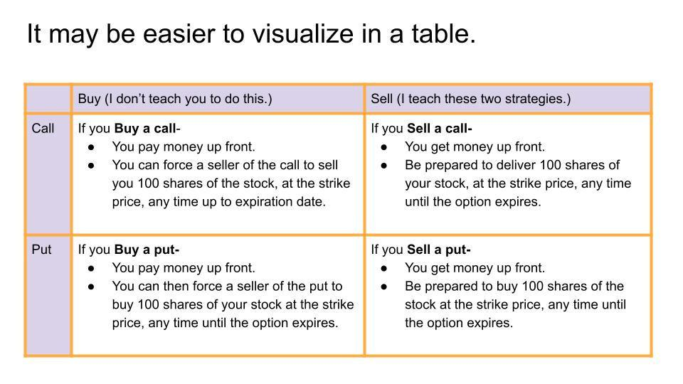

## Table of Contents

## What is a call option?

A call option is a financial contract that gives you the right, but not the obligation, to buy a specific asset, like a stock, at a set price within a certain time period. Think of it like a coupon that lets you buy something at a discount if you choose to use it. The set price is called the strike price, and the time period can range from a few days to several months or even years.

When you buy a call option, you're betting that the price of the asset will go up. If it does, you can buy the asset at the lower strike price and then sell it at the higher market price, making a profit. But if the price doesn't go up, you don't have to buy the asset, and you only lose the money you paid for the option itself, which is called the premium. This makes call options a way to potentially make money with a limited risk, but it also means you need to be right about the direction and timing of the price movement.

## How does a call option work?

A call option is like a special ticket that lets you buy something at a fixed price, even if the price goes up later. Imagine you want to buy a toy that costs $10 now, but you think it might cost $15 soon. You can buy a call option for that toy at $10. If the toy's price goes up to $15, you can use your option to buy it for $10 and then sell it for $15, making a $5 profit. But if the toy's price stays at $10 or goes down, you don't have to buy it. You only lose the small amount you paid for the option.

When you buy a call option, you pay a fee called the premium. This is the cost of having the right to buy the toy at the set price, called the strike price, before the option expires. If the toy's price goes above the strike price before the expiration date, your option becomes valuable because you can buy the toy cheaper than the market price. If the toy's price never goes above the strike price, your option will expire worthless, and you'll lose the premium you paid. So, call options can be a way to make money if you guess right about the price going up, but they also come with the risk of losing the premium if you're wrong.

## What are the basic rights of a call option buyer?

When you buy a call option, you get the right to buy a specific thing, like a stock, at a certain price. This price is called the strike price. You can choose to use this right anytime before the option runs out, which is called the expiration date. You don't have to buy the thing if you don't want to. This means you can wait and see if the price goes up before deciding.

The only thing you have to pay right away is the premium, which is the cost of the option. If the price of the thing goes above the strike price, you can buy it at the lower strike price and then sell it at the higher market price to make a profit. But if the price doesn't go up, you can let the option expire and you won't lose more than the premium you paid. So, buying a call option gives you a chance to make money without having to buy the thing right away.

## What are the obligations of a call option seller?

When you sell a call option, you have to follow some rules. If the person who bought the option decides to use it, you must sell them the thing they want, like a stock, at the price you agreed on, which is called the strike price. This can happen anytime before the option runs out, which is the expiration date. You can't change your mind once you've sold the option.

Selling a call option can be risky because if the price of the thing goes up a lot, you might lose money. You'll have to sell it at the lower strike price even though it's worth more now. But if the price stays the same or goes down, you get to keep the money the buyer paid for the option, which is called the premium. This is the good part for you, but you need to be ready to sell the thing if the buyer wants it.

## How is the price of a call option determined?

The price of a call option, which is called the premium, is figured out by looking at a few main things. One big thing is how much the price of the thing you can buy with the option, like a stock, might move around. If the stock price can change a lot, the option will cost more because it's riskier. Another thing is how long the option lasts. If you have more time to use the option, it will cost more because you have more chances for the price to go up. The difference between the stock's current price and the price you can buy it at with the option, called the strike price, also matters. If the stock price is already close to or above the strike price, the option will be more expensive.

Another important thing that affects the price of a call option is how much people want to buy or sell it, which is called the demand and supply. If a lot of people want to buy the option, its price will go up. Interest rates can also play a part because they affect the cost of holding onto the option. Lastly, if the stock or the whole market is expected to be more risky, the option's price might go up to cover that extra risk. All these things together help decide how much you have to pay for a call option.

## What factors influence the value of a call option?

The value of a call option depends on several things. One important thing is how much the price of the thing you can buy with the option, like a stock, might change. If the stock's price could go up or down a lot, the option will be worth more because it's riskier. Another thing is how long you have to use the option. If you have more time, the option is worth more because you have more chances for the price to go up. The difference between the stock's current price and the price you can buy it at with the option, called the strike price, also matters. If the stock price is already close to or above the strike price, the option will be worth more.

Other things that affect the value of a call option include how much people want to buy or sell it, which is called demand and supply. If lots of people want to buy the option, its value will go up. Interest rates can also play a part because they affect the cost of holding onto the option. Lastly, if the stock or the whole market is seen as more risky, the option's value might go up to cover that extra risk. All these factors together help decide how much a call option is worth.

## Can you explain the concept of 'in the money', 'at the money', and 'out of the money' in relation to call options?

When talking about call options, we use terms like 'in the money', 'at the money', and 'out of the money' to describe how valuable the option is right now. A call option is 'in the money' when the price of the thing you can buy with it, like a stock, is higher than the price you agreed to buy it at, which is called the strike price. If you have a call option to buy a stock at $50 and the stock is now worth $60, your option is in the money because you can buy the stock for less than it's worth and then sell it for a profit.

An option is 'at the money' when the price of the stock is the same as the strike price. If the stock is at $50 and your call option lets you buy it at $50, it's at the money. This means your option isn't worth anything right now, but it could become valuable if the stock price goes up. Lastly, a call option is 'out of the money' when the stock price is lower than the strike price. If the stock is at $40 and your option lets you buy it at $50, it's out of the money because it wouldn't make sense to buy the stock at $50 when you can get it for $40 on the market. In this case, your option has no value right now, but it could still become valuable if the stock price goes up before the option expires.

## What are the risks associated with buying call options?

When you buy a call option, you are betting that the price of the thing you can buy, like a stock, will go up before the option runs out. If it does, you can make money by buying the stock at a lower price and selling it at a higher price. But if the stock price doesn't go up, you lose the money you paid for the option, which is called the premium. This means you can lose all the money you spent on the option if the stock price doesn't move the way you hoped.

Another risk is that options can be hard to understand and can change value a lot in a short time. If the stock price moves around a lot, the value of your option can go up and down quickly. This can be exciting but also stressful because you might not know what to do. Also, if you use borrowed money to buy options, you can lose more than you put in, making the risk even bigger. So, while call options can be a way to make money, they come with risks that you need to think about carefully.

## What are the risks associated with selling call options?

When you sell a call option, you agree to sell a stock at a certain price if the person who bought the option decides to use it. This can be risky because if the stock price goes up a lot, you have to sell it at the lower price you agreed on, which means you could lose money. For example, if you sell a call option with a strike price of $50 and the stock goes up to $70, you have to sell the stock for $50 even though it's worth $70. This means you lose out on the extra $20 per share.

Another risk is that the stock price could move around a lot, making it hard to predict what will happen. If the stock price goes up quickly, you might have to buy the stock at a higher price to sell it at the lower strike price, which could cost you a lot. Also, if you don't own the stock when you sell the option, you might have to buy it at a high price to meet your obligation, adding to your potential losses. So, selling call options can be risky because you could lose more than the money you made from selling the option if things don't go as planned.

## How do call options fit into different investment strategies?

Call options can be a part of different investment plans depending on what you want to do. If you think a stock's price will go up, you can buy a call option to make money without spending a lot upfront. This is called speculation. You only pay a small fee, called the premium, and if the stock price goes up, you can buy it at a lower price and sell it for more, making a profit. But if the stock price doesn't go up, you only lose the premium you paid. This makes call options a way to bet on a stock with limited risk.

Call options can also be used to protect other investments, which is called hedging. If you own a stock and you're worried its price might go down, you can buy a call option on another stock that you think will go up. This way, if your stock goes down, you might still make money from the call option, balancing out your losses. Another strategy is using call options to earn extra money from stocks you already own. This is called covered call writing. You sell call options on your stock and get the premium. If the stock price stays the same or goes down, you keep the premium as extra income. But if the stock price goes up a lot, you might have to sell your stock at the lower strike price, which could limit your gains.

## What is the difference between American and European call options?

American and European call options are two types of options that let you buy something at a set price, but they work a bit differently. The main difference is when you can use them. With an American call option, you can use it anytime before it runs out. This means if you think the price of the thing you want to buy, like a stock, is good at any time before the option expires, you can go ahead and buy it at the set price. This can be helpful if the price goes up early and you want to make money right away.

On the other hand, a European call option can only be used on the day it runs out, which is called the expiration date. You can't use it before then, even if the price goes up a lot. This means you have to wait until the end to see if it's worth using the option. Because of this rule, European call options might be a bit cheaper than American ones, but they also give you less flexibility. So, choosing between an American and a European call option depends on how much you want to be able to act quickly and how much you're willing to pay for that ability.

## How can advanced traders use call options for hedging purposes?

Advanced traders can use call options to protect their investments from big losses, which is called hedging. Imagine you own a stock and you're worried its price might go down. You can buy a call option on another stock that you think will go up. If your original stock goes down, you might lose money on it, but if the other stock goes up, you can use the call option to buy it at a lower price and sell it for more, making money that can help cover your losses. This way, you're not just hoping for the best; you're using call options to balance out the risk.

Another way advanced traders use call options for hedging is by buying them on the same stock they own. If you own a stock and you're worried about a short-term drop in its price, you can buy a call option with a higher strike price. If the stock price falls, your stock loses value, but the call option becomes more valuable because it lets you buy the stock at a lower price than the market. This can help reduce your losses. By using call options smartly, advanced traders can protect their investments and feel more secure about their financial decisions.

## What are Investment Strategies with Call Options?

Call options are versatile financial instruments, and investors employ a range of strategies to capitalize on their potential. These strategies include speculative approaches like long calls, as well as risk-mitigating techniques such as covered calls and spreads.

### Speculative Strategies

Speculative strategies primarily aim to profit from predicted price movements of the underlying asset. A common approach is the long call strategy, where an investor buys a call option expecting that the underlying asset's price will rise above the strike price before expiration. If successful, this allows the investor to purchase the asset at a reduced cost, potentially selling it at the current market price for a profit.

**Example: Long Call**
If an investor buys a call option for a stock with a strike price of $50, anticipating the stock price will rise to $60, the profit formula can be expressed as:

$$
\text{Profit} = (\text{Stock Price at Expiration} - \text{Strike Price}) \times \text{Number of Options} - \text{Premium Paid}
$$

If the stock reaches $60, and the premium paid was $2 per option, the profit on one option would be:

$$
\text{Profit} = (60 - 50) \times 1 - 2 = \$8
$$

### Hedging Strategies

Hedging strategies prioritize risk reduction, often employing options to protect existing investments. A popular hedging strategy using call options is the covered call, where an investor holds a long position in an asset while writing (selling) a call option on the same asset. This approach can generate additional income from the option premium, potentially offsetting some of the asset's holding costs or reducing downside risk.

**Example: Covered Call**
Consider an investor holding 100 shares of a stock worth $50 each and selling a call option with a strike price of $55 for $1 per share. If the stock price remains below $55, the investor retains the premium, augmenting portfolio returns.

$$
\text{Income} = \text{Premium} \times \text{Number of Options} = 1 \times 100 = \$100
$$

### Spreads

Spreads involve using multiple options to create a position with defined risk and reward characteristics. A common spread strategy is the bull call spread, which involves buying a call option at a lower strike price and selling another call option at a higher strike price. This strategy profits when the underlying asset's price rises, but limits potential gains and losses.

**Example: Bull Call Spread**
Suppose an investor buys a call option at a strike price of $50 for $3 and sells a call option at a strike price of $60 for $1, the maximum profit is limited but so is the risk.

$$
\text{Maximum Profit} = (\text{Higher Strike Price} - \text{Lower Strike Price}) \times \text{Number of Options} - \text{Net Premium Paid}
$$

$$
\text{Maximum Profit} = (60 - 50) \times 1 - (3 - 1) = \$8
$$

### Risk-Reward Assessment

Each strategy carries distinct risk-reward profiles that necessitate thorough analysis and sound risk management. Speculative strategies like long calls offer potentially high rewards linked to significant risks if the market moves unfavorably. Conversely, hedging strategies such as covered calls aim to mitigate risk, often sacrificing some profit potential for reduced [volatility](/wiki/volatility-trading-strategies). Spreads offer a balanced approach, providing both risk limitation and cost reduction.

In leveraging call options effectively, investors must employ rigorous market analysis and maintain a robust risk management framework to align strategy selection with their individual risk tolerance and investment objectives. Further exploration of these strategies can reveal additional nuances and opportunities, facilitating more informed decision-making.

## What are the key considerations in algo trading with call options?

Creating effective algorithmic strategies for trading call options necessitates a comprehensive understanding of both market dynamics and option pricing models, such as the Black-Scholes model. The Black-Scholes model is pivotal for determining the theoretical price of options by incorporating variables like the underlying asset’s current price, the option’s strike price, time until expiration, risk-free [interest rate](/wiki/interest-rate-trading-strategies), and the asset’s volatility. The formula is expressed as:

$$
C = S_0N(d_1) - Xe^{-rt}N(d_2)
$$

where:
- $C$ is the call option price,
- $S_0$ is the current stock price,
- $X$ is the strike price,
- $r$ is the risk-free interest rate,
- $t$ is the time to expiration,
- $N$ is the cumulative distribution function of the standard normal distribution,
- $d_1$ and $d_2$ are calculated as follows:

$$
d_1 = \frac{\ln(S_0/X) + (r + \sigma^2/2)t}{\sigma\sqrt{t}}
$$

$$
d_2 = d_1 - \sigma\sqrt{t}
$$

Here, $\sigma$ represents the volatility of the stock returns.

Backtesting is an essential component wherein algorithms are tested on historical data to ascertain their efficacy. It helps in identifying the strengths and weaknesses of a trading strategy, thereby reducing the risk of losses during live trading. Effective [backtesting](/wiki/backtesting) involves simulating the trading strategies over a substantial timeframe to ensure robustness across various market conditions.

Risk management is indispensable, and techniques such as delta hedging and volatility monitoring play a critical role. Delta hedging involves adjusting the portfolio's positions to maintain a delta-neutral stance, which minimizes the portfolio’s directional risk against small price changes in the underlying asset. Monitoring volatility is crucial as it affects the pricing of options and can signal potential market movements.

Algorithmic traders must also navigate the ever-evolving regulatory landscape, ensuring compliance to avoid legal pitfalls. Regulations may vary by region and often involve specific requirements for [algorithmic trading](/wiki/algorithmic-trading) to prevent market manipulation and ensure transparency. Additionally, technology risks such as latency, system failures, and cybersecurity threats need to be managed effectively to safeguard trading operations.

Continuous refinement through monitoring performance metrics and keeping abreast of technological advancements is essential for maintaining competitive trading systems. This may include optimizing algorithms, incorporating [machine learning](/wiki/machine-learning) techniques, or adapting to changes in market microstructure to ensure the algorithmic strategies remain potent and effective.

## References & Further Reading

[1]: ["Options, Futures, and Other Derivatives"](https://www.pearson.com/en-us/subject-catalog/p/options-futures-and-other-derivatives/P200000005938/9780136939917) by John C. Hull

[2]: Black, F., & Scholes, M. (1973). ["The Pricing of Options and Corporate Liabilities."](https://www.cs.princeton.edu/courses/archive/fall09/cos323/papers/black_scholes73.pdf) The Journal of Political Economy, 81(3), 637-654.

[3]: ["Algorithmic Trading: Winning Strategies and Their Rationale"](https://www.wiley.com/en-us/Algorithmic+Trading%3A+Winning+Strategies+and+Their+Rationale-p-9781118460146) by Ernie Chan

[4]: Varian, H. R. (1974). ["A Bayesian Approach to Real Estate Assessment."](https://cir.nii.ac.jp/crid/1572543024713332736?lang=en) Studies in Bayesian Econometrics and Statistics.

[5]: Aldridge, I. (2009). ["High-Frequency Trading: A Practical Guide to Algorithmic Strategies and Trading Systems"](https://www.ahmetbeyefendi.com/wp-content/uploads/2020/07/High-Frequency-Trading-Irene-Aldridge.pdf) by Irene Aldridge