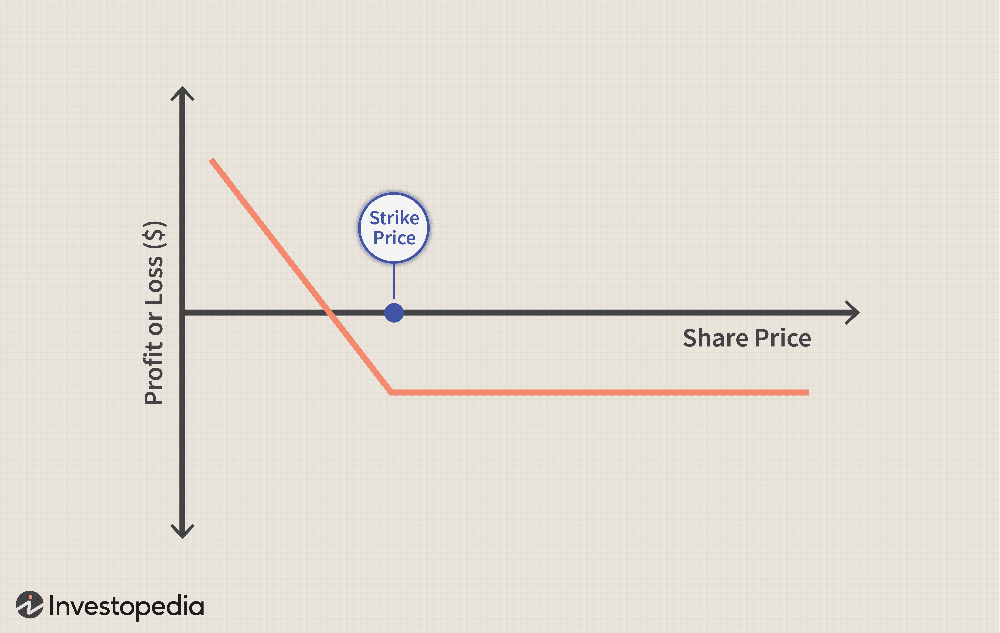

The financial market presents a wide range of instruments to investors, with derivatives such as options standing out for their dynamic nature. Among these, call options are a cornerstone, granting investors the right—but not the obligation—to purchase assets at a predetermined strike price within a specified timeframe. This contractual flexibility allows investors to speculate on asset price movements or hedge against potential portfolio losses, making call options an attractive choice for diverse trading strategies.

The advent of algorithmic trading has significantly enhanced how call options are utilized, introducing greater efficiency and precision in trading operations. By employing algorithms to automate decision-making processes, investors can optimize their strategies to respond quickly to market signals, reducing latency and human error. This integration of technology and financial instruments has catalyzed the development of sophisticated investment strategies that leverage both the predictive power of market data and the strategic flexibility of call options.

This article will investigate key investment strategies that harness call options and illustrate how algorithmic trading can refine and optimize these strategies for better market performance. It aims to provide a comprehensive understanding of the synergy between call options and algorithmic trading and its potential to transform trades into lucrative opportunities.

## Table of Contents

## Understanding Call Options

Call options grant investors the right, but not the obligation, to purchase a specified asset at a predetermined price, known as the strike price, within a set timeframe. This derivative instrument is pivotal in the financial markets, offering flexibility and potential in various investment strategies.

### Use Cases of Call Options

Call options are predominantly utilized for two main purposes: speculation and hedging. Speculative use involves predicting the upward movement of an asset's price, allowing investors to gain substantial returns if the asset appreciates beyond the strike price plus the premium paid. By contrast, hedging with call options serves as a risk management tool, protecting against adverse price movements in an underlying asset.

### Premium and Market Expectations

The premium of a call option represents the cost incurred by the buyer to possess this right. This premium is influenced by several factors but primarily reflects the market's expectations of future [volatility](/wiki/volatility-trading-strategies) of the asset. High expected volatility often translates to higher premiums due to the increased opportunity for profit. The Black-Scholes model is one widely used theoretical framework for pricing options, incorporating variables such as the underlying asset's price, strike price, time to expiration, and volatility.

### Key Parameters

Understanding the fundamental parameters of call options is essential for effective use:

- **Strike Price**: The price at which the option holder can buy the asset. It serves as a critical reference point in determining the intrinsic value of the option.

- **Expiration Date**: This defines the timeframe within which the option can be exercised. Closer expirations typically lead to lower premiums due to reduced time value.

- **Premium**: This is the market price of the call option and is comprised of intrinsic value (if any) and time value, which diminishes as expiration approaches.

To leverage call options effectively, investors need to analyze these components closely, aligning them with market conditions and investment goals. By doing so, they can optimize their chances of success whether they are aiming for speculative gains or hedging an existing portfolio.

## Investment Strategies with Call Options

Call options are versatile financial instruments, and investors employ a range of strategies to capitalize on their potential. These strategies include speculative approaches like long calls, as well as risk-mitigating techniques such as covered calls and spreads.

### Speculative Strategies

Speculative strategies primarily aim to profit from predicted price movements of the underlying asset. A common approach is the long call strategy, where an investor buys a call option expecting that the underlying asset's price will rise above the strike price before expiration. If successful, this allows the investor to purchase the asset at a reduced cost, potentially selling it at the current market price for a profit.

**Example: Long Call**
If an investor buys a call option for a stock with a strike price of $50, anticipating the stock price will rise to $60, the profit formula can be expressed as:

$$
\text{Profit} = (\text{Stock Price at Expiration} - \text{Strike Price}) \times \text{Number of Options} - \text{Premium Paid}
$$

If the stock reaches $60, and the premium paid was $2 per option, the profit on one option would be:

$$
\text{Profit} = (60 - 50) \times 1 - 2 = \$8
$$

### Hedging Strategies

Hedging strategies prioritize risk reduction, often employing options to protect existing investments. A popular hedging strategy using call options is the covered call, where an investor holds a long position in an asset while writing (selling) a call option on the same asset. This approach can generate additional income from the option premium, potentially offsetting some of the asset's holding costs or reducing downside risk.

**Example: Covered Call**
Consider an investor holding 100 shares of a stock worth $50 each and selling a call option with a strike price of $55 for $1 per share. If the stock price remains below $55, the investor retains the premium, augmenting portfolio returns.

$$
\text{Income} = \text{Premium} \times \text{Number of Options} = 1 \times 100 = \$100
$$

### Spreads

Spreads involve using multiple options to create a position with defined risk and reward characteristics. A common spread strategy is the bull call spread, which involves buying a call option at a lower strike price and selling another call option at a higher strike price. This strategy profits when the underlying asset's price rises, but limits potential gains and losses.

**Example: Bull Call Spread**
Suppose an investor buys a call option at a strike price of $50 for $3 and sells a call option at a strike price of $60 for $1, the maximum profit is limited but so is the risk.

$$
\text{Maximum Profit} = (\text{Higher Strike Price} - \text{Lower Strike Price}) \times \text{Number of Options} - \text{Net Premium Paid}
$$

$$
\text{Maximum Profit} = (60 - 50) \times 1 - (3 - 1) = \$8
$$

### Risk-Reward Assessment

Each strategy carries distinct risk-reward profiles that necessitate thorough analysis and sound risk management. Speculative strategies like long calls offer potentially high rewards linked to significant risks if the market moves unfavorably. Conversely, hedging strategies such as covered calls aim to mitigate risk, often sacrificing some profit potential for reduced volatility. Spreads offer a balanced approach, providing both risk limitation and cost reduction.

In leveraging call options effectively, investors must employ rigorous market analysis and maintain a robust risk management framework to align strategy selection with their individual risk tolerance and investment objectives. Further exploration of these strategies can reveal additional nuances and opportunities, facilitating more informed decision-making.

## The Role of Algorithmic Trading

Algorithmic trading involves the use of pre-established algorithms to execute trades automatically, based on comprehensive market analysis. This method integrates both software technology and financial models to enhance trading efficiency.

When aligned with call options, [algorithmic trading](/wiki/algorithmic-trading) capitalizes on market opportunities with precision and speed. Call options give traders the right but not the obligation to buy an asset, unlocking a spectrum of strategic options for traders focused on maximizing profits or minimizing losses. Algorithmic trading optimizes the handling of these derivatives by ensuring that trades occur at the most advantageous times given fluctuating market conditions. Automated systems, equipped with sophisticated algorithms, can compute and respond to complex variables faster than human traders. This includes determining optimal entry and [exit](/wiki/exit-strategy) points. For instance, algorithms can instantly analyze historical and real-time data to forecast price trends, subsequently executing trades at predicted peak profit moments or cutting losses during adverse market swings. This decisiveness is crucial in strategies like straddles or spreads, where timely trade adjustments can significantly impact profitability.

Technological integration into trading reduces human error while leveraging advanced statistical models. Algorithms employ techniques such as moving average crossovers, mean reversion, and volatility [breakout](/wiki/breakout-trading) strategies—each based on complex mathematical models that assess various market indicators. For example, mean reversion strategies assume that prices, volatility, and returns eventually move back towards the mean or average, a principle that can be effectively quantified and automated.

In addition to improved execution, algorithmic systems incorporate risk management through prediction models and hedging techniques. By using standard option pricing models like the Black-Scholes, traders can calculate theoretical values of options and estimate risk variables, enabling dynamic risk adjustment throughout the trading process. Automation facilitates the consistent application of such models across large volumes of trades, thus enhancing overall risk strategy.

Moreover, algorithms continually evolve with each iteration of the code bolstered by [machine learning](/wiki/machine-learning) capabilities. This allows systems to progressively improve from historical performance data, paving the way toward increasingly refined and successful trading algorithms. Such systems are adaptable, capable of responding to new data inputs, and modifying their strategies over time to suit changing market conditions.

In conclusion, the integration of algorithmic trading within the use of call options is transformative, driving precision in market participation and expanding potential profit margins through dynamic and automated decision-making processes.

## Key Considerations in Algo Trading with Call Options

Creating effective algorithmic strategies for trading call options necessitates a comprehensive understanding of both market dynamics and option pricing models, such as the Black-Scholes model. The Black-Scholes model is pivotal for determining the theoretical price of options by incorporating variables like the underlying asset’s current price, the option’s strike price, time until expiration, risk-free [interest rate](/wiki/interest-rate-trading-strategies), and the asset’s volatility. The formula is expressed as:

$$
C = S_0N(d_1) - Xe^{-rt}N(d_2)
$$

where:
- $C$ is the call option price,
- $S_0$ is the current stock price,
- $X$ is the strike price,
- $r$ is the risk-free interest rate,
- $t$ is the time to expiration,
- $N$ is the cumulative distribution function of the standard normal distribution,
- $d_1$ and $d_2$ are calculated as follows:

$$
d_1 = \frac{\ln(S_0/X) + (r + \sigma^2/2)t}{\sigma\sqrt{t}}
$$

$$
d_2 = d_1 - \sigma\sqrt{t}
$$

Here, $\sigma$ represents the volatility of the stock returns.

Backtesting is an essential component wherein algorithms are tested on historical data to ascertain their efficacy. It helps in identifying the strengths and weaknesses of a trading strategy, thereby reducing the risk of losses during live trading. Effective [backtesting](/wiki/backtesting) involves simulating the trading strategies over a substantial timeframe to ensure robustness across various market conditions.

Risk management is indispensable, and techniques such as delta hedging and volatility monitoring play a critical role. Delta hedging involves adjusting the portfolio's positions to maintain a delta-neutral stance, which minimizes the portfolio’s directional risk against small price changes in the underlying asset. Monitoring volatility is crucial as it affects the pricing of options and can signal potential market movements.

Algorithmic traders must also navigate the ever-evolving regulatory landscape, ensuring compliance to avoid legal pitfalls. Regulations may vary by region and often involve specific requirements for algorithmic trading to prevent market manipulation and ensure transparency. Additionally, technology risks such as latency, system failures, and cybersecurity threats need to be managed effectively to safeguard trading operations.

Continuous refinement through monitoring performance metrics and keeping abreast of technological advancements is essential for maintaining competitive trading systems. This may include optimizing algorithms, incorporating machine learning techniques, or adapting to changes in market microstructure to ensure the algorithmic strategies remain potent and effective.

## Conclusion

Combining call options with algorithmic trading significantly enhances investment potential by capitalizing on both strategic flexibility and the speed of execution. Call options, as financial derivatives, offer the right but not the obligation to buy an asset, providing a versatile tool for both hedging and speculative purposes. Algorithmic trading introduces automation and precision to executing these strategies, allowing investors to respond swiftly to market changes and maximize potential gains.

To successfully implement these strategies, investors must possess a robust foundation in financial instruments and technological proficiency. Knowledge of option pricing models, such as Black-Scholes, and an understanding of market dynamics are crucial. Algorithmic trading demands continuous learning and refinement of strategies. Testing algorithms on historical data (backtesting) plays a pivotal role in assessing their viability before committing real capital. Furthermore, ongoing adaptation to market conditions is essential, as financial markets are subject to rapid and sometimes unpredictable changes.

Investment success in this domain also requires a careful consideration of risk management techniques. Strategies such as delta hedging help manage risk exposure by maintaining a neutral portfolio concerning price movements. Monitoring market volatility and regularly updating algorithms ensure that strategies remain effective under different market environments.

As markets and technology continue to evolve, so too do the opportunities and challenges inherent in algorithmic options trading. Staying informed about regulatory requirements and potential technological risks is essential. The fast-paced nature of modern markets necessitates perpetual innovation and diligence, as traders must continually optimize their approach to maintain a competitive edge. This continuous cycle of learning and adaptation represents the critical path to leveraging the synergy between call options and algorithmic trading effectively.

## References & Further Reading

[1]: ["Options, Futures, and Other Derivatives"](https://www.pearson.com/en-us/subject-catalog/p/options-futures-and-other-derivatives/P200000005938/9780136939917) by John C. Hull

[2]: Black, F., & Scholes, M. (1973). ["The Pricing of Options and Corporate Liabilities."](https://www.cs.princeton.edu/courses/archive/fall09/cos323/papers/black_scholes73.pdf) The Journal of Political Economy, 81(3), 637-654.

[3]: ["Algorithmic Trading: Winning Strategies and Their Rationale"](https://www.wiley.com/en-us/Algorithmic+Trading%3A+Winning+Strategies+and+Their+Rationale-p-9781118460146) by Ernie Chan

[4]: Varian, H. R. (1974). ["A Bayesian Approach to Real Estate Assessment."](https://cir.nii.ac.jp/crid/1572543024713332736?lang=en) Studies in Bayesian Econometrics and Statistics.

[5]: Aldridge, I. (2009). ["High-Frequency Trading: A Practical Guide to Algorithmic Strategies and Trading Systems"](https://www.ahmetbeyefendi.com/wp-content/uploads/2020/07/High-Frequency-Trading-Irene-Aldridge.pdf) by Irene Aldridge