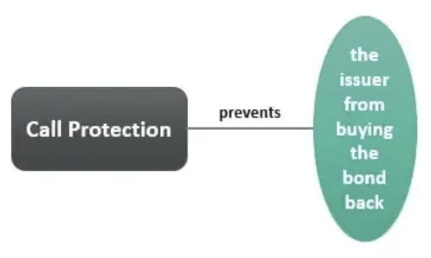

## Table of Contents

## What is call protection in finance?

Call protection in finance is a feature of some bonds that prevents the issuer from calling back, or redeeming, the bond before a specified date. This means that once you buy a bond with call protection, you can be sure that the company won't take it back from you until the call protection period ends. This can be important for investors because it gives them a predictable income stream for a certain amount of time.

For example, if you buy a bond with a 5-year call protection, the company cannot call the bond back for at least 5 years. This is helpful for investors who want to plan their finances, as they know they will receive interest payments for that period. Call protection is often found in bonds that have higher interest rates, as it makes the bond more attractive to investors by offering more security.

## How does call protection benefit bondholders?

Call protection benefits bondholders by giving them a guaranteed income for a set period. When you buy a bond with call protection, the company can't take it back from you until the call protection period is over. This means you know exactly how long you will get interest payments, which helps you plan your money better. It's like having a steady job where you know your salary will come in every month for a certain time.

This feature is especially good for bondholders who rely on the interest from bonds to live on. If the bond could be called back early, they might suddenly lose their income. Call protection makes the bond safer and more predictable. It's why some people are willing to pay more for bonds that have this feature, because it gives them peace of mind knowing their investment is secure for a while.

## What is the typical duration of call protection?

Call protection usually lasts for a few years. The exact time can be different for each bond, but it often ranges from 5 to 10 years. This means the company that issued the bond can't take it back from you during this time.

Having call protection for this length of time helps bondholders feel more secure. They know they will get interest payments for at least 5 to 10 years, which is helpful for planning their finances. It's like knowing you have a steady job for a while, so you can plan your future better.

## Can you explain the difference between hard and soft call protection?

Hard call protection and soft call protection are two types of call protection that bond issuers can offer. Hard call protection means the bond cannot be called back at all during the protection period. It's like a strict rule that says the company can't take the bond back until the time is up. This gives bondholders a lot of security because they know for sure they will get their interest payments for the whole period.

Soft call protection, on the other hand, allows the bond to be called back early, but only under certain conditions. For example, the company might be able to call the bond back if they can do it at a lower price than the bond's face value. This type of protection is less strict than hard call protection, but it still gives bondholders some security. They know the bond can only be called back if specific conditions are met, which makes it a bit less risky than a bond with no call protection at all.

## How does call protection affect the yield of a bond?

Call protection can make a bond's yield go down. This is because when a bond has call protection, it is safer for investors. They know they will get their interest payments for a certain time, so they might be happy with a lower yield. It's like choosing a job that is steady and secure, even if the pay is not as high as a riskier job.

On the other hand, if a bond doesn't have call protection, it can be riskier for investors. The company can take the bond back whenever they want, which means the investor might lose their income earlier than expected. Because of this risk, investors might want a higher yield to make up for it. It's like asking for more money to take a job that might not last as long.

## What are the implications of call protection for issuers?

Call protection can limit what issuers can do with their bonds. If a company has bonds with call protection, they can't take those bonds back from investors until the call protection period is over. This can be a problem if interest rates go down and the company wants to issue new bonds at a lower rate. They have to keep paying the higher interest on the old bonds, which can cost them more money.

But call protection can also help issuers sell their bonds. When a company offers bonds with call protection, it makes the bonds safer for investors. This can make investors more willing to buy the bonds, even if the [interest rate](/wiki/interest-rate-trading-strategies) is not as high as other bonds. So, call protection can help issuers get the money they need, even if it means they have to wait to take the bonds back.

## How is call protection priced in the bond market?

Call protection is priced into a bond's value by making the bond more valuable to investors. When a bond has call protection, it's safer because the company can't take it back for a certain time. This means investors might be okay with a lower interest rate because they know they will get their payments for a while. It's like choosing a job with a steady income over one that might end suddenly.

The price of a bond with call protection can be higher than a bond without it. Investors are willing to pay more for the safety and predictability that call protection offers. It's like buying a more expensive, reliable car instead of a cheaper one that might break down. So, issuers have to think about how much call protection will cost them in terms of higher bond prices and lower interest rates.

## What role does call protection play in corporate bond structuring?

Call protection is an important part of how companies set up their bonds. When a company makes a bond with call protection, it means they can't take the bond back from investors for a certain time. This makes the bond safer for people who buy it. They know they will get their interest payments for a while, which helps them plan their money better. It's like choosing a job that you know will last for a certain time, so you can plan your life around it.

Companies use call protection to make their bonds more attractive to investors. When a bond has call protection, investors might be okay with a lower interest rate because the bond is safer. But this can also be a problem for the company if interest rates go down. They might want to take the old bonds back and issue new ones at a lower rate, but they can't do that until the call protection period is over. So, call protection is a way for companies to balance the needs of their investors with their own financial plans.

## Can call protection be negotiated or modified after issuance?

Call protection can sometimes be changed after a bond is issued, but it's not easy. If a company wants to change the call protection, they usually have to talk to the bondholders and get their agreement. This can be hard because bondholders might not want to give up the safety that call protection gives them. It's like trying to change the rules of a game after it has started; everyone has to agree, and not everyone might want to.

Sometimes, a company can offer something in return to get bondholders to agree to change the call protection. For example, they might offer to pay more interest or give bondholders some other benefit. But even with these offers, it can still be tough to get everyone to agree. So, while it's possible to negotiate or modify call protection after issuance, it's not something that happens very often.

## How do changes in interest rates influence the effectiveness of call protection?

Changes in interest rates can make call protection more or less useful for both bondholders and issuers. When interest rates go down, call protection becomes more valuable for bondholders. This is because the company can't take the bond back and issue new ones at a lower rate. Bondholders keep getting the higher interest rate for the whole call protection period, which is good for them. It's like having a job that pays well when other jobs are paying less.

For issuers, falling interest rates can make call protection less helpful. They might want to take back the old bonds and issue new ones at the lower rate to save money. But if the bonds have call protection, they can't do this until the protection period is over. This means they have to keep paying the higher interest rate, which can be bad for their finances. It's like being stuck in a contract that costs more than it should.

## What are some historical examples where call protection significantly impacted bond performance?

In the early 2000s, when interest rates were falling, call protection became very important for bondholders. A good example is the bonds issued by many utility companies. These bonds often had call protection that lasted for 5 to 10 years. When interest rates went down, the companies wanted to call back their old bonds and issue new ones at lower rates. But because of the call protection, they couldn't do this. So, bondholders kept getting the higher interest rates for the whole protection period, which made their bonds perform better than they would have without call protection.

Another example happened during the financial crisis of 2008. Many banks had issued bonds with call protection before the crisis. When the crisis hit, interest rates dropped a lot. The banks wanted to take back their old bonds and issue new ones at the lower rates to save money. But the call protection stopped them from doing this. So, the bondholders kept getting the higher interest rates, which helped them a lot during a time when many investments were losing value. This made the bonds with call protection perform much better than other investments.

## How do advanced financial models assess the value of call protection in bond valuation?

Advanced financial models assess the value of call protection in bond valuation by looking at how much the bond's safety adds to its price. They use something called option pricing models, like the Black-Scholes model, to figure out how much the call protection is worth. These models think of call protection as a kind of insurance for bondholders. They calculate the cost of this insurance by looking at things like the time until the call protection ends, how likely interest rates are to change, and how much the bond's price might go up or down. This helps them find out how much more people are willing to pay for a bond with call protection compared to one without it.

These models also take into account the bond's yield and the overall interest rate environment. When interest rates are expected to go down, the value of call protection goes up because it keeps the bond safe from being called back early. On the other hand, if interest rates are expected to stay the same or go up, the value of call protection might be lower. By putting all these factors together, the models can give a good estimate of how much call protection adds to a bond's value. This helps investors and issuers understand how much they should pay or charge for bonds with call protection.

## References & Further Reading

[1]: ["Bond Markets, Analysis, and Strategies"](https://www.amazon.com/Bond-Markets-Analysis-Strategies-tenth/dp/026204627X) by Frank J. Fabozzi

[2]: Hendershott, T., Jones, C. M., & Menkveld, A. J. (2011). ["Does Algorithmic Trading Improve Liquidity?"](https://onlinelibrary.wiley.com/doi/full/10.1111/j.1540-6261.2010.01624.x) The Review of Financial Studies, 24(3), 901-937.

[3]: ["Algorithmic Trading: Winning Strategies and Their Rationale"](https://books.google.com/books/about/Algorithmic_Trading.html?id=WAlFDwAAQBAJ) by Ernest P. Chan

[4]: ["Option Pricing and Volatility Strategies and Techniques"](https://www.amazon.com/Option-Volatility-Pricing-Strategies-Techniques/dp/0071818774) by Sheldon Natenberg

[5]: Treleaven, P., Galas, M., & Lalchand, V. (2013). ["Algorithmic Trading Review."](https://dl.acm.org/doi/10.1145/2500117) Communications of the ACM, 56(11), 76-85.