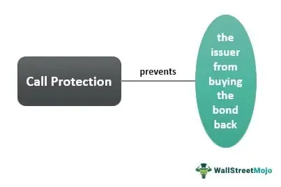

The world of finance is in a perpetual state of transformation, driven by the continuous quest of investors to develop innovative strategies for enhancing returns. This search has led to the exploration of combining traditional and modern financial instruments, such as bonds, call protection, and algorithmic trading. Each of these components plays a crucial role in the construction of efficient and resilient investment portfolios.

Bonds, as fixed-income securities, provide a reliable stream of income and are a cornerstone in portfolio management. Among the various features of bonds, call protection stands out as a significant element. Call protection is a provision that shields investors from the early redemption of bonds by issuers, thereby ensuring a stable and predictable investment horizon. This feature is particularly beneficial in volatile interest rate environments, where premature bond calls can disrupt expected income flows.



Algorithmic trading, on the other hand, represents the forefront of modern trading strategies, utilizing advanced algorithms to automate and optimize trading processes. By minimizing human intervention, algorithmic trading reduces errors and exploits market inefficiencies, leading to more efficient trading outcomes. Its application is not limited to equities; in the bond market, algorithmic trading enhances liquidity and execution speed, thereby improving overall market efficiency.

Understanding the interplay between these elements is essential for investors looking to optimize their portfolios and manage risks effectively. The integration of call protection mechanisms within bonds, alongside algorithmic trading strategies, offers a comprehensive approach to navigating dynamic markets. By leveraging these financial tools, investors can build portfolios that are not only resilient to market fluctuations but also poised to capture enhanced returns.

As we explore the significance of call protection in bonds and the efficiencies brought by algorithmic trading, it becomes clear that the fusion of these strategies can lead to robust investment portfolios. By integrating these aspects, investors are better equipped to construct adaptable and resilient portfolios in ever-changing financial landscapes.

## Table of Contents

## Understanding Bonds and Call Protection

Bonds are a principal form of fixed-income security used extensively in financial markets. As debt instruments, bonds are issued by corporations, municipalities, and governments to raise capital from investors. When an entity issues a bond, it is essentially borrowing money from the bondholders, agreeing to pay interest—known as the coupon rate—at regular intervals, and repaying the principal amount upon maturity.

An essential feature of certain bonds is call protection. Call protection refers to a provision embedded within a bond's contract that restricts the issuer's ability to redeem or "call" the bond before a specified period. This call protection period ensures that investors receive a stable stream of income via interest payments for a preset duration before the issuer has the option to retire the bond prematurely.

The mechanics of call protection are straightforward, yet they greatly influence both the issuer and investor strategies. For issuers, call protection limits flexibility in managing debt, primarily if future interest rates fall, making current debt expensive relative to newly obtainable rates. For investors, the provision provides the comfort of a predictable income stream and protects against the reinvestment risk that accompanies early redemption. This is particularly beneficial in environments prone to [interest rate](/wiki/interest-rate-trading-strategies) [volatility](/wiki/volatility-trading-strategies), where fluctuations could lead to unfavorable conditions for reinvestment.

In practical terms, when interest rates decrease, issuers may find it advantageous to call existing bonds—redeeming them at a pre-specified price—before issuing new bonds at lower interest rates. Call protection averts this potential drawback for investors by legally binding the issuer to honor the agreed payment terms until the call protection period concludes.

From a contractual perspective, understanding the specifics of a bond's call protection involves examining the stipulations in bond indentures. These documents outline the duration of protective periods and the conditions under which a bond may be called post-period. Bonds come with various call protection lengths, ranging from a few years to the entire life of the bond, typically defined in terms of non-callable (not callable until a certain date) or call-protected up to a certain point.

In summary, call protection is a pivotal component of bond contracts that serves to safeguard bondholders' interests by offering assured returns and mitigating exposure to interest rate fluctuations. This feature enhances the attractiveness of bonds to risk-averse investors, thereby providing a stabilizing influence within an investment portfolio.

## The Role of Call Protection in Finance

Call protection serves as an essential provision in bond agreements, offering a layer of security for bondholders against the risk of issuer recall. This feature is particularly significant in scenarios where interest rates decline. When interest rates fall, issuers might be inclined to redeem bonds early to reissue new bonds at a lower rate. However, call protection prevents this premature redemption, allowing investors to continue receiving the initially agreed-upon high-interest payments for a predetermined period.

The strategic advantage of call protection lies in its ability to enhance the stability of an investment portfolio. By ensuring that bonds cannot be called before a certain date, investors are safeguarded against reinvestment risk — the challenge of reinvesting capital at a lower interest rate than that of the original bond. This stability is crucial for long-term financial planning and revenue prediction.

Understanding the different durations and stipulations in call protection is vital for investors. Bonds may come with varying degrees of call protection, each with specific conditions and timeframes. These can range from a complete prohibition against calling the bond for a set number of years to step-down call features where the call price decreases over time.

By comprehensively analyzing these components, investors can make informed decisions on how best to incorporate call-protected bonds into their portfolios. This analysis requires a nuanced understanding of not only the bond terms but also the broader economic context, particularly interest rate forecasts. Such insights equip investors to leverage call protection effectively, contributing to a more secure and stable portfolio in fluctuating market conditions.

## Algorithmic Trading: Enhancing Market Efficiency

Algorithmic trading, commonly referred to as algo trading, has revolutionized financial markets by automating the trading process. This method employs advanced algorithms to execute orders based on predetermined criteria. By automating trades, algo trading significantly minimizes human error and capitalizes on market inefficiencies, ultimately leading to improved trading outcomes.

One of the core benefits of [algorithmic trading](/wiki/algorithmic-trading) is its ability to support a variety of trading strategies. These include:

1. **Trend Following**: Algorithms can be designed to identify and capitalize on market trends, enabling traders to buy or sell securities based on momentum indicators. For instance, moving averages are commonly used to signal buy or sell decisions, and algorithms can efficiently process these indicators to execute trades in real-time.

2. **Arbitrage**: Algo trading is particularly advantageous for arbitrage strategies, which involve exploiting price discrepancies of the same asset across different markets. Algorithms can quickly identify and execute arbitrage opportunities faster than human traders, thus ensuring that the discrepancies are corrected promptly.

3. **Mean Reversion**: This strategy is based on the idea that prices and returns eventually revert to their long-term averages. Algorithms can detect deviations from the average and execute trades to profit from the expected reversal.

In the bond market, algorithmic trading enhances both [liquidity](/wiki/liquidity-risk-premium) and execution speed. Given the typically lower liquidity of bonds compared to equities, algorithms can facilitate more efficient matching of buy and sell orders, thereby improving market liquidity. The speed at which algorithms operate allows for the rapid execution of large orders, minimizing the market impact and reducing transaction costs.

Integrating algorithmic strategies with bond trading can be achieved through several approaches. One approach involves using algorithms to monitor interest rate movements and adjust bond portfolios accordingly. In a Python context, one might employ libraries like PyAlgoTrade or Zipline to backtest and implement trading strategies tailored to fixed-income securities.

```python
import zipline as zp

def initialize(context):
    context.bonds = zp.symbol('BOND')

def handle_data(context, data):
    # Example: Simple moving average crossover strategy
    short_ma = data.history(context.bonds, 'price', 10, '1d').mean()
    long_ma = data.history(context.bonds, 'price', 30, '1d').mean()

    if short_ma > long_ma:
        order_target_percent(context.bonds, 0.5)
    else:
        order_target_percent(context.bonds, -0.5)
```

In this example, the algorithm implements a simple moving average crossover strategy, adjusting the bond position based on short-term and long-term trends detected in the market data. Such strategies enable traders to respond swiftly to market conditions, optimizing portfolio returns while managing risk effectively.

Overall, the integration of algorithmic trading within the bond market not only enhances trading efficiency but also allows for the implementation of sophisticated strategies that can adapt to dynamic market environments. The continual advancement of algorithms and computing technology promises further enhancements in trade execution and market efficiency.

## Integrating Call Protection and Algo Trading

Combining call protection strategies with algorithmic trading significantly enhances both returns and risk management for investors dealing with bonds. Call protection provides a safeguard against early redemptions by the issuer, ensuring that investors enjoy stable and predictable returns for a specified period. This stability is primarily beneficial during periods of fluctuating interest rates, as it prevents bonds from being called away when interest rates drop.

Algorithmic trading, characterized by its ability to execute trades at high speeds and with precision, complements call protection by enabling an adaptive and strategic approach to managing bond portfolios. Through the use of sophisticated algorithms and computer models, investors can simulate various market scenarios and strategically employ call protection in bonds to maximize returns.

Python, with libraries like NumPy, pandas, and Backtrader, can play a crucial role in simulating bond portfolios incorporating call protection and algorithmic trading strategies. Here's a basic Python code snippet demonstrating how an investor might model and adjust bond holdings using algorithmic strategies:

```python
import numpy as np
import pandas as pd

# Example data for bond prices and interest rates
bond_data = pd.DataFrame({
    'Date': pd.date_range(start='2023-01-01', periods=100, freq='D'),
    'Bond_Price': np.random.normal(loc=100, scale=2, size=100),
    'Interest_Rate': np.random.uniform(low=0.01, high=0.05, size=100)
})

# Simple strategy function to decide on action based on interest rates
def algo_strategy(row):
    if row['Interest_Rate'] < 0.03:
        return 'Hold'  # Hold bonds because rates are favorable
    else:
        return 'Reallocate'  # Consider reallocating due to rising rates

# Apply strategy
bond_data['Action'] = bond_data.apply(algo_strategy, axis=1)

print(bond_data.head())
```

Integration of call protection with algorithmic trading enables strategic reallocation during interest rate fluctuations. When interest rates rise, the algorithm can quickly adjust holdings to reduce exposure to rate-sensitive bonds. Conversely, when rates are expected to fall, it can identify opportunities to safeguard high-yield investments that benefit from call protection.

Case studies of these integrated strategies illustrate the potential benefits. For instance, an investor using algorithmic trading to manage a bond portfolio with call-protected instruments could maintain a stable yield even during volatile market conditions. By rebalancing the portfolio dynamically, they ensure the retention of high-interest bonds while mitigating risks associated with rising rates.

Overall, integrating call protection with algorithmic trading provides a comprehensive approach to optimizing bond portfolios, ultimately leading to enhanced returns and robust risk management. Investors leveraging these strategies can navigate the complexities of modern financial markets with greater confidence and efficiency.

## Advantages and Challenges

The integration of call protection in bonds and algorithmic trading presents investors with a diversified approach to enhancing portfolio performance and managing risk. These strategies collectively offer several benefits, yet they also pose distinct challenges requiring a comprehensive understanding of market intricacies and technological capabilities.

Firstly, the combination of call protection and algorithmic trading significantly enhances risk management capabilities. Call protection secures a fixed return for a specified period, shielding investors from the detrimental effects of fluctuating interest rates. Meanwhile, algorithmic trading boosts efficiency by automating trades and identifying market inefficiencies, reducing the likelihood of human error and enabling faster execution of trades. This synergy allows investors to strategically allocate assets, adapting to dynamic market conditions with agility.

However, to fully capitalize on these benefits, investors must possess a profound understanding of market dynamics and the technical prowess to employ complex algorithms. Algorithmic trading relies on sophisticated models which demand expertise in areas like [statistics](/wiki/bayesian-statistics), financial mathematics, and computer programming. These models may include strategies such as [trend following](/wiki/trend-following), [arbitrage](/wiki/arbitrage), or mean reversion, each requiring precise implementation and monitoring to ensure optimal results.

Moreover, navigating the regulatory landscape presents additional challenges, particularly for new investors. Regulatory requirements can vary significantly across regions, imposing constraints and necessitating compliance with financial guidelines. As such, investors must remain informed about legal obligations to avoid potential pitfalls and ensure adherence to standards that govern algorithmic trading activities.

The steep learning curve associated with mastering both financial instruments and trading technologies also poses challenges. Investors must be committed to continuous education, acquiring knowledge not only of financial markets but also of technological advancements. This can involve gaining proficiency in programming languages like Python, often used in financial modeling and algorithm development. Here is a simple Python snippet demonstrating a trend-following algorithm:

```python
import numpy as np

def trend_following(prices, short_window=40, long_window=100):
    signal = np.zeros(len(prices))
    short_mavg = np.convolve(prices, np.ones(short_window)/short_window, mode='valid')
    long_mavg = np.convolve(prices, np.ones(long_window)/long_window, mode='valid')

    signal[len(long_mavg):] = np.where(short_mavg[len(short_mavg)-len(long_mavg):] > long_mavg, 1.0, 0.0)

    return signal
```

Investors must also balance the trade-offs that come with these strategies, acknowledging that while algorithmic trading can yield substantial returns, it can also lead to significant losses if not properly managed. Therefore, maintaining a disciplined approach to market analysis and strategy implementation is crucial.

In conclusion, although the integration of call protection in bonds and algorithmic trading offers promising advantages, investors must be prepared to confront the associated challenges. Success in this domain hinges on a robust understanding of market dynamics, technical competence, and a dedication to continuous learning and adaptation to the evolving financial landscape.

## Conclusion

The integration of bonds, call protection, and algorithmic trading presents a formidable approach to investing by offering unique benefits and requiring specific skill sets. Understanding each component allows investors to enhance potential returns while effectively managing associated risks. Bonds provide a stable income through interest payments, and when coupled with call protection, they offer security against issuer’s early redemption, especially in a low-interest environment. This security is crucial as it ensures predictable cash flows over specified periods.

Algorithmic trading brings a technological edge by automating the trading process, thus minimizing human errors and exploiting market inefficiencies at lightning speeds. This approach supports diverse strategies like arbitrage or trend following, helping investors to swiftly adjust their portfolios to align with market conditions. Combining these elements requires a blend of technical acumen and strategic foresight. Investors must remain adaptable, regularly updating their knowledge and skills to navigate the ever-evolving financial environment effectively.

Achieving an adaptive and resilient portfolio hinges on utilizing these financial tools strategically. It involves carefully analyzing market trends, understanding the specific terms of call protection, and deploying algorithmic trading solutions tailored to enhance portfolio performance. A disciplined, informed approach increases the chances of both protecting assets and achieving sustainable financial growth.

## References & Further Reading

[1]: ["Bond Markets, Analysis, and Strategies"](https://www.amazon.com/Bond-Markets-Analysis-Strategies-tenth/dp/026204627X) by Frank J. Fabozzi

[2]: Hendershott, T., Jones, C. M., & Menkveld, A. J. (2011). ["Does Algorithmic Trading Improve Liquidity?"](https://onlinelibrary.wiley.com/doi/full/10.1111/j.1540-6261.2010.01624.x) The Review of Financial Studies, 24(3), 901-937.

[3]: ["Algorithmic Trading: Winning Strategies and Their Rationale"](https://books.google.com/books/about/Algorithmic_Trading.html?id=WAlFDwAAQBAJ) by Ernest P. Chan

[4]: ["Option Pricing and Volatility Strategies and Techniques"](https://www.amazon.com/Option-Volatility-Pricing-Strategies-Techniques/dp/0071818774) by Sheldon Natenberg

[5]: Treleaven, P., Galas, M., & Lalchand, V. (2013). ["Algorithmic Trading Review."](https://dl.acm.org/doi/10.1145/2500117) Communications of the ACM, 56(11), 76-85.