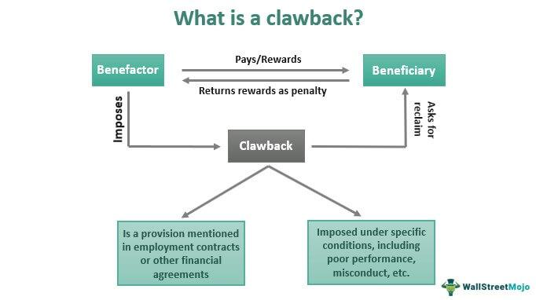

Understanding real estate finance necessitates the comprehension of an array of financial mechanisms and innovations, notably call provisions and algorithmic trading. Call provisions, integral to the finance sector, permit issuers the ability to repurchase and retire their debt securities prior to the maturity date. This flexibility aids issuers in managing their financial liabilities more effectively. Nevertheless, it imposes certain strategic adaptations for investors, who must account for potential disruptions to their expected income streams and the looming possibility of reinvestment risk should an early call occur.

In parallel, algorithmic trading, traditionally synonymous with stock markets, is progressively embedding itself within real estate finance. This advanced trading strategy employs complex algorithms to automate and optimize transaction processes. Its gradual adoption in real estate finance heralds novel opportunities primarily due to its capacity for executing swift, data-driven decisions. This new paradigm promises efficiencies by potentially enhancing market liquidity and cutting transaction costs.



This article will explore the interplay between these two elements—call provisions and algorithmic trading—within real estate finance. By analyzing how call provisions affect financial strategies and discerning the influence of algorithmic trading in this sector, investors and stakeholders can better navigate the complexities of modern real estate finance.

## Table of Contents

## Understanding Call Provisions in Real Estate

A call provision is an essential feature embedded within certain debt securities, allowing the issuer to repurchase and retire these securities before their specified maturity date. Within the bond market, this option provides issuers with the strategic flexibility to manage debt costs effectively. Typically, call provisions are specified in the bond indenture, which outlines the terms and conditions, including the specific triggering events that allow for early buy-back. These events could be linked to specific interest rate changes or financial performance criteria.

In real estate finance, callable bonds are frequently utilized. They offer issuers the ability to capitalize on favorable interest rate movements. When interest rates decline, issuers can call existing bonds and refinance their debt at these lower rates, thereby decreasing the cost of capital and optimizing financial performance. This flexibility can be a crucial tool for real estate firms, which often operate with heavy debt loads, thereby allowing them to manage these more efficiently.

However, while call provisions can benefit issuers by providing refinancing options and reducing overall interest expenses, they also pose challenges for investors. Investors purchasing callable bonds must contend with reinvestment risk, as the likelihood of a bond being called increases in a declining interest rate environment. When a bond is called, investors typically receive their principal back and often must reinvest it at lower prevailing rates, potentially reducing their income stream.

Thus, understanding call provisions is paramount for both issuers and investors. Issuers gain from potential cost savings and increased financial maneuverability, whereas investors must carefully assess the trade-off between potential yield enhancements and associated risks.

## Real Estate Examples of Call Provisions

Municipal bonds are frequently utilized in financing real estate projects and can often include call provisions. These provisions offer a mechanism for issuers to manage their debt obligations more effectively by allowing them to call, or redeem, the bonds before the specified maturity date. This financial strategy is particularly advantageous when market interest rates decline, as it enables issuers to refinance their existing debt at a lower cost.

Consider a municipal bond issued to fund the construction or renovation of public housing projects. If interest rates drop after the issuance of these bonds, the municipality might choose to exercise the call provision. By doing so, the municipality can retire the older, higher-interest bonds and issue new bonds at a more favorable rate. This action effectively reduces the overall interest expense and optimizes budget allocations.

The impact of such strategies is significant. For example, if a city has issued a bond at a 5% [interest rate](/wiki/interest-rate-trading-strategies) and market rates decrease to 3%, the savings from refinancing could be substantial. Calculating these savings involves understanding the present value of future interest payments under both the original and new interest rates.

In practice, municipalities assess the value of calling bonds by considering various factors, including the call premium—the additional amount paid to bondholders above the bond's face value when it is called. Issuers perform a cost-benefit analysis to ensure that the savings from reduced interest payments outweigh any costs associated with the call premium.

Python can be used to model such scenarios:

```python
def calculate_savings(face_value, original_rate, new_rate, years_remaining):
    original_cost = face_value * original_rate * years_remaining
    new_cost = face_value * new_rate * years_remaining
    savings = original_cost - new_cost
    return savings

face_value = 1000000  # $1,000,000 bond
original_rate = 0.05  # 5%
new_rate = 0.03  # 3%
years_remaining = 10

savings = calculate_savings(face_value, original_rate, new_rate, years_remaining)
print(f"Savings from calling bonds: ${savings}")
```

In conclusion, call provisions in municipal bonds used for real estate projects serve as a strategic tool for issuers to capitalize on favorable market conditions, thereby achieving significant interest cost reductions. This practice not only supports effective financial management but also ensures that public projects remain sustainable and cost-efficient in the long term.

## Algorithmic Trading in Real Estate

Algorithmic trading involves the use of complex computer algorithms to execute trading strategies in financial markets, automatically executing trades and managing portfolios based on predetermined criteria. While traditionally associated with stock, [forex](/wiki/forex-system), and commodities markets, [algorithmic trading](/wiki/algorithmic-trading) is beginning to make significant inroads into real estate finance. This adoption is primarily driven by the desire for more efficient, data-driven decision-making processes.

The real estate market, known for its hefty transaction costs and traditionally slower operations, stands to gain substantially from the efficiencies introduced by algorithmic trading. One of the critical benefits is increased [liquidity](/wiki/liquidity-risk-premium). By enabling a more rapid turnover of assets and broader participation from various market players, algorithmic trading can significantly enhance market liquidity. This increased liquidity is likely to attract a wider range of investors, creating a more dynamic market environment.

Additionally, algorithmic trading offers the advantage of reduced transaction costs. Traditional real estate transactions often involve multiple intermediaries, such as brokers and [agents](/wiki/agents), each taking a commission or fee. Automated trading platforms minimize these costs by streamlining the transaction process, reducing the need for intermediaries, and executing trades at optimal market conditions. 

Furthermore, algorithmic trading promotes more efficient market operations. By using real-time data analysis, algorithms can quickly identify market trends, assess risks, and execute trades, thus allowing for more responsive and agile market operations. These capabilities enable investors to capitalize on fleeting opportunities and improve portfolio performance through data-driven insights.

Overall, the integration of algorithmic trading within real estate finance represents a significant evolution in how these markets operate, potentially transforming traditional practices with technology-driven strategies.

## The Intersection of Call Provisions and Algorithmic Trading

Algorithmic trading has revolutionized various financial markets and is beginning to make its mark on real estate finance, particularly in the management of callable securities. Callable securities, such as certain bonds issued for real estate projects, provide issuers the option to redeem the securities before maturity, often when interest rates decline. This flexibility requires investors to develop sophisticated strategies to mitigate the risks associated with early redemption, and algorithmic trading offers a powerful solution to this challenge.

By employing complex algorithms, investors can optimize their real estate portfolios by anticipating call events—situations when issuers decide to call back securities. Predicting these events involves analyzing a multitude of factors, including interest rate trends, issuer behavior patterns, and economic indicators. For instance, algorithms can be designed to adjust investment positions in response to interest rate changes, minimizing the negative impact of reinvestment risk. This adaptability is crucial given the potential loss of future income when a security is called prior to maturity.

Furthermore, algorithmic trading can enhance the efficiency with which callable securities are bought and sold. This efficiency not only reduces transaction costs but also increases market liquidity, making it easier for investors to enter or [exit](/wiki/exit-strategy) positions. Advanced algorithms might apply [machine learning](/wiki/machine-learning) techniques to detect market signals or price anomalies, which can be indicative of impending call events or shifts in interest rates.

For investors and firms adept at leveraging algorithmic trading, these strategies can offer significant competitive advantages in the landscape of real estate finance. They enable more informed decision-making and faster response times compared to traditional trading methods. The integration of technology into the management of callable securities also allows for the handling of larger volumes of data, providing investors with a comprehensive understanding of market dynamics.

Despite the benefits, mastering algorithmic trading in real estate finance does require a substantial investment in technology and expertise. It is essential for investors to carefully consider the accuracy and reliability of their models, continuously refining them to adapt to changing market conditions. In summary, the intersection of call provisions and algorithmic trading represents a significant innovation in real estate finance, offering opportunities for enhanced portfolio management and strategic investment.

## Challenges and Considerations

Investors in real estate finance must carefully assess the interplay between higher yields and the risks associated with early bond calls. The primary advantage of investing in callable bonds is the potential for higher yields compared to non-callable bonds. This is because callable bonds generally offer higher interest rates to compensate investors for the risk of the bond being called before maturity. However, if the issuer decides to exercise the call provision, investors face reinvestment risk, especially if the bonds are called in a declining interest rate environment. This scenario forces investors to reinvest the principal at lower prevailing interest rates, potentially reducing income.

Algorithmic trading, when applied to real estate finance, presents its own set of challenges and considerations. Implementing effective algorithmic trading strategies requires significant investments in technology, infrastructure, and expertise. Developing sophisticated algorithms that can efficiently manage large datasets and execute trades with precision involves both advanced programming skills and a deep understanding of financial markets.

Here is a simple Python code example illustrating how an algorithm might evaluate call risk:

```python
def evaluate_call_risk(bond, interest_rate):
    """
    Function to evaluate call risk given a bond and current interest rate.

    Parameters:
    bond (dict): A dictionary with bond details including 'call_price' and 'coupon_rate'.
    interest_rate (float): The current market interest rate.

    Returns:
    bool: True if the bond is likely to be called, False otherwise.
    """
    return interest_rate < bond['coupon_rate']

# Example usage
bond_example = {'call_price': 100, 'coupon_rate': 0.05}
current_interest_rate = 0.03
is_called = evaluate_call_risk(bond_example, current_interest_rate)
print("Bond likely to be called:", is_called)
```

The above code evaluates whether a bond is likely to be called based on the comparison between the market interest rate and the bond's coupon rate.

Additionally, regulatory considerations are crucial in both call provisions and algorithmic trading. Regulations may dictate the conditions under which call provisions are structured and executed. For algorithmic trading, compliance with financial regulations is paramount to ensure market stability and integrity. Regulatory bodies may impose restrictions on trading algorithms to prevent market manipulation and systemic risks. As such, ensuring compliance requires continuous monitoring of regulatory changes and guidance.

In summary, understanding the complexities of call provisions and algorithmic trading necessitates a comprehensive approach, balancing higher yields against potential risks, investment in robust technology and infrastructure, and strict adherence to regulatory requirements.

## Conclusion

Call provisions and algorithmic trading are becoming increasingly significant in real estate finance. These innovations provide both challenges and opportunities for investors and firms seeking to refine their strategies for better financial outcomes. 

Understanding call provisions is essential for investors aiming to manage risks and leverage potential benefits. These provisions, which allow issuers to retire debt securities before maturity, offer issuers the flexibility to reduce debt costs through refinancing when interest rates fall. However, they present challenges for investors, such as reinvestment risk, which necessitates a strategic approach to balance prospective yields with potential call events.

Algorithmic trading introduces a modern complexity to real estate finance, promising to enhance decision-making through computational efficiency and data-driven insights. This technology facilitates increased market liquidity and reduced transaction costs, ensuring more efficient operations. By incorporating algorithmic models, investors and firms can predict call events and adapt to interest rate fluctuations with remarkable precision, resulting in a competitive advantage.

As real estate finance continually evolves, these tools are set to play a crucial role in shaping the industry's future landscape. Investors equipped with a comprehensive understanding of call provisions alongside an adept use of algorithmic trading can position themselves advantageously. Embracing these aspects is imperative for staying ahead in an increasingly complex financial environment.

## References & Further Reading

[1]: ["Advances in Financial Machine Learning"](https://www.amazon.com/Advances-Financial-Machine-Learning-Marcos/dp/1119482089) by Marcos Lopez de Prado

[2]: Bergstra, J., Bardenet, R., Bengio, Y., & Kégl, B. (2011). ["Algorithms for Hyper-Parameter Optimization."](https://dl.acm.org/doi/10.5555/2986459.2986743) Advances in Neural Information Processing Systems 24.

[3]: ["Evidence-Based Technical Analysis: Applying the Scientific Method and Statistical Inference to Trading Signals"](https://www.amazon.com/Evidence-Based-Technical-Analysis-Scientific-Statistical/dp/0470008741) by David Aronson

[4]: ["Machine Learning for Algorithmic Trading"](https://github.com/stefan-jansen/machine-learning-for-trading) by Stefan Jansen

[5]: ["Quantitative Trading: How to Build Your Own Algorithmic Trading Business"](https://www.amazon.com/Quantitative-Trading-Build-Algorithmic-Business/dp/1119800064) by Ernest P. Chan