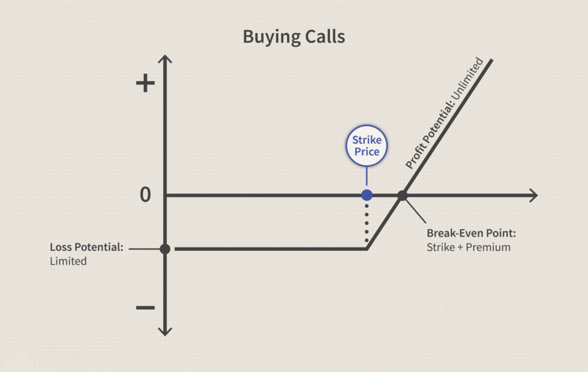

Financial trading has undergone significant transformation over the years with the introduction and evolution of complex financial instruments. Among these, options trading—comprising call and put options—has emerged as a critical component of modern financial markets. Options are financial derivatives that provide versatility in investment strategies through the right, but not the obligation, to buy or sell an asset at a predetermined price within a set timeframe. This flexibility allows investors to hedge risks, speculate on market movements, and enhance portfolio returns.

Alongside the development of sophisticated financial instruments is the rise of algorithmic trading, which leverages advanced computer programs to execute trades based on pre-established criteria. This method of trading capitalizes on speed, accuracy, and the elimination of human biases, distinguishing itself by executing strategies based on complex mathematical models and large datasets. The advent of algorithmic trading has revolutionized the financial landscape by enabling rapid trade execution and enhanced market analysis.



This article examines the synergy between options trading and algorithmic trading, demonstrating how they can be employed to optimize portfolio performance. By employing algorithmic systems, traders can execute options strategies with increased efficiency and precision. The document will further discuss the fundamentals of call and put options, highlight their strategic applications, and explore the benefits of integrating algorithmic trading techniques in the implementation of these strategies. This integration presents traders with advanced tools for optimizing trades, managing risks, and potentially achieving superior investment outcomes.

## Table of Contents

## Understanding Call and Put Options

Options are a category of financial derivatives that grant the buyer specific rights regarding an underlying asset without obligating them to execute a transaction. These rights revolve around the option to either buy or sell the asset, and this feature underpins their utility in risk management and speculative strategies. 

Call options bestow upon the investor the right to purchase an underlying asset at a predetermined price, known as the strike price, before the option's expiration date. Conversely, put options grant the right to sell the asset at the agreed strike price within the specified timeframe. The flexibility offered by these derivatives allows investors to craft strategies that align with their market forecasts or hedging requirements.

Each option contract is characterized by several key parameters, including the strike price, expiration date, and underlying asset. These parameters are integral in determining the option's intrinsic value and time value. The intrinsic value is the difference between the current price of the underlying asset and the strike price, either in favor of the call (when the asset's market price exceeds the strike price) or the put (when the strike price exceeds the market price). Time value considers the potential for market movements before the expiration, often influenced by volatility and the time remaining until expiration.

Options trading offers considerable strategic flexibility. For instance, call options can be used to speculate on an asset's price increase, while put options might be used to bet on a price decline or to protect against potential drops in a portfolio's value. This adaptability makes options highly valuable for hedging—mitigating risk by offsetting potential losses in an investor's portfolio. Notably, combining different options through strategies such as straddles, strangles, or spreads enables traders to leverage market [volatility](/wiki/volatility-trading-strategies) or specific price targets while managing their exposure to risk.

Overall, the structured characteristics of options provide a versatile toolkit for investors, allowing them to engage with financial markets in innovative ways that align with their investment goals and risk tolerance.

## Algorithmic Trading: A New Era

Algorithmic trading has transformed the financial markets by employing computer programs to execute trading strategies. These sophisticated systems leverage complex mathematical models and predefined criteria to perform trades with remarkable speed and precision. One of the key advantages of this approach is its ability to eliminate human biases, thus enhancing the objectivity of trading decisions. By automating the execution process, [algorithmic trading](/wiki/algorithmic-trading) systems minimize errors that are often associated with manual trading, resulting in increased accuracy and consistency.

When algorithmic trading techniques are applied to options, they enable the efficient management of complex multi-leg options strategies. This includes strategies like straddles, strangles, and butterflies, which involve multiple options contracts with different strike prices and expiration dates. Algorithms can manage these intricate combinations by monitoring price movements and executing trades instantaneously based on predefined triggers or market conditions.

Moreover, algorithmic trading optimizes trade executions by taking advantage of market microstructure insights. For instance, algorithms can analyze [order book](/wiki/order-book-trading-strategies) data to determine optimal entry and [exit](/wiki/exit-strategy) points, thereby reducing the market impact of large trades. This capability is particularly beneficial in options trading, where [liquidity](/wiki/liquidity-risk-premium) can vary significantly between different strikes and expirations.

Dynamic risk management is another significant benefit provided by algorithmic trading in the options market. These systems are capable of continuously assessing the risk profile of a portfolio, taking into account factors such as implied volatility and the Greeks (Delta, Gamma, Theta, and Vega). By doing so, they can make real-time adjustments to hedge against unfavorable market movements, ensuring that the overall risk remains within acceptable limits.

In conclusion, algorithmic trading represents a new era in financial markets, characterized by enhanced speed, accuracy, and intelligent risk management. When applied to options, these systems unlock opportunities for executing complex strategies with a level of precision that manual trading cannot match.

## Combining Options with Algorithmic Trading

Algorithmic trading systems have reshaped how options trading strategies are executed by automating processes based on predetermined criteria. This automation allows traders to implement complex strategies, such as Iron Condors and Butterflies, with increased precision and efficiency.

An Iron Condor strategy involves holding a short position in two options with different strike prices and a long position in two options farther away from the money than the short positions, all with the same expiration date. This strategy aims to profit from low volatility markets where the stock price is expected to remain stable.

On the other hand, a Butterfly strategy typically involves three calls (or puts) at different strike prices; the middle strike has two options, while the outer strikes have one. The goal here is to benefit from minimal movement in the underlying asset price.

Algorithmic systems automate these multi-leg strategies by swiftly executing multiple trades simultaneously, reducing the risk of execution errors and taking advantage of narrow market windows. For traders, this means better adherence to their predefined trading criteria without the need for constant human intervention.

Back-testing is another crucial advantage offered by algorithmic trading. By leveraging historical data, traders can simulate and analyze the performance of their strategies, assessing their viability before actual market execution. Python, with libraries such as pandas, NumPy, and Backtrader, is often used for this purpose. Here's a simplified example of how back-testing might be set up in Python:

```python
import backtrader as bt

class IronCondorStrategy(bt.Strategy):
    def __init__(self):
        # Initialize long and short positions for Iron Condor
        pass

    def next(self):
        # Define the logic for executing trades
        pass

cerebro = bt.Cerebro()
cerebro.addstrategy(IronCondorStrategy)

data = bt.feeds.GenericCSVData(dataname='historical_data.csv')
cerebro.adddata(data)

cerebro.run()
cerebro.plot()
```

This code snippet outlines a basic structure for back-testing an Iron Condor strategy. Using such automated systems, traders can iterate over different parameters to find the most effective strategy configurations, enhancing their decision-making process and maximizing the potential for success in live trading scenarios. By refining these strategies through back-testing, traders can better navigate market conditions and optimize their trades, combining analytical rigor with computational power.

## Benefits of Algorithmic Options Trading

Algorithmic options trading presents numerous advantages that enhance the efficiency and effectiveness of financial market operations. One of the primary benefits is the remarkable improvement in execution speed. In fast-moving markets, the ability to execute trades swiftly is crucial. By utilizing high-frequency, low-latency algorithms, traders can capitalize on transient market opportunities that human traders might miss. Algorithms can process vast amounts of data instantaneously, allowing for near real-time trade execution and reducing the likelihood of slippage—a significant advantage in volatile markets.

Another significant benefit lies in improved risk management. Algorithmic systems continuously monitor market conditions and can execute automated adjustments to a trading position. This dynamic response capability is vital for managing portfolio risk amidst fluctuating market conditions. For instance, algorithms can adjust the Greeks—Delta, Gamma, Theta, and Vega—of an options portfolio to maintain a desired risk profile or execute stop-loss orders when necessary, minimizing potential losses.

Moreover, algorithmic trading enables sophisticated execution of complex trading strategies, particularly those involving multi-leg and multi-strike options combinations, such as straddles, strangles, iron condors, or butterflies. These strategies require precise timing and calculations, which can be effectively managed by an algorithm. The ability to back-test these strategies using historical data further refines the decision-making process, ensuring strategies are both robust and optimized before being deployed in live markets. 

For example, consider a Python script that simulates an options strategy, evaluating hundreds of potential combinations to select the most profitable configuration:

```python
import numpy as np
from scipy.optimize import minimize

# Define the objective function for the strategy optimization
def strategy_performance(allocation, returns):
    return -np.dot(allocation, returns)  # Negative for maximization

# Simulate possible return scenarios for options strategies
returns = np.random.normal(0.05, 0.02, (1000, 4))  # 4 potential strategies

# Constraints: sum of allocations must be 1, allocations must be between 0 and 1
constraints = ({'type': 'eq', 'fun': lambda x: np.sum(x) - 1},
               {'type': 'ineq', 'fun': lambda x: x})

# Initial guess allocations
initial_guess = np.ones(4) / 4  # Equal allocation

# Optimization to find the best strategy allocation
result = minimize(strategy_performance, initial_guess, args=(returns.mean(axis=0)), 
                  method='SLSQP', constraints=constraints)

optimal_allocation = result.x
print("Optimal Strategy Allocation:", optimal_allocation)
```

This ability to optimize and implement complex strategies algorithmically not only enhances the precision of executions but also boosts potential profitability while adhering to a trader's risk-tolerance levels. In doing so, algorithmic options trading embodies a paradigm shift towards a data-driven, systematic approach in the financial markets, offering a significant edge to traders who leverage it effectively.

## Risk Management in Algorithmic Options Trading

Effective risk management in algorithmic options trading requires a deep understanding of options Greeks, which are critical in evaluating the sensitivity of an option's price to various factors. The primary Greeks include Delta, Gamma, Theta, and Vega.

- **Delta** measures the sensitivity of the option's price to changes in the price of the underlying asset. This is crucial for delta-neutral strategies, where the goal is to create a portfolio with a net zero delta to minimize exposure to price movements of the underlying asset.

- **Gamma** indicates the rate of change of Delta relative to the underlying asset's price. High Gamma values suggest significant sensitivity in Delta, making it important for traders to monitor and adjust their positions as needed.

- **Theta** represents the time decay of an option, reflecting the rate at which the option's value decreases as the expiration date approaches. Managing Theta is vital, particularly for short-term options strategies, where time decay can significantly impact profitability.

- **Vega** measures the sensitivity of an option's price to changes in the volatility of the underlying asset. Understanding Vega is essential for strategies that involve volatility trading, as it allows traders to predict how options prices may respond to shifts in market volatility.

Automated systems in algorithmic trading can dynamically hedge against unfavorable market movements and implied volatility changes, using these Greeks to inform trading decisions. For instance, an algorithm can automatically adjust a portfolio's delta in response to market fluctuations or hedge against volatility spikes by recalibrating Vega exposure.

Algorithmic approaches also enable traders to set predefined stop-loss levels and safeguards to mitigate potential losses. By coding these risk management protocols into the trading algorithms, traders can ensure that positions are automatically closed or adjusted when certain risk thresholds are reached. This not only protects against catastrophic losses but also maintains discipline in trading practices, reducing the impact of emotional decision-making.

Python, a preferred language in this domain due to its robust libraries and user-friendly syntax, facilitates the implementation of these strategies. Here's a simple example of how one might set a stop-loss level in a Python-based trading algorithm:

```python
def check_stop_loss(position_price, stop_loss_threshold):
    if position_price <= stop_loss_threshold:
        execute_trade = True
    else:
        execute_trade = False
    return execute_trade

current_price = 50  # Example current position price
stop_loss = 48  # Example stop-loss threshold

if check_stop_loss(current_price, stop_loss):
    print("Stop-loss triggered: Exit position")
else:
    print("Position within acceptable risk limits")
```

This code snippet provides the basic logic for checking whether the current price of a position has reached the stop-loss threshold, triggering an exit from the position. Such automated checks ensure that traders can enforce risk limits swiftly and consistently.

Overall, integrating comprehensive risk management protocols into algorithmic options trading enhances the robustness and resilience of trading strategies, allowing for more precise control over potential risks and better adaptation to changing market conditions.

## Conclusion

Options trading, when effectively combined with algorithmic trading, provides traders with powerful tools for portfolio growth and risk management. By leveraging algorithmic trading's capabilities, traders can execute complex options strategies with enhanced speed and precision, addressing the dynamic nature of financial markets. This combination allows for the automation of sophisticated trading strategies which accommodate complex options like Iron Condors or Butterflies. 

Algorithmic trading supports the execution of these strategies through real-time data analysis and back-testing, allowing traders to refine and optimize their strategies based on historical market performance. This process ensures that decisions are data-driven, reducing the influence of human emotion and improving the accuracy of trades.

As technology continues to advance, the landscape of financial trading will continuously evolve, bringing forth new opportunities for those ready to adapt. The integration of algorithmic capabilities with options trading is a reflection of how innovation can enhance traditional trading methodologies, producing more efficient and effective approaches to managing portfolios and risks. Traders equipped with these tools are better positioned to capitalize on market movements, harnessing technology to achieve favorable outcomes in fast-paced trading environments.

## References & Further Reading

[1]: Hull, J. C. (2018). ["Options, Futures, and Other Derivatives"](https://www.semanticscholar.org/paper/Options%2C-Futures%2C-and-Other-Derivatives-Hull/89bdee500c8623864fc9eb7a471546aa713acc44). Pearson Education.

[2]: Jabbour, L. (2015). ["Financial Derivatives: Pricing and Risk Management"](https://books.google.com/books/about/Financial_Derivatives.html?id=NJ5mBgAAQBAJ). Routledge.

[3]: Aldridge, I. (2013). ["High-Frequency Trading: A Practical Guide to Algorithmic Strategies and Trading Systems"](https://onlinelibrary.wiley.com/doi/pdf/10.1002/9781119203803.fmatter). Wiley Finance.

[4]: Kissell, R. (2013). ["The Science of Algorithmic Trading and Portfolio Management"](https://www.sciencedirect.com/book/9780124016897/the-science-of-algorithmic-trading-and-portfolio-management). Academic Press.

[5]: Pardo, R. (2008). ["The Evaluation and Optimization of Trading Strategies"](https://onlinelibrary.wiley.com/doi/book/10.1002/9781119196969). Wiley Trading.