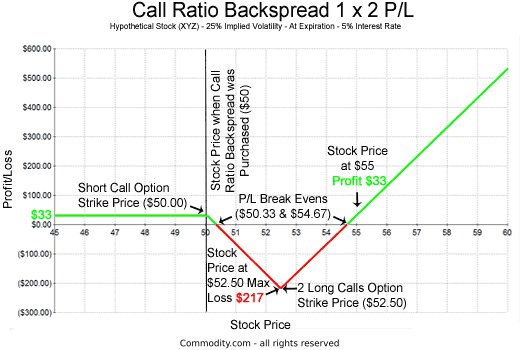

## Table of Contents

## What is a Call Ratio Backspread?

A Call Ratio Backspread is an options trading strategy that involves buying and selling call options in a specific ratio. In this strategy, a trader sells a smaller number of call options at a lower strike price and buys a larger number of call options at a higher strike price. The idea is to profit from a significant move in the underlying stock's price, usually to the upside, while limiting the risk if the stock price doesn't move as expected.

The strategy is designed to have unlimited profit potential if the stock price rises sharply, because the long calls at the higher strike price will increase in value more than the short calls at the lower strike price. However, if the stock price stays the same or falls, the trader might face a loss, but this loss is limited to the net cost of setting up the trade. This makes the Call Ratio Backspread a good choice for traders who are bullish on a stock but want to manage their risk if the stock doesn't perform as expected.

## How does a Call Ratio Backspread work?

A Call Ratio Backspread is a way to trade options that can make money if a stock goes up a lot. You do this by selling some call options with a lower price and buying more call options with a higher price. For example, you might sell one call option at a $50 strike price and buy two call options at a $60 strike price. If the stock price goes way up, the two call options you bought will become more valuable than the one you sold, and you could make a lot of money.

But if the stock price doesn't move much or goes down, you might lose money. The good thing is, your loss is limited to what you spent to set up the trade. This strategy is good if you think the stock might go up a lot, but you want to be safe if it doesn't. It's like betting on a big win while keeping your risk under control.

## What are the key components of a Call Ratio Backspread?

A Call Ratio Backspread involves two main parts: selling call options at a lower strike price and buying more call options at a higher strike price. For example, you might sell one call option at a $50 strike price and buy two call options at a $60 strike price. This setup is called a "ratio" because you're buying and selling in different amounts. The goal is to make money if the stock price goes up a lot.

The strategy can be profitable if the stock price rises significantly. If the stock price goes above the higher strike price, the two call options you bought will gain more value than the one you sold, leading to a profit. However, if the stock price stays the same or goes down, you might lose money. But the good news is, your loss is limited to the cost of setting up the trade. This makes the Call Ratio Backspread a good choice if you think the stock might go up a lot but want to keep your risk under control.

## What are the potential benefits of using a Call Ratio Backspread?

A Call Ratio Backspread can help you make money if you think a stock will go up a lot. By selling some call options at a lower price and buying more call options at a higher price, you set up a trade that can earn a big profit if the stock price rises sharply. For example, if you sell one call option at a $50 strike price and buy two call options at a $60 strike price, and the stock price goes above $60, the two options you bought will become much more valuable than the one you sold, leading to a profit.

Another benefit of a Call Ratio Backspread is that it limits your risk if the stock price doesn't move as expected. The most you can lose is the cost of setting up the trade. This makes it a safer choice compared to other strategies that might lose more money if the stock price stays the same or goes down. So, if you're hopeful about a big increase in the stock price but want to keep your risk under control, a Call Ratio Backspread can be a good option.

## What are the risks associated with a Call Ratio Backspread?

One risk of using a Call Ratio Backspread is that if the stock price doesn't move much or goes down, you might lose money. The most you can lose is the cost of setting up the trade, which includes the difference between what you paid for the call options you bought and what you received for the call options you sold. This loss can happen if the stock price stays between the lower and higher strike prices at the time the options expire.

Another risk is that if the stock price goes up but not enough to cover the cost of setting up the trade, you might still lose money. For example, if you sell one call option at a $50 strike price and buy two call options at a $60 strike price, and the stock price goes up to $55, the options you bought won't be worth enough to make up for the option you sold. So, you need a big enough move in the stock price to make a profit, which means there's a risk if the stock only goes up a little bit.

## When should an investor consider using a Call Ratio Backspread?

An investor should consider using a Call Ratio Backspread when they believe a stock will go up a lot but want to limit their risk if it doesn't. This strategy is good for people who are hopeful about a big increase in the stock price but want to be safe if the stock doesn't move as expected. By selling some call options at a lower price and buying more call options at a higher price, the investor sets up a trade that can earn a big profit if the stock price rises sharply.

However, this strategy is not for everyone. It's best for investors who are okay with the stock price staying the same or going down a little, because the most they can lose is the cost of setting up the trade. If the stock price goes up but not enough to cover the cost of setting up the trade, the investor might still lose money. So, it's important for the investor to be ready for a big move in the stock price to make a profit with a Call Ratio Backspread.

## How do you set up a Call Ratio Backspread?

To set up a Call Ratio Backspread, you need to sell a smaller number of call options at a lower strike price and buy a larger number of call options at a higher strike price. For example, you might sell one call option at a $50 strike price and buy two call options at a $60 strike price. The idea is to make money if the stock price goes up a lot. You can choose the number of options and the strike prices based on how much you think the stock will go up and how much risk you want to take.

When setting up the trade, you need to pay attention to the cost. The cost of the trade is the difference between what you pay for the call options you buy and what you get for the call options you sell. If the stock price goes above the higher strike price, the two call options you bought will become much more valuable than the one you sold, leading to a profit. But if the stock price doesn't move much or goes down, you might lose money. The good news is, the most you can lose is the cost of setting up the trade, which makes it a safer choice if you want to limit your risk.

## Can you explain the profit and loss potential of a Call Ratio Backspread with an example?

Let's say you want to set up a Call Ratio Backspread on a stock that's currently trading at $50. You decide to sell one call option with a strike price of $50 for $2 and buy two call options with a strike price of $60 for $1 each. The total cost of setting up the trade is $2 (the cost of the two call options you bought) minus $2 (the money you got from selling the call option), which equals $0. This means you set up the trade for free, but you'll need to put up margin for the short call.

If the stock price goes up to $70 by the time the options expire, the call option you sold at $50 will be worth $20 ($70 - $50), and you'll have to pay this amount. But the two call options you bought at $60 will each be worth $10 ($70 - $60), so they'll be worth $20 together. Since you sold one call for $20 but bought two calls for $20, your net profit is $0 from the options, but you also keep the $2 you got from selling the $50 call, so your total profit is $2. If the stock price goes even higher, your profit will keep growing because the two call options you bought will gain more value than the one you sold.

If the stock price stays at $50 or goes down, the call option you sold at $50 will expire worthless, and so will the two call options you bought at $60. You won't lose any money from the options themselves, but you also won't make any money. However, if the stock price goes up but stays between $50 and $60, you might lose money. For example, if the stock price goes to $55, the call option you sold at $50 will be worth $5, and you'll have to pay this amount. The two call options you bought at $60 will be worthless, so you'll lose $5 on the trade. The most you can lose is the cost of setting up the trade, which in this case is $0, but you'll need to cover the margin for the short call.

## What are the market conditions that favor a Call Ratio Backspread?

A Call Ratio Backspread works best when you think a stock is going to go up a lot. If the stock price stays the same or goes down a little, you won't lose much money because the most you can lose is what you paid to set up the trade. But if the stock price goes way up, you can make a lot of money because the call options you bought at the higher price will become much more valuable than the call option you sold at the lower price.

This strategy is good when you expect a big move in the stock price but want to keep your risk low. It's not the best choice if you think the stock will only go up a little bit, because then you might lose money. So, use a Call Ratio Backspread when you're hopeful for a big increase in the stock price and you're okay with the stock staying the same or going down a bit.

## How does the choice of strike prices and expiration dates affect a Call Ratio Backspread?

The choice of strike prices and expiration dates in a Call Ratio Backspread can really change how the trade works. If you pick strike prices that are too close together, the stock might not move enough to make you money. For example, if you sell a call at $50 and buy calls at $55, the stock needs to go above $55 to start making money. But if you pick strike prices that are far apart, like selling at $50 and buying at $60, the stock needs a bigger move to be profitable, but it can also make you more money if it goes up a lot. The closer the strike prices, the less the stock needs to move, but the less profit you might make.

The expiration date also matters a lot. If you pick a short expiration date, like one month, the stock needs to move quickly to make money. This can be riskier because if the stock doesn't move fast enough, you might lose money. But if you pick a longer expiration date, like six months, the stock has more time to move, which can be safer. Longer expiration dates might cost more to set up, but they give the stock more time to go up, which can be good if you think it will take a while for the big move to happen.

## What are the advanced strategies for adjusting a Call Ratio Backspread?

One way to adjust a Call Ratio Backspread is to roll the short call to a higher strike price if the stock price goes up a lot. This means you buy back the call you sold at the lower strike price and sell a new call at a higher strike price. This can help you make more money if the stock keeps going up, and it can also lower your risk if the stock price falls back down. For example, if you sold a call at $50 and bought calls at $60, and the stock goes to $65, you could buy back the $50 call and sell a new call at $60 or $65. This way, you keep the trade going and can make more money if the stock keeps going up.

Another way to adjust a Call Ratio Backspread is to add more long calls at a higher strike price if you think the stock will go up even more. This can increase your potential profit if the stock keeps rising, but it also increases your cost and risk. For example, if you already have two long calls at $60, you could buy one more call at $70. This gives you more upside potential if the stock goes above $70, but it also means you'll lose more money if the stock price doesn't move as expected. Adjusting a Call Ratio Backspread can help you manage the trade as the stock price changes, but it's important to think about how these changes affect your risk and potential profit.

## How can an investor manage and exit a Call Ratio Backspread position effectively?

Managing and exiting a Call Ratio Backspread effectively involves watching the stock price closely and being ready to make changes to your trade. If the stock price goes up a lot, you might want to roll the short call to a higher strike price. This means you buy back the call you sold at the lower strike price and sell a new call at a higher strike price. This can help you make more money if the stock keeps going up, and it can also lower your risk if the stock price falls back down. For example, if you sold a call at $50 and bought calls at $60, and the stock goes to $65, you could buy back the $50 call and sell a new call at $60 or $65. This way, you keep the trade going and can make more money if the stock keeps going up.

To [exit](/wiki/exit-strategy) the trade, you can close out all the options at once if you think the stock price has moved as much as it will. This means buying back the call you sold and selling the calls you bought. If the stock price goes up a lot and you're happy with your profit, you can close the trade to lock in your gains. If the stock price doesn't move much or goes down, and you don't want to lose more money, you can also close the trade to limit your losses. The key is to keep an eye on the stock price and be ready to make changes to your trade as the market moves.

## What is Understanding Call Ratio Backspread?

A call ratio backspread is a strategic options trading approach used by investors who hold an optimistic view on the future price movement of a specific stock. This bullish strategy is constructed by simultaneously selling a certain number of call options and purchasing a greater number of call options on the same underlying asset, but at a higher strike price and with the same expiration date.

The primary goal of executing a call ratio backspread is to capitalize on significant upward price movements of the underlying stock. When constructing this spread, the trader sells one call option while buying multiple call options. Common ratios include 2:1 or 3:1, meaning that for each call option sold, two or three call options are purchased, respectively. This creates a position with potential for unlimited profit, as the long calls will benefit from any substantial increase in the stock price.

The financial incentive of this strategy largely stems from the structure of the transaction. By selling a call option with a lower strike price, the trader receives a premium that partially finances the purchase of the additional call options. The premium collected helps offset the initial cost of the trade, thus creating a net credit or minimal net debit position.

In mathematical terms, the profit and risk dynamics of a call ratio backspread can be assessed using the following model:

$$
\text{Profit} = 
  \begin{cases} 
   n \times (S - K_2) - m \times (S - K_1) - \text{Net Premium} & \text{if } S > K_2 \\
   \text{Net Premium} & \text{if } K_1 < S \le K_2 
  \end{cases}
$$

Where:
- $S$ is the stock price at expiration.
- $K_1$ is the strike price of the sold call option.
- $K_2$ is the strike price of the purchased call options.
- $n$ is the number of call options bought.
- $m$ is the number of call options sold.
- Net Premium is the total premium received from selling minus the premium paid for buying.

One of the significant advantages of the call ratio backspread is its risk-limited nature. If the stock does not experience a significant price increase, the maximum loss is limited to the net debit paid at the trade's inception or nothing if structured as a net credit. This cap on losses makes the strategy appealing to risk-averse investors who still want exposure to potential upside gains. Therefore, a call ratio backspread serves as an efficient instrument to profit from anticipated stock rallies while providing a safety net against unforeseen declines.

## How does it work?

The call ratio backspread strategy is executed through an options trading technique that involves selling a specific number of call options and using the proceeds to purchase a greater number of call options with a higher strike price, with all options having the same expiration date. Typically, the ratio could be 2:1, where one call option is sold to finance the purchase of two call options. This approach is designed to capitalize on significant upward movements in the underlying stock's price.

To understand its mechanism, let's take a systematic look at the trade construction. Suppose you have a stock currently trading at $X. You initiate the strategy by selling one call option with a strike price of $A and simultaneously buying two call options with a higher strike price of $B. The net premium received or paid at the inception of the strategy depends on the relative pricing of these options.

The rationale behind this strategy is straightforward: if the stock price rises substantially above the higher strike price $B, the long call options (those purchased) increase in intrinsic value significantly, leading to potential unlimited profit. The initial net premium position can be either a credit or a debit, depending on the option premiums, thus influencing the breakeven points.

Critical to the effectiveness of the call ratio backspread is selecting the appropriate strike prices and expiration dates. The choice of strike prices defines the potential profit zones and breakeven points, while the expiration date affects time decay and [volatility](/wiki/volatility-trading-strategies) considerations. For instance, the breakeven point on the upside can be calculated as:

$$
\text{Breakeven} = B + \frac{\text{Net Premium Paid (or Received)}}{\text{Number of Long Calls}}
$$

where $B$ is the strike price of the long calls. If a net credit is received, the strategy is immediately profitable to the downside until the premium matches potential intrinsic losses from the starting stock price down to the long call level.

Appropriate [backtesting](/wiki/backtesting) and scenario analysis are advisable to tailor the strategy to specific market conditions and trader expectations, ensuring an optimal balance between risk and reward.

## References & Further Reading

[1]: Bergstra, J., Bardenet, R., Bengio, Y., & Kégl, B. (2011). ["Algorithms for Hyper-Parameter Optimization."](https://dl.acm.org/doi/10.5555/2986459.2986743) Advances in Neural Information Processing Systems 24.

[2]: ["Advances in Financial Machine Learning"](https://www.amazon.com/Advances-Financial-Machine-Learning-Marcos/dp/1119482089) by Marcos Lopez de Prado

[3]: ["Evidence-Based Technical Analysis: Applying the Scientific Method and Statistical Inference to Trading Signals"](https://www.amazon.com/Evidence-Based-Technical-Analysis-Scientific-Statistical/dp/0470008741) by David Aronson

[4]: ["Machine Learning for Algorithmic Trading"](https://github.com/stefan-jansen/machine-learning-for-trading) by Stefan Jansen

[5]: ["Quantitative Trading: How to Build Your Own Algorithmic Trading Business"](https://www.amazon.com/Quantitative-Trading-Build-Algorithmic-Business/dp/1119800064) by Ernest P. Chan