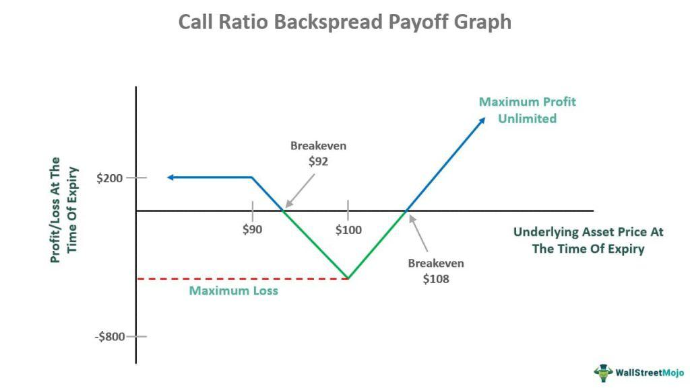

Options trading is an essential tool for investors aiming to diversify their investment portfolios and achieve substantial growth. The intricacies of options allow for a variety of strategies to be employed, catering to different market outlooks and risk preferences. One such strategy is the 'call ratio backspread,' which is devised for investors with a bullish sentiment, expecting a significant upward movement in the price of an underlying asset.

Within options trading, a fundamental understanding of the dynamics between call and put options, strike prices, and expiration dates is crucial. The call ratio backspread specifically leverages these elements to provide a mechanism that offers unlimited profit potential when correctly executed under bullish market conditions while capping downside risks if the anticipated price movement does not materialize.



A growing aspect of modern options trading is the incorporation of algorithmic techniques. Algorithmic trading, which uses computer programs to automate the execution of trading strategies, has the potential to enhance the call ratio backspread strategy significantly. By automating trades and pinpointing optimal entry and exit points, these algorithms can handle vast market data in real-time, enabling traders to react swiftly to market changes. This reduces susceptibility to emotional trading pitfalls and increases both efficiency and accuracy.

As the financial markets evolve, adopting strategies like the call ratio backspread, optimized through algorithmic trading, can offer astute investors robust tools for navigating complex market dynamics. Such strategies not only contribute to portfolio diversification but can also amplify potential returns while reducing associated risks.

## Table of Contents

## Understanding Call Ratio Backspread

A call ratio backspread is a strategic options trading approach used by investors who hold an optimistic view on the future price movement of a specific stock. This bullish strategy is constructed by simultaneously selling a certain number of call options and purchasing a greater number of call options on the same underlying asset, but at a higher strike price and with the same expiration date.

The primary goal of executing a call ratio backspread is to capitalize on significant upward price movements of the underlying stock. When constructing this spread, the trader sells one call option while buying multiple call options. Common ratios include 2:1 or 3:1, meaning that for each call option sold, two or three call options are purchased, respectively. This creates a position with potential for unlimited profit, as the long calls will benefit from any substantial increase in the stock price.

The financial incentive of this strategy largely stems from the structure of the transaction. By selling a call option with a lower strike price, the trader receives a premium that partially finances the purchase of the additional call options. The premium collected helps offset the initial cost of the trade, thus creating a net credit or minimal net debit position.

In mathematical terms, the profit and risk dynamics of a call ratio backspread can be assessed using the following model:

$$
\text{Profit} = 
  \begin{cases} 
   n \times (S - K_2) - m \times (S - K_1) - \text{Net Premium} & \text{if } S > K_2 \\
   \text{Net Premium} & \text{if } K_1 < S \le K_2 
  \end{cases}
$$

Where:
- $S$ is the stock price at expiration.
- $K_1$ is the strike price of the sold call option.
- $K_2$ is the strike price of the purchased call options.
- $n$ is the number of call options bought.
- $m$ is the number of call options sold.
- Net Premium is the total premium received from selling minus the premium paid for buying.

One of the significant advantages of the call ratio backspread is its risk-limited nature. If the stock does not experience a significant price increase, the maximum loss is limited to the net debit paid at the trade's inception or nothing if structured as a net credit. This cap on losses makes the strategy appealing to risk-averse investors who still want exposure to potential upside gains. Therefore, a call ratio backspread serves as an efficient instrument to profit from anticipated stock rallies while providing a safety net against unforeseen declines.

## How It Works

The call ratio backspread strategy is executed through an options trading technique that involves selling a specific number of call options and using the proceeds to purchase a greater number of call options with a higher strike price, with all options having the same expiration date. Typically, the ratio could be 2:1, where one call option is sold to finance the purchase of two call options. This approach is designed to capitalize on significant upward movements in the underlying stock's price.

To understand its mechanism, let's take a systematic look at the trade construction. Suppose you have a stock currently trading at $X. You initiate the strategy by selling one call option with a strike price of $A and simultaneously buying two call options with a higher strike price of $B. The net premium received or paid at the inception of the strategy depends on the relative pricing of these options.

The rationale behind this strategy is straightforward: if the stock price rises substantially above the higher strike price $B, the long call options (those purchased) increase in intrinsic value significantly, leading to potential unlimited profit. The initial net premium position can be either a credit or a debit, depending on the option premiums, thus influencing the breakeven points.

Critical to the effectiveness of the call ratio backspread is selecting the appropriate strike prices and expiration dates. The choice of strike prices defines the potential profit zones and breakeven points, while the expiration date affects time decay and [volatility](/wiki/volatility-trading-strategies) considerations. For instance, the breakeven point on the upside can be calculated as:

$$
\text{Breakeven} = B + \frac{\text{Net Premium Paid (or Received)}}{\text{Number of Long Calls}}
$$

where $B$ is the strike price of the long calls. If a net credit is received, the strategy is immediately profitable to the downside until the premium matches potential intrinsic losses from the starting stock price down to the long call level.

Appropriate [backtesting](/wiki/backtesting) and scenario analysis are advisable to tailor the strategy to specific market conditions and trader expectations, ensuring an optimal balance between risk and reward.

## Benefits of Using an Algorithmic Approach

Algorithmic trading offers significant advantages when implementing the call ratio backspread strategy by automating the execution of trades and optimizing entry and [exit](/wiki/exit-strategy) points. By leveraging algorithms, traders gain the ability to analyze market data continuously and in real-time, allowing them to make informed decisions based on dynamic market conditions. This capability is particularly valuable in options trading, where timing and precision are critical to maximizing returns.

Through [algorithmic trading](/wiki/algorithmic-trading), the process of identifying optimal trading opportunities becomes more efficient, as algorithms can process and interpret large volumes of data to detect patterns and trends that may not be immediately apparent to human traders. For instance, [machine learning](/wiki/machine-learning) models can be employed to predict stock price movements based on historical data and other factors such as market volatility and economic indicators.

The precision offered by algorithmic trading reduces the likelihood of emotional decision-making, a common pitfall for traders. Emotional trading errors, such as panic selling or holding onto a position for too long due to speculative optimism, can be mitigated as algorithms execute trades based on pre-defined criteria and logical conditions. This leads to a more disciplined trading approach that enhances the overall efficiency and effectiveness of the strategy.

In practice, a trader might implement a Python algorithm to automate the call ratio backspread strategy. Here is a simple example of a Python script that uses historical data to calculate potential entry points for the strategy:

```python
import numpy as np
import pandas as pd
import yfinance as yf

# Fetch historical data for a given stock
data = yf.download('AAPL', start='2022-01-01', end='2022-12-31')['Close']

# Calculate moving averages
short_window = 20
long_window = 50
data['short_mavg'] = data.rolling(window=short_window, min_periods=1).mean()
data['long_mavg'] = data.rolling(window=long_window, min_periods=1).mean()

# Define the algorithm criterion
data['signal'] = np.where(data['short_mavg'] > data['long_mavg'], 1.0, 0.0)

# Generate trading signals
data['positions'] = data['signal'].diff()

# Print potential entry points for call ratio backspread
entry_points = data.loc[data['positions'] == 1.0]
print("Entry Points:\n", entry_points)
```

This script calculates short-term and long-term moving averages to generate trading signals. When the short-term average crosses above the long-term average, it indicates a potential entry point for a bullish strategy such as the call ratio backspread. By automating the detection of such signals, the strategy can be executed with greater efficiency and reduced risk of errors.

In summary, an algorithmic approach to the call ratio backspread strategy empowers traders to maintain a systematic, data-driven methodology. This precision in strategy execution ultimately leads to more consistent and potentially higher returns, while mitigating the risks associated with emotion-driven trading.

## Example of a Call Ratio Backspread

Consider a stock currently trading at $20; a call ratio backspread can be executed by selling one call option with a $16 strike price and simultaneously buying two call options at a $20 strike price. This strategy generates a net credit because the premium received from selling the lower strike call option generally exceeds the cost of buying the two higher strike call options. The potential profits are significant if the stock price rises above the purchased calls' strike price.

In this scenario, suppose the call option sold at a $16 strike price garners a premium of $6, while each call bought at a $20 strike price costs $2. The net premium (net credit) can be calculated as follows:
$$
\text{Net Premium} = P_{\text{sold}} - 2 \times P_{\text{bought}} = \$6 - 2 \times \$2 = \$2
$$

Here, $P_{\text{sold}}$ denotes the premium from the sold call option, and $P_{\text{bought}}$ represents the premium for each purchased call option.

Let's evaluate the potential outcomes at expiration under various stock price scenarios:

1. **Stock Price ≤ $16:** All options expire worthless. The trader retains the net premium of $2 as profit. 

2. **$16 < \text{Stock Price} ≤ $20:** The sold call is exercised since it is in-the-money, while the bought calls expire worthless. Though the trader might face a loss on the exercise, the initial net credit helps offset it. The net outcome would primarily depend on how much above $16 the stock price is.

3. **Stock Price > $20:** Both the sold call and the purchased calls are in-the-money. The loss from the sold call's obligation is outweighed by the larger gain from the two purchased calls. The profit grows as the stock price increases beyond $20, thus allowing for potentially unlimited gains.

To better illustrate, if the stock price reaches $25 at expiration:
- The sold $16 call incurs a loss equal to the intrinsic value of the exercised option: 
  \[ \text{Loss} = (\$25 - \$16) \times 1 = \$9
$$

- Each purchased $20 call results in a gain from being exercised:
  \[ \text{Gain per Call} = (\$25 - \$20) \times 2 = \$5
$$
  \[ \text{Total Gain} = \$5 \times 2 = \$10
$$

- Net Profit = Total Gain - Loss + Net Premium = $\$10 - \$9 + \$2 = \$3$

This example demonstrates how selecting appropriate strike prices and understanding price dynamics are crucial for optimizing the call ratio backspread strategy, especially when expecting a notable upward movement in stock price.

## Comparison with Put Ratio Backspread

A put ratio backspread is a bearish options strategy, where investors seek to gain from a decline in the price of an underlying asset. This strategy is analogous to the call ratio backspread but utilizes put options instead of calls. By implementing this strategy, traders sell a smaller number of put options at a lower strike price and use the premium received to fund the purchase of a larger number of put options at a higher strike price, typically maintaining a ratio such as 2:1 or 3:1 in favor of the long puts. This establishes a position where potential gains are substantial if the stock price falls significantly, while losses are capped if the price remains stable or increases.

The fundamental distinction between the call and put ratio backspread strategies is the market outlook they cater to. The call ratio backspread is optimized for bullish speculation, when an investor expects a considerable increase in the underlying asset's price. Conversely, the put ratio backspread is formed with a bearish perspective, anticipating substantial price declines.

Understanding these distinctions is crucial for traders when selecting the appropriate strategy aligned with their specific market forecasts and risk tolerance. For example, if a trader believes a certain stock is poised for a dramatic drop, a put ratio backspread would be more suitable than its call counterpart. Conversely, a predicted substantial upward movement would favor the call ratio backspread.

To illustrate this with a simple scenario in Python, consider the following code that simulates the outcomes of both strategies:

```python
def potential_outcomes(price_change, call_gain, put_gain):
    call_outcome = max(0, price_change - call_gain)
    put_outcome = max(0, put_gain - price_change)
    return call_outcome, put_outcome

# Hypothetical values
price_change = 8  # Expected price increase
call_gain = 5     # Point above which call spreads profit
put_gain = 3      # Point below which put spreads profit

call_profit, put_profit = potential_outcomes(price_change, call_gain, put_gain)

print(f"Call Ratio Backspread Profit: {call_profit}")
print(f"Put Ratio Backspread Profit: {put_profit}")
```

This snippet calculates profits depending on the price change in the underlying asset. A notable upward shift rewards the call strategy, while a significant fall benefits the put strategy. By using these options structures wisely, traders can align their tactics with anticipated market movements, ensuring they select the most advantageous hedging or speculative mechanism given their outlook and risk preferences.

## References & Further Reading

[1]: Bergstra, J., Bardenet, R., Bengio, Y., & Kégl, B. (2011). ["Algorithms for Hyper-Parameter Optimization."](https://dl.acm.org/doi/10.5555/2986459.2986743) Advances in Neural Information Processing Systems 24.

[2]: ["Advances in Financial Machine Learning"](https://www.amazon.com/Advances-Financial-Machine-Learning-Marcos/dp/1119482089) by Marcos Lopez de Prado

[3]: ["Evidence-Based Technical Analysis: Applying the Scientific Method and Statistical Inference to Trading Signals"](https://www.amazon.com/Evidence-Based-Technical-Analysis-Scientific-Statistical/dp/0470008741) by David Aronson

[4]: ["Machine Learning for Algorithmic Trading"](https://github.com/stefan-jansen/machine-learning-for-trading) by Stefan Jansen

[5]: ["Quantitative Trading: How to Build Your Own Algorithmic Trading Business"](https://www.amazon.com/Quantitative-Trading-Build-Algorithmic-Business/dp/1119800064) by Ernest P. Chan