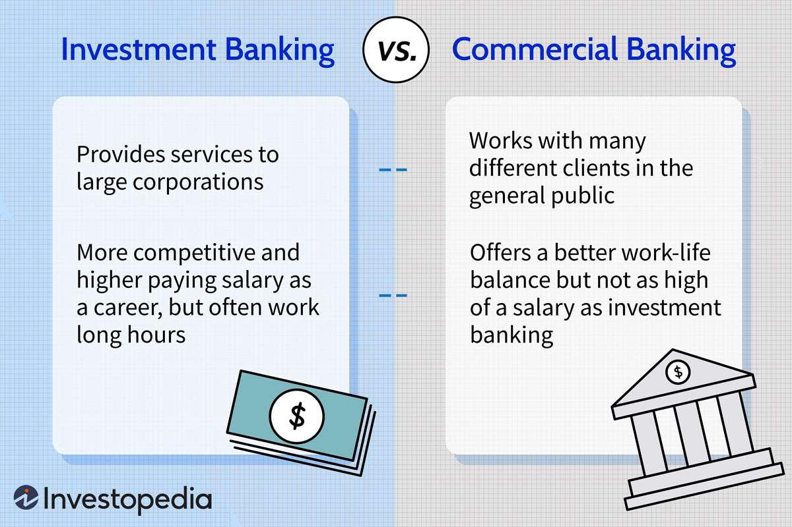

The finance industry is rapidly transforming, where the synergy of traditional banking methods and state-of-the-art technologies is becoming increasingly prominent. At the heart of this evolution is the integration of banking call reports with algorithmic trading practices. This confluence not only streamlines financial operations but also enhances the decision-making capabilities of professionals within the sector.

Banking call reports are detailed financial statements filed by banking institutions, providing a snapshot of their financial health. These reports encompass critical data, including assets, liabilities, income, and other financial benchmarks. Such comprehensive reporting serves as the backbone of regulatory compliance and offers stakeholders crucial insights about a bank's operational status and financial performance.



On the other hand, algorithmic trading is a modern approach that employs sophisticated computer algorithms to execute trades at high speed and with optimal efficiency. These algorithms are designed to analyze vast datasets, identify trading signals, and execute orders within milliseconds, capitalizing on fleeting market opportunities.

The convergence of financial reporting and algorithmic trading represents a significant advancement. By integrating the robust and detailed data from banking call reports into algorithmic trading models, financial professionals can enhance the precision and effectiveness of their trading strategies. This integration allows for more informed trade decisions, better risk management, and ultimately, improved returns on investment.

Understanding these components and their integration is vital for financial professionals who aspire to harness data-driven insights for strategic gains. By leveraging this sophisticated blend of traditional reporting and cutting-edge trading technologies, they can navigate the dynamic landscape of the financial industry with greater acumen. As we explore the various facets of these financial mechanisms, it becomes apparent that the fusion of traditional and modern financial practices is paving the way for a more integrated and efficient financial ecosystem.

## Table of Contents

## Understanding Banking Call Reports

Banking call reports are vital standardized documents that banks are required to file, providing a comprehensive overview of their financial health. These reports are instrumental for regulatory compliance and serve as a crucial resource for various stakeholders. By examining call reports, stakeholders can gain insights into a bank's assets, liabilities, and income, thus understanding its financial position and performance.

The structure of banking call reports is carefully designed to present financial data in a systematic way. Generally, these reports include the balance sheet, which details assets and liabilities, and the income statement, which outlines revenue and expenses. Another critical component is the statement of cash flows, which provides information about cash inflows and outflows, illustrating how cash is generated and used in operations, investing, and financing activities.

Types of banking call reports can vary, but typically, they include quarterly and annual submissions. The quarterly reports are more frequent and provide ongoing updates about a bank’s financial status, allowing for timely identification of trends or issues. Annual reports, on the other hand, offer a broader overview and are often more detailed, providing a thorough analysis of a bank's yearly financial activities.

The importance of call reports extends beyond compliance. They play a critical role in maintaining transparency within the banking sector, thereby fostering trust and accountability. For stakeholders such as investors, analysts, and regulators, these reports serve as a primary source of reliable financial information. Accurate and transparent reporting is fundamental for assessing the risk profile of banks, understanding their financial strategies, and making informed decisions regarding investments and regulatory measures.

Overall, the structured and detailed nature of call reports makes them indispensable within the finance industry. They not only ensure regulatory adherence but also enhance the decision-making process by offering clear visibility into the financial status of banks. This comprehensive approach to financial reporting helps maintain the integrity and stability of financial institutions, benefiting the broader economic landscape.

## The Importance of Financial Reporting in Banking

Financial reporting stands as a fundamental pillar within the banking sector, providing critical insights that facilitate informed decision-making among stakeholders. Accurate financial reports help evaluate a bank’s overall performance, financial health, and strategic direction, thereby influencing investment decisions and maintaining public trust.

The precision of financial reporting plays a pivotal role in securing accountability within the financial systems. Stakeholders, including investors, depositors, and regulatory bodies, rely on transparent reporting to assess a bank's solvency, [liquidity](/wiki/liquidity-risk-premium), and risk management practices. Financial statements, comprised of balance sheets, income statements, and cash flow statements, allow for a comprehensive understanding of a bank's operations. For instance, the balance sheet provides insights into a bank's assets, liabilities, and equity structure, aiding in the evaluation of its financial stability.

In the context of [algorithmic trading](/wiki/algorithmic-trading), the importance of accurate financial data becomes even more pronounced. Automated trading systems, which execute trades based on pre-programmed criteria, require high-quality data to develop effective trading strategies. For these algorithms to function optimally, they must process real-time data reflecting up-to-date financial conditions. Financial reports serve as valuable data sources, offering the necessary insights to craft strategies that can respond effectively to market movements.

Financial integrity, or the accuracy and completeness of financial data, underpins the functionality and reliability of automated and high-frequency trading systems. These systems thrive on the ability to rapidly process vast volumes of data to detect patterns and make quick, informed trading decisions. Integrity in financial reporting therefore ensures that the data used to train these algorithms is dependable, minimizing the risk of erroneous decisions that could lead to significant financial losses.

However, financial reporting is not without challenges. Ensuring the timeliness and accuracy of reports can be a significant hurdle for banks, given the complexity of data and regulatory requirements. Errors or delays in reporting can obscure the true financial position of a bank, leading to misguided strategies and loss of stakeholder confidence. Moreover, discrepancies or inconsistencies in financial data can severely impact the performance of algorithmic trading models, which depend on precise inputs for decision-making.

Navigating these challenges necessitates robust technological solutions and adherence to rigorous standards. Banks must employ advanced data analytics tools to verify data integrity and overcome the limitations of traditional reporting systems. Additionally, ongoing regulatory scrutiny and evolving compliance requirements can complicate the reporting process, requiring banks to continuously adapt to new rules while maintaining transparency and accountability.

In conclusion, financial reporting is a critical component in the efficient functioning of the banking and trading sectors. Its role extends beyond mere compliance, influencing strategic decision-making and the performance of sophisticated trading systems. As the complexity and scale of financial markets evolve, the demand for accurate and timely financial reporting will continue to grow, reinforcing its importance in an increasingly data-driven financial landscape.

 to Algorithmic Trading

Algorithmic trading, commonly referred to as algo trading, is a method of executing orders using automated and pre-programmed trading instructions. This approach capitalizes on the power of computers to process vast datasets much faster than any human could achieve. The algorithms make use of certain variables like timing, price, quantity, and sometimes even complex mathematical models to determine trading decisions. This technology facilitates high-speed and efficient trading processes, which are now prevalent in contemporary financial markets.

At its core, algo trading is about efficiency. The immediate execution of trades within milliseconds can significantly impact the profitability of investment strategies, especially in volatile markets. For instance, an algorithm might be programmed to buy stocks if they rise above their 50-day moving average—a common technique known as a mean-reversion strategy. Such systems require incredible speed and accuracy, aspects where algo trading excels. 

The main advantage of algo trading lies in its ability to remove human emotional factors, which can lead to biased trading decisions. Furthermore, algorithms operate around the clock, continuously scanning market conditions and executing trades at optimal prices. This constant vigilance allows traders to exploit tiny fluctuations in asset prices that would be too brief for a human to capitalize on.

Despite its benefits, there are inherent risks associated with algorithmic trading. High-frequency trading, a subset of algorithmic trading, has been criticized for increasing market [volatility](/wiki/volatility-trading-strategies) and triggering events such as the "flash crash" of May 6, 2010. Rapid buying and selling, devoid of human oversight, can sometimes yield unintended consequences if algorithms misinterpret market signals. To mitigate such risks, robust risk management protocols must be established, including thorough back-testing of algorithms and constant monitoring of their performance in live markets.

The integration of credible financial data significantly enhances algorithmic trading strategies. Reliable data sources provide the foundation upon which these complex models are built and validated. Access to accurate and timely information allows algorithms to detect patterns or trends that might influence asset prices. For example, incorporating economic indicators or corporate earnings reports can fine-tune trading models and potentially yield better returns. 

In summary, the evolution of algorithmic trading, powered by technological advancements, has transformed the landscape of modern finance. As data management continues to advance, particularly with the help of [artificial intelligence](/wiki/ai-artificial-intelligence) and [machine learning](/wiki/machine-learning), the potential for even more sophisticated and effective trading strategies will grow, propelling this field into new frontiers.

## Integration of Banking Call Reports in Algo Trading

Banking call reports serve as a vital data source for algorithmic trading models, providing crucial insights into a bank's financial health. These reports, which detail a bank's assets, liabilities, and income, are indispensable for developing data-driven trading strategies. Utilizing accurate financial data from call reports allows traders to influence trade decisions and optimize strategies, potentially yielding better returns.

### Incorporating Call Report Data into Trading Algorithms

Algorithmic trading utilizes predefined criteria and models to analyze vast datasets and execute trades with precision. The integration of banking call reports into these models involves several methodologies:

1. **Data Extraction and Transformation:** Algorithms extract relevant data from call reports, typically involving parsing and transforming this information into a structured format suitable for analysis. Utilizing software tools like Python's Pandas library can facilitate this step. For example:

    ```python
    import pandas as pd

    # Load the call report data
    data = pd.read_csv('call_report.csv')

    # Extract relevant columns for analysis
    relevant_data = data[['Assets', 'Liabilities', 'Net Income']]
    ```

2. **Trend Analysis and Forecasting:** After data transformation, algorithms perform statistical analyses to identify trends and patterns. Methods such as time-series analysis and machine learning models like ARIMA or LSTM can forecast future financial conditions, aiding strategy refinement.

3. **Risk Assessment and Strategy Optimization:** Financial metrics extracted from call reports are critical for assessing risk and optimizing strategies. Ratios like the return on assets (ROA) can be calculated and used in risk models:
$$
    \text{ROA} = \frac{\text{Net Income}}{\text{Total Assets}}

$$

    This ratio helps in gauging the profitability relative to total assets, allowing algorithms to adjust trading strategies accordingly.

### Real-World Examples

Traders benefit from using call reports to gain a competitive edge. For instance:

- **Hedge Funds:** Use data-driven insights to manage risk portfolios more effectively, ensuring alignment with financial regulations.

- **Institutional Investors:** Analyze call report data to predict stock price movements, aiding in decision-making for long-term investments.

### Balancing Regulatory Compliance and Technological Advancements

While banks must ensure compliance with regulatory standards in their call reports, algorithmic traders face the challenge of aligning these datasets with technological advancements. This involves:

- Ensuring data accuracy and reliability by validating call report information against regulatory filings.
- Leveraging advanced technologies, such as AI and machine learning, to enhance data processing capabilities and improve trading algorithms.

In conclusion, the integration of banking call reports with algorithmic trading not only contributes to more effective and informed trading decisions but also ensures a careful balance between adhering to regulatory compliance and adopting technological innovations.

## Challenges and Solutions

Integrating banking call reports with algorithmic trading involves navigating several challenges, notably data accuracy and timeliness. Banking call reports contain a wealth of complex financial data that must be accurately captured, standardized, and translated into actionable insights for trading algorithms. This process can be hampered by discrepancies in data entry or reporting errors, which could mislead trading strategies and lead to financial losses.

The timeliness of data is another critical [factor](/wiki/factor-investing). In markets where decisions are executed within milliseconds, any delay in incorporating the latest financial data can hinder the effectiveness of trading strategies. High-frequency trading ([HFT](/wiki/high-frequency-trading-strategies)) systems require real-time data updates, thus relying on the timely collection and processing of vast datasets from banking call reports.

Managing these vast amounts of data poses significant hurdles. Not only must systems be capable of handling large volumes efficiently, but they must also ensure data integrity. The process often requires advanced data management solutions that can efficiently filter, process, and analyze this information without compromising accuracy or speed. For instance, employing distributed computing frameworks such as Apache Hadoop or Apache Spark can enhance data processing capabilities, ensuring scalability and reliability.

Moreover, ethical considerations and market volatility present additional challenges. The use of algorithmic trading strategies based on sensitive financial data can inadvertently contribute to market instability. Rapid trades executed in response to automated signals may exacerbate volatility, prompting discussions on the ethical implications of such practices. Ensuring algorithmic transparency and implementing stricter controls can mitigate these risks, enhancing accountability.

Technological advancements, including artificial intelligence (AI) and machine learning, are playing a pivotal role in overcoming these challenges. AI models can identify patterns and anomalies in financial data with greater accuracy than traditional methods, providing more reliable inputs for trading algorithms. Machine learning can also predict market movements by analyzing historical data and market trends, although it requires comprehensive datasets to validate such predictions.

Python has emerged as a preferred language for implementing these solutions due to its versatility and the robust ecosystem of data analysis libraries. Here's a simple Python example leveraging pandas for basic data processing:

```python
import pandas as pd

# Load banking call report data
data = pd.read_csv('call_report.csv')

# Basic data cleaning
data.dropna(inplace=True)
data = data[data['Asset'] > 0]  # Filter out zero or negative assets

# Analyze key financial ratios
data['Capital_Adequacy_Ratio'] = data['Capital'] / data['Risk_Adjusted_Assets']

# Moving average to smoothen asset data for anomaly detection
data['Smoothed_Assets'] = data['Asset'].rolling(window=3).mean()

# Display processed data
print(data[['Bank_Name', 'Capital_Adequacy_Ratio', 'Smoothed_Assets']].head())
```

This script exemplifies how initial data cleansing and analysis can be performed on banking call report data to generate insights for algorithmic trading purposes.

Understanding these challenges is crucial to maximizing the potential of financial data in algorithmic trades. Continuous innovation and ethical consideration will remain imperative as the industry progresses, ensuring that technology serves not just efficiency, but also financial market stability.

## Future Trends in Financial Reporting and Algo Trading

As technology advances, the integration of financial reporting and algorithmic trading is witnessing significant transformative trends. Central to this evolution are innovations in artificial intelligence (AI) and machine learning, which are dramatically reshaping data analytics within financial markets. 

AI and machine learning hold the potential to enhance predictive capabilities in trading models by analyzing vast datasets more accurately and swiftly. These technologies can dissect complex financial statements and banking call reports to extract insights that may not be immediately evident. For instance, machine learning algorithms can predict market trends by identifying patterns in historical financial data, enabling traders to make more informed decisions.

The integration of AI-driven analytics with traditional banking call reports paves the way for highly adaptive trading strategies. Financial institutions are increasingly investing in AI technologies to process and analyze call reports in near real-time, creating a more responsive trading environment. This is particularly relevant for high-frequency trading platforms, where timely data analysis is crucial for maintaining a competitive edge.

Moreover, advancements in AI facilitate the development of more cohesive and intelligent trading ecosystems. By leveraging enhanced data processing capabilities, financial institutions can create integrated platforms that combine different financial reports and market datasets. This results in a more unified trading framework that supports the efficient exchange of information across multiple channels.

To provide a glimpse into how these technologies might be utilized, consider the following Python snippet, which uses a basic linear regression model to predict stock prices from parsed financial data:

```python
import numpy as np
from sklearn.linear_model import LinearRegression

# Hypothetical data representing previous financial quarters' performance.
quarters = np.array([[1], [2], [3], [4]])
stock_prices = np.array([150, 165, 180, 200])

# Create and train the model.
model = LinearRegression().fit(quarters, stock_prices)

# Predict the stock price for the upcoming quarter.
predicted_price = model.predict(np.array([[5]]))

print(f"Predicted stock price for next quarter: {predicted_price[0]}")
```

As AI and machine learning technologies evolve, the future of financial reporting and trading ecosystems promises to be more interconnected, efficient, and intelligent than ever. Future trends point towards predictive analytics that not only process existing data but also anticipate market shifts, enabling traders to strategize and execute decisions proactively. These advancements offer significant opportunities for financial professionals to enhance their strategies and maintain a competitive edge in a rapidly changing market.

## Conclusion

The intricate relationship between banking call reports and algorithmic trading signifies a profound transformation within the financial sector. By offering a reliable source of financial information, banking call reports significantly bolster the efficiency and effectiveness of algorithmic trading strategies. Accurate and timely financial reporting serves as a cornerstone for developing robust trading algorithms that are capable of making informed decisions rapidly in the highly competitive trading environment.

Despite the evident advantages, challenges such as data accuracy, timeliness, and integration complexities persist. However, technological innovations continue to mitigate these challenges and facilitate substantial improvements. The advent of advanced data analytics, artificial intelligence (AI), and machine learning further enhances the ability of financial professionals to harness the potential of banking call reports in algorithmic trading. These technologies offer sophisticated tools for parsing and interpreting vast amounts of financial data, leading to more informed trading decisions and optimized strategies.

For financial professionals, a thorough comprehension of the intricacies involved in the intersection of banking call reports and algorithmic trading unveils opportunities for strategic advancement. The ability to integrate substantive financial data with automated trading systems not only increases competitiveness but also aids in adhering to regulatory compliance requirements.

Looking ahead, the continuous evolution of financial reporting and algorithmic trading holds a promising outlook. As technology rapidly advances, the convergence of these domains is expected to yield more unified, efficient, and intelligent trading systems. This progression indicates a future where financial strategies are driven by increasingly sophisticated data analytics, paving the way for innovative solutions and strategic growth in the financial industry.

## References & Further Reading

[1]: Bergstra, J., Bardenet, R., Bengio, Y., & Kégl, B. (2011). ["Algorithms for Hyper-Parameter Optimization."](https://proceedings.neurips.cc/paper/2011/file/86e8f7ab32cfd12577bc2619bc635690-Paper.pdf) Advances in Neural Information Processing Systems 24.

[2]: ["Advances in Financial Machine Learning"](https://www.amazon.com/Advances-Financial-Machine-Learning-Marcos/dp/1119482089) by Marcos Lopez de Prado

[3]: ["Evidence-Based Technical Analysis: Applying the Scientific Method and Statistical Inference to Trading Signals"](https://www.amazon.com/Evidence-Based-Technical-Analysis-Scientific-Statistical/dp/0470008741) by David Aronson

[4]: ["Machine Learning for Algorithmic Trading"](https://github.com/PacktPublishing/Machine-Learning-for-Algorithmic-Trading-Second-Edition) by Stefan Jansen

[5]: ["Quantitative Trading: How to Build Your Own Algorithmic Trading Business"](https://books.google.com/books/about/Quantitative_Trading.html?id=j70yEAAAQBAJ) by Ernest P. Chan