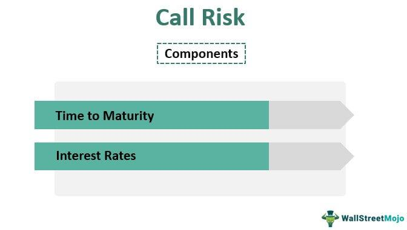

In the complex world of finance, bond investments provide a reliable income stream by offering periodic interest payments to investors. However, these investments carry various risks, with call risk being a significant concern. Call risk emerges when a bond issuer decides to redeem a bond before its scheduled maturity date. This preemptive redemption often occurs in environments where interest rates are declining, enabling issuers to refinance debt at more favorable rates. For investors, this action can disrupt income forecasts and planned financial strategies, as the holder is forced to seek alternative investment opportunities, potentially at lower yields.

This article aims to clarify the nuances of call risk within bond investments and examine how algorithmic trading can act as a tool to mitigate some of these associated risks. By comprehending the dynamics of call risk and leveraging advanced algorithmic trading strategies, investors can enhance the management and optimization of their bond portfolios. We will cover the essence of call risk, its repercussions on bond investments, and the invaluable role of algorithmic trading in risk management. Such understanding not only aids in protecting the anticipated returns but also supports investors in aligning their investment choices with their financial objectives and risk tolerance.

## Table of Contents

## Understanding Call Risk in Bonds

Call risk is inherent to bonds that are subject to redemption by the issuer before reaching their maturity date. This risk typically arises in environments where interest rates are declining, prompting issuers to opt for early redemption to take advantage of the opportunity to refinance at a lower cost. 

Callable bonds are designed with embedded options similar to financial call options. These options permit the issuer to buy back the bond prior to its scheduled maturity. By exercising this option, issuers often aim to refinance the outstanding debt at a reduced interest rate, thereby saving on interest expenses. While this is beneficial for issuers, it presents a significant risk to investors who may have planned to rely on the expected cash flows over the full term of the bond. Such investors face the potential disadvantage of having to reinvest their principal in an environment where yields are lower, thereby jeopardizing their anticipated returns.

The call protection period is a specified duration during which the bond cannot be called by the issuer. This period provides investors with a temporary safeguard against call risk, ensuring them some level of income stability. It is important for investors to understand the provisions of call protection and to be aware of the first call date, as this information is vital in assessing the overall call risk associated with the bond. 

When evaluating callable bonds, investors should pay close attention to the terms outlined in the bond's prospectus or offering circular, which typically details the call provisions, including potential call dates, call premiums, and other key features. By thoroughly understanding these terms, investors can better assess the likelihood of a bond being called early and make more informed investment decisions.

## Impact of Call Risk on Bond Investors

Call risk is a significant concern for bond investors due to its potential to reduce expected returns by prompting the early redemption of bonds. This occurs when issuers decide to buy back bonds before their maturity, typically during periods when interest rates decline and they can refinance at lower costs. Consequently, investors lose out on future interest payments they anticipated receiving over the bond’s original life span. 

The loss of interest income is not just a simple financial setback; it introduces reinvestment risk. Investors facing early bond redemption are forced to search for new investment opportunities. Given the often-lower interest rates prevailing during such times, these investors might find themselves settling for alternatives with diminished yields, thereby affecting the expected income stream from their investment portfolios.

Moreover, callable bonds inherently have a price ceiling. The potential for a bond to be called means its price typically does not rise significantly above its call price, even if market interest rates drop and would otherwise push bond prices higher. This price limitation restricts investors from fully benefiting from favorable market conditions, thus impacting the total returns on callable bonds compared to non-callable bonds, which do not face such limitations.

The unpredictability of bond calls can also disrupt carefully constructed investment strategies. Investors, who may have planned their bond investments to meet future financial needs based on known interest payments and redemption dates, may find themselves having to prematurely adjust their portfolios. This requires strategic foresight, accurate risk assessment, and an understanding of market conditions to mitigate the effects of call risk effectively. 

Ultimately, managing call risk requires a proactive approach, incorporating tools such as yield-to-call calculations to forecast potential outcomes and ensuring a well-diversified portfolio that spreads exposure across different types of bonds and maturities. This ensures that the impact of any single callable bond's early redemption is minimized.

## Role of Algorithmic Trading in Managing Call Risk

Algorithmic trading serves as an efficient tool in managing call risk associated with bonds by leveraging advanced data analysis capabilities. It excels in sifting through vast datasets to predict [interest rate](/wiki/interest-rate-trading-strategies) movements and assess the likelihood of a bond being called. By accurately forecasting these factors, algorithms enable investors to make informed decisions, maximizing returns while minimizing risk exposure.

One of the key strengths of [algorithmic trading](/wiki/algorithmic-trading) is its ability to identify and optimize investment opportunities across diverse bond types. This involves balancing potential yields with the associated risks. For instance, algorithms can evaluate the yield-to-call (YTC) and yield-to-maturity (YTM) values for different bonds, allowing investors to compare the attractiveness of callable and non-callable bonds. Such comparisons help in constructing a bond portfolio that aligns with the investor's risk tolerance and return expectations.

Furthermore, algorithmic trading can implement strategies like bond laddering to mitigate call risk. Bond laddering involves purchasing bonds with staggered maturity dates. This strategy reduces the simultaneous call risk and ensures a steady income stream as different bonds mature at different times. By doing so, investors can reinvest the proceeds from maturing bonds in new bonds at prevailing market rates, potentially enhancing returns and reducing exposure to interest rate fluctuations.

The precision and speed of algorithmic trading also play a crucial role in managing call risk. Algorithms ensure that trades are executed promptly, minimizing the lag between decision-making and trade execution. This timely execution is critical in volatile markets, where interest rates can change rapidly, impacting call decisions made by bond issuers. By removing emotional biases from the trading process, algorithms improve the objectivity and accuracy of investment decisions, enhancing the effectiveness of risk management strategies.

In summary, algorithmic trading provides a sophisticated approach to managing call risk by utilizing data-driven insights and advanced trading strategies. It helps investors to navigate complex bond markets, optimize their portfolios, and maintain a balance between risk and return.

## Strategies for Mitigating Call Risk

Diversification is a fundamental strategy to mitigate call risk in bond portfolios. By spreading investments across different bond types and maturities, investors can cushion against the impact of early bond redemptions. A well-diversified portfolio ensures that not all financial instruments will be called at once, reducing potential disruptions in expected income.

Investors can also focus on bonds with extended call protection periods. Call protection provides a buffer against premature calling, allowing bonds to generate interest for a guaranteed duration. Bonds with call premiums offer another protective measure, compensating investors if the issuer decides to redeem the bond early. This premium acts as an incentive for investors, offsetting the risk of losing future interest payments.

The yield-to-call (YTC) calculation is a critical tool for investors evaluating callable bonds. YTC provides an estimate of the yield assuming the bond is called at the first eligible date. This is calculated using the formula:

$$
YTC = \left( \frac{C + \frac{{(F - P)}}{n}}{\frac{{F + P}}{2}} \right)
$$

where:
- $C$ is the annual coupon payment,
- $F$ is the face value of the bond,
- $P$ is the purchase price of the bond,
- $n$ is the number of years until the first call date.

This calculation helps investors assess the return on investment under call scenarios and make informed decisions about whether the bond meets their yield requirements considering potential early redemption.

Monitoring economic indicators and issuer credit ratings is essential. Changes in interest rate environments can influence issuer decisions to call bonds. A decrease in interest rates often prompts issuers to refinance and call existing bonds. Additionally, the credit quality of issuers impacts their likelihood to exercise call options. Investors should remain vigilant, analyzing market trends and credit reports to anticipate early redemption risks and adjust portfolios accordingly.

Through effective diversification, careful selection of bonds, and ongoing market analysis, investors can manage call risk, ensuring that bond returns align with their financial objectives and risk tolerance.

## Conclusion

Call risk is a fundamental consideration for investors in callable bonds, making the implementation of proactive risk management strategies essential. By understanding and predicting call risk, investors can protect their portfolios from unexpected changes in returns and capital. Algorithmic trading offers potent tools to tackle these uncertainties, providing a competitive advantage. Algorithms analyze vast datasets, predict interest rate movements, and execute trades with precision, thus optimizing investment strategies.

Investors must also remain vigilant, adapting to market dynamics to ensure that their investments align with both financial objectives and risk tolerance. This requires constant monitoring of economic indicators, interest rate environments, and the financial standing of bond issuers. Staying informed and responsive to changes enables investors to manage call risk effectively.

The strategic deployment of technology and disciplined investment practices can significantly reduce the impact of call risk. Combining algorithmic solutions with traditional risk management approaches allows for a more robust defense against potential losses. As such, investors can navigate the complexities of the bond market more successfully, achieving a balanced and resilient portfolio.

## References & Further Reading

[1]: Fabozzi, F. J. (2007). ["Fixed Income Analysis, Second Edition"](https://books.google.com/books/about/Fixed_Income_Analysis.html?id=lujLawVLS3YC). CFA Institute.

[2]: ["Algorithmic Trading and DMA: An Introduction to Direct Access Trading Strategies"](https://www.amazon.com/Algorithmic-Trading-DMA-introduction-strategies/dp/0956399207) by Barry Johnson

[3]: Sundaresan, S. M. (2009). ["Fixed Income Markets and Their Derivatives, Third Edition"](https://shop.elsevier.com/books/fixed-income-markets-and-their-derivatives/sundaresan/978-0-12-370471-9). Academic Press.

[4]: ["The Handbook of Fixed Income Securities, Eighth Edition"](https://www.amazon.com/Handbook-Fixed-Income-Securities-Eighth/dp/0071768467) by Frank J. Fabozzi

[5]: ["Bond Markets, Analysis and Strategies"](https://mitpress.mit.edu/9780262046275/bond-markets-analysis-and-strategies/) by Frank J. Fabozzi