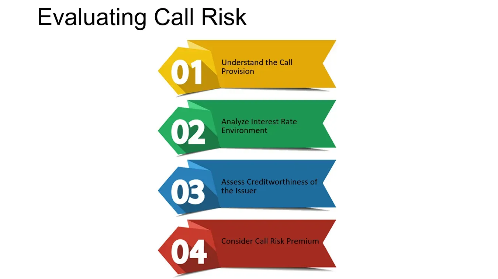

## Table of Contents

## What is call risk in the context of financial securities?

Call risk is a type of risk that investors face when they buy bonds or other fixed-income securities. It happens when the issuer of the bond decides to pay back the money they borrowed before the bond's maturity date. This is called "calling" the bond. When a bond is called, the investor gets their money back earlier than expected, but they might not be able to find another investment that pays as much interest.

This can be a problem for investors because they might have to reinvest their money at a lower interest rate. For example, if interest rates have gone down since the bond was issued, the investor might only be able to buy new bonds that pay less interest. This means the investor's future income from investments could be lower than they had planned. Call risk is something investors need to think about, especially when interest rates are expected to change.

## How does call risk affect bond investors?

Call risk affects bond investors by potentially cutting short their expected income from the bond. When a bond is called, the issuer pays back the principal early, and the investor gets their money back sooner than planned. This can be a problem if the investor was counting on the regular interest payments from the bond to meet their financial needs or goals. If the bond is called, the investor has to find a new place to invest their money, which might not be easy or as profitable.

The main issue with call risk is that it often happens when interest rates have dropped. If rates are lower when the bond is called, the investor might only be able to reinvest their money in new bonds that pay less interest. This means the investor's future income could be lower than what they were getting from the called bond. So, call risk can lead to lower returns for bond investors, making it an important [factor](/wiki/factor-investing) to consider when choosing which bonds to buy.

## What are the key factors that contribute to call risk?

Call risk happens mainly because of changes in interest rates. When interest rates go down, companies that issued bonds might want to call them back. They do this because they can borrow money again at a lower [interest rate](/wiki/interest-rate-trading-strategies), which saves them money. For example, if a company issued a bond with a 5% interest rate and now they can issue a new bond at 3%, they would want to call the old bond and issue a new one to save on interest costs.

Another factor that contributes to call risk is the terms of the bond itself. Some bonds have a call feature, which means the issuer can choose to pay back the bond before it matures. This call feature is usually set up with specific rules, like when the bond can be called and at what price. If an investor buys a bond with a call feature, they need to be aware that the bond might be called early, especially if interest rates change.

Overall, call risk is influenced by both market conditions, like interest rates, and the specific features of the bond. Investors need to think about these factors when they decide to buy bonds, because call risk can affect how much money they make from their investment.

## Can you explain the difference between callable and non-callable bonds?

Callable bonds and non-callable bonds are two types of bonds that investors can buy. The main difference between them is that a callable bond can be paid back early by the company that issued it, while a non-callable bond cannot be paid back early. When a company decides to pay back a callable bond before it matures, it is called "calling" the bond. This usually happens when interest rates go down, and the company wants to borrow money again at a lower rate.

On the other hand, a non-callable bond means the investor is guaranteed to get regular interest payments until the bond reaches its maturity date. With a non-callable bond, the investor doesn't have to worry about the bond being called early and having to find a new place to invest their money. This makes non-callable bonds a safer choice for investors who want a steady income, but they might offer a lower interest rate compared to callable bonds because they are less risky.

## How do issuers decide when to call a bond?

Issuers decide to call a bond when it makes financial sense for them. The main reason they do this is when interest rates drop. If a company issued a bond at a high interest rate and now they can borrow money at a lower rate, they will want to call the old bond. By doing this, they can save money on interest payments. For example, if they issued a bond with a 6% interest rate and now they can issue a new bond at 4%, calling the old bond and issuing a new one saves them 2% in interest costs.

The decision to call a bond also depends on the terms written in the bond agreement. These terms say when and how the bond can be called. Some bonds can be called any time after a certain date, while others have specific times when they can be called. The issuer will look at these terms and the current interest rates to decide if calling the bond is a good move. If the savings from calling the bond and issuing a new one at a lower rate are big enough, the issuer will likely go ahead and call the bond.

## What are the financial implications for an investor when a bond is called?

When a bond is called, the investor gets their money back earlier than they expected. This means they lose out on the future interest payments they were counting on. If the bond was providing a steady income, the investor might have to find another investment quickly. But finding a new investment that pays as much interest can be hard, especially if interest rates have gone down since the bond was first issued.

The biggest problem for the investor is that they might have to reinvest their money at a lower interest rate. If interest rates have dropped, the new bonds they can buy might pay less interest than the called bond did. This can lead to lower income for the investor. So, when a bond is called, it can mess up the investor's plans and make it harder for them to earn the same amount of money from their investments.

## How can investors assess the call risk of a bond?

Investors can assess the call risk of a bond by looking at the bond's terms and the current interest rate environment. The bond's terms will tell them if the bond can be called and when. Some bonds can be called any time after a certain date, while others have specific times when they can be called. If the bond has a call feature, it's more likely to be called if interest rates go down. So, investors should check the bond's terms to understand the call risk.

They should also look at what's happening with interest rates. If interest rates are dropping, there's a higher chance that the bond will be called. Companies want to call their bonds and issue new ones at lower interest rates to save money. By keeping an eye on interest rates and understanding the bond's terms, investors can get a good idea of the call risk. This helps them make better choices about which bonds to buy and how to plan for the future.

## What strategies can investors use to mitigate call risk?

Investors can use a few strategies to lower the risk of their bonds being called. One good way is to look for bonds that don't have a call feature. These bonds can't be paid back early by the issuer, so the investor gets to keep getting interest payments until the bond's maturity date. This makes the investment safer because the investor knows exactly when they will get their money back.

Another strategy is to pay attention to interest rates. If interest rates are going down, there's a higher chance that bonds will be called. So, investors can try to buy bonds when interest rates are high or expected to stay the same. This way, the bonds are less likely to be called early, and the investor can keep [earning](/wiki/earning-announcement) the higher interest rate for longer. By choosing bonds carefully and keeping an eye on interest rates, investors can better manage the risk of their bonds being called.

## How does interest rate environment influence call risk?

The interest rate environment plays a big role in call risk. When interest rates go down, companies that issued bonds might want to call them back. They do this because they can borrow money again at a lower interest rate, which saves them money. For example, if a company issued a bond with a 5% interest rate and now they can issue a new bond at 3%, they would want to call the old bond and issue a new one to save on interest costs. So, when interest rates drop, the risk of a bond being called goes up.

On the other hand, if interest rates are high or expected to stay the same, the risk of a bond being called is lower. Companies are less likely to call their bonds if they can't get a better deal by borrowing at a lower rate. This means that investors can feel more secure about keeping their bonds and getting the interest payments they expect. By understanding the interest rate environment, investors can make smarter choices about which bonds to buy and how to manage the risk of their bonds being called early.

## What role does the call protection period play in managing call risk?

The call protection period is a time when the bond can't be called by the issuer. This period helps investors because it means they can get interest payments without worrying about the bond being called early. If a bond has a call protection period, investors know they will get their money back at a certain time, which makes the bond safer. This period can last for a few years, and it gives investors more peace of mind.

When choosing bonds, investors should look at the call protection period to understand the call risk better. A longer call protection period means the bond is less likely to be called early, which is good for investors who want a steady income. By [picking](/wiki/asset-class-picking) bonds with a call protection period that fits their plans, investors can lower the chance of their bonds being called and manage their call risk better.

## How do credit rating changes affect the call risk of a bond?

Credit rating changes can affect the call risk of a bond in a couple of ways. If a bond's credit rating goes up, it means the issuer is seen as less risky. This might make the bond more attractive to investors, but it doesn't directly increase the call risk. However, if interest rates drop after the credit rating improves, the issuer might be more likely to call the bond to take advantage of lower rates, which increases the call risk.

On the other hand, if a bond's credit rating goes down, it means the issuer is seen as riskier. This might make the bond less attractive to investors, and the issuer might have a harder time calling the bond because they might not be able to issue new bonds at a good rate. So, a lower credit rating can actually decrease the call risk because the issuer is less likely to call the bond when they can't get a better deal. By keeping an eye on credit rating changes, investors can better understand the call risk of their bonds.

## What advanced metrics or models are used by experts to predict call risk?

Experts use a few different tools and models to predict call risk. One common tool is the yield to call (YTC) calculation, which helps figure out what the return would be if the bond is called before it matures. By comparing the YTC to the yield to maturity (YTM), investors can see if it makes more sense for the issuer to call the bond early. Another tool is the interest rate model, which looks at how interest rates are expected to change in the future. If interest rates are predicted to go down, the call risk goes up because issuers are more likely to call their bonds to save on interest costs.

Another way experts predict call risk is by using option-adjusted spread (OAS) models. These models take into account the option the issuer has to call the bond and help investors understand how much extra return they should expect for taking on call risk. By looking at the OAS, investors can see if the bond is priced right for the risk of being called. Overall, these tools and models help investors make better decisions about which bonds to buy and how to manage the risk of their bonds being called early.

## What are the strategies for mitigating call risk?

Diversification is a fundamental strategy to mitigate call risk in bond portfolios. By spreading investments across different bond types and maturities, investors can cushion against the impact of early bond redemptions. A well-diversified portfolio ensures that not all financial instruments will be called at once, reducing potential disruptions in expected income.

Investors can also focus on bonds with extended call protection periods. Call protection provides a buffer against premature calling, allowing bonds to generate interest for a guaranteed duration. Bonds with call premiums offer another protective measure, compensating investors if the issuer decides to redeem the bond early. This premium acts as an incentive for investors, offsetting the risk of losing future interest payments.

The yield-to-call (YTC) calculation is a critical tool for investors evaluating callable bonds. YTC provides an estimate of the yield assuming the bond is called at the first eligible date. This is calculated using the formula:

$$
YTC = \left( \frac{C + \frac{{(F - P)}}{n}}{\frac{{F + P}}{2}} \right)
$$

where:
- $C$ is the annual coupon payment,
- $F$ is the face value of the bond,
- $P$ is the purchase price of the bond,
- $n$ is the number of years until the first call date.

This calculation helps investors assess the return on investment under call scenarios and make informed decisions about whether the bond meets their yield requirements considering potential early redemption.

Monitoring economic indicators and issuer credit ratings is essential. Changes in interest rate environments can influence issuer decisions to call bonds. A decrease in interest rates often prompts issuers to refinance and call existing bonds. Additionally, the credit quality of issuers impacts their likelihood to exercise call options. Investors should remain vigilant, analyzing market trends and credit reports to anticipate early redemption risks and adjust portfolios accordingly.

Through effective diversification, careful selection of bonds, and ongoing market analysis, investors can manage call risk, ensuring that bond returns align with their financial objectives and risk tolerance.

## References & Further Reading

[1]: Fabozzi, F. J. (2007). ["Fixed Income Analysis, Second Edition"](https://books.google.com/books/about/Fixed_Income_Analysis.html?id=lujLawVLS3YC). CFA Institute.

[2]: ["Algorithmic Trading and DMA: An Introduction to Direct Access Trading Strategies"](https://www.amazon.com/Algorithmic-Trading-DMA-introduction-strategies/dp/0956399207) by Barry Johnson

[3]: Sundaresan, S. M. (2009). ["Fixed Income Markets and Their Derivatives, Third Edition"](https://shop.elsevier.com/books/fixed-income-markets-and-their-derivatives/sundaresan/978-0-12-370471-9). Academic Press.

[4]: ["The Handbook of Fixed Income Securities, Eighth Edition"](https://www.amazon.com/Handbook-Fixed-Income-Securities-Eighth/dp/0071768467) by Frank J. Fabozzi

[5]: ["Bond Markets, Analysis and Strategies"](https://mitpress.mit.edu/9780262046275/bond-markets-analysis-and-strategies/) by Frank J. Fabozzi