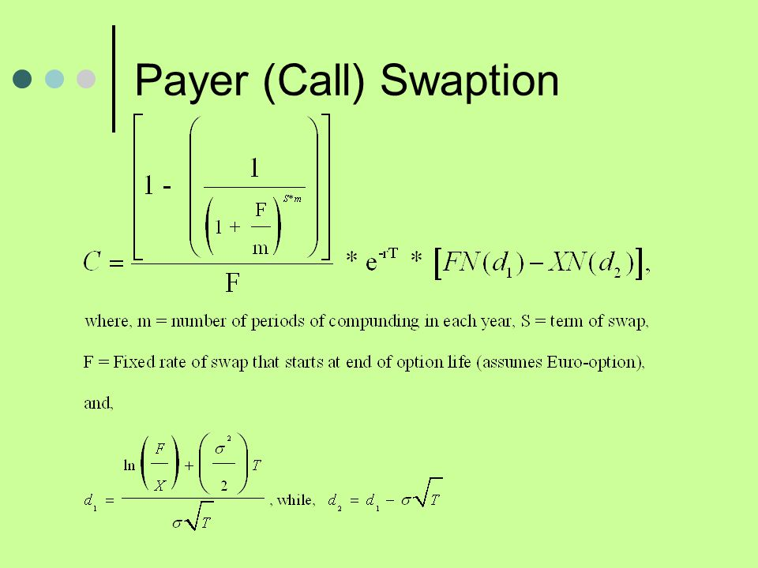

## Table of Contents

## What is a call swaption?

A call swaption is a type of financial contract that gives the buyer the right, but not the obligation, to enter into a swap agreement as the fixed-rate payer. In simpler terms, it's like having an option to start a swap where you agree to pay a fixed interest rate and receive a floating interest rate in return. This can be useful if you think interest rates might go up in the future, because you can lock in a lower fixed rate now.

For example, imagine you think interest rates will increase next year. You could buy a call swaption now, which would allow you to enter into a swap next year at today's lower fixed rate. If rates do go up, you can exercise your option and benefit from paying the lower fixed rate while receiving the higher floating rate. If rates don't go up, you can simply let the option expire without using it, and you would only lose the cost of the swaption.

## How does a call swaption differ from a put swaption?

A call swaption and a put swaption are both options on interest rate swaps, but they work in opposite ways. A call swaption gives the buyer the right to enter into a swap where they pay a fixed rate and receive a floating rate. This is useful if you think interest rates will go up because you can lock in a lower fixed rate now. On the other hand, a put swaption gives the buyer the right to enter into a swap where they receive a fixed rate and pay a floating rate. This is helpful if you think interest rates will go down, as you can lock in a higher fixed rate now.

Think of it like this: with a call swaption, you're betting that rates will rise, so you want to fix your payments at a lower rate. With a put swaption, you're betting that rates will fall, so you want to fix your receipts at a higher rate. Both types of swaptions allow you to manage [interest rate](/wiki/interest-rate-trading-strategies) risk, but they are used in different scenarios based on your expectations about future interest rate movements.

## What are the basic components of a call swaption?

A call swaption has a few basic parts that you need to know about. The first part is the expiration date. This is the date by which you must decide whether to use the swaption or let it expire. If you think interest rates will go up, you want to use the swaption before this date. The second part is the strike rate, which is the fixed interest rate you agree to pay if you use the swaption. This rate is set when you buy the swaption and is important because it affects how much you'll pay if you enter the swap.

The third part is the underlying swap, which is the actual agreement you enter into if you use the swaption. This swap will have its own terms, like how long it lasts and how often payments are made. The fourth part is the premium, which is the price you pay to buy the swaption. This is like the cost of the option and is paid upfront. Together, these parts make up a call swaption and help you manage your interest rate risks.

## Who are the typical buyers and sellers of call swaptions?

The typical buyers of call swaptions are often companies or financial institutions that expect interest rates to rise in the future. They buy these swaptions to protect themselves against higher borrowing costs. For example, a company might want to lock in a lower fixed rate now, so if rates go up, they can use the swaption to enter into a swap and pay that lower rate while receiving the higher floating rate. This helps them save money on interest payments.

On the other hand, the typical sellers of call swaptions are usually banks or other financial institutions that are willing to take on the risk of interest rates rising. They sell these swaptions to earn the premium paid by the buyer. If interest rates don't go up, the seller keeps the premium and the swaption expires worthless. But if rates do rise, the seller might have to enter into a swap where they receive the lower fixed rate and pay the higher floating rate, which could be costly for them.

## What are the primary uses of call swaptions in financial markets?

Call swaptions are used by companies and financial institutions to manage their interest rate risks. If a company thinks that interest rates will go up in the future, they can buy a call swaption. This gives them the right to enter into a swap where they pay a fixed rate and receive a floating rate. By doing this, they can lock in a lower fixed rate now, so if rates do go up, they can save money on their interest payments. It's like having an insurance policy against rising rates.

Banks and other financial institutions often sell call swaptions. They do this to earn the premium that the buyer pays. If interest rates don't go up, the swaption expires without being used, and the seller keeps the premium as profit. But if rates do rise, the seller has to enter into the swap and might end up paying more. So, selling call swaptions can be risky, but it's a way for banks to make money by taking on this risk.

## How is the pricing of a call swaption determined?

The pricing of a call swaption depends on several factors. One important [factor](/wiki/factor-investing) is the difference between the current interest rates and the strike rate of the swaption. If the strike rate is much lower than the current rates, the swaption is more valuable because it lets you lock in a lower fixed rate. Another factor is the time until the swaption expires. The longer you have until the expiration date, the more time there is for interest rates to change, which makes the swaption more valuable. The expected [volatility](/wiki/volatility-trading-strategies) of interest rates also plays a role. If rates are expected to change a lot, the swaption becomes more valuable because there's a bigger chance that rates will go up and you'll want to use the swaption.

The premium, or the price you pay for the swaption, is also affected by the creditworthiness of the seller. If the seller is seen as risky, they might charge a higher premium to cover that risk. Finally, the pricing models used by financial institutions, like the Black model or the Black-Scholes model adapted for interest rates, help determine the fair value of the swaption. These models take into account all these factors and more to come up with a price that reflects the current market conditions and the risk involved in the swaption.

## What role do interest rate expectations play in the valuation of call swaptions?

Interest rate expectations are a big part of deciding how much a call swaption is worth. If people think interest rates will go up a lot, a call swaption becomes more valuable. That's because it gives you the right to lock in a lower fixed rate now and then swap it for a higher floating rate later. So, if everyone expects rates to rise, they'll be willing to pay more for the swaption because it could save them a lot of money on interest payments.

On the other hand, if people think interest rates will stay the same or go down, a call swaption won't be as valuable. In this case, there's less chance you'll want to use the swaption to swap to a higher floating rate, so it's not worth as much. The price of the swaption reflects these expectations because it's all about how likely it is that you'll use the swaption to your advantage.

## Can you explain the concept of exercising a call swaption?

Exercising a call swaption means you decide to use the option you bought. When you buy a call swaption, you get the right to enter into a swap where you pay a fixed interest rate and receive a floating interest rate. You would choose to exercise this option if interest rates have gone up since you bought the swaption. By exercising it, you can lock in the lower fixed rate you agreed to when you bought the swaption, and then you'll start receiving the higher floating rate that's now available in the market.

For example, imagine you bought a call swaption with a strike rate of 3% when the market rate was also 3%. If the market rate goes up to 5%, you can exercise your swaption. This means you start paying the 3% fixed rate and receiving the 5% floating rate, which saves you money because you're paying less than the current market rate. You have to exercise the swaption before it expires, or you'll lose the right to use it. If the market rate stays the same or goes down, you might choose not to exercise the swaption and just let it expire, in which case you'd only lose the cost of the swaption.

## What are the risks associated with holding a call swaption?

Holding a call swaption comes with a few risks. One big risk is that interest rates might not go up as much as you thought they would. If rates stay the same or go down, you might not want to use your swaption. If you don't use it, you lose the money you paid for the swaption, which is called the premium. This is like buying insurance that you end up not needing.

Another risk is that even if rates do go up, they might not go up enough to make it worth using your swaption. The fixed rate you agreed to pay might still be higher than the new floating rate, so exercising the swaption wouldn't save you money. Plus, if the company selling you the swaption runs into financial trouble, they might not be able to honor the agreement, which adds another layer of risk.

## How do call swaptions fit into broader interest rate risk management strategies?

Call swaptions are a useful tool for managing interest rate risk. They give companies or financial institutions the right to enter into a swap where they pay a fixed rate and receive a floating rate. This can be really helpful if they think interest rates will go up in the future. By buying a call swaption, they can lock in a lower fixed rate now. If rates do go up, they can use the swaption to start the swap and save money on their interest payments. It's like having an insurance policy against rising rates, which can help them plan their finances better and avoid unexpected costs.

In a broader interest rate risk management strategy, call swaptions are often used alongside other tools like interest rate swaps, caps, and floors. Companies might use a mix of these tools to protect themselves from different scenarios. For example, they might use an interest rate swap to convert floating rate debt to fixed rate debt, and then use a call swaption to hedge against the risk of rates going up even more. This way, they can manage their exposure to interest rate changes more effectively and keep their borrowing costs under control, no matter what happens with rates.

## What are some advanced trading strategies involving call swaptions?

One advanced trading strategy involving call swaptions is called a "swaption straddle." In this strategy, a trader buys both a call swaption and a put swaption with the same expiration date and strike rate. The idea is to profit from big moves in interest rates, no matter which way they go. If rates go up a lot, the trader can use the call swaption to start a swap where they pay a lower fixed rate and receive a higher floating rate. If rates go down a lot, they can use the put swaption to start a swap where they receive a higher fixed rate and pay a lower floating rate. The downside is that if rates don't move much, the trader loses the premiums paid for both swaptions.

Another strategy is called "swaption spreading," where a trader buys and sells different swaptions at the same time to take advantage of changes in the yield curve. For example, a trader might buy a call swaption with a short expiration date and sell a call swaption with a longer expiration date. If they think short-term rates will go up faster than long-term rates, this strategy can be profitable. The key is to find the right combination of swaptions that will benefit from the expected changes in the yield curve. This strategy can be complex but can also offer good returns if done right.

## How have regulatory changes affected the use and trading of call swaptions?

Regulatory changes, like the Dodd-Frank Act in the United States, have made a big impact on how call swaptions are used and traded. Before these rules, a lot of swaptions were traded privately between banks and other big financial players. But now, many swaptions have to be traded on public exchanges or through clearinghouses. This makes things more transparent and safer, but it also means more paperwork and costs for the people trading them. So, some smaller companies might find it harder to use call swaptions because of these new rules.

Also, these regulations have changed how much risk banks can take when they sell call swaptions. Banks now have to hold more money aside to cover potential losses, which means they might charge more for selling swaptions. This can make call swaptions more expensive for buyers. But on the flip side, these rules help make the financial system more stable, so there's less chance of a big problem happening because of swaption trading.

## References & Further Reading

1. **Hull, John C. "Options, Futures, and Other Derivatives."** This textbook offers a foundational understanding of various derivatives, including call swaptions. It provides insights into the theoretical and practical aspects of derivative trading and risk management. 

2. **Brigo, Damiano, and Fabio Mercurio. "Interest Rate Models - Theory and Practice."** This book is an extensive guide to interest rate modeling and includes discussions on swaptions and their pricing. It is highly recommended for those looking to grasp the mathematical frameworks behind interest rate derivatives.

3. **Rebonato, Riccardo. "Modern Pricing of Interest-Rate Derivatives: The LIBOR Market Model and Beyond."** This work explores more advanced aspects of interest rate derivatives, using the LIBOR market model and other techniques to price swaptions.

4. **Joshi, Mark S. "The Concepts and Practice of Mathematical Finance."** A primer on the quantitative techniques applied across finance, this book is essential for understanding the mathematical underpinnings of derivative pricing models, including those for swaptions.

5. **Bouchaud, Jean-Philippe, and Marc Potters. "Theory of Financial Risk and Derivative Pricing: From Statistical Physics to Risk Management."** This book blends statistical physics with finance, presenting novel approaches to understanding financial risk and derivative pricing.

6. **Nelder, J.A., and Mead, R. "A Simplex Method for Function Minimization," Computer Journal, 1965.** This paper presents the Simplex algorithm, which forms the basis of many optimization techniques used in derivative pricing models.

7. **Lequeux, Paul. "Algorithmic Trading & DMA: An Introduction to Direct Access Trading Strategies."** This resource provides insights into algorithmic trading techniques, focusing on their application in derivative markets for optimized trading strategies.

8. **Aldridge, Irene. "High-Frequency Trading: A Practical Guide to Algorithmic Strategies and Trading Systems."** This comprehensive guide to high-frequency and algorithmic trading covers both the theoretical background and practical implementation, with examples focused on derivatives.

9. **McNeil, Alexander J., Frey, Rüdiger, and Embrechts, Paul. "Quantitative Risk Management: Concepts, Techniques, and Tools."** This advanced text outlines quantitative techniques in risk management applicable to financial derivatives, including swaptions.

10. **Engle, Robert F., and Clive W. J. Granger. "Co-Integration and Error Correction: Representation, Estimation, and Testing," Econometrica, 1987.** This seminal paper introduces cointegration concepts relevant for understanding time series data, crucial for predictive analytics in algorithmic trading.

11. **Bishop, Christopher M. "Pattern Recognition and Machine Learning."** This comprehensive text covers machine learning techniques that are increasingly being adopted in algorithmic trading systems to enhance decision-making and predictive capabilities.

