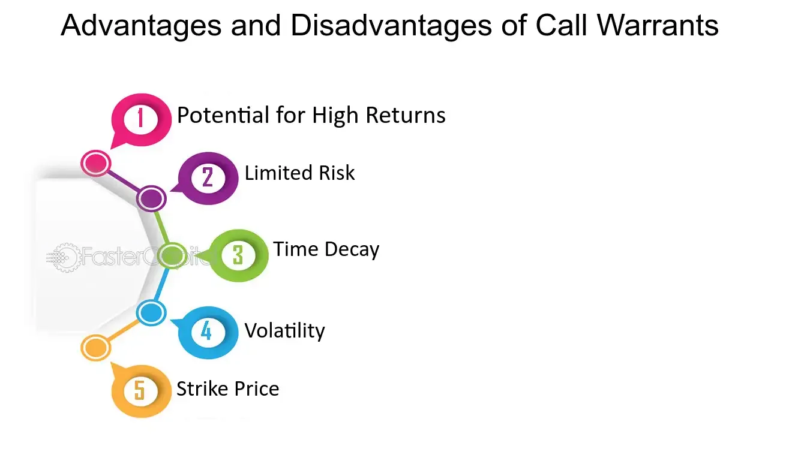

## Table of Contents

## What are call warrants and how do they function?

Call warrants are financial instruments that give the holder the right, but not the obligation, to buy a specific asset, like a stock or a commodity, at a set price before a certain date. They are similar to call options but are often issued by financial institutions rather than being traded on an exchange. When you buy a call warrant, you're betting that the price of the underlying asset will go up. If it does, you can use the warrant to buy the asset at the lower, set price and then sell it at the higher market price, making a profit.

Using call warrants can be a way to make money from rising prices without having to buy the actual asset outright. For example, if you think the price of a company's stock will go up, you can buy a call warrant for that stock. If the stock price does rise above the set price in the warrant, you can buy the stock at the lower price and sell it at the higher market price. However, if the stock price doesn't rise above the set price by the expiration date, the warrant becomes worthless, and you lose the money you paid for it. This makes call warrants a risky but potentially rewarding investment.

## What are the basic advantages of investing in call warrants?

One big advantage of investing in call warrants is that they let you make money from rising prices without spending a lot of money upfront. When you buy a call warrant, you're not buying the actual stock or asset. You're just buying the right to buy it later at a set price. This means you can control a lot of the asset for less money than if you bought it outright. It's like putting a small deposit on a big purchase, which can lead to big profits if the price goes up a lot.

Another advantage is that call warrants can help you spread your investments around. Instead of putting all your money into one stock, you can use call warrants to bet on different stocks or assets. This can help lower your risk because if one investment doesn't do well, you might still make money from another. Plus, call warrants can make your investments more exciting because they have the potential for big gains in a short time, although they come with more risk too.

## How do call warrants differ from call options?

Call warrants and call options are similar because they both give you the right to buy something at a set price before a certain date. But there are some key differences. Call warrants are usually issued by financial institutions, like banks, and they are not traded on a big stock exchange like call options are. This means that call warrants might not be as easy to buy and sell quickly as call options.

Another difference is how long they last. Call warrants often have longer expiration dates than call options. This can be good if you think it will take a while for the price of the asset to go up. Also, the way they are priced can be different. Call warrants can sometimes be cheaper because they are issued by banks, but they might also have extra costs or fees that you need to think about. So, while both can help you make money if prices go up, call warrants and call options work a bit differently and have their own pros and cons.

## What are the risks associated with call warrants?

Investing in call warrants can be risky. One big risk is that you could lose all the money you put into them. If the price of the asset doesn't go up above the set price by the time the warrant expires, it becomes worthless. This means you lose the money you paid for the warrant. It's like betting on a horse race and losing your bet if your horse doesn't win.

Another risk is that call warrants can be hard to sell quickly. Since they are not traded on big stock exchanges like call options, it might be tough to find someone to buy your warrant if you need to sell it fast. This can make it hard to get out of a bad investment quickly. Plus, call warrants can have extra costs or fees that you need to watch out for, which can eat into any profits you might make.

## Can you explain the leverage effect in call warrants?

The leverage effect in call warrants means you can control a big amount of an asset without spending a lot of money. It's like using a lever to lift a heavy object; you use a small force to move something much bigger. When you buy a call warrant, you pay a small price for the right to buy the asset later at a set price. If the price of the asset goes up a lot, you can make a big profit compared to what you paid for the warrant. It's a way to make your money work harder.

But leverage can be a double-edged sword. While it can lead to big profits if the price goes up, it can also lead to big losses if the price doesn't go up as you hoped. If the price of the asset stays below the set price by the time the warrant expires, you lose all the money you paid for the warrant. So, while leverage can make your investment more exciting and potentially more rewarding, it also makes it riskier.

## What are the key factors to consider before investing in call warrants?

Before investing in call warrants, it's important to think about how much risk you're willing to take. Call warrants can lead to big profits if the price of the asset goes up a lot, but you can also lose all the money you put into them if the price doesn't go up. They're like betting on a horse race, where you could win big or lose everything. So, make sure you're okay with the chance of losing your investment.

Another thing to consider is how long you're willing to wait. Call warrants have an expiration date, and if the price of the asset doesn't go up by then, the warrant becomes worthless. You need to think about whether you believe the price will go up in time. Also, think about how easy it will be to sell the warrant if you need to. Since call warrants are not traded on big stock exchanges, it might be hard to find someone to buy them quickly if you want to get out of the investment.

Lastly, look at the costs and fees. Call warrants might have extra charges that can eat into your profits. Make sure you understand all the costs before you invest. And don't forget about the leverage effect, which can make your investment more exciting but also more risky. Always do your homework and think carefully before deciding to invest in call warrants.

## How does the expiration date impact the value of call warrants?

The expiration date of a call warrant is really important because it sets a deadline for when you can use the warrant. If the price of the asset goes up above the set price before the expiration date, you can make money by buying the asset at the lower price and selling it at the higher market price. But if the price doesn't go up enough by the expiration date, the call warrant becomes worthless, and you lose the money you paid for it. So, the closer you get to the expiration date without the price going up, the less valuable the warrant becomes.

As the expiration date gets closer, the time you have left to make a profit gets shorter. This means the value of the call warrant can drop quickly if the price of the asset isn't going up fast enough. It's like a race against time. If you believe the price will go up, but it takes too long, you might not be able to use the warrant before it expires. So, always keep an eye on the expiration date when you're thinking about investing in call warrants.

## What are some common criticisms of call warrants?

One common criticism of call warrants is that they are very risky. People worry that it's too easy to lose all the money you put into them. If the price of the asset doesn't go up enough before the warrant expires, you lose everything. This can be scary, especially for people who don't like taking big risks with their money. Critics say that call warrants can be like gambling, where you might win big, but you're more likely to lose.

Another criticism is that call warrants can be hard to sell quickly. They are not traded on big stock exchanges like call options, so finding someone to buy your warrant when you want to sell it can be tough. This can be a problem if you need to get out of the investment fast. Plus, call warrants can come with extra costs and fees that can make them less attractive to some investors. Critics argue that these factors make call warrants a less reliable and more complicated investment choice.

## How do issuers of call warrants make money?

Issuers of call warrants make money in a few ways. One way is by selling the warrants to investors. When someone buys a call warrant, they pay the issuer a price for the right to buy the asset later at a set price. This money is profit for the issuer, no matter what happens to the price of the asset after that. It's like selling tickets to a show; the issuer gets to keep the money from the ticket sales.

Another way issuers make money is through the difference between the price they set for the asset in the warrant and the actual market price of the asset. If the market price stays below the set price, the warrant expires worthless, and the issuer keeps the money from selling the warrant. If the market price goes above the set price, the issuer still makes money because they can buy the asset at a lower price and sell it to the warrant holder at the higher set price. This difference is another source of profit for the issuer.

## Can you provide examples of successful call warrant investments?

One example of a successful call warrant investment happened a few years ago when a tech company's stock was expected to rise because of a new product launch. An investor bought call warrants for the company's stock at a set price of $50 per share. When the product launch was a big hit, the stock price jumped to $70 per share before the warrant expired. The investor used the warrant to buy the stock at $50 and then sold it at the market price of $70, making a nice profit.

Another example involved a mining company that was about to announce a big new discovery. An investor bought call warrants for the company's stock, betting that the announcement would drive the price up. When the company revealed they had found a huge new deposit, the stock price soared from $30 to $45 per share. The investor was able to buy the stock at the set price of $30 using the warrant and sell it at $45, making a good return on their investment.

## What are the tax implications of trading call warrants?

When you make money from trading call warrants, you have to pay taxes on your profits. The tax you pay depends on how long you held the warrant before selling it. If you held it for less than a year, the profit is considered a short-term capital gain, and you'll pay your regular income tax rate on it. If you held it for more than a year, it's a long-term capital gain, and you'll pay a lower tax rate, usually between 0% and 20%, depending on your income.

Sometimes, you might lose money on call warrants. If that happens, you can use those losses to reduce the taxes you owe on other investments. This is called tax loss harvesting. You can subtract your losses from your gains, and if your losses are more than your gains, you can use up to $3,000 of those losses to lower your taxable income. Any leftover losses can be carried over to future years to offset gains or income then.

## How do market conditions affect the pricing and performance of call warrants?

Market conditions play a big role in how call warrants are priced and how well they perform. If the market is doing well and people think prices will keep going up, call warrants can become more valuable. This is because more people want to buy them, hoping to make money from the rising prices. On the other hand, if the market is doing poorly and prices are falling, call warrants can lose value quickly. Investors might not want to bet on prices going up when everything is going down, so they won't pay as much for the warrants.

Another thing that affects call warrants is how much the price of the asset moves around, called volatility. If the price of the asset is bouncing up and down a lot, call warrants can be priced higher because there's a bigger chance the price will go above the set price before the warrant expires. But if the price is staying pretty steady, call warrants might not be worth as much because there's less chance of a big jump in price. So, market conditions like overall trends and how much prices move can make a big difference in how call warrants are priced and how they perform.

## What are Call Warrants and how do they work?

Call warrants are financial instruments that afford the holder the right, but not the obligation, to purchase a specific quantity of stock at a predetermined price, known as the exercise price, before a designated expiration date. Unlike options, which are typically traded on exchanges and issued by third parties, call warrants are directly issued by the company whose stock underlies the warrant itself. This issuance often coincides with new equity or debt offerings, as companies use call warrants as a strategic tool to raise capital.

A key feature of call warrants is their high leverage potential. The leverage effect is due to the warrant's inherent ability to amplify the gains (or losses) from favorable (or unfavorable) movements in the stock price relative to the exercise price. The mathematical leverage can be expressed as:

$$
\text{Leverage} = \frac{\Delta \text{Stock Price}}{\Delta \text{Warrant Price}}
$$

This leverage makes call warrants particularly attractive to investors anticipating substantial appreciation in the underlying stock price. When the market price of the stock exceeds the exercise price before expiration, holders can exercise the warrant to purchase the stock at a reduced cost or sell the warrant at a premium. 

However, this high potential for profit does not come without risks. The speculative nature of call warrants means that if the expected stock price increase does not materialize, or if the stock price falls, investors can suffer substantial losses, potentially losing the entire investment if the warrants expire worthless. Additionally, factors like remaining time to expiration and [volatility](/wiki/volatility-trading-strategies) of the underlying stock can affect the pricing of warrants, introducing elements of complexity and risk.

Despite these risks, call warrants remain a compelling component of investment strategies for those willing to embrace their speculative characteristics.

## References & Further Reading

[1]: ["The Handbook of Financial Engineering: New Financial Products"](https://archive.org/details/handbookoffinanc0000unse_y9v3) by Clifford E. Kirsch and Jaemin Kim

[2]: ["Options, Futures, and Other Derivatives"](https://www.amazon.com/Options-Futures-Other-Derivatives-11th/dp/B0B9JS99C2) by John C. Hull

[3]: Bergstra, J., Bardenet, R., Bengio, Y., & Kégl, B. (2011). ["Algorithms for Hyper-Parameter Optimization."](https://proceedings.neurips.cc/paper/2011/file/86e8f7ab32cfd12577bc2619bc635690-Paper.pdf) Advances in Neural Information Processing Systems 24.

[4]: ["Advances in Financial Machine Learning"](https://www.amazon.com/Advances-Financial-Machine-Learning-Marcos/dp/1119482089) by Marcos Lopez de Prado

[5]: ["High-Frequency Trading - A Practical Guide to Algorithmic Strategies and Trading Systems"](https://www.ahmetbeyefendi.com/wp-content/uploads/2020/07/High-Frequency-Trading-Irene-Aldridge.pdf) by Irene Aldridge

[6]: Woebbeking, Felix-Ferdinand. (2020). ["Ethical aspects in the regulation of algorithmic trading."](https://onlinelibrary.wiley.com/doi/10.1111/rego.12437) ERA Forum.

[7]: ["Evidence-Based Technical Analysis: Applying the Scientific Method and Statistical Inference to Trading Signals"](https://www.amazon.com/Evidence-Based-Technical-Analysis-Scientific-Statistical/dp/0470008741) by David Aronson

[8]: ["Machine Learning for Algorithmic Trading"](https://github.com/stefan-jansen/machine-learning-for-trading) by Stefan Jansen

[9]: ["Quantitative Trading: How to Build Your Own Algorithmic Trading Business"](https://www.amazon.com/Quantitative-Trading-Build-Algorithmic-Business/dp/1119800064) by Ernest P. Chan